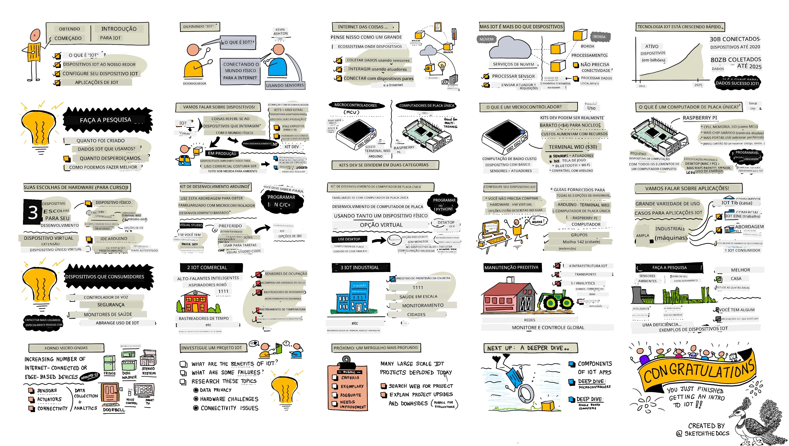

# Introdução ao IoT

> Ilustração por [Nitya Narasimhan](https://github.com/nitya). Clique na imagem para uma versão maior.

Esta lição foi apresentada como parte da série [Hello IoT](https://youtube.com/playlist?list=PLmsFUfdnGr3xRts0TIwyaHyQuHaNQcb6-) do [Microsoft Reactor](https://developer.microsoft.com/reactor/?WT.mc_id=academic-17441-jabenn). A lição foi dividida em 2 vídeos - uma aula de 1 hora e uma sessão de perguntas e respostas de 1 hora, explorando mais a fundo partes da lição e respondendo a dúvidas.

> 🎥 Clique nas imagens acima para assistir aos vídeos

## Questionário pré-aula

[Questionário pré-aula](https://black-meadow-040d15503.1.azurestaticapps.net/quiz/1)

## Introdução

Esta lição aborda alguns dos tópicos introdutórios sobre a Internet das Coisas (IoT) e ajuda você a configurar o seu hardware.

Nesta lição, abordaremos:

* [O que é a 'Internet das Coisas'?](../../../../../1-getting-started/lessons/1-introduction-to-iot)
* [Dispositivos IoT](../../../../../1-getting-started/lessons/1-introduction-to-iot)
* [Configurar o seu dispositivo](../../../../../1-getting-started/lessons/1-introduction-to-iot)
* [Aplicações do IoT](../../../../../1-getting-started/lessons/1-introduction-to-iot)
* [Exemplos de dispositivos IoT ao seu redor](../../../../../1-getting-started/lessons/1-introduction-to-iot)

## O que é a 'Internet das Coisas'?

O termo 'Internet das Coisas' foi cunhado por [Kevin Ashton](https://wikipedia.org/wiki/Kevin_Ashton) em 1999, para se referir à conexão da Internet com o mundo físico por meio de sensores. Desde então, o termo tem sido usado para descrever qualquer dispositivo que interaja com o mundo físico ao seu redor, seja coletando dados de sensores ou realizando interações no mundo real por meio de atuadores (dispositivos que fazem algo, como ligar um interruptor ou acender um LED), geralmente conectados a outros dispositivos ou à Internet.

> **Sensores** coletam informações do mundo, como medir velocidade, temperatura ou localização.
>
> **Atuadores** convertem sinais elétricos em interações no mundo real, como acionar um interruptor, ligar luzes, emitir sons ou enviar sinais de controle para outros dispositivos, por exemplo, para ligar uma tomada.

IoT como área tecnológica vai além de dispositivos - inclui serviços baseados na nuvem que podem processar os dados dos sensores ou enviar comandos para atuadores conectados a dispositivos IoT. Também inclui dispositivos que não possuem ou não precisam de conectividade com a Internet, frequentemente chamados de dispositivos de borda. Estes são dispositivos que podem processar e responder aos dados dos sensores por conta própria, geralmente usando modelos de IA treinados na nuvem.

IoT é um campo tecnológico em rápido crescimento. Estima-se que, até o final de 2020, 30 bilhões de dispositivos IoT estavam implantados e conectados à Internet. Olhando para o futuro, estima-se que, até 2025, os dispositivos IoT estarão coletando quase 80 zettabytes de dados, ou 80 trilhões de gigabytes. Isso é muito dado!

✅ Faça uma pequena pesquisa: Quanto dos dados gerados por dispositivos IoT é realmente utilizado e quanto é desperdiçado? Por que tantos dados são ignorados?

Esses dados são a chave para o sucesso do IoT. Para ser um desenvolvedor de IoT bem-sucedido, você precisa entender quais dados coletar, como coletá-los, como tomar decisões com base neles e como usar essas decisões para interagir com o mundo físico, se necessário.

## Dispositivos IoT

O **T** em IoT significa **Things** (Coisas) - dispositivos que interagem com o mundo físico ao seu redor, seja coletando dados de sensores ou realizando interações no mundo real por meio de atuadores.

Dispositivos para uso comercial ou de produção, como rastreadores de fitness para consumidores ou controladores de máquinas industriais, geralmente são feitos sob medida. Eles utilizam placas de circuito personalizadas, talvez até processadores personalizados, projetados para atender às necessidades de uma tarefa específica, seja ser pequeno o suficiente para caber no pulso ou robusto o suficiente para operar em ambientes de alta temperatura, alta pressão ou alta vibração.

Como desenvolvedor aprendendo sobre IoT ou criando um protótipo de dispositivo, você precisará começar com um kit de desenvolvimento. Estes são dispositivos IoT de uso geral projetados para desenvolvedores, frequentemente com recursos que não estariam presentes em um dispositivo de produção, como pinos externos para conectar sensores ou atuadores, hardware para suporte à depuração ou recursos adicionais que aumentariam o custo desnecessariamente em uma produção em larga escala.

Esses kits de desenvolvimento geralmente se dividem em duas categorias - microcontroladores e computadores de placa única. Eles serão apresentados aqui, e entraremos em mais detalhes na próxima lição.

> 💁 O seu telemóvel também pode ser considerado um dispositivo IoT de uso geral, com sensores e atuadores integrados, sendo que diferentes aplicações utilizam esses sensores e atuadores de maneiras diferentes com serviços na nuvem. Você pode até encontrar alguns tutoriais de IoT que usam uma aplicação de telemóvel como dispositivo IoT.

### Microcontroladores

Um microcontrolador (também chamado de MCU, abreviação de microcontroller unit) é um pequeno computador composto por:

🧠 Um ou mais processadores centrais (CPUs) - o 'cérebro' do microcontrolador que executa o seu programa

💾 Memória (RAM e memória de programa) - onde o seu programa, dados e variáveis são armazenados

🔌 Conexões de entrada/saída (I/O) programáveis - para comunicação com periféricos externos (dispositivos conectados), como sensores e atuadores

Os microcontroladores são dispositivos de computação de baixo custo, com preços médios para aqueles usados em hardware personalizado caindo para cerca de US$0,50, e alguns dispositivos custando apenas US$0,03. Kits de desenvolvimento podem começar a partir de US$4, com os custos aumentando à medida que mais recursos são adicionados. O [Wio Terminal](https://www.seeedstudio.com/Wio-Terminal-p-4509.html), um kit de desenvolvimento de microcontrolador da [Seeed Studios](https://www.seeedstudio.com) que possui sensores, atuadores, WiFi e uma tela, custa cerca de US$30.

> 💁 Ao pesquisar na Internet por microcontroladores, tenha cuidado ao procurar pelo termo **MCU**, pois isso trará muitos resultados relacionados ao Universo Cinematográfico da Marvel, e não a microcontroladores.

Os microcontroladores são projetados para serem programados para realizar um número limitado de tarefas muito específicas, em vez de serem computadores de uso geral como PCs ou Macs. Exceto em cenários muito específicos, você não pode conectar um monitor, teclado e rato e usá-los para tarefas gerais.

Os kits de desenvolvimento de microcontroladores geralmente vêm com sensores e atuadores adicionais integrados. A maioria das placas terá um ou mais LEDs que você pode programar, juntamente com outros dispositivos, como conectores padrão para adicionar mais sensores ou atuadores usando os ecossistemas de vários fabricantes ou sensores integrados (geralmente os mais populares, como sensores de temperatura). Alguns microcontroladores possuem conectividade sem fios integrada, como Bluetooth ou WiFi, ou têm microcontroladores adicionais na placa para adicionar essa conectividade.

> 💁 Os microcontroladores geralmente são programados em C/C++.

### Computadores de placa única

Um computador de placa única é um pequeno dispositivo de computação que contém todos os elementos de um computador completo em uma única placa pequena. Estes dispositivos possuem especificações próximas a um PC ou Mac de secretária ou portátil, executam um sistema operativo completo, mas são menores, consomem menos energia e são substancialmente mais baratos.

O Raspberry Pi é um dos computadores de placa única mais populares.

Assim como um microcontrolador, os computadores de placa única possuem uma CPU, memória e pinos de entrada/saída, mas têm recursos adicionais, como um chip gráfico para permitir a conexão de monitores, saídas de áudio e portas USB para conectar teclados, ratos e outros dispositivos USB padrão, como webcams ou armazenamento externo. Os programas são armazenados em cartões SD ou discos rígidos, juntamente com um sistema operativo, em vez de um chip de memória integrado na placa.

> 🎓 Você pode pensar em um computador de placa única como uma versão menor e mais barata do PC ou Mac que está a usar, com a adição de pinos GPIO (entrada/saída de uso geral) para interagir com sensores e atuadores.

Os computadores de placa única são computadores completos, por isso podem ser programados em qualquer linguagem. Os dispositivos IoT geralmente são programados em Python.

### Escolha de hardware para as próximas lições

Todas as lições subsequentes incluem tarefas usando um dispositivo IoT para interagir com o mundo físico e comunicar com a nuvem. Cada lição suporta 3 opções de dispositivos - Arduino (usando um Seeed Studios Wio Terminal) ou um computador de placa única, seja um dispositivo físico (um Raspberry Pi 4) ou um computador de placa única virtual executado no seu PC ou Mac.

Você pode ler sobre o hardware necessário para concluir todas as tarefas no [guia de hardware](../../../hardware.md).

> 💁 Não é necessário adquirir nenhum hardware IoT para concluir as tarefas, você pode fazer tudo usando um computador de placa única virtual.

A escolha do hardware depende de você - depende do que tem disponível em casa ou na escola e da linguagem de programação que conhece ou planeia aprender. Ambas as variantes de hardware usarão o mesmo ecossistema de sensores, então, se começar com uma, pode mudar para a outra sem precisar substituir a maior parte do kit. O computador de placa única virtual será equivalente a aprender em um Raspberry Pi, com a maior parte do código transferível para o Pi caso eventualmente adquira um dispositivo e sensores.

### Kit de desenvolvimento Arduino

Se estiver interessado em aprender desenvolvimento de microcontroladores, pode concluir as tarefas usando um dispositivo Arduino. Será necessário ter um conhecimento básico de programação em C/C++, pois as lições ensinarão apenas o código relevante para o framework Arduino, os sensores e atuadores utilizados e as bibliotecas que interagem com a nuvem.

As tarefas usarão o [Visual Studio Code](https://code.visualstudio.com/?WT.mc_id=academic-17441-jabenn) com a [extensão PlatformIO para desenvolvimento de microcontroladores](https://platformio.org). Também pode usar o Arduino IDE se já tiver experiência com esta ferramenta, mas as instruções não serão fornecidas.

### Kit de desenvolvimento de computador de placa única

Se estiver interessado em aprender desenvolvimento IoT usando computadores de placa única, pode concluir as tarefas usando um Raspberry Pi ou um dispositivo virtual executado no seu PC ou Mac.

Será necessário ter um conhecimento básico de programação em Python, pois as lições ensinarão apenas o código relevante para os sensores e atuadores utilizados e as bibliotecas que interagem com a nuvem.

> 💁 Se quiser aprender a programar em Python, confira as seguintes séries de vídeos:
>
> * [Python para iniciantes](https://channel9.msdn.com/Series/Intro-to-Python-Development?WT.mc_id=academic-17441-jabenn)
> * [Mais Python para iniciantes](https://channel9.msdn.com/Series/More-Python-for-Beginners?WT.mc_id=academic-7372-jabenn)

As tarefas usarão o [Visual Studio Code](https://code.visualstudio.com/?WT.mc_id=academic-17441-jabenn).

Se estiver a usar um Raspberry Pi, pode executar o Pi com a versão completa do sistema operativo Raspberry Pi OS e fazer toda a programação diretamente no Pi usando [a versão do VS Code para Raspberry Pi OS](https://code.visualstudio.com/docs/setup/raspberry-pi?WT.mc_id=academic-17441-jabenn), ou executar o Pi como um dispositivo sem cabeça e programar a partir do seu PC ou Mac usando o VS Code com a [extensão Remote SSH](https://code.visualstudio.com/docs/remote/ssh?WT.mc_id=academic-17441-jabenn), que permite conectar-se ao Pi e editar, depurar e executar código como se estivesse a programar diretamente nele.

Se optar pelo dispositivo virtual, programará diretamente no seu computador. Em vez de acessar sensores e atuadores, usará uma ferramenta para simular este hardware, fornecendo valores de sensores que pode definir e mostrando os resultados dos atuadores no ecrã.

## Configurar o seu dispositivo

Antes de começar a programar o seu dispositivo IoT, será necessário realizar uma pequena configuração. Siga as instruções relevantes abaixo, dependendo do dispositivo que irá utilizar.
> 💁 Se ainda não tens um dispositivo, consulta o [guia de hardware](../../../hardware.md) para te ajudar a decidir qual dispositivo vais usar e que hardware adicional precisas de adquirir. Não é necessário comprar hardware, pois todos os projetos podem ser executados em hardware virtual.
Estas instruções incluem links para websites de terceiros dos criadores do hardware ou ferramentas que irá utilizar. Isto garante que está sempre a usar as instruções mais atualizadas para as várias ferramentas e hardware.

Siga o guia relevante para configurar o seu dispositivo e completar um projeto 'Hello World'. Este será o primeiro passo para criar uma luz noturna IoT ao longo das 4 lições desta parte introdutória.

* [Arduino - Wio Terminal](wio-terminal.md)
* [Computador de placa única - Raspberry Pi](pi.md)
* [Computador de placa única - Dispositivo virtual](virtual-device.md)

✅ Irá utilizar o VS Code tanto para Arduino como para computadores de placa única. Se nunca utilizou esta ferramenta antes, leia mais sobre ela no [site do VS Code](https://code.visualstudio.com?WT.mc_id=academic-17441-jabenn).

## Aplicações da IoT

A IoT abrange uma vasta gama de casos de uso, divididos em alguns grupos principais:

* IoT para consumidores
* IoT comercial
* IoT industrial
* IoT de infraestrutura

✅ Faça uma pequena pesquisa: Para cada uma das áreas descritas abaixo, encontre um exemplo concreto que não esteja mencionado no texto.

### IoT para consumidores

IoT para consumidores refere-se a dispositivos IoT que os consumidores compram e utilizam em casa. Alguns destes dispositivos são extremamente úteis, como altifalantes inteligentes, sistemas de aquecimento inteligentes e aspiradores robóticos. Outros têm uma utilidade questionável, como torneiras controladas por voz que depois não podem ser desligadas porque o controlo por voz não consegue ouvir devido ao som da água a correr.

Os dispositivos IoT para consumidores estão a capacitar as pessoas a fazer mais no seu ambiente, especialmente os 1 bilião de pessoas que têm uma deficiência. Aspiradores robóticos podem proporcionar pisos limpos a pessoas com problemas de mobilidade que não conseguem aspirar sozinhas, fornos controlados por voz permitem que pessoas com visão limitada ou dificuldades motoras aqueçam os seus fornos apenas com a voz, monitores de saúde permitem que pacientes acompanhem condições crónicas com atualizações mais regulares e detalhadas sobre o seu estado. Estes dispositivos estão a tornar-se tão comuns que até crianças pequenas os utilizam como parte do seu dia-a-dia, por exemplo, estudantes que fazem ensino virtual durante a pandemia de COVID a definir temporizadores em dispositivos inteligentes para acompanhar o trabalho escolar ou alarmes para lembrar reuniões de aulas.

✅ Que dispositivos IoT para consumidores tem consigo ou em sua casa?

### IoT comercial

IoT comercial abrange o uso de IoT no local de trabalho. Num ambiente de escritório, podem existir sensores de ocupação e detetores de movimento para gerir a iluminação e o aquecimento, mantendo as luzes e o calor desligados quando não são necessários, reduzindo custos e emissões de carbono. Numa fábrica, dispositivos IoT podem monitorizar perigos de segurança, como trabalhadores sem capacetes ou níveis de ruído perigosos. No comércio, dispositivos IoT podem medir a temperatura de armazenamento a frio, alertando o proprietário da loja se um frigorífico ou congelador estiver fora da faixa de temperatura necessária, ou podem monitorizar itens nas prateleiras para direcionar os funcionários a reabastecer produtos vendidos. A indústria de transportes está a depender cada vez mais da IoT para monitorizar a localização de veículos, rastrear quilometragem em estrada para cobrança de utilizadores, acompanhar horas de condução e cumprimento de pausas, ou notificar funcionários quando um veículo está a aproximar-se de um depósito para preparar o carregamento ou descarregamento.

✅ Que dispositivos IoT comerciais tem na sua escola ou local de trabalho?

### IoT industrial (IIoT)

IoT industrial, ou IIoT, é o uso de dispositivos IoT para controlar e gerir máquinas em grande escala. Isto abrange uma ampla gama de casos de uso, desde fábricas até agricultura digital.

As fábricas utilizam dispositivos IoT de várias formas. Máquinas podem ser monitorizadas com múltiplos sensores para acompanhar coisas como temperatura, vibração e velocidade de rotação. Estes dados podem ser monitorizados para permitir que a máquina seja desligada se ultrapassar certos limites - por exemplo, se estiver demasiado quente e for desligada. Estes dados também podem ser recolhidos e analisados ao longo do tempo para realizar manutenção preditiva, onde modelos de IA analisam os dados que antecedem uma falha e utilizam isso para prever outras falhas antes que aconteçam.

A agricultura digital é importante para alimentar a população crescente, especialmente para os 2 biliões de pessoas em 500 milhões de lares que dependem da [agricultura de subsistência](https://wikipedia.org/wiki/Subsistence_agriculture). A agricultura digital pode variar desde sensores de poucos dólares até grandes instalações comerciais. Um agricultor pode começar por monitorizar temperaturas e usar [dias de grau de crescimento](https://wikipedia.org/wiki/Growing_degree-day) para prever quando uma colheita estará pronta para ser colhida. Pode ligar a monitorização da humidade do solo a sistemas de rega automatizados para dar às plantas a quantidade de água necessária, mas sem desperdiçar, garantindo que as colheitas não secam. Alguns agricultores estão a ir ainda mais longe, utilizando drones, dados de satélite e IA para monitorizar o crescimento das colheitas, doenças e qualidade do solo em grandes áreas de terreno agrícola.

✅ Que outros dispositivos IoT poderiam ajudar os agricultores?

### IoT de infraestrutura

IoT de infraestrutura é a monitorização e controlo da infraestrutura local e global que as pessoas utilizam diariamente.

[Cidades inteligentes](https://wikipedia.org/wiki/Smart_city) são áreas urbanas que utilizam dispositivos IoT para recolher dados sobre a cidade e utilizá-los para melhorar o funcionamento da mesma. Estas cidades geralmente são geridas com colaborações entre governos locais, academia e empresas locais, monitorizando e gerindo coisas como transporte, estacionamento e poluição. Por exemplo, em Copenhaga, Dinamarca, a poluição do ar é importante para os residentes locais, sendo medida e os dados utilizados para fornecer informações sobre as rotas mais limpas para ciclismo e jogging.

[Redes elétricas inteligentes](https://wikipedia.org/wiki/Smart_grid) permitem melhores análises da procura de energia ao recolher dados de utilização ao nível de residências individuais. Estes dados podem orientar decisões a nível nacional, como onde construir novas centrais elétricas, e a nível pessoal, dando aos utilizadores informações sobre o consumo de energia, quando o utilizam e até sugestões para reduzir custos, como carregar carros elétricos à noite.

✅ Se pudesse adicionar dispositivos IoT para medir algo onde vive, o que seria?

## Exemplos de dispositivos IoT que pode ter à sua volta

Ficaria surpreendido com a quantidade de dispositivos IoT que tem à sua volta. Estou a escrever isto de casa e tenho os seguintes dispositivos conectados à Internet com funcionalidades inteligentes, como controlo por aplicação, controlo por voz ou a capacidade de enviar dados para mim através do telemóvel:

* Vários altifalantes inteligentes
* Frigorífico, máquina de lavar loiça, forno e micro-ondas
* Monitor de eletricidade para painéis solares
* Tomadas inteligentes
* Campainha de vídeo e câmaras de segurança
* Termóstato inteligente com vários sensores inteligentes de divisão
* Abridor de porta de garagem
* Sistemas de entretenimento doméstico e televisões controladas por voz
* Luzes
* Rastreadores de fitness e saúde

Todos estes tipos de dispositivos têm sensores e/ou atuadores e comunicam com a Internet. Posso verificar no meu telemóvel se a porta da garagem está aberta e pedir ao meu altifalante inteligente para a fechar. Posso até configurá-la para um temporizador, para que, se ainda estiver aberta à noite, feche automaticamente. Quando a minha campainha toca, posso ver no meu telemóvel quem está lá, onde quer que esteja no mundo, e falar com eles através de um altifalante e microfone embutidos na campainha. Posso monitorizar a minha glicose no sangue, frequência cardíaca e padrões de sono, procurando padrões nos dados para melhorar a minha saúde. Posso controlar as minhas luzes através da nuvem e ficar no escuro quando a minha ligação à Internet falha.

---

## 🚀 Desafio

Liste o maior número possível de dispositivos IoT que tem em casa, na escola ou no local de trabalho - pode haver mais do que imagina!

## Questionário pós-aula

[Questionário pós-aula](https://black-meadow-040d15503.1.azurestaticapps.net/quiz/2)

## Revisão e estudo autónomo

Leia sobre os benefícios e falhas de projetos de IoT para consumidores. Consulte sites de notícias para artigos sobre quando algo correu mal, como questões de privacidade, problemas de hardware ou problemas causados pela falta de conectividade.

Alguns exemplos:

* Consulte a conta de Twitter **[Internet of Sh*t](https://twitter.com/internetofshit)** *(aviso de linguagem imprópria)* para alguns bons exemplos de falhas em IoT para consumidores.
* [c|net - O meu Apple Watch salvou a minha vida: 5 pessoas partilham as suas histórias](https://www.cnet.com/news/apple-watch-lifesaving-health-features-read-5-peoples-stories/)
* [c|net - Técnico da ADT declara-se culpado de espiar feeds de câmaras de clientes durante anos](https://www.cnet.com/news/adt-home-security-technician-pleads-guilty-to-spying-on-customer-camera-feeds-for-years/) *(aviso de conteúdo - voyeurismo não consensual)*

## Tarefa

[Investigue um projeto de IoT](assignment.md)

**Aviso Legal**:  
Este documento foi traduzido utilizando o serviço de tradução por IA [Co-op Translator](https://github.com/Azure/co-op-translator). Embora nos esforcemos para garantir a precisão, esteja ciente de que traduções automáticas podem conter erros ou imprecisões. O documento original no seu idioma nativo deve ser considerado a fonte autoritária. Para informações críticas, recomenda-se uma tradução profissional realizada por humanos. Não nos responsabilizamos por quaisquer mal-entendidos ou interpretações incorretas resultantes do uso desta tradução.