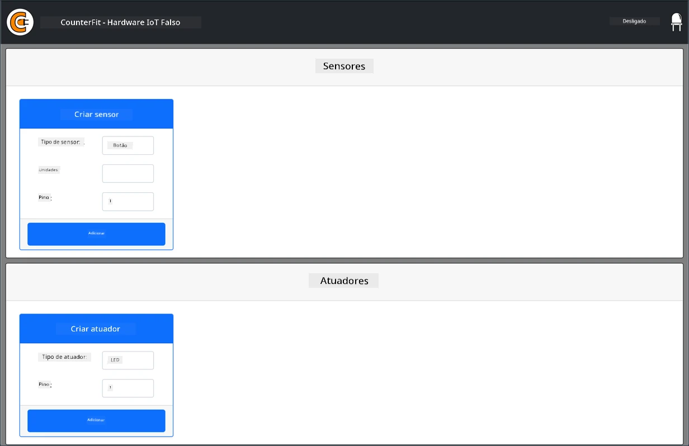
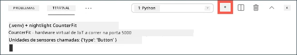

# Computador de placa única virtual

Em vez de comprar um dispositivo IoT, juntamente com sensores e atuadores, pode usar o seu computador para simular hardware IoT. O [projeto CounterFit](https://github.com/CounterFit-IoT/CounterFit) permite executar uma aplicação localmente que simula hardware IoT, como sensores e atuadores, e aceder a esses sensores e atuadores a partir de código Python local, escrito da mesma forma que escreveria num Raspberry Pi utilizando hardware físico.

## Configuração

Para usar o CounterFit, precisará de instalar algum software gratuito no seu computador.

### Tarefa

Instale o software necessário.

1. Instale o Python. Consulte a [página de downloads do Python](https://www.python.org/downloads/) para obter instruções sobre como instalar a versão mais recente do Python.

1. Instale o Visual Studio Code (VS Code). Este será o editor que usará para escrever o código do seu dispositivo virtual em Python. Consulte a [documentação do VS Code](https://code.visualstudio.com?WT.mc_id=academic-17441-jabenn) para obter instruções sobre como instalar o VS Code.

    > 💁 Está livre para usar qualquer IDE ou editor de Python para estas lições, caso tenha uma ferramenta preferida, mas as instruções das lições serão baseadas no uso do VS Code.

1. Instale a extensão Pylance para o VS Code. Esta é uma extensão para o VS Code que fornece suporte à linguagem Python. Consulte a [documentação da extensão Pylance](https://marketplace.visualstudio.com/items?WT.mc_id=academic-17441-jabenn&itemName=ms-python.vscode-pylance) para obter instruções sobre como instalar esta extensão no VS Code.

As instruções para instalar e configurar a aplicação CounterFit serão fornecidas no momento relevante nas instruções do exercício, pois a instalação é feita por projeto.

## Hello World

É tradicional, ao começar com uma nova linguagem de programação ou tecnologia, criar uma aplicação 'Hello World' - uma pequena aplicação que exibe algo como o texto `"Hello World"` para mostrar que todas as ferramentas estão configuradas corretamente.

A aplicação Hello World para o hardware IoT virtual garantirá que tem o Python e o Visual Studio Code instalados corretamente. Também se conectará ao CounterFit para os sensores e atuadores IoT virtuais. Não usará nenhum hardware, apenas se conectará para provar que tudo está a funcionar.

Esta aplicação estará numa pasta chamada `nightlight`, e será reutilizada com código diferente em partes posteriores deste exercício para construir a aplicação de luz noturna.

### Configurar um ambiente virtual Python

Uma das funcionalidades poderosas do Python é a capacidade de instalar [pacotes Pip](https://pypi.org) - pacotes de código escritos por outras pessoas e publicados na Internet. Pode instalar um pacote Pip no seu computador com um único comando e, em seguida, usar esse pacote no seu código. Usará o Pip para instalar um pacote que permite comunicar com o CounterFit.

Por padrão, quando instala um pacote, ele fica disponível em todo o computador, o que pode levar a problemas com versões de pacotes - como uma aplicação depender de uma versão de um pacote que deixa de funcionar quando instala uma nova versão para outra aplicação. Para contornar este problema, pode usar um [ambiente virtual Python](https://docs.python.org/3/library/venv.html), essencialmente uma cópia do Python numa pasta dedicada, e quando instala pacotes Pip, eles são instalados apenas nessa pasta.

> 💁 Se estiver a usar um Raspberry Pi, não configurou um ambiente virtual nesse dispositivo para gerir pacotes Pip, em vez disso, está a usar pacotes globais, pois os pacotes Grove são instalados globalmente pelo script de instalação.

#### Tarefa - configurar um ambiente virtual Python

Configure um ambiente virtual Python e instale os pacotes Pip para o CounterFit.

1. No seu terminal ou linha de comandos, execute o seguinte num local à sua escolha para criar e navegar para um novo diretório:

    ```sh
    mkdir nightlight
    cd nightlight
    ```

1. Agora execute o seguinte para criar um ambiente virtual na pasta `.venv`:

    ```sh
    python3 -m venv .venv
    ```

    > 💁 Precisa de chamar explicitamente `python3` para criar o ambiente virtual, caso tenha o Python 2 instalado além do Python 3 (a versão mais recente). Se tiver o Python 2 instalado, chamar `python` usará o Python 2 em vez do Python 3.

1. Ative o ambiente virtual:

    * No Windows:
        * Se estiver a usar o Command Prompt ou o Command Prompt através do Windows Terminal, execute:

            ```cmd
            .venv\Scripts\activate.bat
            ```

        * Se estiver a usar o PowerShell, execute:

            ```powershell
            .\.venv\Scripts\Activate.ps1
            ```

            > Se receber um erro sobre a execução de scripts estar desativada neste sistema, precisará de ativar a execução de scripts definindo uma política de execução apropriada. Pode fazer isso ao iniciar o PowerShell como administrador e, em seguida, executar o seguinte comando:

            ```powershell
            Set-ExecutionPolicy -ExecutionPolicy Unrestricted
            ```

            Insira `Y` quando solicitado a confirmar. Depois, reinicie o PowerShell e tente novamente.

            Pode redefinir esta política de execução mais tarde, se necessário. Pode ler mais sobre isso na [página de Políticas de Execução na documentação da Microsoft](https://docs.microsoft.com/powershell/module/microsoft.powershell.core/about/about_execution_policies?WT.mc_id=academic-17441-jabenn).

    * No macOS ou Linux, execute:

        ```cmd
        source ./.venv/bin/activate
        ```

    > 💁 Estes comandos devem ser executados a partir do mesmo local onde executou o comando para criar o ambiente virtual. Nunca precisará de navegar para dentro da pasta `.venv`, deve sempre executar o comando de ativação e quaisquer comandos para instalar pacotes ou executar código a partir da pasta onde estava quando criou o ambiente virtual.

1. Uma vez ativado o ambiente virtual, o comando padrão `python` executará a versão do Python usada para criar o ambiente virtual. Execute o seguinte para obter a versão:

    ```sh
    python --version
    ```

    O resultado deve conter o seguinte:

    ```output
    (.venv) ➜  nightlight python --version
    Python 3.9.1
    ```

    > 💁 A sua versão do Python pode ser diferente - desde que seja a versão 3.6 ou superior, está tudo bem. Caso contrário, elimine esta pasta, instale uma versão mais recente do Python e tente novamente.

1. Execute os seguintes comandos para instalar os pacotes Pip para o CounterFit. Estes pacotes incluem a aplicação principal do CounterFit, bem como shims para hardware Grove. Estes shims permitem escrever código como se estivesse a programar com sensores e atuadores físicos do ecossistema Grove, mas conectados a dispositivos IoT virtuais.

    ```sh
    pip install CounterFit
    pip install counterfit-connection
    pip install counterfit-shims-grove
    ```

    Estes pacotes Pip serão instalados apenas no ambiente virtual e não estarão disponíveis fora dele.

### Escrever o código

Depois de o ambiente virtual Python estar pronto, pode escrever o código para a aplicação 'Hello World'.

#### Tarefa - escrever o código

Crie uma aplicação Python para imprimir `"Hello World"` no terminal.

1. No seu terminal ou linha de comandos, execute o seguinte dentro do ambiente virtual para criar um ficheiro Python chamado `app.py`:

    * No Windows, execute:

        ```cmd
        type nul > app.py
        ```

    * No macOS ou Linux, execute:

        ```cmd
        touch app.py
        ```

1. Abra a pasta atual no VS Code:

    ```sh
    code .
    ```

    > 💁 Se o seu terminal retornar `command not found` no macOS, significa que o VS Code não foi adicionado ao seu PATH. Pode adicionar o VS Code ao PATH seguindo as instruções na [secção de Lançamento a partir da linha de comandos na documentação do VS Code](https://code.visualstudio.com/docs/setup/mac?WT.mc_id=academic-17441-jabenn#_launching-from-the-command-line) e executar o comando novamente. O VS Code é adicionado ao PATH por padrão no Windows e Linux.

1. Quando o VS Code for iniciado, ativará o ambiente virtual Python. O ambiente virtual selecionado aparecerá na barra de estado inferior:

    

1. Se o Terminal do VS Code já estiver em execução quando o VS Code for iniciado, ele não terá o ambiente virtual ativado. A forma mais fácil de resolver isso é encerrar o terminal usando o botão **Kill the active terminal instance**:

    

    Pode verificar se o terminal tem o ambiente virtual ativado, pois o nome do ambiente virtual será um prefixo no prompt do terminal. Por exemplo, pode ser:

    ```sh
    (.venv) ➜  nightlight
    ```

    Se não tiver `.venv` como prefixo no prompt, o ambiente virtual não está ativo no terminal.

1. Inicie um novo Terminal do VS Code selecionando *Terminal -> New Terminal*, ou pressionando `` CTRL+` ``. O novo terminal carregará o ambiente virtual, e a chamada para ativá-lo aparecerá no terminal. O prompt também terá o nome do ambiente virtual (`.venv`):

    ```output
    ➜  nightlight source .venv/bin/activate
    (.venv) ➜  nightlight 
    ```

1. Abra o ficheiro `app.py` no explorador do VS Code e adicione o seguinte código:

    ```python
    print('Hello World!')
    ```

    A função `print` imprime no terminal o que for passado para ela.

1. No terminal do VS Code, execute o seguinte para executar a sua aplicação Python:

    ```sh
    python app.py
    ```

    O seguinte será exibido no terminal:

    ```output
    (.venv) ➜  nightlight python app.py 
    Hello World!
    ```

😀 O seu programa 'Hello World' foi um sucesso!

### Conectar o 'hardware'

Como um segundo passo do 'Hello World', irá executar a aplicação CounterFit e conectar o seu código a ela. Este é o equivalente virtual a ligar algum hardware IoT a um kit de desenvolvimento.

#### Tarefa - conectar o 'hardware'

1. No terminal do VS Code, inicie a aplicação CounterFit com o seguinte comando:

    ```sh
    counterfit
    ```

    A aplicação começará a ser executada e abrirá no seu navegador:

    

    Será marcada como *Disconnected*, com o LED no canto superior direito desligado.

1. Adicione o seguinte código ao início do ficheiro `app.py`:

    ```python
    from counterfit_connection import CounterFitConnection
    CounterFitConnection.init('127.0.0.1', 5000)
    ```

    Este código importa a classe `CounterFitConnection` do módulo `counterfit_connection`, que vem do pacote Pip `counterfit-connection` que instalou anteriormente. Em seguida, inicializa uma conexão com a aplicação CounterFit em execução no `127.0.0.1`, que é um endereço IP que pode sempre usar para aceder ao seu computador local (frequentemente referido como *localhost*), na porta 5000.

    > 💁 Se tiver outras aplicações a usar a porta 5000, pode alterar isso atualizando a porta no código e executando o CounterFit usando `CounterFit --port <port_number>`, substituindo `<port_number>` pela porta que deseja usar.

1. Precisará de iniciar um novo terminal no VS Code selecionando o botão **Create a new integrated terminal**. Isto porque a aplicação CounterFit está a ser executada no terminal atual.

    

1. Neste novo terminal, execute o ficheiro `app.py` como antes. O estado do CounterFit mudará para **Connected** e o LED acenderá.

    

> 💁 Pode encontrar este código na pasta [code/virtual-device](../../../../../1-getting-started/lessons/1-introduction-to-iot/code/virtual-device).

😀 A sua conexão com o hardware foi um sucesso!

**Aviso Legal**:  
Este documento foi traduzido utilizando o serviço de tradução por IA [Co-op Translator](https://github.com/Azure/co-op-translator). Embora nos esforcemos pela precisão, esteja ciente de que traduções automáticas podem conter erros ou imprecisões. O documento original na sua língua nativa deve ser considerado a fonte autoritária. Para informações críticas, recomenda-se a tradução profissional realizada por humanos. Não nos responsabilizamos por quaisquer mal-entendidos ou interpretações incorretas decorrentes do uso desta tradução.