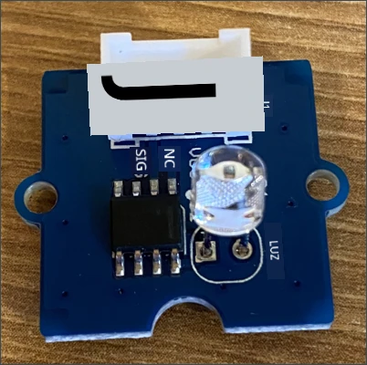

# Construir uma luz de presença - Raspberry Pi

Nesta parte da lição, vais adicionar um sensor de luz ao teu Raspberry Pi.

## Hardware

O sensor utilizado nesta lição é um **sensor de luz** que usa um [fotodíodo](https://wikipedia.org/wiki/Photodiode) para converter luz em um sinal elétrico. Este é um sensor analógico que envia um valor inteiro de 0 a 1.000, indicando uma quantidade relativa de luz que não corresponde a nenhuma unidade de medida padrão, como [lux](https://wikipedia.org/wiki/Lux).

O sensor de luz é um sensor externo Grove e precisa ser conectado ao Grove Base hat no Raspberry Pi.

### Conectar o sensor de luz

O sensor de luz Grove, utilizado para detetar os níveis de luz, precisa ser conectado ao Raspberry Pi.

#### Tarefa - conectar o sensor de luz

Conecta o sensor de luz.



1. Insere uma extremidade de um cabo Grove na entrada do módulo do sensor de luz. Ele só encaixará de uma forma.

1. Com o Raspberry Pi desligado, conecta a outra extremidade do cabo Grove à entrada analógica marcada como **A0** no Grove Base hat conectado ao Pi. Esta entrada é a segunda da direita, na fila de entradas ao lado dos pinos GPIO.


## Programar o sensor de luz

Agora o dispositivo pode ser programado utilizando o sensor de luz Grove.

### Tarefa - programar o sensor de luz

Programa o dispositivo.

1. Liga o Raspberry Pi e espera que ele inicie.

1. Abre o projeto da luz de presença no VS Code que criaste na parte anterior desta tarefa, seja diretamente no Pi ou conectado usando a extensão Remote SSH.

1. Abre o ficheiro `app.py` e remove todo o código existente.

1. Adiciona o seguinte código ao ficheiro `app.py` para importar algumas bibliotecas necessárias:

    ```python
    import time
    from grove.grove_light_sensor_v1_2 import GroveLightSensor
    ```

    A instrução `import time` importa o módulo `time`, que será utilizado mais tarde nesta tarefa.

    A instrução `from grove.grove_light_sensor_v1_2 import GroveLightSensor` importa o `GroveLightSensor` das bibliotecas Python do Grove. Esta biblioteca contém o código para interagir com um sensor de luz Grove e foi instalada globalmente durante a configuração do Pi.

1. Adiciona o seguinte código após o código acima para criar uma instância da classe que gere o sensor de luz:

    ```python
    light_sensor = GroveLightSensor(0)
    ```

    A linha `light_sensor = GroveLightSensor(0)` cria uma instância da classe `GroveLightSensor` conectando ao pino **A0** - o pino analógico Grove ao qual o sensor de luz está conectado.

1. Adiciona um loop infinito após o código acima para consultar o valor do sensor de luz e imprimi-lo no terminal:

    ```python
    while True:
        light = light_sensor.light
        print('Light level:', light)
    ```

    Isto irá ler o nível atual de luz numa escala de 0-1.023 utilizando a propriedade `light` da classe `GroveLightSensor`. Esta propriedade lê o valor analógico do pino. Este valor é então impresso no terminal.

1. Adiciona uma pequena pausa de um segundo no final do `loop`, pois os níveis de luz não precisam ser verificados continuamente. Uma pausa reduz o consumo de energia do dispositivo.

    ```python
    time.sleep(1)
    ```

1. No Terminal do VS Code, executa o seguinte comando para correr a tua aplicação Python:

    ```sh
    python3 app.py
    ```

    Os valores de luz serão exibidos no terminal. Cobre e descobre o sensor de luz, e os valores irão mudar:

    ```output
    pi@raspberrypi:~/nightlight $ python3 app.py 
    Light level: 634
    Light level: 634
    Light level: 634
    Light level: 230
    Light level: 104
    Light level: 290
    ```

> 💁 Podes encontrar este código na pasta [code-sensor/pi](../../../../../1-getting-started/lessons/3-sensors-and-actuators/code-sensor/pi).

😀 Adicionar um sensor ao teu programa de luz de presença foi um sucesso!

**Aviso Legal**:  
Este documento foi traduzido utilizando o serviço de tradução por IA [Co-op Translator](https://github.com/Azure/co-op-translator). Embora nos esforcemos para garantir a precisão, é importante notar que traduções automáticas podem conter erros ou imprecisões. O documento original na sua língua nativa deve ser considerado a fonte autoritária. Para informações críticas, recomenda-se a tradução profissional realizada por humanos. Não nos responsabilizamos por quaisquer mal-entendidos ou interpretações incorretas decorrentes do uso desta tradução.