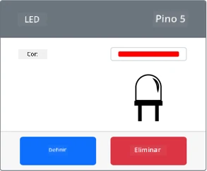

# Construir uma luz de presença - Hardware IoT Virtual

Nesta parte da lição, irá adicionar um LED ao seu dispositivo IoT virtual e utilizá-lo para criar uma luz de presença.

## Hardware Virtual

A luz de presença necessita de um atuador, criado na aplicação CounterFit.

O atuador é um **LED**. Num dispositivo IoT físico, seria um [díodo emissor de luz](https://wikipedia.org/wiki/Light-emitting_diode) que emite luz quando a corrente passa por ele. Este é um atuador digital que possui 2 estados: ligado e desligado. Enviar um valor de 1 liga o LED, e 0 desliga-o.

A lógica da luz de presença em pseudo-código é:

```output
Check the light level.
If the light is less than 300
    Turn the LED on
Otherwise
    Turn the LED off
```

### Adicionar o atuador ao CounterFit

Para utilizar um LED virtual, é necessário adicioná-lo à aplicação CounterFit.

#### Tarefa - adicionar o atuador ao CounterFit

Adicione o LED à aplicação CounterFit.

1. Certifique-se de que a aplicação web CounterFit está a ser executada a partir da parte anterior deste exercício. Caso contrário, inicie-a e volte a adicionar o sensor de luz.

1. Crie um LED:

    1. Na caixa *Create actuator* no painel *Actuator*, abra o menu suspenso *Actuator type* e selecione *LED*.

    1. Defina o *Pin* para *5*.

    1. Selecione o botão **Add** para criar o LED no Pin 5.

    

    O LED será criado e aparecerá na lista de atuadores.

    

    Depois de criar o LED, pode alterar a cor utilizando o seletor *Color*. Selecione o botão **Set** para alterar a cor após a sua escolha.

### Programar a luz de presença

Agora pode programar a luz de presença utilizando o sensor de luz e o LED do CounterFit.

#### Tarefa - programar a luz de presença

Programe a luz de presença.

1. Abra o projeto da luz de presença no VS Code que criou na parte anterior deste exercício. Encerre e recrie o terminal para garantir que está a ser executado com o ambiente virtual, se necessário.

1. Abra o ficheiro `app.py`.

1. Adicione o seguinte código ao ficheiro `app.py` para importar uma biblioteca necessária. Isto deve ser adicionado no topo, abaixo das outras linhas de `import`.

    ```python
    from counterfit_shims_grove.grove_led import GroveLed
    ```

    A instrução `from counterfit_shims_grove.grove_led import GroveLed` importa o `GroveLed` das bibliotecas Python CounterFit Grove shim. Esta biblioteca contém o código para interagir com um LED criado na aplicação CounterFit.

1. Adicione o seguinte código após a declaração de `light_sensor` para criar uma instância da classe que gere o LED:

    ```python
    led = GroveLed(5)
    ```

    A linha `led = GroveLed(5)` cria uma instância da classe `GroveLed` conectada ao pino **5** - o pino Grove do CounterFit ao qual o LED está ligado.

1. Adicione uma verificação dentro do ciclo `while`, antes do `time.sleep`, para verificar os níveis de luz e ligar ou desligar o LED:

    ```python
    if light < 300:
        led.on()
    else:
        led.off()
    ```

    Este código verifica o valor de `light`. Se for inferior a 300, chama o método `on` da classe `GroveLed`, que envia um valor digital de 1 para o LED, ligando-o. Se o valor de luz for maior ou igual a 300, chama o método `off`, enviando um valor digital de 0 para o LED, desligando-o.

    > 💁 Este código deve estar indentado ao mesmo nível da linha `print('Light level:', light)` para estar dentro do ciclo while!

1. No Terminal do VS Code, execute o seguinte comando para executar a sua aplicação Python:

    ```sh
    python3 app.py
    ```

    Os valores de luz serão exibidos no console.

    ```output
    (.venv) ➜  GroveTest python3 app.py 
    Light level: 143
    Light level: 244
    Light level: 246
    Light level: 253
    ```

1. Altere as definições de *Value* ou *Random* para variar o nível de luz acima e abaixo de 300. O LED irá ligar e desligar.


> 💁 Pode encontrar este código na pasta [code-actuator/virtual-device](../../../../../1-getting-started/lessons/3-sensors-and-actuators/code-actuator/virtual-device).

😀 O seu programa de luz de presença foi um sucesso!

**Aviso Legal**:  
Este documento foi traduzido utilizando o serviço de tradução por IA [Co-op Translator](https://github.com/Azure/co-op-translator). Embora nos esforcemos para garantir a precisão, esteja ciente de que traduções automáticas podem conter erros ou imprecisões. O documento original na sua língua nativa deve ser considerado a fonte autoritária. Para informações críticas, recomenda-se a tradução profissional realizada por humanos. Não nos responsabilizamos por quaisquer mal-entendidos ou interpretações incorretas decorrentes do uso desta tradução.