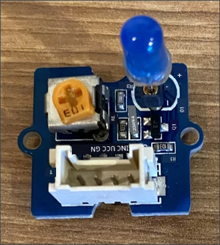
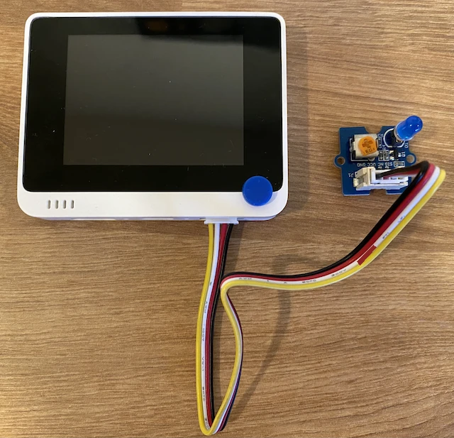

# Construa uma luz de presença - Wio Terminal

Nesta parte da lição, irá adicionar um LED ao seu Wio Terminal e usá-lo para criar uma luz de presença.

## Hardware

A luz de presença agora precisa de um atuador.

O atuador é um **LED**, um [díodo emissor de luz](https://wikipedia.org/wiki/Light-emitting_diode) que emite luz quando a corrente passa por ele. Este é um atuador digital que tem 2 estados: ligado e desligado. Enviar um valor de 1 liga o LED, e 0 desliga-o. Este é um atuador externo Grove e precisa de ser ligado ao Wio Terminal.

A lógica da luz de presença em pseudo-código é:

```output
Check the light level.
If the light is less than 300
    Turn the LED on
Otherwise
    Turn the LED off
```

### Ligar o LED

O LED Grove vem como um módulo com uma seleção de LEDs, permitindo-lhe escolher a cor.

#### Tarefa - ligar o LED

Ligue o LED.



1. Escolha o seu LED favorito e insira as pernas nos dois orifícios do módulo LED.

    Os LEDs são díodos emissores de luz, e os díodos são dispositivos eletrónicos que só permitem a passagem de corrente num sentido. Isto significa que o LED precisa de ser ligado na orientação correta, caso contrário, não funcionará.

    Uma das pernas do LED é o pino positivo, a outra é o pino negativo. O LED não é perfeitamente redondo e é ligeiramente mais plano de um lado. O lado ligeiramente mais plano é o pino negativo. Ao ligar o LED ao módulo, certifique-se de que o pino do lado arredondado está ligado à tomada marcada com **+** na parte externa do módulo, e o lado mais plano está ligado à tomada mais próxima do centro do módulo.

1. O módulo LED tem um botão rotativo que permite controlar o brilho. Rode-o completamente para cima no início, girando-o no sentido anti-horário até ao limite, usando uma pequena chave de fendas Phillips.

1. Insira uma extremidade de um cabo Grove na tomada do módulo LED. Só encaixará de uma forma.

1. Com o Wio Terminal desligado do computador ou de outra fonte de alimentação, ligue a outra extremidade do cabo Grove à tomada Grove do lado direito do Wio Terminal, olhando para o ecrã. Esta é a tomada mais distante do botão de energia.

    > 💁 A tomada Grove do lado direito pode ser usada com sensores e atuadores analógicos ou digitais. A tomada do lado esquerdo é apenas para sensores e atuadores digitais. O C será abordado numa lição posterior.



## Programar a luz de presença

A luz de presença pode agora ser programada usando o sensor de luz embutido e o LED Grove.

### Tarefa - programar a luz de presença

Programe a luz de presença.

1. Abra o projeto da luz de presença no VS Code que criou na parte anterior desta tarefa.

1. Adicione a seguinte linha ao final da função `setup`:

    ```cpp
    pinMode(D0, OUTPUT);
    ```

    Esta linha configura o pino usado para comunicar com o LED através da porta Grove.

    O pino `D0` é o pino digital para a tomada Grove do lado direito. Este pino é configurado como `OUTPUT`, o que significa que está ligado a um atuador e os dados serão escritos no pino.

1. Adicione o seguinte código imediatamente antes do `delay` na função loop:

    ```cpp
    if (light < 300)
    {
        digitalWrite(D0, HIGH);
    }
    else
    {
        digitalWrite(D0, LOW);
    }
    ```

    Este código verifica o valor de `light`. Se for inferior a 300, envia um valor `HIGH` para o pino digital `D0`. Este `HIGH` é um valor de 1, ligando o LED. Se o valor de luz for maior ou igual a 300, um valor `LOW` de 0 é enviado para o pino, desligando o LED.

    > 💁 Ao enviar valores digitais para atuadores, um valor LOW é 0v, e um valor HIGH é a voltagem máxima para o dispositivo. Para o Wio Terminal, a voltagem HIGH é 3.3V.

1. Volte a ligar o Wio Terminal ao seu computador e carregue o novo código como fez anteriormente.

1. Ligue o Monitor Serial. Os valores de luz serão exibidos no terminal.

    ```output
    > Executing task: platformio device monitor <

    --- Available filters and text transformations: colorize, debug, default, direct, hexlify, log2file, nocontrol, printable, send_on_enter, time
    --- More details at http://bit.ly/pio-monitor-filters
    --- Miniterm on /dev/cu.usbmodem101  9600,8,N,1 ---
    --- Quit: Ctrl+C | Menu: Ctrl+T | Help: Ctrl+T followed by Ctrl+H ---
    Light value: 4
    Light value: 5
    Light value: 4
    Light value: 158
    Light value: 343
    Light value: 348
    Light value: 344
    ```

1. Tape e destape o sensor de luz. Note como o LED acende se o nível de luz for 300 ou menos, e apaga-se quando o nível de luz for superior a 300.


> 💁 Pode encontrar este código na pasta [code-actuator/wio-terminal](../../../../../1-getting-started/lessons/3-sensors-and-actuators/code-actuator/wio-terminal).

😀 O seu programa de luz de presença foi um sucesso!

**Aviso Legal**:  
Este documento foi traduzido utilizando o serviço de tradução por IA [Co-op Translator](https://github.com/Azure/co-op-translator). Embora nos esforcemos pela precisão, esteja ciente de que traduções automáticas podem conter erros ou imprecisões. O documento original na sua língua nativa deve ser considerado a fonte autoritária. Para informações críticas, recomenda-se a tradução profissional realizada por humanos. Não nos responsabilizamos por quaisquer mal-entendidos ou interpretações incorretas decorrentes do uso desta tradução.