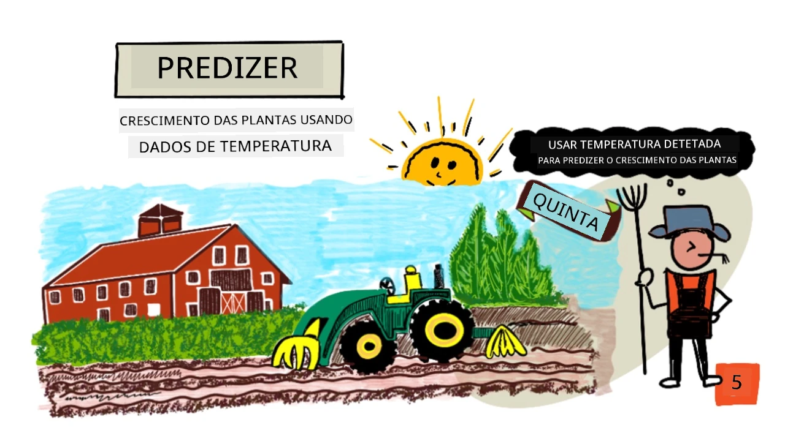
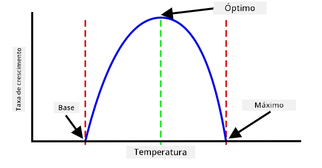
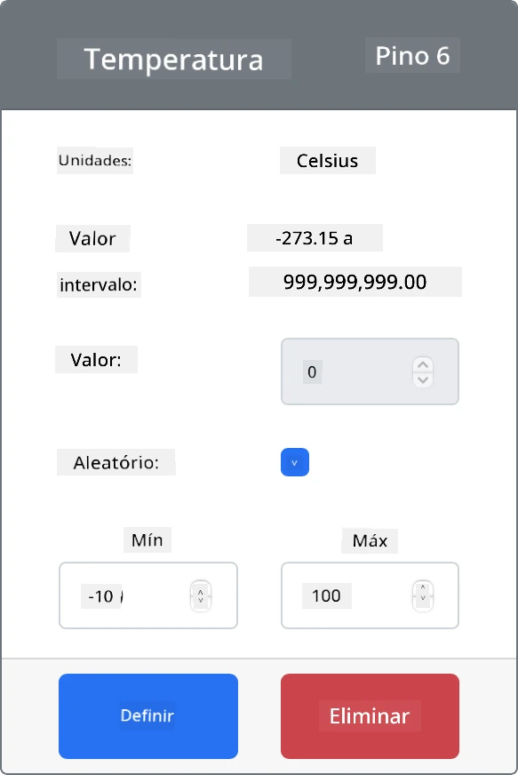

# Prever o crescimento das plantas com IoT



> Ilustração por [Nitya Narasimhan](https://github.com/nitya). Clique na imagem para uma versão maior.

## Questionário pré-aula

[Questionário pré-aula](https://black-meadow-040d15503.1.azurestaticapps.net/quiz/9)

## Introdução

As plantas precisam de certos elementos para crescer - água, dióxido de carbono, nutrientes, luz e calor. Nesta lição, vais aprender a calcular as taxas de crescimento e maturação das plantas medindo a temperatura do ar.

Nesta lição, vamos abordar:

* [Agricultura digital](../../../../../2-farm/lessons/1-predict-plant-growth)
* [Por que a temperatura é importante na agricultura?](../../../../../2-farm/lessons/1-predict-plant-growth)
* [Medir a temperatura ambiente](../../../../../2-farm/lessons/1-predict-plant-growth)
* [Dias de grau de crescimento (GDD)](../../../../../2-farm/lessons/1-predict-plant-growth)
* [Calcular GDD usando dados de sensores de temperatura](../../../../../2-farm/lessons/1-predict-plant-growth)

## Agricultura digital

A Agricultura Digital está a transformar a forma como cultivamos, utilizando ferramentas para recolher, armazenar e analisar dados agrícolas. Estamos atualmente num período descrito como a 'Quarta Revolução Industrial' pelo Fórum Económico Mundial, e o surgimento da agricultura digital tem sido apelidado de 'Quarta Revolução Agrícola', ou 'Agricultura 4.0'.

> 🎓 O termo Agricultura Digital também inclui toda a 'cadeia de valor agrícola', ou seja, todo o percurso desde a quinta até à mesa. Inclui o rastreio da qualidade dos produtos enquanto são transportados e processados, sistemas de armazém e comércio eletrónico, até mesmo aplicações para aluguer de tratores!

Estas mudanças permitem aos agricultores aumentar a produtividade, usar menos fertilizantes e pesticidas, e gerir a água de forma mais eficiente. Embora seja usada principalmente em países mais ricos, os sensores e outros dispositivos estão gradualmente a reduzir de preço, tornando-se mais acessíveis em países em desenvolvimento.

Algumas técnicas possibilitadas pela agricultura digital são:

* Medição de temperatura - medir a temperatura permite aos agricultores prever o crescimento e a maturação das plantas.
* Rega automatizada - medir a humidade do solo e ativar os sistemas de irrigação quando o solo está demasiado seco, em vez de regar em horários fixos. A rega programada pode levar a que as culturas fiquem sub-regadas durante um período quente e seco, ou sobre-regadas durante a chuva. Ao regar apenas quando o solo precisa, os agricultores podem otimizar o uso da água.
* Controlo de pragas - os agricultores podem usar câmaras em robôs automatizados ou drones para verificar a presença de pragas e aplicar pesticidas apenas onde for necessário, reduzindo a quantidade de pesticidas usados e o escoamento de pesticidas para os recursos hídricos locais.

✅ Faz uma pesquisa. Que outras técnicas são usadas para melhorar os rendimentos agrícolas?

> 🎓 O termo 'Agricultura de Precisão' é usado para definir a observação, medição e resposta às culturas numa base por campo, ou até mesmo em partes de um campo. Isto inclui medir os níveis de água, nutrientes e pragas e responder de forma precisa, como regar apenas uma pequena parte de um campo.

## Por que a temperatura é importante na agricultura?

Ao aprender sobre plantas, a maioria dos alunos é ensinada sobre a necessidade de água, luz, dióxido de carbono e nutrientes. As plantas também precisam de calor para crescer - é por isso que florescem na primavera, quando a temperatura aumenta, porque os narcisos ou campainhas podem brotar cedo devido a um curto período de calor, e porque as estufas e casas de vegetação são tão eficazes para o crescimento das plantas.

> 🎓 As casas de vegetação e as estufas têm funções semelhantes, mas com uma diferença importante. As casas de vegetação são aquecidas artificialmente e permitem aos agricultores controlar as temperaturas com mais precisão, enquanto as estufas dependem do sol para o calor e geralmente o único controlo são janelas ou outras aberturas para deixar o calor sair.

As plantas têm uma temperatura base ou mínima, uma temperatura ótima e uma temperatura máxima, todas baseadas nas temperaturas médias diárias.

* Temperatura base - esta é a temperatura média diária mínima necessária para que uma planta cresça.
* Temperatura ótima - esta é a melhor temperatura média diária para obter o maior crescimento.
* Temperatura máxima - esta é a temperatura máxima que uma planta pode suportar. Acima disso, a planta interrompe o crescimento numa tentativa de conservar água e sobreviver.

> 💁 Estas são temperaturas médias, calculadas a partir das temperaturas diurnas e noturnas. As plantas também precisam de temperaturas diferentes durante o dia e a noite para ajudar na fotossíntese de forma mais eficiente e poupar energia à noite.

Cada espécie de planta tem valores diferentes para a sua temperatura base, ótima e máxima. É por isso que algumas plantas prosperam em países quentes e outras em países mais frios.

✅ Faz uma pesquisa. Para qualquer planta que tenhas no teu jardim, escola ou parque local, vê se consegues encontrar a temperatura base.



O gráfico acima mostra um exemplo de taxa de crescimento em relação à temperatura. Até à temperatura base, não há crescimento. A taxa de crescimento aumenta até à temperatura ótima e depois diminui após atingir este pico. Na temperatura máxima, o crescimento para.

A forma deste gráfico varia de espécie para espécie. Algumas têm quedas mais acentuadas acima da temperatura ótima, outras têm aumentos mais lentos da base até à ótima.

> 💁 Para que um agricultor obtenha o melhor crescimento, ele precisará de conhecer os três valores de temperatura e entender a forma dos gráficos para as plantas que está a cultivar.

Se um agricultor tiver controlo sobre a temperatura, por exemplo, numa casa de vegetação comercial, ele pode otimizar para as suas plantas. Uma casa de vegetação comercial que cultiva tomates, por exemplo, terá a temperatura ajustada para cerca de 25°C durante o dia e 20°C à noite para obter o crescimento mais rápido.

> 🍅 Combinando estas temperaturas com luzes artificiais, fertilizantes e níveis controlados de CO
Este código abre o ficheiro CSV e adiciona uma nova linha no final. A linha contém a data e hora atual formatadas de forma legível, seguidas pela temperatura recebida do dispositivo IoT. Os dados são armazenados no [formato ISO 8601](https://wikipedia.org/wiki/ISO_8601) com o fuso horário, mas sem os microsegundos.

1. Execute este código da mesma forma que antes, certificando-se de que o seu dispositivo IoT está a enviar dados. Um ficheiro CSV chamado `temperature.csv` será criado na mesma pasta. Se o abrir, verá datas/horas e medições de temperatura:

    ```output
    date,temperature
    2021-04-19T17:21:36-07:00,25
    2021-04-19T17:31:36-07:00,24
    2021-04-19T17:41:36-07:00,25
    ```

1. Execute este código durante algum tempo para capturar dados. Idealmente, deve executá-lo durante um dia inteiro para recolher dados suficientes para os cálculos de GDD.

    
> 💁 Se estiver a usar um Dispositivo IoT Virtual, selecione a caixa de verificação aleatória e defina um intervalo para evitar obter sempre a mesma temperatura quando o valor da temperatura for retornado.
     

    > 💁 Se quiser executar isto durante um dia inteiro, então precisa de garantir que o computador onde o código do servidor está a correr não entra em modo de suspensão, seja alterando as definições de energia ou executando algo como [este script Python para manter o sistema ativo](https://github.com/jaqsparow/keep-system-active).
    
> 💁 Pode encontrar este código na pasta [code-server/temperature-sensor-server](../../../../../2-farm/lessons/1-predict-plant-growth/code-server/temperature-sensor-server).

### Tarefa - calcular GDD usando os dados armazenados

Depois de o servidor ter capturado os dados de temperatura, o GDD para uma planta pode ser calculado.

Os passos para fazer isto manualmente são:

1. Descubra a temperatura base para a planta. Por exemplo, para morangos a temperatura base é 10°C.

1. No ficheiro `temperature.csv`, encontre as temperaturas mais altas e mais baixas do dia.

1. Use o cálculo de GDD dado anteriormente para calcular o GDD.

Por exemplo, se a temperatura mais alta do dia for 25°C e a mais baixa for 12°C:


* 25 + 12 = 37
* 37 / 2 = 18.5
* 18.5 - 10 = 8.5

Portanto, os morangos receberam **8.5** GDD. Os morangos precisam de cerca de 250 GDD para dar frutos, então ainda falta algum tempo.

---

## 🚀 Desafio

As plantas precisam de mais do que calor para crescer. Que outras coisas são necessárias?

Para estas, descubra se existem sensores que podem medi-las. E quanto a atuadores para controlar esses níveis? Como poderia montar um ou mais dispositivos IoT para otimizar o crescimento das plantas?

## Questionário pós-aula

[Questionário pós-aula](https://black-meadow-040d15503.1.azurestaticapps.net/quiz/10)

## Revisão & Autoestudo

* Leia mais sobre agricultura digital na [página da Wikipedia sobre Agricultura Digital](https://wikipedia.org/wiki/Digital_agriculture). Leia também mais sobre agricultura de precisão na [página da Wikipedia sobre Agricultura de Precisão](https://wikipedia.org/wiki/Precision_agriculture).
* O cálculo completo dos graus-dia de crescimento é mais complicado do que o simplificado apresentado aqui. Leia mais sobre a equação mais complexa e como lidar com temperaturas abaixo do limite na [página da Wikipedia sobre Graus-Dia de Crescimento](https://wikipedia.org/wiki/Growing_degree-day).
* A comida pode ser escassa no futuro se continuarmos a usar os mesmos métodos de cultivo. Saiba mais sobre técnicas de agricultura de alta tecnologia neste [vídeo sobre Fazendas Hi-Tech do Futuro no YouTube](https://www.youtube.com/watch?v=KIEOuKD9KX8).

## Trabalho

[Visualizar dados de GDD usando um Jupyter Notebook](assignment.md)

**Aviso Legal**:  
Este documento foi traduzido utilizando o serviço de tradução por IA [Co-op Translator](https://github.com/Azure/co-op-translator). Embora nos esforcemos para garantir a precisão, esteja ciente de que traduções automáticas podem conter erros ou imprecisões. O documento original no seu idioma nativo deve ser considerado a fonte autoritativa. Para informações críticas, recomenda-se uma tradução profissional realizada por humanos. Não nos responsabilizamos por quaisquer mal-entendidos ou interpretações incorretas resultantes do uso desta tradução.