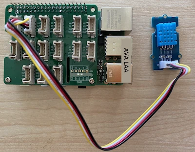

# Medir a temperatura - Raspberry Pi

Nesta parte da lição, vais adicionar um sensor de temperatura ao teu Raspberry Pi.

## Hardware

O sensor que vais utilizar é um [sensor de humidade e temperatura DHT11](https://www.seeedstudio.com/Grove-Temperature-Humidity-Sensor-DHT11.html), que combina 2 sensores num único dispositivo. Este sensor é bastante popular, com vários modelos disponíveis comercialmente que combinam temperatura, humidade e, por vezes, pressão atmosférica. O componente de temperatura é um termistor de coeficiente de temperatura negativo (NTC), ou seja, um termistor cuja resistência diminui à medida que a temperatura aumenta.

Este é um sensor digital, pelo que possui um ADC integrado para criar um sinal digital contendo os dados de temperatura e humidade que o microcontrolador pode ler.

### Ligar o sensor de temperatura

O sensor de temperatura Grove pode ser ligado ao Raspberry Pi.

#### Tarefa

Liga o sensor de temperatura.


1. Insere uma extremidade de um cabo Grove na entrada do sensor de humidade e temperatura. O cabo só encaixa de uma forma.

1. Com o Raspberry Pi desligado, liga a outra extremidade do cabo Grove à entrada digital marcada como **D5** no Grove Base Hat conectado ao Pi. Esta entrada é a segunda a contar da esquerda, na fila de entradas ao lado dos pinos GPIO.



## Programar o sensor de temperatura

Agora o dispositivo pode ser programado para utilizar o sensor de temperatura conectado.

### Tarefa

Programa o dispositivo.

1. Liga o Pi e espera que ele inicie.

1. Abre o VS Code, diretamente no Pi ou através da extensão Remote SSH.

    > ⚠️ Podes consultar [as instruções para configurar e abrir o VS Code na lição 1, se necessário](../../../1-getting-started/lessons/1-introduction-to-iot/pi.md).

1. No terminal, cria uma nova pasta no diretório home do utilizador `pi` chamada `temperature-sensor`. Cria um ficheiro nesta pasta chamado `app.py`:

    ```sh
    mkdir temperature-sensor
    cd temperature-sensor
    touch app.py
    ```

1. Abre esta pasta no VS Code.

1. Para utilizar o sensor de temperatura e humidade, é necessário instalar um pacote adicional do Pip. No Terminal do VS Code, executa o seguinte comando para instalar este pacote no Pi:

    ```sh
    pip3 install seeed-python-dht
    ```

1. Adiciona o seguinte código ao ficheiro `app.py` para importar as bibliotecas necessárias:

    ```python
    import time
    from seeed_dht import DHT
    ```

    A instrução `from seeed_dht import DHT` importa a classe `DHT` para interagir com um sensor de temperatura Grove do módulo `seeed_dht`.

1. Adiciona o seguinte código após o código acima para criar uma instância da classe que gere o sensor de temperatura:

    ```python
    sensor = DHT("11", 5)
    ```

    Isto declara uma instância da classe `DHT` que gere o sensor digital de humidade e temperatura (**D**igital **H**umidity and **T**emperature). O primeiro parâmetro indica que o sensor utilizado é o *DHT11* - a biblioteca que estás a usar suporta outras variantes deste sensor. O segundo parâmetro indica que o sensor está ligado à entrada digital `D5` no Grove Base Hat.

    > ✅ Lembra-te, todas as entradas têm números de pinos únicos. Os pinos 0, 2, 4 e 6 são pinos analógicos, enquanto os pinos 5, 16, 18, 22, 24 e 26 são pinos digitais.

1. Adiciona um loop infinito após o código acima para obter o valor do sensor de temperatura e imprimi-lo na consola:

    ```python
    while True:
        _, temp = sensor.read()
        print(f'Temperature {temp}°C')
    ```

    A chamada a `sensor.read()` devolve uma tupla com os valores de humidade e temperatura. Apenas precisas do valor da temperatura, por isso o valor da humidade é ignorado. O valor da temperatura é então impresso na consola.

1. Adiciona uma pequena pausa de dez segundos no final do `loop`, pois os níveis de temperatura não precisam de ser verificados continuamente. Uma pausa reduz o consumo de energia do dispositivo.

    ```python
    time.sleep(10)
    ```

1. No Terminal do VS Code, executa o seguinte comando para correr a tua aplicação Python:

    ```sh
    python3 app.py
    ```

    Deverás ver os valores de temperatura a serem exibidos na consola. Usa algo para aquecer o sensor, como pressionar o polegar sobre ele ou usar um ventilador, para observar as mudanças nos valores:

    ```output
    pi@raspberrypi:~/temperature-sensor $ python3 app.py 
    Temperature 26°C
    Temperature 26°C
    Temperature 28°C
    Temperature 30°C
    Temperature 32°C
    ```

> 💁 Podes encontrar este código na pasta [code-temperature/pi](../../../../../2-farm/lessons/1-predict-plant-growth/code-temperature/pi).

😀 O teu programa para o sensor de temperatura foi um sucesso!

**Aviso Legal**:  
Este documento foi traduzido utilizando o serviço de tradução por IA [Co-op Translator](https://github.com/Azure/co-op-translator). Embora nos esforcemos para garantir a precisão, tenha em atenção que traduções automáticas podem conter erros ou imprecisões. O documento original na sua língua nativa deve ser considerado a fonte autoritária. Para informações críticas, recomenda-se a tradução profissional realizada por humanos. Não nos responsabilizamos por quaisquer mal-entendidos ou interpretações incorretas decorrentes da utilização desta tradução.