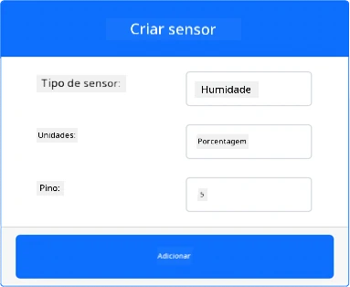
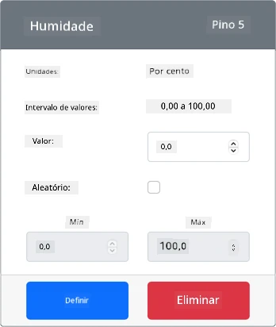
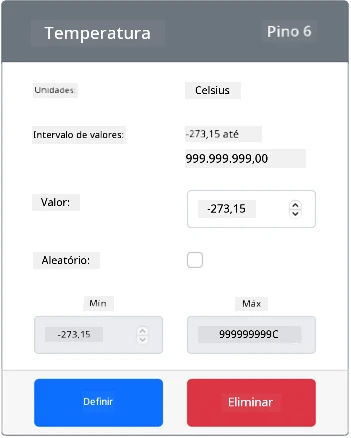

# Medir temperatura - Hardware Virtual IoT

Nesta parte da lição, irá adicionar um sensor de temperatura ao seu dispositivo IoT virtual.

## Hardware Virtual

O dispositivo IoT virtual utilizará um sensor simulado Grove Digital Humidity and Temperature. Isto mantém este laboratório semelhante ao uso de um Raspberry Pi com um sensor físico Grove DHT11.

O sensor combina um **sensor de temperatura** com um **sensor de humidade**, mas neste laboratório está apenas interessado no componente do sensor de temperatura. Num dispositivo IoT físico, o sensor de temperatura seria um [termístor](https://wikipedia.org/wiki/Thermistor) que mede a temperatura ao detetar uma mudança na resistência conforme a temperatura varia. Os sensores de temperatura são geralmente sensores digitais que internamente convertem a resistência medida numa temperatura em graus Celsius (ou Kelvin, ou Fahrenheit).

### Adicionar os sensores ao CounterFit

Para utilizar um sensor virtual de humidade e temperatura, precisa de adicionar os dois sensores à aplicação CounterFit.

#### Tarefa - adicionar os sensores ao CounterFit

Adicione os sensores de humidade e temperatura à aplicação CounterFit.

1. Crie uma nova aplicação Python no seu computador numa pasta chamada `temperature-sensor` com um único ficheiro chamado `app.py`, um ambiente virtual Python, e adicione os pacotes pip do CounterFit.

    > ⚠️ Pode consultar [as instruções para criar e configurar um projeto Python CounterFit na lição 1, se necessário](../../../1-getting-started/lessons/1-introduction-to-iot/virtual-device.md).

1. Instale um pacote adicional do Pip para instalar um shim CounterFit para o sensor DHT11. Certifique-se de que está a instalar isto a partir de um terminal com o ambiente virtual ativado.

    ```sh
    pip install counterfit-shims-seeed-python-dht
    ```

1. Certifique-se de que a aplicação web CounterFit está em execução.

1. Crie um sensor de humidade:

    1. Na caixa *Create sensor* no painel *Sensors*, abra o menu suspenso *Sensor type* e selecione *Humidity*.

    1. Deixe as *Units* definidas como *Percentage*.

    1. Certifique-se de que o *Pin* está definido como *5*.

    1. Selecione o botão **Add** para criar o sensor de humidade no Pin 5.

    

    O sensor de humidade será criado e aparecerá na lista de sensores.

    

1. Crie um sensor de temperatura:

    1. Na caixa *Create sensor* no painel *Sensors*, abra o menu suspenso *Sensor type* e selecione *Temperature*.

    1. Deixe as *Units* definidas como *Celsius*.

    1. Certifique-se de que o *Pin* está definido como *6*.

    1. Selecione o botão **Add** para criar o sensor de temperatura no Pin 6.

    

    O sensor de temperatura será criado e aparecerá na lista de sensores.

    

## Programar a aplicação do sensor de temperatura

A aplicação do sensor de temperatura pode agora ser programada utilizando os sensores do CounterFit.

### Tarefa - programar a aplicação do sensor de temperatura

Programe a aplicação do sensor de temperatura.

1. Certifique-se de que a aplicação `temperature-sensor` está aberta no VS Code.

1. Abra o ficheiro `app.py`.

1. Adicione o seguinte código ao topo do `app.py` para ligar a aplicação ao CounterFit:

    ```python
    from counterfit_connection import CounterFitConnection
    CounterFitConnection.init('127.0.0.1', 5000)
    ```

1. Adicione o seguinte código ao ficheiro `app.py` para importar as bibliotecas necessárias:

    ```python
    import time
    from counterfit_shims_seeed_python_dht import DHT
    ```

    A instrução `from seeed_dht import DHT` importa a classe `DHT` para interagir com um sensor virtual Grove de temperatura utilizando um shim do módulo `counterfit_shims_seeed_python_dht`.

1. Adicione o seguinte código após o código acima para criar uma instância da classe que gere o sensor virtual de humidade e temperatura:

    ```python
    sensor = DHT("11", 5)
    ```

    Isto declara uma instância da classe `DHT` que gere o sensor virtual de **H**umidade e **T**emperatura **D**igital. O primeiro parâmetro indica ao código que o sensor utilizado é um sensor virtual *DHT11*. O segundo parâmetro indica ao código que o sensor está ligado à porta `5`.

    > 💁 O CounterFit simula este sensor combinado de humidade e temperatura ao ligar-se a 2 sensores, um sensor de humidade no pino indicado quando a classe `DHT` é criada, e um sensor de temperatura que funciona no pino seguinte. Se o sensor de humidade estiver no pino 5, o shim espera que o sensor de temperatura esteja no pino 6.

1. Adicione um loop infinito após o código acima para consultar o valor do sensor de temperatura e imprimi-lo no console:

    ```python
    while True:
        _, temp = sensor.read()
        print(f'Temperature {temp}°C')
    ```

    A chamada a `sensor.read()` retorna uma tupla de humidade e temperatura. Apenas precisa do valor da temperatura, por isso a humidade é ignorada. O valor da temperatura é então impresso no console.

1. Adicione uma pequena pausa de dez segundos no final do `loop`, uma vez que os níveis de temperatura não precisam de ser verificados continuamente. Uma pausa reduz o consumo de energia do dispositivo.

    ```python
    time.sleep(10)
    ```

1. A partir do Terminal do VS Code com um ambiente virtual ativado, execute o seguinte para executar a sua aplicação Python:

    ```sh
    python app.py
    ```

1. Na aplicação CounterFit, altere o valor do sensor de temperatura que será lido pela aplicação. Pode fazer isto de duas formas:

    * Insira um número na caixa *Value* do sensor de temperatura e selecione o botão **Set**. O número que inserir será o valor retornado pelo sensor.

    * Marque a caixa *Random* e insira um valor *Min* e *Max*, depois selecione o botão **Set**. Sempre que o sensor ler um valor, será lido um número aleatório entre *Min* e *Max*.

    Deve ver os valores que definiu aparecerem no console. Altere o *Value* ou as definições *Random* para ver a mudança de valor.

    ```output
    (.venv) ➜  temperature-sensor python app.py
    Temperature 28.25°C
    Temperature 30.71°C
    Temperature 25.17°C
    ```

> 💁 Pode encontrar este código na pasta [code-temperature/virtual-device](../../../../../2-farm/lessons/1-predict-plant-growth/code-temperature/virtual-device).

😀 O seu programa do sensor de temperatura foi um sucesso!

**Aviso Legal**:  
Este documento foi traduzido utilizando o serviço de tradução por IA [Co-op Translator](https://github.com/Azure/co-op-translator). Embora nos esforcemos pela precisão, esteja ciente de que traduções automáticas podem conter erros ou imprecisões. O documento original na sua língua nativa deve ser considerado a fonte autoritária. Para informações críticas, recomenda-se a tradução profissional realizada por humanos. Não nos responsabilizamos por quaisquer mal-entendidos ou interpretações incorretas decorrentes do uso desta tradução.