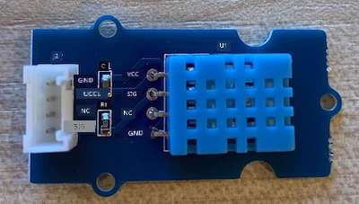

# Medir a temperatura - Wio Terminal

Nesta parte da lição, irá adicionar um sensor de temperatura ao seu Wio Terminal e ler os valores de temperatura a partir dele.

## Hardware

O Wio Terminal necessita de um sensor de temperatura.

O sensor que irá utilizar é um [sensor de humidade e temperatura DHT11](https://www.seeedstudio.com/Grove-Temperature-Humidity-Sensor-DHT11.html), que combina 2 sensores num único dispositivo. Este é bastante popular, com vários sensores comercialmente disponíveis que combinam temperatura, humidade e, por vezes, pressão atmosférica. O componente do sensor de temperatura é um termistor de coeficiente de temperatura negativo (NTC), um termistor cuja resistência diminui à medida que a temperatura aumenta.

Este é um sensor digital, pelo que possui um ADC integrado para criar um sinal digital contendo os dados de temperatura e humidade que o microcontrolador pode ler.

### Ligar o sensor de temperatura

O sensor de temperatura Grove pode ser ligado à porta digital do Wio Terminal.

#### Tarefa - ligar o sensor de temperatura

Ligue o sensor de temperatura.



1. Insira uma extremidade de um cabo Grove na entrada do sensor de humidade e temperatura. Só encaixará de uma forma.

1. Com o Wio Terminal desligado do computador ou de outra fonte de alimentação, ligue a outra extremidade do cabo Grove à entrada Grove do lado direito do Wio Terminal, olhando para o ecrã. Esta é a entrada mais distante do botão de energia.


## Programar o sensor de temperatura

O Wio Terminal pode agora ser programado para utilizar o sensor de temperatura ligado.

### Tarefa - programar o sensor de temperatura

Programe o dispositivo.

1. Crie um novo projeto Wio Terminal utilizando o PlatformIO. Chame este projeto `temperature-sensor`. Adicione código na função `setup` para configurar a porta serial.

    > ⚠️ Pode consultar [as instruções para criar um projeto PlatformIO no projeto 1, lição 1, se necessário](../../../1-getting-started/lessons/1-introduction-to-iot/wio-terminal.md#create-a-platformio-project).

1. Adicione uma dependência de biblioteca para a biblioteca Seeed Grove Humidity and Temperature sensor no ficheiro `platformio.ini` do projeto:

    ```ini
    lib_deps =
        seeed-studio/Grove Temperature And Humidity Sensor @ 1.0.1
    ```

    > ⚠️ Pode consultar [as instruções para adicionar bibliotecas a um projeto PlatformIO no projeto 1, lição 4, se necessário](../../../1-getting-started/lessons/4-connect-internet/wio-terminal-mqtt.md#install-the-wifi-and-mqtt-arduino-libraries).

1. Adicione as seguintes diretivas `#include` ao topo do ficheiro, abaixo do `#include <Arduino.h>` existente:

    ```cpp
    #include <DHT.h>
    #include <SPI.h>
    ```

    Isto importa os ficheiros necessários para interagir com o sensor. O ficheiro de cabeçalho `DHT.h` contém o código para o próprio sensor, e adicionar o cabeçalho `SPI.h` garante que o código necessário para comunicar com o sensor é incluído quando a aplicação é compilada.

1. Antes da função `setup`, declare o sensor DHT:

    ```cpp
    DHT dht(D0, DHT11);
    ```

    Isto declara uma instância da classe `DHT` que gere o sensor de **H**umidade e **T**emperatura **D**igital. Este está ligado à porta `D0`, a entrada Grove do lado direito do Wio Terminal. O segundo parâmetro informa o código de que o sensor utilizado é o *DHT11* - a biblioteca que está a usar suporta outras variantes deste sensor.

1. Na função `setup`, adicione código para configurar a ligação serial:

    ```cpp
    void setup()
    {
        Serial.begin(9600);
    
        while (!Serial)
            ; // Wait for Serial to be ready
    
        delay(1000);
    }
    ```

1. No final da função `setup`, após o último `delay`, adicione uma chamada para iniciar o sensor DHT:

    ```cpp
    dht.begin();
    ```

1. Na função `loop`, adicione código para chamar o sensor e imprimir a temperatura na porta serial:

    ```cpp
    void loop()
    {
        float temp_hum_val[2] = {0};
        dht.readTempAndHumidity(temp_hum_val);
        Serial.print("Temperature: ");
        Serial.print(temp_hum_val[1]);
        Serial.println ("°C");
    
        delay(10000);
    }
    ```

    Este código declara um array vazio de 2 floats e passa-o para a chamada `readTempAndHumidity` na instância `DHT`. Esta chamada preenche o array com 2 valores - a humidade é colocada no item 0 do array (lembre-se de que em C++ os arrays começam no índice 0, por isso o item 0 é o 'primeiro' item do array), e a temperatura é colocada no item 1.

    A temperatura é lida a partir do item 1 do array e impressa na porta serial.

    > 🇺🇸 A temperatura é lida em Celsius. Para os americanos, para converter para Fahrenheit, divida o valor em Celsius por 5, depois multiplique por 9 e, por fim, adicione 32. Por exemplo, uma leitura de temperatura de 20°C torna-se ((20/5)*9) + 32 = 68°F.

1. Compile e carregue o código no Wio Terminal.

    > ⚠️ Pode consultar [as instruções para criar um projeto PlatformIO no projeto 1, lição 1, se necessário](../../../1-getting-started/lessons/1-introduction-to-iot/wio-terminal.md#write-the-hello-world-app).

1. Depois de carregado, pode monitorizar a temperatura utilizando o monitor serial:

    ```output
    > Executing task: platformio device monitor <
    
    --- Available filters and text transformations: colorize, debug, default, direct, hexlify, log2file, nocontrol, printable, send_on_enter, time
    --- More details at http://bit.ly/pio-monitor-filters
    --- Miniterm on /dev/cu.usbmodem1201  9600,8,N,1 ---
    --- Quit: Ctrl+C | Menu: Ctrl+T | Help: Ctrl+T followed by Ctrl+H ---
    Temperature: 25.00°C
    Temperature: 25.00°C
    Temperature: 25.00°C
    Temperature: 24.00°C
    ```

> 💁 Pode encontrar este código na pasta [code-temperature/wio-terminal](../../../../../2-farm/lessons/1-predict-plant-growth/code-temperature/wio-terminal).

😀 O programa do sensor de temperatura foi um sucesso!

**Aviso Legal**:  
Este documento foi traduzido utilizando o serviço de tradução por IA [Co-op Translator](https://github.com/Azure/co-op-translator). Embora nos esforcemos para garantir a precisão, é importante notar que traduções automáticas podem conter erros ou imprecisões. O documento original na sua língua nativa deve ser considerado a fonte autoritária. Para informações críticas, recomenda-se a tradução profissional realizada por humanos. Não nos responsabilizamos por quaisquer mal-entendidos ou interpretações incorretas decorrentes da utilização desta tradução.