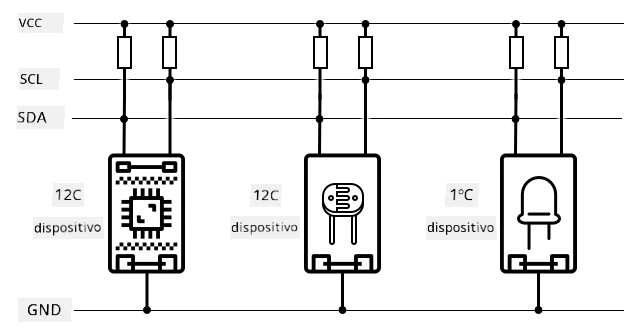
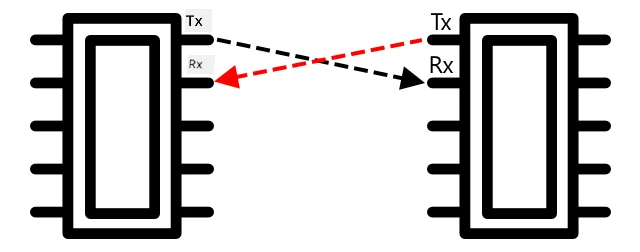
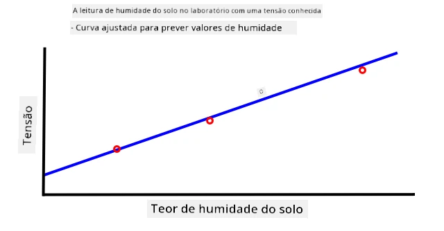
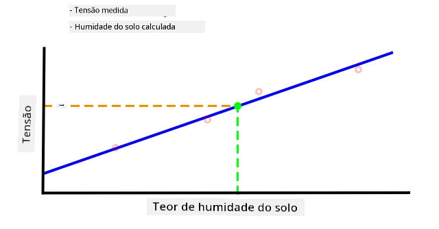

C, pronunciado como *I-quadrado-C*, é um protocolo multi-controlador e multi-periférico, onde qualquer dispositivo conectado pode atuar como controlador ou periférico, comunicando-se através do barramento I²C (o nome para um sistema de comunicação que transfere dados). Os dados são enviados como pacotes endereçados, com cada pacote contendo o endereço do dispositivo conectado ao qual se destinam.

> 💁 Este modelo costumava ser referido como master/slave, mas essa terminologia está sendo abandonada devido à sua associação com a escravidão. A [Open Source Hardware Association adotou os termos controlador/periférico](https://www.oshwa.org/a-resolution-to-redefine-spi-signal-names/), mas você ainda pode encontrar referências à terminologia antiga.

Os dispositivos possuem um endereço que é usado quando se conectam ao barramento I²C, e geralmente é codificado no próprio dispositivo. Por exemplo, cada tipo de sensor Grove da Seeed tem o mesmo endereço, então todos os sensores de luz têm o mesmo endereço, todos os botões têm o mesmo endereço, que é diferente do endereço do sensor de luz. Alguns dispositivos permitem alterar o endereço, mudando as configurações de jumpers ou soldando pinos juntos.

O I²C possui um barramento composto por 2 fios principais, além de 2 fios de alimentação:

| Fio | Nome | Descrição |
| ---- | --------- | ----------- |
| SDA | Dados Seriais | Este fio é usado para enviar dados entre dispositivos. |
| SCL | Relógio Serial | Este fio envia um sinal de relógio a uma taxa definida pelo controlador. |
| VCC | Coletor Comum de Tensão | A fonte de alimentação para os dispositivos. Está conectado aos fios SDA e SCL para fornecer energia através de um resistor pull-up que desliga o sinal quando nenhum dispositivo é o controlador. |
| GND | Terra | Fornece um terra comum para o circuito elétrico. |

Para enviar dados, um dispositivo emite uma condição de início para indicar que está pronto para enviar dados. Ele então se torna o controlador. O controlador envia o endereço do dispositivo com o qual deseja se comunicar, juntamente com a indicação se deseja ler ou escrever dados. Após a transmissão dos dados, o controlador envia uma condição de parada para indicar que terminou. Depois disso, outro dispositivo pode se tornar o controlador e enviar ou receber dados.

2C tem limites de velocidade, com 3 modos diferentes que operam a velocidades fixas. O mais rápido é o modo de Alta Velocidade, com uma velocidade máxima de 3,4Mbps (megabits por segundo), embora poucos dispositivos suportem essa velocidade. O Raspberry Pi, por exemplo, está limitado ao modo rápido a 400Kbps (kilobits por segundo). O modo padrão opera a 100Kbps.

> 💁 Se estiver a usar um Raspberry Pi com um Grove Base hat como o seu hardware IoT, poderá ver várias tomadas I2C na placa que pode usar para comunicar com sensores I2C. Sensores analógicos Grove também utilizam I2C com um ADC para enviar valores analógicos como dados digitais, por isso o sensor de luz que utilizou simulou um pino analógico, com o valor enviado através de I2C, já que o Raspberry Pi apenas suporta pinos digitais.

### Recetor-transmissor assíncrono universal (UART)

UART envolve circuitos físicos que permitem a comunicação entre dois dispositivos. Cada dispositivo tem 2 pinos de comunicação - transmitir (Tx) e receber (Rx), com o pino Tx do primeiro dispositivo conectado ao pino Rx do segundo, e o pino Tx do segundo dispositivo conectado ao pino Rx do primeiro. Isto permite que os dados sejam enviados em ambas as direções.

* O dispositivo 1 transmite dados do seu pino Tx, que são recebidos pelo dispositivo 2 no seu pino Rx.
* O dispositivo 1 recebe dados no seu pino Rx que são transmitidos pelo dispositivo 2 a partir do seu pino Tx.

> 🎓 Os dados são enviados um bit de cada vez, e isto é conhecido como comunicação *serial*. A maioria dos sistemas operativos e microcontroladores têm *portas seriais*, ou seja, conexões que podem enviar e receber dados seriais disponíveis para o seu código.

Os dispositivos UART têm uma [taxa de transmissão](https://wikipedia.org/wiki/Symbol_rate) (também conhecida como taxa de símbolos), que é a velocidade com que os dados serão enviados e recebidos em bits por segundo. Uma taxa de transmissão comum é 9.600, o que significa que 9.600 bits (0s e 1s) de dados são enviados a cada segundo.

UART utiliza bits de início e fim - ou seja, envia um bit de início para indicar que está prestes a enviar um byte (8 bits) de dados, e um bit de fim após enviar os 8 bits.

A velocidade do UART depende do hardware, mas mesmo as implementações mais rápidas não excedem 6,5 Mbps (megabits por segundo, ou milhões de bits, 0 ou 1, enviados por segundo).

Pode usar UART através de pinos GPIO - pode definir um pino como Tx e outro como Rx, e depois conectá-los a outro dispositivo.

> 💁 Se estiver a usar um Raspberry Pi com um Grove Base hat como o seu hardware IoT, poderá ver uma tomada UART na placa que pode usar para comunicar com sensores que utilizam o protocolo UART.

### Interface Serial Periférica (SPI)

SPI foi projetado para comunicação a curtas distâncias, como num microcontrolador para falar com um dispositivo de armazenamento, como memória flash. Baseia-se num modelo de controlador/periférico, com um único controlador (geralmente o processador do dispositivo IoT) interagindo com múltiplos periféricos. O controlador controla tudo ao selecionar um periférico e enviar ou solicitar dados.

> 💁 Tal como I2C, os termos controlador e periférico são mudanças recentes, por isso pode encontrar os termos mais antigos ainda em uso.

Os controladores SPI utilizam 3 fios, juntamente com 1 fio extra por periférico. Os periféricos utilizam 4 fios. Estes fios são:

| Fio | Nome | Descrição |
| ---- | --------- | ----------- |
| COPI | Saída do Controlador, Entrada do Periférico | Este fio é usado para enviar dados do controlador para o periférico. |
| CIPO | Entrada do Controlador, Saída do Periférico | Este fio é usado para enviar dados do periférico para o controlador. |
| SCLK | Relógio Serial | Este fio envia um sinal de relógio a uma taxa definida pelo controlador. |
| CS   | Seleção de Chip | O controlador tem múltiplos fios, um por periférico, e cada fio conecta-se ao fio CS no periférico correspondente. |

O fio CS é usado para ativar um periférico de cada vez, comunicando através dos fios COPI e CIPO. Quando o controlador precisa de mudar de periférico, desativa o fio CS conectado ao periférico atualmente ativo e ativa o fio conectado ao periférico com o qual deseja comunicar a seguir.

SPI é *full-duplex*, o que significa que o controlador pode enviar e receber dados ao mesmo tempo do mesmo periférico usando os fios COPI e CIPO. SPI utiliza um sinal de relógio no fio SCLK para manter os dispositivos sincronizados, por isso, ao contrário do envio direto através de UART, não necessita de bits de início e fim.

Não há limites de velocidade definidos para SPI, com implementações frequentemente capazes de transmitir múltiplos megabytes de dados por segundo.

Os kits de desenvolvimento IoT frequentemente suportam SPI em alguns dos pinos GPIO. Por exemplo, num Raspberry Pi pode usar os pinos GPIO 19, 21, 23, 24 e 26 para SPI.

### Sem fios

Alguns sensores podem comunicar através de protocolos sem fios padrão, como Bluetooth (principalmente Bluetooth Low Energy, ou BLE), LoRaWAN (um protocolo de rede de baixo consumo e **Lo**nga **Ra**nge), ou WiFi. Estes permitem sensores remotos que não estão fisicamente conectados a um dispositivo IoT.

Um exemplo é em sensores comerciais de humidade do solo. Estes medem a humidade do solo num campo e enviam os dados através de LoRaWAN para um dispositivo central, que processa os dados ou os envia pela Internet. Isto permite que o sensor esteja longe do dispositivo IoT que gere os dados, reduzindo o consumo de energia e a necessidade de grandes redes WiFi ou cabos longos.

BLE é popular para sensores avançados, como rastreadores de fitness que funcionam no pulso. Estes combinam múltiplos sensores e enviam os dados dos sensores para um dispositivo IoT, como o seu telemóvel, via BLE.

✅ Tem algum sensor Bluetooth consigo, na sua casa ou na sua escola? Estes podem incluir sensores de temperatura, sensores de ocupação, rastreadores de dispositivos e dispositivos de fitness.

Uma forma popular para dispositivos comerciais se conectarem é Zigbee. Zigbee utiliza WiFi para formar redes em malha entre dispositivos, onde cada dispositivo se conecta ao maior número possível de dispositivos próximos, formando um grande número de conexões como uma teia de aranha. Quando um dispositivo quer enviar uma mensagem para a Internet, pode enviá-la para os dispositivos mais próximos, que a encaminham para outros dispositivos próximos e assim por diante, até chegar a um coordenador e ser enviada para a Internet.

> 🐝 O nome Zigbee refere-se à dança de abanar das abelhas após o seu retorno à colmeia.

## Medir os níveis de humidade no solo

Pode medir o nível de humidade no solo usando um sensor de humidade do solo, um dispositivo IoT e uma planta doméstica ou um pedaço de solo próximo.

### Tarefa - medir a humidade do solo

Siga o guia relevante para medir a humidade do solo usando o seu dispositivo IoT:

* [Arduino - Wio Terminal](wio-terminal-soil-moisture.md)
* [Computador de placa única - Raspberry Pi](pi-soil-moisture.md)
* [Computador de placa única - Dispositivo virtual](virtual-device-soil-moisture.md)

## Calibração de sensores

Os sensores dependem da medição de propriedades elétricas, como resistência ou capacitância.

> 🎓 Resistência, medida em ohms (Ω), é a oposição ao fluxo de corrente elétrica através de algo. Quando uma tensão é aplicada a um material, a quantidade de corrente que passa por ele depende da resistência do material. Pode ler mais na [página de resistência elétrica na Wikipedia](https://wikipedia.org/wiki/Electrical_resistance_and_conductance).

> 🎓 Capacitância, medida em farads (F), é a capacidade de um componente ou circuito de coletar e armazenar energia elétrica. Pode ler mais sobre capacitância na [página de capacitância na Wikipedia](https://wikipedia.org/wiki/Capacitance).

Estas medições nem sempre são úteis - imagine um sensor de temperatura que lhe dá uma medição de 22,5KΩ! Em vez disso, o valor medido precisa de ser convertido numa unidade útil através de calibração - ou seja, correspondendo os valores medidos à quantidade medida para permitir que novas medições sejam convertidas na unidade correta.

Alguns sensores vêm pré-calibrados. Por exemplo, o sensor de temperatura que utilizou na última lição já estava calibrado para retornar uma medição de temperatura em °C. Na fábrica, o primeiro sensor criado seria exposto a uma gama de temperaturas conhecidas e a resistência medida. Isto seria então usado para construir um cálculo que pode converter do valor medido em Ω (a unidade de resistência) para °C.

> 💁 A fórmula para calcular a resistência a partir da temperatura é chamada de [equação de Steinhart–Hart](https://wikipedia.org/wiki/Steinhart–Hart_equation).

### Calibração do sensor de humidade do solo

A humidade do solo é medida usando o conteúdo de água gravimétrico ou volumétrico.

* Gravimétrico é o peso da água numa unidade de peso de solo medido, como o número de quilogramas de água por quilograma de solo seco.
* Volumétrico é o volume de água numa unidade de volume de solo medido, como o número de metros cúbicos de água por metros cúbicos de solo seco.

> 🇺🇸 Para os americanos, devido à consistência das unidades, estas podem ser medidas em libras em vez de quilogramas ou pés cúbicos em vez de metros cúbicos.

Os sensores de humidade do solo medem resistência elétrica ou capacitância - isto varia não apenas com a humidade do solo, mas também com o tipo de solo, já que os componentes no solo podem alterar as suas características elétricas. Idealmente, os sensores devem ser calibrados - ou seja, fazer leituras do sensor e compará-las com medições obtidas usando uma abordagem mais científica. Por exemplo, um laboratório pode calcular a humidade gravimétrica do solo usando amostras de um campo específico recolhidas algumas vezes por ano, e esses números usados para calibrar o sensor, correspondendo a leitura do sensor à humidade gravimétrica do solo.

O gráfico acima mostra como calibrar um sensor. A tensão é capturada para uma amostra de solo que é então medida num laboratório, comparando o peso húmido com o peso seco (medindo o peso húmido, depois secando num forno e medindo seco). Depois de algumas leituras serem feitas, estas podem ser plotadas num gráfico e uma linha ajustada aos pontos. Esta linha pode então ser usada para converter leituras de sensores de humidade do solo feitas por um dispositivo IoT em medições reais de humidade do solo.

💁 Para sensores resistivos de humidade do solo, a tensão aumenta à medida que a humidade do solo aumenta. Para sensores capacitivos de humidade do solo, a tensão diminui à medida que a humidade do solo aumenta, por isso os gráficos para estes inclinariam para baixo, não para cima.

O gráfico acima mostra uma leitura de tensão de um sensor de humidade do solo, e ao seguir essa leitura até à linha no gráfico, a humidade real do solo pode ser calculada.

Esta abordagem significa que o agricultor só precisa de obter algumas medições laboratoriais para um campo, e depois pode usar dispositivos IoT para medir a humidade do solo - acelerando drasticamente o tempo para obter medições.

---

## 🚀 Desafio

Sensores resistivos e capacitivos de humidade do solo têm várias diferenças. Quais são essas diferenças, e qual tipo (se algum) é o melhor para um agricultor usar? Esta resposta muda entre países em desenvolvimento e desenvolvidos?

## Questionário pós-aula

[Questionário pós-aula](https://black-meadow-040d15503.1.azurestaticapps.net/quiz/12)

## Revisão & Autoestudo

Leia sobre o hardware e os protocolos usados por sensores e atuadores:

* [Página da Wikipedia sobre GPIO](https://wikipedia.org/wiki/General-purpose_input/output)
* [Página da Wikipedia sobre UART](https://wikipedia.org/wiki/Universal_asynchronous_receiver-transmitter)
* [Página da Wikipedia sobre SPI](https://wikipedia.org/wiki/Serial_Peripheral_Interface)
* [Página da Wikipedia sobre I2C](https://wikipedia.org/wiki/I²C)
* [Página da Wikipedia sobre Zigbee](https://wikipedia.org/wiki/Zigbee)

## Tarefa

[Calibre o seu sensor](assignment.md)

**Aviso Legal**:  
Este documento foi traduzido utilizando o serviço de tradução por IA [Co-op Translator](https://github.com/Azure/co-op-translator). Embora nos esforcemos para garantir a precisão, esteja ciente de que traduções automáticas podem conter erros ou imprecisões. O documento original no seu idioma nativo deve ser considerado a fonte autoritária. Para informações críticas, recomenda-se uma tradução profissional realizada por humanos. Não nos responsabilizamos por quaisquer mal-entendidos ou interpretações incorretas resultantes do uso desta tradução.