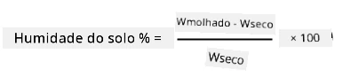
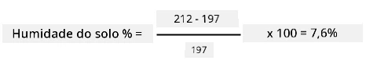

# Calibre o seu sensor

## Instruções

Nesta lição, recolheu leituras do sensor de humidade do solo, medidas em valores de 0-1023. Para converter estas leituras em valores reais de humidade do solo, é necessário calibrar o sensor. Pode fazer isso recolhendo amostras de solo e calculando o teor gravimétrico de humidade do solo a partir dessas amostras.

Será necessário repetir estes passos várias vezes para obter as leituras necessárias, utilizando solos com diferentes níveis de humidade em cada tentativa.

1. Faça uma leitura de humidade do solo utilizando o sensor de humidade do solo. Registe esta leitura.

1. Recolha uma amostra do solo e pese-a. Registe este peso.

1. Seque o solo - um forno quente a 110°C (230°F) durante algumas horas é o método ideal. Pode também secá-lo ao sol ou colocá-lo num local quente e seco até que o solo esteja completamente seco. O solo deve ficar pulverulento e solto.

    > 💁 Num laboratório, para obter resultados mais precisos, deve secar o solo num forno durante 48-72 horas. Se a sua escola tiver fornos de secagem, veja se pode utilizá-los para secar por mais tempo. Quanto mais tempo secar, mais seco ficará o solo e mais precisos serão os resultados.

1. Pese novamente o solo.

    > 🔥 Se o secou num forno, certifique-se de que o solo arrefeceu antes de o pesar!

A humidade gravimétrica do solo é calculada como:

* W  
- o peso do solo húmido  
* W  
- o peso do solo seco  

Por exemplo, suponha que tem uma amostra de solo que pesa 212g húmida e 197g seca.

* W = 212g  
* W = 197g  
* 212 - 197 = 15  
* 15 / 197 = 0,076  
* 0,076 * 100 = 7,6%  

Neste exemplo, o solo tem uma humidade gravimétrica de 7,6%.

Depois de obter as leituras de pelo menos 3 amostras, faça um gráfico da humidade do solo % em relação às leituras do sensor de humidade do solo e adicione uma linha que melhor se ajuste aos pontos. Pode então usar este gráfico para calcular o teor gravimétrico de humidade do solo para uma determinada leitura do sensor, lendo o valor na linha.

## Rubrica

| Critério | Exemplar | Adequado | Necessita de Melhorias |
| -------- | --------- | -------- | ---------------------- |
| Recolher dados de calibração | Captura pelo menos 3 amostras de calibração | Captura pelo menos 2 amostras de calibração | Captura pelo menos 1 amostra de calibração |
| Fazer uma leitura calibrada | Consegue traçar com sucesso o gráfico de calibração, fazer uma leitura do sensor e convertê-la em teor gravimétrico de humidade do solo | Consegue traçar com sucesso o gráfico de calibração | Não consegue traçar o gráfico |

**Aviso Legal**:  
Este documento foi traduzido utilizando o serviço de tradução por IA [Co-op Translator](https://github.com/Azure/co-op-translator). Embora nos esforcemos para garantir a precisão, esteja ciente de que traduções automáticas podem conter erros ou imprecisões. O documento original no seu idioma nativo deve ser considerado a fonte autoritativa. Para informações críticas, recomenda-se uma tradução profissional realizada por humanos. Não nos responsabilizamos por quaisquer mal-entendidos ou interpretações incorretas resultantes do uso desta tradução.