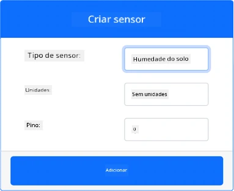
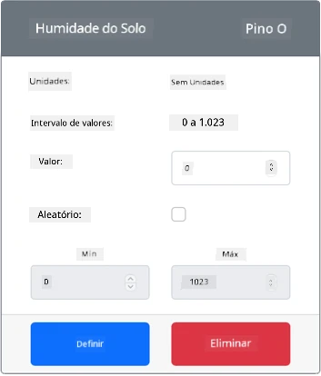

# Medir a humidade do solo - Hardware Virtual IoT

Nesta parte da lição, irá adicionar um sensor capacitivo de humidade do solo ao seu dispositivo IoT virtual e ler os valores obtidos.

## Hardware Virtual

O dispositivo IoT virtual utilizará um sensor capacitivo de humidade do solo simulado da Grove. Isto mantém este laboratório semelhante ao uso de um Raspberry Pi com um sensor capacitivo de humidade do solo físico da Grove.

Num dispositivo IoT físico, o sensor de humidade do solo seria um sensor capacitivo que mede a humidade do solo ao detetar a capacitância do mesmo, uma propriedade que muda conforme a humidade do solo varia. À medida que a humidade do solo aumenta, a voltagem diminui.

Este é um sensor analógico, por isso utiliza um ADC simulado de 10 bits para reportar um valor entre 1 e 1.023.

### Adicionar o sensor de humidade do solo ao CounterFit

Para utilizar um sensor virtual de humidade do solo, é necessário adicioná-lo à aplicação CounterFit.

#### Tarefa - Adicionar o sensor de humidade do solo ao CounterFit

Adicione o sensor de humidade do solo à aplicação CounterFit.

1. Crie uma nova aplicação Python no seu computador numa pasta chamada `soil-moisture-sensor` com um único ficheiro chamado `app.py`, um ambiente virtual Python, e adicione os pacotes pip do CounterFit.

    > ⚠️ Pode consultar [as instruções para criar e configurar um projeto Python no CounterFit na lição 1, se necessário](../../../1-getting-started/lessons/1-introduction-to-iot/virtual-device.md).

1. Certifique-se de que a aplicação web do CounterFit está em execução.

1. Crie um sensor de humidade do solo:

    1. Na caixa *Create sensor* no painel *Sensors*, abra o menu suspenso *Sensor type* e selecione *Soil Moisture*.

    1. Deixe as *Units* definidas como *NoUnits*.

    1. Certifique-se de que o *Pin* está definido como *0*.

    1. Selecione o botão **Add** para criar o sensor *Soil Moisture* no Pin 0.

    

    O sensor de humidade do solo será criado e aparecerá na lista de sensores.

    

## Programar a aplicação do sensor de humidade do solo

A aplicação do sensor de humidade do solo pode agora ser programada utilizando os sensores do CounterFit.

### Tarefa - Programar a aplicação do sensor de humidade do solo

Programe a aplicação do sensor de humidade do solo.

1. Certifique-se de que a aplicação `soil-moisture-sensor` está aberta no VS Code.

1. Abra o ficheiro `app.py`.

1. Adicione o seguinte código ao início do ficheiro `app.py` para ligar a aplicação ao CounterFit:

    ```python
    from counterfit_connection import CounterFitConnection
    CounterFitConnection.init('127.0.0.1', 5000)
    ```

1. Adicione o seguinte código ao ficheiro `app.py` para importar algumas bibliotecas necessárias:

    ```python
    import time
    from counterfit_shims_grove.adc import ADC
    ```

    A instrução `import time` importa o módulo `time`, que será utilizado mais tarde nesta tarefa.

    A instrução `from counterfit_shims_grove.adc import ADC` importa a classe `ADC` para interagir com um conversor analógico para digital virtual que pode ser ligado a um sensor do CounterFit.

1. Adicione o seguinte código abaixo para criar uma instância da classe `ADC`:

    ```python
    adc = ADC()
    ```

1. Adicione um loop infinito que lê os valores deste ADC no pin 0 e escreve o resultado na consola. Este loop pode então aguardar 10 segundos entre as leituras.

    ```python
    while True:
        soil_moisture = adc.read(0)
        print("Soil moisture:", soil_moisture)
    
        time.sleep(10)
    ```

1. Na aplicação CounterFit, altere o valor do sensor de humidade do solo que será lido pela aplicação. Pode fazer isto de duas formas:

    * Insira um número na caixa *Value* do sensor de humidade do solo e, em seguida, selecione o botão **Set**. O número inserido será o valor retornado pelo sensor.

    * Marque a caixa *Random* e insira um valor *Min* e *Max*, depois selecione o botão **Set**. Sempre que o sensor ler um valor, será gerado um número aleatório entre *Min* e *Max*.

1. Execute a aplicação Python. Verá as medições de humidade do solo escritas na consola. Altere o *Value* ou as definições *Random* para observar a mudança nos valores.

    ```output
    (.venv) ➜ soil-moisture-sensor $ python app.py 
    Soil moisture: 615
    Soil moisture: 612
    Soil moisture: 498
    Soil moisture: 493
    Soil moisture: 490
    Soil Moisture: 388
    ```

> 💁 Pode encontrar este código na pasta [code/virtual-device](../../../../../2-farm/lessons/2-detect-soil-moisture/code/virtual-device).

😀 O seu programa do sensor de humidade do solo foi um sucesso!

**Aviso Legal**:  
Este documento foi traduzido utilizando o serviço de tradução por IA [Co-op Translator](https://github.com/Azure/co-op-translator). Embora nos esforcemos pela precisão, esteja ciente de que traduções automáticas podem conter erros ou imprecisões. O documento original na sua língua nativa deve ser considerado a fonte autoritária. Para informações críticas, recomenda-se a tradução profissional realizada por humanos. Não nos responsabilizamos por quaisquer mal-entendidos ou interpretações incorretas decorrentes do uso desta tradução.