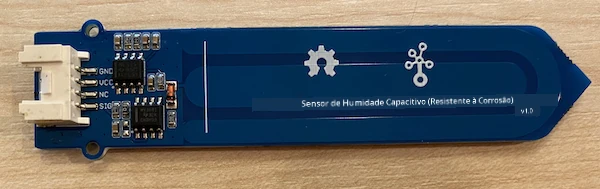
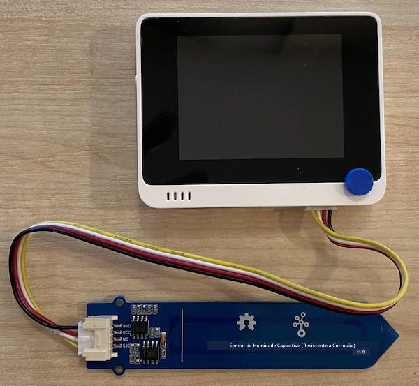
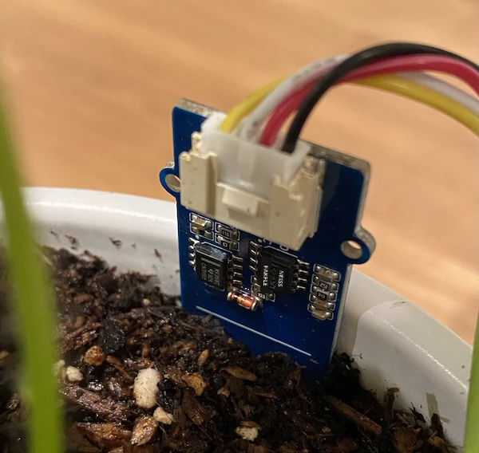

# Medir a humidade do solo - Wio Terminal

Nesta parte da lição, irá adicionar um sensor capacitivo de humidade do solo ao seu Wio Terminal e ler os valores obtidos.

## Hardware

O Wio Terminal necessita de um sensor capacitivo de humidade do solo.

O sensor que irá utilizar é um [Sensor Capacitivo de Humidade do Solo](https://www.seeedstudio.com/Grove-Capacitive-Moisture-Sensor-Corrosion-Resistant.html), que mede a humidade do solo ao detetar a capacitância do mesmo, uma propriedade que muda conforme a humidade do solo varia. À medida que a humidade do solo aumenta, a voltagem diminui.

Este é um sensor analógico, por isso conecta-se aos pinos analógicos do Wio Terminal, utilizando um ADC integrado para criar um valor entre 0-1.023.

### Conectar o sensor de humidade do solo

O sensor Grove de humidade do solo pode ser conectado à porta analógica/digital configurável do Wio Terminal.

#### Tarefa - conectar o sensor de humidade do solo

Conecte o sensor de humidade do solo.



1. Insira uma extremidade de um cabo Grove na entrada do sensor de humidade do solo. O cabo só encaixa de uma forma.

1. Com o Wio Terminal desconectado do seu computador ou outra fonte de alimentação, conecte a outra extremidade do cabo Grove à entrada Grove do lado direito do Wio Terminal, olhando para o ecrã. Esta é a entrada mais distante do botão de energia.



1. Insira o sensor de humidade do solo na terra. O sensor tem uma 'linha de posição máxima' - uma linha branca atravessando o sensor. Insira o sensor até esta linha, mas não ultrapasse.



1. Agora pode conectar o Wio Terminal ao seu computador.

## Programar o sensor de humidade do solo

O Wio Terminal pode agora ser programado para utilizar o sensor de humidade do solo conectado.

### Tarefa - programar o sensor de humidade do solo

Programe o dispositivo.

1. Crie um novo projeto para o Wio Terminal utilizando o PlatformIO. Chame este projeto `soil-moisture-sensor`. Adicione código na função `setup` para configurar a porta serial.

    > ⚠️ Pode consultar [as instruções para criar um projeto PlatformIO no projeto 1, lição 1, se necessário](../../../1-getting-started/lessons/1-introduction-to-iot/wio-terminal.md#create-a-platformio-project).

1. Não existe uma biblioteca para este sensor, mas pode ler o pino analógico utilizando a função [`analogRead`](https://www.arduino.cc/reference/en/language/functions/analog-io/analogread/) integrada do Arduino. Comece por configurar o pino analógico como entrada para que os valores possam ser lidos, adicionando o seguinte à função `setup`.

    ```cpp
    pinMode(A0, INPUT);
    ```

    Isto define o pino `A0`, o pino combinado analógico/digital, como um pino de entrada de onde a voltagem pode ser lida.

1. Adicione o seguinte à função `loop` para ler a voltagem deste pino:

    ```cpp
    int soil_moisture = analogRead(A0);
    ```

1. Abaixo deste código, adicione o seguinte código para imprimir o valor na porta serial:

    ```cpp
    Serial.print("Soil Moisture: ");
    Serial.println(soil_moisture);
    ```

1. Finalmente, adicione um atraso de 10 segundos no final:

    ```cpp
    delay(10000);
    ```

1. Compile e carregue o código no Wio Terminal.

    > ⚠️ Pode consultar [as instruções para criar um projeto PlatformIO no projeto 1, lição 1, se necessário](../../../1-getting-started/lessons/1-introduction-to-iot/wio-terminal.md#write-the-hello-world-app).

1. Depois de carregado, pode monitorizar a humidade do solo utilizando o monitor serial. Adicione água à terra ou remova o sensor da terra e veja o valor mudar.

    ```output
    > Executing task: platformio device monitor <
    
    --- Available filters and text transformations: colorize, debug, default, direct, hexlify, log2file, nocontrol, printable, send_on_enter, time
    --- More details at http://bit.ly/pio-monitor-filters
    --- Miniterm on /dev/cu.usbmodem1201  9600,8,N,1 ---
    --- Quit: Ctrl+C | Menu: Ctrl+T | Help: Ctrl+T followed by Ctrl+H ---
    Soil Moisture: 526
    Soil Moisture: 529
    Soil Moisture: 521
    Soil Moisture: 494
    Soil Moisture: 454
    Soil Moisture: 456
    Soil Moisture: 395
    Soil Moisture: 388
    Soil Moisture: 394
    Soil Moisture: 391
    ```

    No exemplo de saída acima, pode ver a voltagem diminuir à medida que a água é adicionada.

> 💁 Pode encontrar este código na pasta [code/wio-terminal](../../../../../2-farm/lessons/2-detect-soil-moisture/code/wio-terminal).

😀 O programa do sensor de humidade do solo foi um sucesso!

**Aviso Legal**:  
Este documento foi traduzido utilizando o serviço de tradução por IA [Co-op Translator](https://github.com/Azure/co-op-translator). Embora nos esforcemos para garantir a precisão, esteja ciente de que traduções automáticas podem conter erros ou imprecisões. O documento original na sua língua nativa deve ser considerado a fonte autoritária. Para informações críticas, recomenda-se a tradução profissional realizada por humanos. Não nos responsabilizamos por quaisquer mal-entendidos ou interpretações incorretas decorrentes do uso desta tradução.