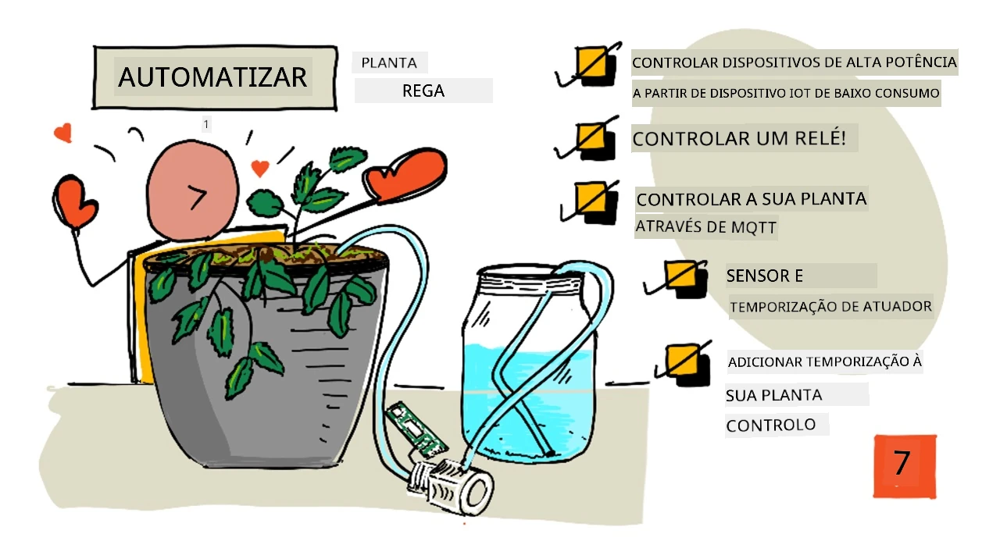
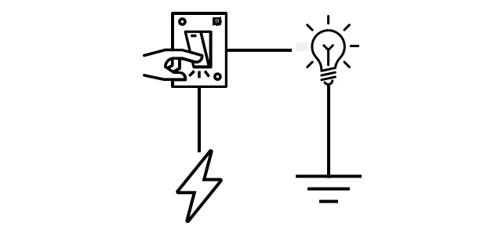
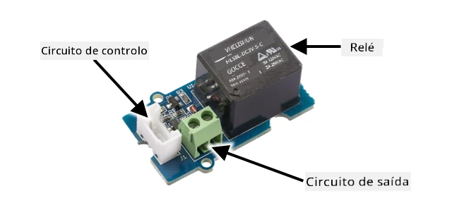
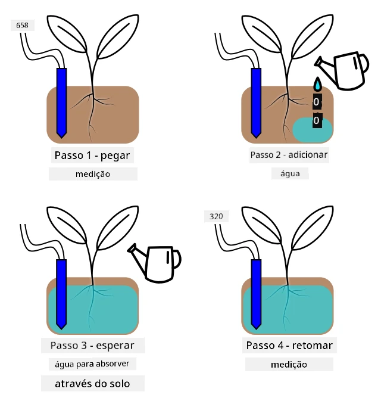

# Rega automática de plantas



> Ilustração por [Nitya Narasimhan](https://github.com/nitya). Clique na imagem para uma versão maior.

Esta lição foi ensinada como parte da [série IoT para Iniciantes - Agricultura Digital, Projeto 2](https://youtube.com/playlist?list=PLmsFUfdnGr3yCutmcVg6eAUEfsGiFXgcx) do [Microsoft Reactor](https://developer.microsoft.com/reactor/?WT.mc_id=academic-17441-jabenn).

[](https://youtu.be/g9FfZwv9R58)

## Questionário pré-aula

[Questionário pré-aula](https://black-meadow-040d15503.1.azurestaticapps.net/quiz/13)

## Introdução

Na última lição, aprendeste a monitorizar a humidade do solo. Nesta lição, vais aprender a construir os componentes principais de um sistema de rega automática que responde à humidade do solo. Também vais aprender sobre temporização - como os sensores podem demorar a responder a mudanças e como os atuadores podem levar tempo para alterar as propriedades medidas pelos sensores.

Nesta lição, abordaremos:

* [Controlar dispositivos de alta potência com um dispositivo IoT de baixa potência](../../../../../2-farm/lessons/3-automated-plant-watering)
* [Controlar um relé](../../../../../2-farm/lessons/3-automated-plant-watering)
* [Controlar a tua planta via MQTT](../../../../../2-farm/lessons/3-automated-plant-watering)
* [Temporização de sensores e atuadores](../../../../../2-farm/lessons/3-automated-plant-watering)
* [Adicionar temporização ao servidor de controlo da tua planta](../../../../../2-farm/lessons/3-automated-plant-watering)

## Controlar dispositivos de alta potência com um dispositivo IoT de baixa potência

Os dispositivos IoT utilizam uma baixa voltagem. Embora isso seja suficiente para sensores e atuadores de baixa potência, como LEDs, é insuficiente para controlar hardware maior, como uma bomba de água usada para irrigação. Mesmo bombas pequenas, adequadas para plantas de interior, consomem demasiada corrente para um kit de desenvolvimento IoT e poderiam danificar a placa.

> 🎓 Corrente, medida em Amperes (A), é a quantidade de eletricidade que circula num circuito. A voltagem fornece o impulso, enquanto a corrente é a quantidade que é impulsionada. Podes ler mais sobre corrente na [página sobre corrente elétrica na Wikipédia](https://wikipedia.org/wiki/Electric_current).

A solução para isto é ligar a bomba a uma fonte de alimentação externa e usar um atuador para ligar a bomba, de forma semelhante a como ligarias uma luz. É necessário apenas uma pequena quantidade de energia (na forma de energia do teu corpo) para o teu dedo acionar um interruptor, conectando a luz à eletricidade da rede elétrica, que opera a 110V/240V.



> 🎓 [Eletricidade da rede](https://wikipedia.org/wiki/Mains_electricity) refere-se à eletricidade fornecida a casas e empresas através da infraestrutura nacional em muitas partes do mundo.

✅ Os dispositivos IoT geralmente fornecem 3,3V ou 5V, com menos de 1 ampere (1A) de corrente. Em comparação, a eletricidade da rede opera frequentemente a 230V (120V na América do Norte e 100V no Japão) e pode fornecer energia para dispositivos que consomem até 30A.

Existem vários tipos de atuadores que podem fazer isso, incluindo dispositivos mecânicos que podes anexar a interruptores existentes para simular um dedo a ligá-los. O mais popular é o relé.

### Relés

Um relé é um interruptor eletromecânico que converte um sinal elétrico num movimento mecânico para ligar um interruptor. O núcleo de um relé é um eletroíman.

> 🎓 [Eletroímanes](https://wikipedia.org/wiki/Electromagnet) são ímanes criados ao passar eletricidade por uma bobina de fio. Quando a eletricidade é ligada, a bobina torna-se magnetizada. Quando a eletricidade é desligada, a bobina perde o magnetismo.


Num relé, um circuito de controlo alimenta o eletroíman. Quando o eletroíman está ligado, ele puxa uma alavanca que move um interruptor, fechando um par de contactos e completando um circuito de saída.


Quando o circuito de controlo está desligado, o eletroíman desliga-se, libertando a alavanca e abrindo os contactos, desligando o circuito de saída. Os relés são atuadores digitais - um sinal alto liga o relé, um sinal baixo desliga-o.

O circuito de saída pode ser usado para alimentar hardware adicional, como um sistema de irrigação. O dispositivo IoT pode ligar o relé, completando o circuito de saída que alimenta o sistema de irrigação, e as plantas são regadas. O dispositivo IoT pode então desligar o relé, cortando a energia do sistema de irrigação e desligando a água.


No vídeo acima, um relé é ativado. Um LED no relé acende-se para indicar que está ligado (algumas placas de relé têm LEDs para indicar se o relé está ligado ou desligado), e a energia é enviada para a bomba, ligando-a e bombeando água para uma planta.

> 💁 Os relés também podem ser usados para alternar entre dois circuitos de saída em vez de ligar ou desligar um. À medida que a alavanca se move, ela muda um interruptor de completar um circuito de saída para completar outro circuito de saída, geralmente compartilhando uma conexão de energia comum ou de terra comum.

✅ Faz uma pesquisa: Existem vários tipos de relés, com diferenças como se o circuito de controlo liga ou desliga o relé quando a energia é aplicada, ou múltiplos circuitos de saída. Descobre mais sobre esses diferentes tipos.

Quando a alavanca se move, geralmente podes ouvi-la fazer contacto com o eletroíman, produzindo um clique bem definido.

> 💁 Um relé pode ser ligado de forma que a conexão interrompa a energia do próprio relé, desligando-o, o que então envia energia de volta para o relé, ligando-o novamente, e assim por diante. Isso faz com que o relé clique muito rapidamente, produzindo um som de zumbido. Foi assim que alguns dos primeiros campainhas elétricas funcionavam.

### Alimentação do relé

O eletroíman não precisa de muita energia para ativar e puxar a alavanca; ele pode ser controlado usando a saída de 3,3V ou 5V de um kit de desenvolvimento IoT. O circuito de saída pode transportar muito mais energia, dependendo do relé, incluindo voltagem da rede elétrica ou até níveis de potência mais altos para uso industrial. Desta forma, um kit de desenvolvimento IoT pode controlar um sistema de irrigação, desde uma pequena bomba para uma única planta até um sistema industrial massivo para uma exploração agrícola comercial.



A imagem acima mostra um relé Grove. O circuito de controlo conecta-se a um dispositivo IoT e liga ou desliga o relé usando 3,3V ou 5V. O circuito de saída tem dois terminais, qualquer um pode ser energia ou terra. O circuito de saída pode lidar com até 250V a 10A, suficiente para uma variedade de dispositivos alimentados pela rede elétrica. Existem relés que podem lidar com níveis de potência ainda mais altos.


Na imagem acima, a energia é fornecida a uma bomba através de um relé. Há um fio vermelho que conecta o terminal +5V de uma fonte de alimentação USB a um terminal do circuito de saída do relé, e outro fio vermelho que conecta o outro terminal do circuito de saída à bomba. Um fio preto conecta a bomba ao terra da fonte de alimentação USB. Quando o relé é ligado, ele completa o circuito, enviando 5V para a bomba, ligando-a.

## Controlar um relé

Podes controlar um relé a partir do teu kit de desenvolvimento IoT.

### Tarefa - controlar um relé

Segue o guia relevante para controlar um relé usando o teu dispositivo IoT:

* [Arduino - Wio Terminal](wio-terminal-relay.md)
* [Computador de placa única - Raspberry Pi](pi-relay.md)
* [Computador de placa única - Dispositivo virtual](virtual-device-relay.md)

## Controlar a tua planta via MQTT

Até agora, o teu relé é controlado diretamente pelo dispositivo IoT com base numa única leitura de humidade do solo. Num sistema de irrigação comercial, a lógica de controlo será centralizada, permitindo tomar decisões de rega com base em dados de múltiplos sensores e permitindo que qualquer configuração seja alterada num único local. Para simular isso, podes controlar o relé via MQTT.

### Tarefa - controlar o relé via MQTT

1. Adiciona as bibliotecas/pacotes pip MQTT relevantes e o código ao teu projeto `soil-moisture-sensor` para te conectares ao MQTT. Nomeia o ID do cliente como `soilmoisturesensor_client` prefixado pelo teu ID.

    > ⚠️ Podes consultar [as instruções para te conectares ao MQTT no projeto 1, lição 4, se necessário](../../../1-getting-started/lessons/4-connect-internet/README.md#connect-your-iot-device-to-mqtt).

1. Adiciona o código relevante do dispositivo para enviar telemetria com as configurações de humidade do solo. Para a mensagem de telemetria, nomeia a propriedade `soil_moisture`.

    > ⚠️ Podes consultar [as instruções para enviar telemetria ao MQTT no projeto 1, lição 4, se necessário](../../../1-getting-started/lessons/4-connect-internet/README.md#send-telemetry-from-your-iot-device).

1. Cria algum código de servidor local para subscrever a telemetria e enviar um comando para controlar o relé numa pasta chamada `soil-moisture-sensor-server`. Nomeia a propriedade na mensagem de comando `relay_on` e define o ID do cliente como `soilmoisturesensor_server` prefixado pelo teu ID. Mantém a mesma estrutura do código do servidor que escreveste para o projeto 1, lição 4, pois vais adicionar a este código mais tarde nesta lição.

    > ⚠️ Podes consultar [as instruções para enviar telemetria ao MQTT](../../../1-getting-started/lessons/4-connect-internet/README.md#write-the-server-code) e [enviar comandos via MQTT](../../../1-getting-started/lessons/4-connect-internet/README.md#send-commands-to-the-mqtt-broker) no projeto 1, lição 4, se necessário.

1. Adiciona o código relevante do dispositivo para controlar o relé a partir dos comandos recebidos, usando a propriedade `relay_on` da mensagem. Envia `true` para `relay_on` se a `soil_moisture` for maior que 450, caso contrário, envia `false`, o mesmo que a lógica que adicionaste para o dispositivo IoT anteriormente.

    > ⚠️ Podes consultar [as instruções para responder a comandos do MQTT no projeto 1, lição 4, se necessário](../../../1-getting-started/lessons/4-connect-internet/README.md#handle-commands-on-the-iot-device).

> 💁 Podes encontrar este código na pasta [code-mqtt](../../../../../2-farm/lessons/3-automated-plant-watering/code-mqtt).

Certifica-te de que o código está a ser executado no teu dispositivo e servidor local, e testa-o alterando os níveis de humidade do solo, seja alterando os valores enviados pelo sensor virtual ou alterando os níveis de humidade do solo ao adicionar água ou remover o sensor do solo.

## Temporização de sensores e atuadores

Na lição 3, construíste uma luz noturna - um LED que se acende assim que um nível baixo de luz é detetado por um sensor de luz. O sensor de luz detetava uma mudança nos níveis de luz instantaneamente, e o dispositivo conseguia responder rapidamente, limitado apenas pelo comprimento do atraso na função `loop` ou no ciclo `while True:`. Como programador de IoT, não podes sempre contar com um ciclo de feedback tão rápido.

### Temporização para humidade do solo

Se fizeste a última lição sobre humidade do solo usando um sensor físico, terás notado que demorava alguns segundos para a leitura de humidade do solo diminuir após regares a tua planta. Isto não acontece porque o sensor é lento, mas porque a água demora a infiltrar-se no solo.
💁 Se regou muito perto do sensor, pode ter notado que a leitura desceu rapidamente e depois voltou a subir - isto acontece porque a água próxima do sensor se espalha pelo resto do solo, reduzindo a humidade do solo junto ao sensor.


No diagrama acima, uma leitura de humidade do solo mostra 658. A planta é regada, mas esta leitura não muda imediatamente, pois a água ainda não chegou ao sensor. A rega pode até terminar antes que a água alcance o sensor e o valor diminua para refletir o novo nível de humidade.

Se estivesse a escrever código para controlar um sistema de irrigação através de um relé com base nos níveis de humidade do solo, teria de levar este atraso em consideração e implementar uma temporização mais inteligente no seu dispositivo IoT.

✅ Reserve um momento para pensar em como poderia fazer isso.

### Controlar a temporização do sensor e do atuador

Imagine que lhe foi atribuída a tarefa de construir um sistema de irrigação para uma quinta. Com base no tipo de solo, descobriu-se que o nível ideal de humidade do solo para as plantas cultivadas corresponde a uma leitura de tensão analógica entre 400 e 450.

Poderia programar o dispositivo da mesma forma que uma luz noturna - sempre que o sensor lê acima de 450, ligar um relé para ativar uma bomba. O problema é que a água demora algum tempo a passar da bomba, através do solo, até ao sensor. O sensor irá parar a água quando detetar um nível de 450, mas o nível de água continuará a cair à medida que a água bombeada continua a infiltrar-se no solo. O resultado final é desperdício de água e o risco de danificar as raízes.

✅ Lembre-se - demasiada água pode ser tão prejudicial para as plantas quanto pouca água, além de desperdiçar um recurso precioso.

A melhor solução é compreender que existe um atraso entre o momento em que o atuador é ativado e a alteração da propriedade que o sensor lê. Isto significa que não só o sensor deve esperar algum tempo antes de medir novamente o valor, como também o atuador precisa de ser desligado durante algum tempo antes de a próxima medição do sensor ser realizada.

Quanto tempo deve o relé estar ligado de cada vez? É melhor pecar por excesso de cautela e ligar o relé apenas por um curto período, depois esperar que a água se infiltre e, em seguida, voltar a verificar os níveis de humidade. Afinal, pode sempre ligar novamente para adicionar mais água, mas não pode retirar água do solo.

> 💁 Este tipo de controlo de temporização é muito específico para o dispositivo IoT que está a construir, a propriedade que está a medir e os sensores e atuadores utilizados.


Por exemplo, tenho uma planta de morango com um sensor de humidade do solo e uma bomba controlada por um relé. Observei que, quando adiciono água, demora cerca de 20 segundos para a leitura de humidade do solo estabilizar. Isto significa que preciso de desligar o relé e esperar 20 segundos antes de verificar os níveis de humidade. Prefiro ter pouca água do que demasiada - posso sempre ligar a bomba novamente, mas não posso retirar água da planta.



Isto significa que o melhor processo seria um ciclo de rega semelhante a:

* Ligar a bomba durante 5 segundos  
* Esperar 20 segundos  
* Verificar a humidade do solo  
* Se o nível ainda estiver acima do necessário, repetir os passos acima  

5 segundos podem ser demasiado tempo para a bomba, especialmente se os níveis de humidade estiverem apenas ligeiramente acima do nível necessário. A melhor forma de saber qual a temporização a usar é experimentando e ajustando com base nos dados do sensor, num ciclo constante de feedback. Isto pode até levar a uma temporização mais granular, como ligar a bomba durante 1 segundo para cada 100 acima do nível de humidade necessário, em vez de um tempo fixo de 5 segundos.

✅ Faça uma pesquisa: Existem outras considerações de temporização? A planta pode ser regada a qualquer momento em que a humidade do solo esteja baixa, ou existem horários específicos do dia que são bons ou maus para regar as plantas?

> 💁 As previsões meteorológicas também podem ser consideradas ao controlar sistemas de rega automatizados para cultivo ao ar livre. Se houver previsão de chuva, a rega pode ser adiada até que a chuva termine. Nesse ponto, o solo pode estar suficientemente húmido, eliminando a necessidade de rega, o que é muito mais eficiente do que desperdiçar água ao regar antes da chuva.

## Adicionar temporização ao servidor de controlo da planta

O código do servidor pode ser modificado para adicionar controlo em torno da temporização do ciclo de rega e da espera pelos níveis de humidade do solo para mudarem. A lógica do servidor para controlar a temporização do relé é:

1. Mensagem de telemetria recebida  
1. Verificar o nível de humidade do solo  
1. Se estiver ok, não fazer nada. Se a leitura for demasiado alta (significando que a humidade do solo está demasiado baixa), então:  
    1. Enviar um comando para ligar o relé  
    1. Esperar 5 segundos  
    1. Enviar um comando para desligar o relé  
    1. Esperar 20 segundos para os níveis de humidade do solo estabilizarem  

O ciclo de rega, o processo desde a receção da mensagem de telemetria até estar pronto para processar novamente os níveis de humidade do solo, demora cerca de 25 segundos. Estamos a enviar os níveis de humidade do solo a cada 10 segundos, por isso há uma sobreposição em que uma mensagem é recebida enquanto o servidor está a aguardar a estabilização dos níveis de humidade do solo, o que pode iniciar outro ciclo de rega.

Existem duas opções para contornar isto:

* Alterar o código do dispositivo IoT para enviar telemetria apenas a cada minuto, garantindo que o ciclo de rega será concluído antes de a próxima mensagem ser enviada  
* Cancelar a subscrição da telemetria durante o ciclo de rega  

A primeira opção nem sempre é uma boa solução para grandes quintas. O agricultor pode querer capturar os níveis de humidade do solo enquanto o solo está a ser regado para análise posterior, por exemplo, para estar ciente do fluxo de água em diferentes áreas da quinta e orientar uma rega mais direcionada. A segunda opção é melhor - o código simplesmente ignora a telemetria quando não pode usá-la, mas a telemetria ainda está disponível para outros serviços que possam subscrever-se a ela.

> 💁 Os dados IoT não são enviados de apenas um dispositivo para apenas um serviço; em vez disso, muitos dispositivos podem enviar dados para um broker, e muitos serviços podem ouvir os dados do broker. Por exemplo, um serviço pode ouvir os dados de humidade do solo e armazená-los numa base de dados para análise posterior. Outro serviço pode também ouvir a mesma telemetria para controlar um sistema de irrigação.

### Tarefa - adicionar temporização ao servidor de controlo da planta

Atualize o código do servidor para executar o relé durante 5 segundos e, em seguida, esperar 20 segundos.

1. Abra a pasta `soil-moisture-sensor-server` no VS Code, se ainda não estiver aberta. Certifique-se de que o ambiente virtual está ativado.

1. Abra o ficheiro `app.py`.

1. Adicione o seguinte código ao ficheiro `app.py` abaixo das importações existentes:

    ```python
    import threading
    ```

    Esta instrução importa `threading` das bibliotecas Python. O threading permite que o Python execute outro código enquanto espera.

1. Adicione o seguinte código antes da função `handle_telemetry` que processa as mensagens de telemetria recebidas pelo código do servidor:

    ```python
    water_time = 5
    wait_time = 20
    ```

    Isto define quanto tempo o relé deve funcionar (`water_time`) e quanto tempo deve esperar depois para verificar a humidade do solo (`wait_time`).

1. Abaixo deste código, adicione o seguinte:

    ```python
    def send_relay_command(client, state):
        command = { 'relay_on' : state }
        print("Sending message:", command)
        client.publish(server_command_topic, json.dumps(command))
    ```

    Este código define uma função chamada `send_relay_command` que envia um comando via MQTT para controlar o relé. A telemetria é criada como um dicionário e, em seguida, convertida numa string JSON. O valor passado para `state` determina se o relé deve estar ligado ou desligado.

1. Após a função `send_relay_command`, adicione o seguinte código:

    ```python
    def control_relay(client):
        print("Unsubscribing from telemetry")
        mqtt_client.unsubscribe(client_telemetry_topic)
    
        send_relay_command(client, True)
        time.sleep(water_time)
        send_relay_command(client, False)
    
        time.sleep(wait_time)
    
        print("Subscribing to telemetry")
        mqtt_client.subscribe(client_telemetry_topic)
    ```

    Isto define uma função para controlar o relé com base na temporização necessária. Começa por cancelar a subscrição da telemetria para que as mensagens de humidade do solo não sejam processadas enquanto a rega está a decorrer. Em seguida, envia um comando para ligar o relé. Depois, espera pelo `water_time` antes de enviar um comando para desligar o relé. Finalmente, espera que os níveis de humidade do solo estabilizem durante `wait_time` segundos. Depois, volta a subscrever-se à telemetria.

1. Altere a função `handle_telemetry` para o seguinte:

    ```python
    def handle_telemetry(client, userdata, message):
        payload = json.loads(message.payload.decode())
        print("Message received:", payload)
    
        if payload['soil_moisture'] > 450:
            threading.Thread(target=control_relay, args=(client,)).start()
    ```

    Este código verifica o nível de humidade do solo. Se for superior a 450, o solo precisa de ser regado, por isso chama a função `control_relay`. Esta função é executada numa thread separada, em segundo plano.

1. Certifique-se de que o seu dispositivo IoT está a funcionar e, em seguida, execute este código. Altere os níveis de humidade do solo e observe o que acontece ao relé - ele deve ligar-se durante 5 segundos e, em seguida, permanecer desligado por pelo menos 20 segundos, ligando-se apenas se os níveis de humidade do solo não forem suficientes.

    ```output
    (.venv) ➜  soil-moisture-sensor-server ✗ python app.py
    Message received: {'soil_moisture': 457}
    Unsubscribing from telemetry
    Sending message: {'relay_on': True}
    Sending message: {'relay_on': False}
    Subscribing to telemetry
    Message received: {'soil_moisture': 302}
    ```

    Uma boa forma de testar isto num sistema de irrigação simulado é usar solo seco e, em seguida, adicionar água manualmente enquanto o relé está ligado, parando de adicionar água quando o relé se desliga.

> 💁 Pode encontrar este código na pasta [code-timing](../../../../../2-farm/lessons/3-automated-plant-watering/code-timing).

> 💁 Se quiser usar uma bomba para construir um sistema de irrigação real, pode usar uma [bomba de água de 6V](https://www.seeedstudio.com/6V-Mini-Water-Pump-p-1945.html) com uma [fonte de alimentação USB](https://www.adafruit.com/product/3628). Certifique-se de que a energia para ou da bomba está conectada através do relé.

---

## 🚀 Desafio

Consegue pensar noutros dispositivos IoT ou elétricos que tenham um problema semelhante, onde demora algum tempo para os resultados do atuador chegarem ao sensor? Provavelmente tem alguns em sua casa ou escola.

* Que propriedades medem?  
* Quanto tempo demora para a propriedade mudar após o uso do atuador?  
* É aceitável que a propriedade ultrapasse o valor necessário?  
* Como pode ser retornada ao valor necessário, se necessário?  

## Questionário pós-aula

[Questionário pós-aula](https://black-meadow-040d15503.1.azurestaticapps.net/quiz/14)

## Revisão e Autoestudo

* Leia mais sobre relés, incluindo o seu uso histórico em centrais telefónicas, na [página da Wikipédia sobre relés](https://wikipedia.org/wiki/Relay).

## Tarefa

[Construa um ciclo de rega mais eficiente](assignment.md)

**Aviso Legal**:  
Este documento foi traduzido utilizando o serviço de tradução por IA [Co-op Translator](https://github.com/Azure/co-op-translator). Embora nos esforcemos para garantir a precisão, é importante notar que traduções automáticas podem conter erros ou imprecisões. O documento original na sua língua nativa deve ser considerado a fonte autoritária. Para informações críticas, recomenda-se a tradução profissional realizada por humanos. Não nos responsabilizamos por quaisquer mal-entendidos ou interpretações incorretas decorrentes da utilização desta tradução.