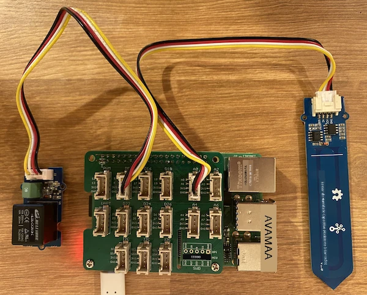

# Controlar um relé - Raspberry Pi

Nesta parte da lição, irá adicionar um relé ao seu Raspberry Pi, além do sensor de humidade do solo, e controlá-lo com base no nível de humidade do solo.

## Hardware

O Raspberry Pi necessita de um relé.

O relé que irá utilizar é um [relé Grove](https://www.seeedstudio.com/Grove-Relay.html), um relé normalmente aberto (o que significa que o circuito de saída está aberto, ou desconectado, quando não é enviado nenhum sinal para o relé) que pode lidar com circuitos de saída até 250V e 10A.

Este é um atuador digital, por isso conecta-se a um pino digital no Grove Base Hat.

### Ligar o relé

O relé Grove pode ser ligado ao Raspberry Pi.

#### Tarefa

Ligue o relé.


1. Insira uma extremidade de um cabo Grove na entrada do relé. Ele só encaixará de uma forma.

1. Com o Raspberry Pi desligado, conecte a outra extremidade do cabo Grove à entrada digital marcada como **D5** no Grove Base Hat ligado ao Pi. Esta entrada é a segunda da esquerda, na fila de entradas ao lado dos pinos GPIO. Deixe o sensor de humidade do solo conectado à entrada **A0**.



1. Insira o sensor de humidade do solo na terra, caso ainda não o tenha feito na lição anterior.

## Programar o relé

O Raspberry Pi pode agora ser programado para utilizar o relé conectado.

### Tarefa

Programe o dispositivo.

1. Ligue o Pi e aguarde que ele inicie.

1. Abra o projeto `soil-moisture-sensor` da última lição no VS Code, caso ainda não esteja aberto. Irá adicionar código a este projeto.

1. Adicione o seguinte código ao ficheiro `app.py` abaixo das importações existentes:

    ```python
    from grove.grove_relay import GroveRelay
    ```

    Esta instrução importa o `GroveRelay` das bibliotecas Python do Grove para interagir com o relé Grove.

1. Adicione o seguinte código abaixo da declaração da classe `ADC` para criar uma instância de `GroveRelay`:

    ```python
    relay = GroveRelay(5)
    ```

    Isto cria um relé utilizando o pino **D5**, o pino digital ao qual conectou o relé.

1. Para testar se o relé está a funcionar, adicione o seguinte ao ciclo `while True:`:

    ```python
    relay.on()
    time.sleep(.5)
    relay.off()
    ```

    O código liga o relé, espera 0,5 segundos e depois desliga o relé.

1. Execute a aplicação Python. O relé irá ligar e desligar a cada 10 segundos, com um intervalo de meio segundo entre ligar e desligar. Irá ouvir o relé a clicar ao ligar e a clicar ao desligar. Um LED na placa Grove acenderá quando o relé estiver ligado e apagará quando estiver desligado.

    

## Controlar o relé com base na humidade do solo

Agora que o relé está a funcionar, pode ser controlado em resposta às leituras de humidade do solo.

### Tarefa

Controle o relé.

1. Elimine as 3 linhas de código que adicionou para testar o relé. Substitua-as pelo seguinte código:

    ```python
    if soil_moisture > 450:
        print("Soil Moisture is too low, turning relay on.")
        relay.on()
    else:
        print("Soil Moisture is ok, turning relay off.")
        relay.off()
    ```

    Este código verifica o nível de humidade do solo a partir do sensor de humidade do solo. Se estiver acima de 450, liga o relé, e desliga-o quando estiver abaixo de 450.

    > 💁 Lembre-se de que o sensor capacitivo de humidade do solo lê: quanto mais baixo for o nível de humidade do solo, maior é a humidade na terra, e vice-versa.

1. Execute a aplicação Python. Verá o relé a ligar ou desligar dependendo do nível de humidade do solo. Experimente em terra seca e depois adicione água.

    ```output
    Soil Moisture: 638
    Soil Moisture is too low, turning relay on.
    Soil Moisture: 452
    Soil Moisture is too low, turning relay on.
    Soil Moisture: 347
    Soil Moisture is ok, turning relay off.
    ```

> 💁 Pode encontrar este código na pasta [code-relay/pi](../../../../../2-farm/lessons/3-automated-plant-watering/code-relay/pi).

😀 O seu programa de controlo de um relé com base no sensor de humidade do solo foi um sucesso!

**Aviso Legal**:  
Este documento foi traduzido utilizando o serviço de tradução por IA [Co-op Translator](https://github.com/Azure/co-op-translator). Embora nos esforcemos pela precisão, esteja ciente de que traduções automáticas podem conter erros ou imprecisões. O documento original na sua língua nativa deve ser considerado a fonte autoritária. Para informações críticas, recomenda-se a tradução profissional realizada por humanos. Não nos responsabilizamos por quaisquer mal-entendidos ou interpretações incorretas decorrentes do uso desta tradução.