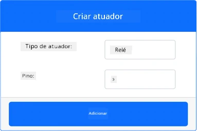
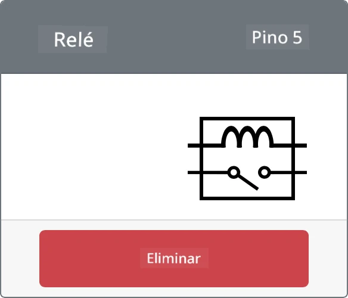

# Controlar um relé - Hardware IoT Virtual

Nesta parte da lição, irá adicionar um relé ao seu dispositivo IoT virtual, além do sensor de humidade do solo, e controlá-lo com base no nível de humidade do solo.

## Hardware Virtual

O dispositivo IoT virtual utilizará um relé simulado Grove. Isto mantém este laboratório semelhante ao uso de um Raspberry Pi com um relé físico Grove.

Num dispositivo IoT físico, o relé seria um relé normalmente aberto (o que significa que o circuito de saída está aberto, ou desconectado, quando não há sinal enviado para o relé). Um relé deste tipo pode lidar com circuitos de saída até 250V e 10A.

### Adicionar o relé ao CounterFit

Para usar um relé virtual, é necessário adicioná-lo à aplicação CounterFit.

#### Tarefa

Adicione o relé à aplicação CounterFit.

1. Abra o projeto `soil-moisture-sensor` da última lição no VS Code, caso ainda não esteja aberto. Irá adicionar a este projeto.

1. Certifique-se de que a aplicação web CounterFit está em execução.

1. Crie um relé:

    1. Na caixa *Create actuator* no painel *Actuators*, abra o menu suspenso *Actuator type* e selecione *Relay*.

    1. Defina o *Pin* para *5*.

    1. Selecione o botão **Add** para criar o relé no Pin 5.

    

    O relé será criado e aparecerá na lista de atuadores.

    

## Programar o relé

A aplicação do sensor de humidade do solo pode agora ser programada para usar o relé virtual.

### Tarefa

Programe o dispositivo virtual.

1. Abra o projeto `soil-moisture-sensor` da última lição no VS Code, caso ainda não esteja aberto. Irá adicionar a este projeto.

1. Adicione o seguinte código ao ficheiro `app.py` abaixo das importações existentes:

    ```python
    from counterfit_shims_grove.grove_relay import GroveRelay
    ```

    Esta instrução importa o `GroveRelay` das bibliotecas Grove Python shim para interagir com o relé virtual Grove.

1. Adicione o seguinte código abaixo da declaração da classe `ADC` para criar uma instância de `GroveRelay`:

    ```python
    relay = GroveRelay(5)
    ```

    Isto cria um relé utilizando o pin **5**, o pin ao qual conectou o relé.

1. Para testar se o relé está a funcionar, adicione o seguinte ao ciclo `while True:`:

    ```python
    relay.on()
    time.sleep(.5)
    relay.off()
    ```

    O código liga o relé, espera 0,5 segundos e depois desliga o relé.

1. Execute a aplicação Python. O relé irá ligar e desligar a cada 10 segundos, com um atraso de meio segundo entre ligar e desligar. Verá o relé virtual na aplicação CounterFit fechar e abrir à medida que o relé é ligado e desligado.

    

## Controlar o relé com base na humidade do solo

Agora que o relé está a funcionar, pode ser controlado em resposta às leituras de humidade do solo.

### Tarefa

Controle o relé.

1. Elimine as 3 linhas de código que adicionou para testar o relé. Substitua-as pelo seguinte código no mesmo local:

    ```python
    if soil_moisture > 450:
        print("Soil Moisture is too low, turning relay on.")
        relay.on()
    else:
        print("Soil Moisture is ok, turning relay off.")
        relay.off()
    ```

    Este código verifica o nível de humidade do solo a partir do sensor de humidade do solo. Se estiver acima de 450, liga o relé, desligando-o se descer abaixo de 450.

    > 💁 Lembre-se de que o sensor capacitivo de humidade do solo lê: quanto mais baixo o nível de humidade do solo, maior é a humidade no solo, e vice-versa.

1. Execute a aplicação Python. Verá o relé ligar ou desligar dependendo dos níveis de humidade do solo. Altere o *Value* ou as definições de *Random* para o sensor de humidade do solo para ver o valor mudar.

    ```output
    Soil Moisture: 638
    Soil Moisture is too low, turning relay on.
    Soil Moisture: 452
    Soil Moisture is too low, turning relay on.
    Soil Moisture: 347
    Soil Moisture is ok, turning relay off.
    ```

> 💁 Pode encontrar este código na pasta [code-relay/virtual-device](../../../../../2-farm/lessons/3-automated-plant-watering/code-relay/virtual-device).

😀 O seu programa de sensor de humidade do solo virtual a controlar um relé foi um sucesso!

**Aviso Legal**:  
Este documento foi traduzido utilizando o serviço de tradução por IA [Co-op Translator](https://github.com/Azure/co-op-translator). Embora nos esforcemos para garantir a precisão, é importante notar que traduções automáticas podem conter erros ou imprecisões. O documento original na sua língua nativa deve ser considerado a fonte autoritária. Para informações críticas, recomenda-se a tradução profissional realizada por humanos. Não nos responsabilizamos por quaisquer mal-entendidos ou interpretações incorretas decorrentes do uso desta tradução.