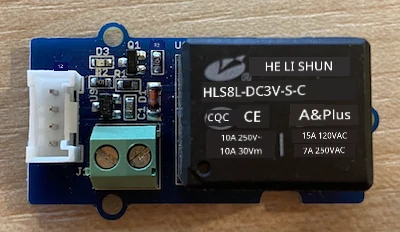
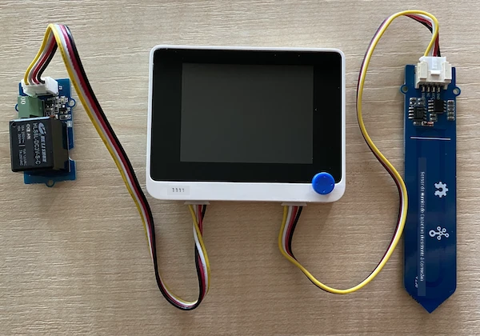

# Controlar um relé - Wio Terminal

Nesta parte da lição, vais adicionar um relé ao teu Wio Terminal, além do sensor de humidade do solo, e controlá-lo com base no nível de humidade do solo.

## Hardware

O Wio Terminal precisa de um relé.

O relé que vais usar é um [relé Grove](https://www.seeedstudio.com/Grove-Relay.html), um relé normalmente aberto (o que significa que o circuito de saída está aberto ou desconectado quando não há sinal enviado para o relé) que pode lidar com circuitos de saída até 250V e 10A.

Este é um atuador digital, por isso conecta-se aos pinos digitais do Wio Terminal. A porta combinada analógica/digital já está a ser usada com o sensor de humidade do solo, por isso este será ligado à outra porta, que é uma porta combinada I2C e digital.

### Ligar o relé

O relé Grove pode ser ligado à porta digital do Wio Terminal.

#### Tarefa

Liga o relé.



1. Insere uma extremidade de um cabo Grove na entrada do relé. Só encaixará de uma forma.

1. Com o Wio Terminal desconectado do computador ou de outra fonte de energia, liga a outra extremidade do cabo Grove à entrada Grove do lado esquerdo do Wio Terminal, olhando para o ecrã. Deixa o sensor de humidade do solo ligado à entrada do lado direito.



1. Insere o sensor de humidade do solo na terra, caso ainda não esteja inserido da lição anterior.

## Programar o relé

Agora o Wio Terminal pode ser programado para usar o relé ligado.

### Tarefa

Programa o dispositivo.

1. Abre o projeto `soil-moisture-sensor` da última lição no VS Code, caso ainda não esteja aberto. Vais adicionar código a este projeto.

2. Não existe uma biblioteca para este atuador - é um atuador digital controlado por um sinal alto ou baixo. Para o ligar, envias um sinal alto para o pino (3.3V); para o desligar, envias um sinal baixo (0V). Podes fazer isso usando a função [`digitalWrite`](https://www.arduino.cc/reference/en/language/functions/digital-io/digitalwrite/) integrada no Arduino. Começa por adicionar o seguinte ao final da função `setup` para configurar a porta combinada I2C/digital como um pino de saída para enviar uma tensão ao relé:

    ```cpp
    pinMode(PIN_WIRE_SCL, OUTPUT);
    ```

    `PIN_WIRE_SCL` é o número da porta para a porta combinada I2C/digital.

1. Para testar se o relé está a funcionar, adiciona o seguinte à função `loop`, abaixo do último `delay`:

    ```cpp
    digitalWrite(PIN_WIRE_SCL, HIGH);
    delay(500);
    digitalWrite(PIN_WIRE_SCL, LOW);
    ```

    O código envia um sinal alto para o pino ao qual o relé está ligado para o ligar, espera 500ms (meio segundo) e depois envia um sinal baixo para o desligar.

1. Compila e carrega o código para o Wio Terminal.

1. Depois de carregado, o relé irá ligar e desligar a cada 10 segundos, com um atraso de meio segundo entre ligar e desligar. Vais ouvir o relé a clicar ao ligar e a clicar ao desligar. Um LED na placa Grove acenderá quando o relé estiver ligado e apagará quando estiver desligado.

    

## Controlar o relé com base na humidade do solo

Agora que o relé está a funcionar, pode ser controlado em resposta às leituras de humidade do solo.

### Tarefa

Controla o relé.

1. Apaga as 3 linhas de código que adicionaste para testar o relé. Substitui-as pelo seguinte código:

    ```cpp
    if (soil_moisture > 450)
    {
        Serial.println("Soil Moisture is too low, turning relay on.");
        digitalWrite(PIN_WIRE_SCL, HIGH);
    }
    else
    {
        Serial.println("Soil Moisture is ok, turning relay off.");
        digitalWrite(PIN_WIRE_SCL, LOW);
    }
    ```

    Este código verifica o nível de humidade do solo a partir do sensor de humidade do solo. Se estiver acima de 450, liga o relé; se estiver abaixo de 450, desliga-o.

    > 💁 Lembra-te de que o sensor de humidade do solo capacitivo lê: quanto mais baixo o nível de humidade do solo, mais húmido está o solo, e vice-versa.

1. Compila e carrega o código para o Wio Terminal.

1. Monitoriza o dispositivo através do monitor serial. Vais ver o relé a ligar ou desligar dependendo do nível de humidade do solo. Experimenta em solo seco e depois adiciona água.

    ```output
    Soil Moisture: 638
    Soil Moisture is too low, turning relay on.
    Soil Moisture: 452
    Soil Moisture is too low, turning relay on.
    Soil Moisture: 347
    Soil Moisture is ok, turning relay off.
    ```

> 💁 Podes encontrar este código na pasta [code-relay/wio-terminal](../../../../../2-farm/lessons/3-automated-plant-watering/code-relay/wio-terminal).

😀 O teu programa de controlo de relé com base no sensor de humidade do solo foi um sucesso!

**Aviso Legal**:  
Este documento foi traduzido utilizando o serviço de tradução por IA [Co-op Translator](https://github.com/Azure/co-op-translator). Embora nos esforcemos para garantir a precisão, é importante notar que traduções automáticas podem conter erros ou imprecisões. O documento original na sua língua nativa deve ser considerado a fonte autoritária. Para informações críticas, recomenda-se a tradução profissional realizada por humanos. Não nos responsabilizamos por quaisquer mal-entendidos ou interpretações incorretas decorrentes do uso desta tradução.