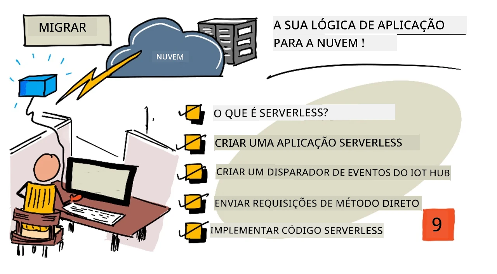
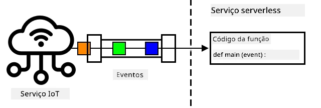
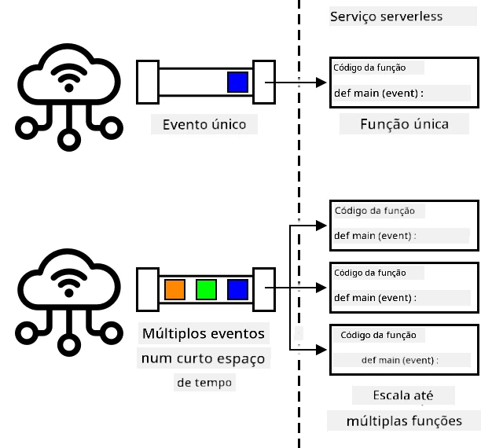
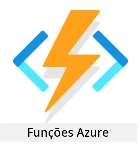
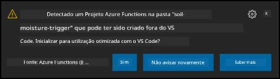

# Migre a lógica da sua aplicação para a cloud



> Ilustração por [Nitya Narasimhan](https://github.com/nitya). Clique na imagem para uma versão maior.

Esta lição foi ensinada como parte da [série IoT para Iniciantes - Agricultura Digital, Projeto 2](https://youtube.com/playlist?list=PLmsFUfdnGr3yCutmcVg6eAUEfsGiFXgcx) do [Microsoft Reactor](https://developer.microsoft.com/reactor/?WT.mc_id=academic-17441-jabenn).

[](https://youtu.be/VVZDcs5u1_I)

## Questionário pré-aula

[Questionário pré-aula](https://black-meadow-040d15503.1.azurestaticapps.net/quiz/17)

## Introdução

Na última lição, aprendeu a conectar o monitoramento de humidade do solo da sua planta e o controlo do relé a um serviço IoT baseado na cloud. O próximo passo é mover o código do servidor que controla o tempo do relé para a cloud. Nesta lição, aprenderá a fazer isso utilizando funções serverless.

Nesta lição, abordaremos:

* [O que é serverless?](../../../../../2-farm/lessons/5-migrate-application-to-the-cloud)
* [Criar uma aplicação serverless](../../../../../2-farm/lessons/5-migrate-application-to-the-cloud)
* [Criar um trigger de evento do IoT Hub](../../../../../2-farm/lessons/5-migrate-application-to-the-cloud)
* [Enviar pedidos de método direto a partir de código serverless](../../../../../2-farm/lessons/5-migrate-application-to-the-cloud)
* [Desplegar o seu código serverless na cloud](../../../../../2-farm/lessons/5-migrate-application-to-the-cloud)

## O que é serverless?

Serverless, ou computação serverless, envolve criar pequenos blocos de código que são executados na cloud em resposta a diferentes tipos de eventos. Quando o evento ocorre, o seu código é executado e recebe dados sobre o evento. Estes eventos podem vir de várias fontes, incluindo pedidos web, mensagens colocadas numa fila, alterações a dados numa base de dados ou mensagens enviadas para um serviço IoT por dispositivos IoT.



> 💁 Se já utilizou triggers de base de dados antes, pode pensar nisto como algo semelhante: código sendo acionado por um evento, como a inserção de uma linha.



O seu código só é executado quando o evento ocorre, não permanecendo ativo em outros momentos. O evento ocorre, o seu código é carregado e executado. Isto torna o serverless altamente escalável - se muitos eventos ocorrerem ao mesmo tempo, o fornecedor da cloud pode executar a sua função tantas vezes quanto necessário, simultaneamente, em qualquer servidor disponível. A desvantagem é que, se precisar de partilhar informações entre eventos, terá de armazená-las em algum lugar, como uma base de dados, em vez de as manter na memória.

O seu código é escrito como uma função que recebe detalhes sobre o evento como parâmetro. Pode usar uma ampla gama de linguagens de programação para escrever estas funções serverless.

> 🎓 Serverless também é conhecido como Functions as a Service (FaaS), pois cada trigger de evento é implementado como uma função no código.

Apesar do nome, serverless utiliza servidores. O nome refere-se ao facto de que, como programador, não precisa de se preocupar com os servidores necessários para executar o seu código; tudo o que importa é que o código seja executado em resposta a um evento. O fornecedor da cloud possui um *runtime* serverless que gere a alocação de servidores, redes, armazenamento, CPU, memória e tudo o mais necessário para executar o seu código. Este modelo significa que não paga por servidor, mas sim pelo tempo em que o código está em execução e pela quantidade de memória utilizada.

> 💰 Serverless é uma das formas mais económicas de executar código na cloud. Por exemplo, no momento em que este texto foi escrito, um fornecedor de cloud permite que todas as suas funções serverless sejam executadas até 1.000.000 de vezes por mês antes de começar a cobrar, e depois disso cobra 0,20 USD por cada 1.000.000 de execuções. Quando o seu código não está em execução, não paga.

Como programador IoT, o modelo serverless é ideal. Pode escrever uma função que é chamada em resposta a mensagens enviadas por qualquer dispositivo IoT conectado ao seu serviço IoT hospedado na cloud. O seu código lidará com todas as mensagens enviadas, mas só será executado quando necessário.

✅ Relembre o código que escreveu como servidor a ouvir mensagens via MQTT. Como acha que isso poderia ser executado na cloud usando serverless? Que alterações seriam necessárias no código para suportar a computação serverless?

> 💁 O modelo serverless está a expandir-se para outros serviços na cloud, além da execução de código. Por exemplo, bases de dados serverless estão disponíveis na cloud, utilizando um modelo de preços serverless onde paga por cada pedido feito à base de dados, como uma consulta ou inserção, geralmente com preços baseados no trabalho necessário para atender ao pedido. Por exemplo, uma consulta simples de uma linha por chave primária custará menos do que uma operação complexa que junta várias tabelas e retorna milhares de linhas.

## Criar uma aplicação serverless

O serviço de computação serverless da Microsoft chama-se Azure Functions.



O vídeo curto abaixo apresenta uma visão geral do Azure Functions.

[](https://www.youtube.com/watch?v=8-jz5f_JyEQ)

> 🎥 Clique na imagem acima para assistir ao vídeo.

✅ Reserve um momento para pesquisar e ler a visão geral do Azure Functions na [documentação do Microsoft Azure Functions](https://docs.microsoft.com/azure/azure-functions/functions-overview?WT.mc_id=academic-17441-jabenn).

Para escrever Azure Functions, começa com uma aplicação Azure Functions na linguagem de sua escolha. O Azure Functions suporta, de forma nativa, Python, JavaScript, TypeScript, C#, F#, Java e Powershell. Nesta lição, aprenderá a escrever uma aplicação Azure Functions em Python.

> 💁 O Azure Functions também suporta *handlers* personalizados, permitindo que escreva funções em qualquer linguagem que suporte pedidos HTTP, incluindo linguagens mais antigas, como COBOL.

As aplicações de funções consistem em um ou mais *triggers* - funções que respondem a eventos. Pode ter vários triggers dentro de uma aplicação de funções, todos partilhando uma configuração comum. Por exemplo, no ficheiro de configuração da sua aplicação de funções, pode ter os detalhes de conexão do seu IoT Hub, e todas as funções na aplicação podem usar isso para se conectar e ouvir eventos.

### Tarefa - instalar as ferramentas do Azure Functions

> No momento em que este texto foi escrito, as ferramentas de código do Azure Functions não funcionam totalmente em Macs com Apple Silicon para projetos em Python. Será necessário usar um Mac baseado em Intel, um PC com Windows ou um PC com Linux.

Uma grande funcionalidade do Azure Functions é que pode executá-lo localmente. O mesmo runtime usado na cloud pode ser executado no seu computador, permitindo que escreva código que responde a mensagens IoT e o execute localmente. Pode até depurar o seu código enquanto os eventos são processados. Quando estiver satisfeito com o código, pode implementá-lo na cloud.

As ferramentas do Azure Functions estão disponíveis como uma CLI, conhecida como Azure Functions Core Tools.

1. Instale as ferramentas principais do Azure Functions seguindo as instruções na [documentação do Azure Functions Core Tools](https://docs.microsoft.com/azure/azure-functions/functions-run-local?WT.mc_id=academic-17441-jabenn).

1. Instale a extensão do Azure Functions para o VS Code. Esta extensão fornece suporte para criar, depurar e implementar funções do Azure. Consulte a [documentação da extensão do Azure Functions](https://marketplace.visualstudio.com/items?WT.mc_id=academic-17441-jabenn&itemName=ms-azuretools.vscode-azurefunctions) para instruções sobre como instalar esta extensão no VS Code.

Quando implementar a sua aplicação Azure Functions na cloud, será necessário usar uma pequena quantidade de armazenamento na cloud para guardar ficheiros da aplicação e ficheiros de log. Quando executa a sua aplicação de funções localmente, ainda precisa de se conectar ao armazenamento na cloud, mas, em vez de usar armazenamento real, pode usar um emulador de armazenamento chamado [Azurite](https://github.com/Azure/Azurite). Este emulador é executado localmente, mas age como se fosse armazenamento na cloud.

> 🎓 No Azure, o armazenamento usado pelo Azure Functions é uma Conta de Armazenamento do Azure. Estas contas podem armazenar ficheiros, blobs, dados em tabelas ou dados em filas. Pode partilhar uma conta de armazenamento entre várias aplicações, como uma aplicação de funções e uma aplicação web.

1. O Azurite é uma aplicação Node.js, por isso será necessário instalar o Node.js. Pode encontrar as instruções de download e instalação no [site do Node.js](https://nodejs.org/). Se estiver a usar um Mac, também pode instalá-lo através do [Homebrew](https://formulae.brew.sh/formula/node).

1. Instale o Azurite usando o seguinte comando (`npm` é uma ferramenta instalada juntamente com o Node.js):

    ```sh
    npm install -g azurite
    ```

1. Crie uma pasta chamada `azurite` para o Azurite usar como armazenamento de dados:

    ```sh
    mkdir azurite
    ```

1. Execute o Azurite, passando-lhe esta nova pasta:

    ```sh
    azurite --location azurite
    ```

    O emulador de armazenamento Azurite será iniciado e estará pronto para o runtime local do Functions se conectar.

    ```output
    ➜  ~ azurite --location azurite  
    Azurite Blob service is starting at http://127.0.0.1:10000
    Azurite Blob service is successfully listening at http://127.0.0.1:10000
    Azurite Queue service is starting at http://127.0.0.1:10001
    Azurite Queue service is successfully listening at http://127.0.0.1:10001
    Azurite Table service is starting at http://127.0.0.1:10002
    Azurite Table service is successfully listening at http://127.0.0.1:10002
    ```

### Tarefa - criar um projeto Azure Functions

A CLI do Azure Functions pode ser usada para criar uma nova aplicação de funções.

1. Crie uma pasta para a sua aplicação de funções e navegue até ela. Chame-a de `soil-moisture-trigger`.

    ```sh
    mkdir soil-moisture-trigger
    cd soil-moisture-trigger
    ```

1. Crie um ambiente virtual Python dentro desta pasta:

    ```sh
    python3 -m venv .venv
    ```

1. Ative o ambiente virtual:

    * No Windows:
        * Se estiver a usar o Command Prompt ou o Command Prompt através do Windows Terminal, execute:

            ```cmd
            .venv\Scripts\activate.bat
            ```

        * Se estiver a usar o PowerShell, execute:

            ```powershell
            .\.venv\Scripts\Activate.ps1
            ```

    * No macOS ou Linux, execute:

        ```cmd
        source ./.venv/bin/activate
        ```

    > 💁 Estes comandos devem ser executados a partir do mesmo local onde criou o ambiente virtual. Nunca precisará de navegar para dentro da pasta `.venv`; deve sempre executar o comando de ativação e quaisquer comandos para instalar pacotes ou executar código a partir da pasta onde criou o ambiente virtual.

1. Execute o seguinte comando para criar uma aplicação de funções nesta pasta:

    ```sh
    func init --worker-runtime python soil-moisture-trigger
    ```

    Isto criará três ficheiros dentro da pasta atual:

    * `host.json` - este documento JSON contém configurações para a sua aplicação de funções. Não será necessário modificar estas configurações.
    * `local.settings.json` - este documento JSON contém configurações que a sua aplicação usará ao ser executada localmente, como strings de conexão para o seu IoT Hub. Estas configurações são apenas locais e não devem ser adicionadas ao controlo de versão. Quando implementar a aplicação na cloud, estas configurações não serão implementadas; em vez disso, as configurações serão carregadas a partir das definições da aplicação. Isto será abordado mais tarde nesta lição.
    * `requirements.txt` - este é um [ficheiro de requisitos do Pip](https://pip.pypa.io/en/stable/user_guide/#requirements-files) que contém os pacotes necessários para executar a sua aplicação de funções.

1. O ficheiro `local.settings.json` tem uma configuração para a conta de armazenamento que a aplicação de funções usará. Por padrão, esta configuração está vazia, por isso precisa de ser definida. Para se conectar ao emulador de armazenamento local Azurite, defina este valor como o seguinte:

    ```json
    "AzureWebJobsStorage": "UseDevelopmentStorage=true",
    ```

1. Instale os pacotes necessários do Pip usando o ficheiro de requisitos:

    ```sh
    pip install -r requirements.txt
    ```

    > 💁 Os pacotes necessários do Pip precisam de estar neste ficheiro, para que, quando a aplicação de funções for implementada na cloud, o runtime possa garantir que instala os pacotes corretos.

1. Para testar se tudo está a funcionar corretamente, pode iniciar o runtime do Functions. Execute o seguinte comando para fazer isso:

    ```sh
    func start
    ```

    Verá o runtime iniciar e relatar que não encontrou nenhuma função de trabalho (triggers).

    ```output
    (.venv) ➜  soil-moisture-trigger func start
    Found Python version 3.9.1 (python3).
    
    Azure Functions Core Tools
    Core Tools Version:       3.0.3442 Commit hash: 6bfab24b2743f8421475d996402c398d2fe4a9e0  (64-bit)
    Function Runtime Version: 3.0.15417.0
    
    [2021-05-05T01:24:46.795Z] No job functions found.
    ```
> ⚠️ Se receber uma notificação do firewall, conceda acesso, pois a aplicação `func` precisa de permissão para ler e escrever na sua rede.
> ⚠️ Se estiver a usar macOS, podem surgir avisos na saída:
>
> ```output
    > (.venv) ➜  soil-moisture-trigger func start
    > Found Python version 3.9.1 (python3).
    >
    > Azure Functions Core Tools
    > Core Tools Version:       3.0.3442 Commit hash: 6bfab24b2743f8421475d996402c398d2fe4a9e0  (64-bit)
    > Function Runtime Version: 3.0.15417.0
    >
    > [2021-06-16T08:18:28.315Z] Cannot create directory for shared memory usage: /dev/shm/AzureFunctions
    > [2021-06-16T08:18:28.316Z] System.IO.FileSystem: Access to the path '/dev/shm/AzureFunctions' is denied. Operation not permitted.
    > [2021-06-16T08:18:30.361Z] No job functions found.
    > ```
>
> Pode ignorá-los desde que a aplicação Functions inicie corretamente e liste as funções em execução. Como mencionado [nesta questão no Microsoft Docs Q&A](https://docs.microsoft.com/answers/questions/396617/azure-functions-core-tools-error-osx-devshmazurefu.html?WT.mc_id=academic-17441-jabenn), estes avisos podem ser ignorados.

1. Pare a aplicação Functions pressionando `ctrl+c`.

1. Abra a pasta atual no VS Code, seja abrindo o VS Code e depois esta pasta, ou executando o seguinte comando:

    ```sh
    code .
    ```

    O VS Code irá detetar o seu projeto Functions e mostrar uma notificação dizendo:

    ```output
    Detected an Azure Functions Project in folder "soil-moisture-trigger" that may have been created outside of
    VS Code. Initialize for optimal use with VS Code?
    ```

    

    Selecione **Yes** nesta notificação.

1. Certifique-se de que o ambiente virtual Python está em execução no terminal do VS Code. Termine-o e reinicie-o, se necessário.

## Criar um trigger de evento do IoT Hub

A aplicação Functions é a estrutura do seu código serverless. Para responder a eventos do IoT Hub, pode adicionar um trigger do IoT Hub a esta aplicação. Este trigger precisa de se conectar ao fluxo de mensagens enviadas para o IoT Hub e responder a elas. Para obter este fluxo de mensagens, o seu trigger precisa de se conectar ao *endpoint compatível com Event Hub* do IoT Hub.

O IoT Hub baseia-se noutro serviço Azure chamado Azure Event Hubs. O Event Hubs é um serviço que permite enviar e receber mensagens, e o IoT Hub estende-o para adicionar funcionalidades para dispositivos IoT. A forma como se conecta para ler mensagens do IoT Hub é a mesma que usaria se estivesse a usar o Event Hubs.

✅ Faça uma pesquisa: Leia a visão geral do Event Hubs na [documentação do Azure Event Hubs](https://docs.microsoft.com/azure/event-hubs/event-hubs-about?WT.mc_id=academic-17441-jabenn). Como é que as funcionalidades básicas se comparam ao IoT Hub?

Para que um dispositivo IoT se conecte ao IoT Hub, tem de usar uma chave secreta que garante que apenas dispositivos autorizados podem conectar-se. O mesmo se aplica ao conectar-se para ler mensagens; o seu código precisará de uma string de conexão que contenha uma chave secreta, juntamente com os detalhes do IoT Hub.

> 💁 A string de conexão padrão que obtém tem permissões de **iothubowner**, o que dá a qualquer código que a utilize permissões totais no IoT Hub. Idealmente, deve conectar-se com o nível mais baixo de permissões necessário. Isto será abordado na próxima lição.

Depois de o seu trigger estar conectado, o código dentro da função será chamado para cada mensagem enviada ao IoT Hub, independentemente do dispositivo que a enviou. O trigger passará a mensagem como um parâmetro.

### Tarefa - obter a string de conexão do endpoint compatível com Event Hub

1. No terminal do VS Code, execute o seguinte comando para obter a string de conexão para o endpoint compatível com Event Hub do IoT Hub:

    ```sh
    az iot hub connection-string show --default-eventhub \
                                      --output table \
                                      --hub-name <hub_name>
    ```

    Substitua `<hub_name>` pelo nome que utilizou para o seu IoT Hub.

1. No VS Code, abra o ficheiro `local.settings.json`. Adicione o seguinte valor adicional dentro da secção `Values`:

    ```json
    "IOT_HUB_CONNECTION_STRING": "<connection string>"
    ```

    Substitua `<connection string>` pelo valor do passo anterior. Será necessário adicionar uma vírgula após a linha acima para que seja um JSON válido.

### Tarefa - criar um trigger de evento

Agora está pronto para criar o trigger de evento.

1. No terminal do VS Code, execute o seguinte comando dentro da pasta `soil-moisture-trigger`:

    ```sh
    func new --name iot-hub-trigger --template "Azure Event Hub trigger"
    ```

    Isto cria uma nova Function chamada `iot-hub-trigger`. O trigger irá conectar-se ao endpoint compatível com Event Hub no IoT Hub, permitindo-lhe usar um trigger de Event Hub. Não existe um trigger específico para IoT Hub.

Isto criará uma pasta dentro da pasta `soil-moisture-trigger` chamada `iot-hub-trigger`, que contém esta função. Esta pasta terá os seguintes ficheiros:

* `__init__.py` - este é o ficheiro de código Python que contém o trigger, usando a convenção padrão de nomes de ficheiros Python para transformar esta pasta num módulo Python.

    Este ficheiro conterá o seguinte código:

    ```python
    import logging

    import azure.functions as func


    def main(event: func.EventHubEvent):
        logging.info('Python EventHub trigger processed an event: %s',
                    event.get_body().decode('utf-8'))
    ```

    O núcleo do trigger é a função `main`. É esta função que é chamada com os eventos do IoT Hub. Esta função tem um parâmetro chamado `event` que contém um `EventHubEvent`. Sempre que uma mensagem é enviada para o IoT Hub, esta função é chamada passando essa mensagem como o `event`, juntamente com propriedades que são as mesmas que as anotações que viu na última lição.

    O núcleo desta função regista o evento.

* `function.json` - este ficheiro contém a configuração para o trigger. A configuração principal está numa secção chamada `bindings`. Um binding é o termo para uma ligação entre Azure Functions e outros serviços Azure. Esta função tem um binding de entrada para um Event Hub - conecta-se a um Event Hub e recebe dados.

    > 💁 Também pode ter bindings de saída para que o output de uma função seja enviado para outro serviço. Por exemplo, poderia adicionar um binding de saída para uma base de dados e retornar o evento do IoT Hub a partir da função, e este seria automaticamente inserido na base de dados.

    ✅ Faça uma pesquisa: Leia sobre bindings na [documentação de conceitos de triggers e bindings do Azure Functions](https://docs.microsoft.com/azure/azure-functions/functions-triggers-bindings?WT.mc_id=academic-17441-jabenn&tabs=python).

    A secção `bindings` inclui a configuração para o binding. Os valores de interesse são:

  * `"type": "eventHubTrigger"` - isto indica que a função precisa de ouvir eventos de um Event Hub
  * `"name": "events"` - este é o nome do parâmetro a usar para os eventos do Event Hub. Este corresponde ao nome do parâmetro na função `main` no código Python.
  * `"direction": "in"` - este é um binding de entrada, os dados do Event Hub entram na função
  * `"connection": ""` - isto define o nome da configuração para ler a string de conexão. Quando executado localmente, esta configuração será lida do ficheiro `local.settings.json`.

    > 💁 A string de conexão não pode ser armazenada no ficheiro `function.json`, tem de ser lida das configurações. Isto é para evitar expor acidentalmente a sua string de conexão.

1. Devido a [um bug no template do Azure Functions](https://github.com/Azure/azure-functions-templates/issues/1250), o ficheiro `function.json` tem um valor incorreto para o campo `cardinality`. Atualize este campo de `many` para `one`:

    ```json
    "cardinality": "one",
    ```

1. Atualize o valor de `"connection"` no ficheiro `function.json` para apontar para o novo valor que adicionou ao ficheiro `local.settings.json`:

    ```json
    "connection": "IOT_HUB_CONNECTION_STRING",
    ```

    > 💁 Lembre-se - isto precisa de apontar para a configuração, não conter a string de conexão real.

1. A string de conexão contém o valor `eventHubName`, por isso o valor para este no ficheiro `function.json` precisa de ser limpo. Atualize este valor para uma string vazia:

    ```json
    "eventHubName": "",
    ```

### Tarefa - executar o trigger de evento

1. Certifique-se de que não está a executar o monitor de eventos do IoT Hub. Se este estiver a ser executado ao mesmo tempo que a aplicação Functions, a aplicação Functions não conseguirá conectar-se e consumir eventos.

    > 💁 Várias aplicações podem conectar-se aos endpoints do IoT Hub usando diferentes *consumer groups*. Estes serão abordados numa lição posterior.

1. Para executar a aplicação Functions, execute o seguinte comando no terminal do VS Code:

    ```sh
    func start
    ```

    A aplicação Functions será iniciada e descobrirá a função `iot-hub-trigger`. Em seguida, processará quaisquer eventos que já tenham sido enviados para o IoT Hub no último dia.

    ```output
    (.venv) ➜  soil-moisture-trigger func start
    Found Python version 3.9.1 (python3).
    
    Azure Functions Core Tools
    Core Tools Version:       3.0.3442 Commit hash: 6bfab24b2743f8421475d996402c398d2fe4a9e0  (64-bit)
    Function Runtime Version: 3.0.15417.0
    
    Functions:
    
            iot-hub-trigger: eventHubTrigger
    
    For detailed output, run func with --verbose flag.
    [2021-05-05T02:44:07.517Z] Worker process started and initialized.
    [2021-05-05T02:44:09.202Z] Executing 'Functions.iot-hub-trigger' (Reason='(null)', Id=802803a5-eae9-4401-a1f4-176631456ce4)
    [2021-05-05T02:44:09.205Z] Trigger Details: PartitionId: 0, Offset: 1011240-1011632, EnqueueTimeUtc: 2021-05-04T19:04:04.2030000Z-2021-05-04T19:04:04.3900000Z, SequenceNumber: 2546-2547, Count: 2
    [2021-05-05T02:44:09.352Z] Python EventHub trigger processed an event: {"soil_moisture":628}
    [2021-05-05T02:44:09.354Z] Python EventHub trigger processed an event: {"soil_moisture":624}
    [2021-05-05T02:44:09.395Z] Executed 'Functions.iot-hub-trigger' (Succeeded, Id=802803a5-eae9-4401-a1f4-176631456ce4, Duration=245ms)
    ```

    Cada chamada à função será rodeada por um bloco `Executing 'Functions.iot-hub-trigger'`/`Executed 'Functions.iot-hub-trigger'` na saída, para que possa ver quantas mensagens foram processadas em cada chamada da função.

1. Certifique-se de que o seu dispositivo IoT está em execução. Verá novas mensagens de humidade do solo a aparecer na aplicação Functions.

1. Pare e reinicie a aplicação Functions. Verá que não processará mensagens anteriores novamente, apenas processará novas mensagens.

> 💁 O VS Code também suporta a depuração das suas Functions. Pode definir pontos de interrupção clicando na margem ao lado do início de cada linha de código, ou colocando o cursor numa linha de código e selecionando *Run -> Toggle breakpoint*, ou pressionando `F9`. Pode iniciar o depurador selecionando *Run -> Start debugging*, pressionando `F5`, ou selecionando o painel *Run and debug* e clicando no botão **Start debugging**. Ao fazer isto, pode ver os detalhes dos eventos que estão a ser processados.

#### Resolução de problemas

* Se receber o seguinte erro:

    ```output
    The listener for function 'Functions.iot-hub-trigger' was unable to start. Microsoft.WindowsAzure.Storage: Connection refused. System.Net.Http: Connection refused. System.Private.CoreLib: Connection refused.
    ```

    Verifique se o Azurite está em execução e se definiu o `AzureWebJobsStorage` no ficheiro `local.settings.json` como `UseDevelopmentStorage=true`.

* Se receber o seguinte erro:

    ```output
    System.Private.CoreLib: Exception while executing function: Functions.iot-hub-trigger. System.Private.CoreLib: Result: Failure Exception: AttributeError: 'list' object has no attribute 'get_body'
    ```

    Verifique se definiu o `cardinality` no ficheiro `function.json` como `one`.

* Se receber o seguinte erro:

    ```output
    Azure.Messaging.EventHubs: The path to an Event Hub may be specified as part of the connection string or as a separate value, but not both.  Please verify that your connection string does not have the `EntityPath` token if you are passing an explicit Event Hub name. (Parameter 'connectionString').
    ```

    Verifique se definiu o `eventHubName` no ficheiro `function.json` como uma string vazia.

## Enviar pedidos de método direto a partir de código serverless

Até agora, a sua aplicação Functions está a ouvir mensagens do IoT Hub usando o endpoint compatível com Event Hub. Agora precisa de enviar comandos para o dispositivo IoT. Isto é feito usando uma conexão diferente ao IoT Hub através do *Registry Manager*. O Registry Manager é uma ferramenta que permite ver quais os dispositivos registados no IoT Hub e comunicar com esses dispositivos enviando mensagens cloud-to-device, pedidos de método direto ou atualizando o device twin. Também pode usá-lo para registar, atualizar ou eliminar dispositivos IoT do IoT Hub.

Para se conectar ao Registry Manager, precisa de uma string de conexão.

### Tarefa - obter a string de conexão do Registry Manager

1. Para obter a string de conexão, execute o seguinte comando:

    ```sh
    az iot hub connection-string show --policy-name service \
                                      --output table \
                                      --hub-name <hub_name>
    ```

    Substitua `<hub_name>` pelo nome que utilizou para o seu IoT Hub.

    A string de conexão é solicitada para a política *ServiceConnect* usando o parâmetro `--policy-name service`. Quando solicita uma string de conexão, pode especificar quais as permissões que essa string de conexão permitirá. A política ServiceConnect permite que o seu código se conecte e envie mensagens para dispositivos IoT.

    ✅ Faça uma pesquisa: Leia sobre as diferentes políticas na [documentação de permissões do IoT Hub](https://docs.microsoft.com/azure/iot-hub/iot-hub-devguide-security#iot-hub-permissions?WT.mc_id=academic-17441-jabenn)

1. No VS Code, abra o ficheiro `local.settings.json`. Adicione o seguinte valor adicional dentro da secção `Values`:

    ```json
    "REGISTRY_MANAGER_CONNECTION_STRING": "<connection string>"
    ```

    Substitua `<connection string>` pelo valor do passo anterior. Será necessário adicionar uma vírgula após a linha acima para que seja um JSON válido.

### Tarefa - enviar um pedido de método direto para um dispositivo

1. O SDK para o Registry Manager está disponível através de um pacote Pip. Adicione a seguinte linha ao ficheiro `requirements.txt` para adicionar a dependência deste pacote:

    ```sh
    azure-iot-hub
    ```

1. Certifique-se de que o terminal do VS Code tem o ambiente virtual ativado e execute o seguinte comando para instalar os pacotes Pip:

    ```sh
    pip install -r requirements.txt
    ```

1. Adicione as seguintes importações ao ficheiro `__init__.py`:

    ```python
    import json
    import os
    from azure.iot.hub import IoTHubRegistryManager
    from azure.iot.hub.models import CloudToDeviceMethod
    ```

    Isto importa algumas bibliotecas do sistema, bem como as bibliotecas para interagir com o Registry Manager e enviar pedidos de método direto.

1. Remova o código de dentro do método `main`, mas mantenha o método em si.

1. No método `main`, adicione o seguinte código:

    ```python
    body = json.loads(event.get_body().decode('utf-8'))
    device_id = event.iothub_metadata['connection-device-id']

    logging.info(f'Received message: {body} from {device_id}')
    ```

    Este código extrai o corpo do evento, que contém a mensagem JSON enviada pelo dispositivo IoT.

    Em seguida, obtém o ID do dispositivo a partir das anotações passadas com a mensagem. O corpo do evento contém a mensagem enviada como telemetria, e o dicionário `iothub_metadata` contém propriedades definidas pelo IoT Hub, como o ID do dispositivo do remetente e a hora em que a mensagem foi enviada.

    Esta informação é então registada. Verá este registo no terminal quando executar a aplicação Function localmente.

1. Abaixo disto, adicione o seguinte código:

    ```python
    soil_moisture = body['soil_moisture']

    if soil_moisture > 450:
        direct_method = CloudToDeviceMethod(method_name='relay_on', payload='{}')
    else:
        direct_method = CloudToDeviceMethod(method_name='relay_off', payload='{}')
    ```

    Este código obtém a humidade do solo da mensagem. Em seguida, verifica a humidade do solo e, dependendo do valor, cria uma classe auxiliar para o pedido de método direto para o método `relay_on` ou `relay_off`. O pedido de método não precisa de um payload, por isso é enviado um documento JSON vazio.

1. Abaixo disto, adicione o seguinte código:

    ```python
    logging.info(f'Sending direct method request for {direct_method.method_name} for device {device_id}')

    registry_manager_connection_string = os.environ['REGISTRY_MANAGER_CONNECTION_STRING']
    registry_manager = IoTHubRegistryManager(registry_manager_connection_string)
    ```
Este código carrega a `REGISTRY_MANAGER_CONNECTION_STRING` do ficheiro `local.settings.json`. Os valores neste ficheiro são disponibilizados como variáveis de ambiente, que podem ser lidas utilizando a função `os.environ`, uma função que retorna um dicionário com todas as variáveis de ambiente.

> 💁 Quando este código é implementado na cloud, os valores no ficheiro `local.settings.json` serão definidos como *Application Settings*, e podem ser lidos a partir das variáveis de ambiente.

O código cria então uma instância da classe auxiliar Registry Manager utilizando a connection string.

1. Abaixo disso, adicione o seguinte código:

    ```python
    registry_manager.invoke_device_method(device_id, direct_method)

    logging.info('Direct method request sent!')
    ```

    Este código instrui o registry manager a enviar o pedido de método direto para o dispositivo que enviou a telemetria.

    > 💁 Nas versões da aplicação que criou em lições anteriores utilizando MQTT, os comandos de controlo do relé eram enviados para todos os dispositivos. O código assumia que teria apenas um dispositivo. Esta versão do código envia o pedido de método para um único dispositivo, funcionando assim caso tenha múltiplas configurações de sensores de humidade e relés, enviando o pedido de método direto para o dispositivo correto.

1. Execute a aplicação Functions e certifique-se de que o seu dispositivo IoT está a enviar dados. Verá as mensagens a serem processadas e os pedidos de método direto a serem enviados. Mova o sensor de humidade do solo para dentro e fora do solo para ver os valores mudarem e o relé ligar e desligar.

> 💁 Pode encontrar este código na pasta [code/functions](../../../../../2-farm/lessons/5-migrate-application-to-the-cloud/code/functions).

## Implemente o seu código serverless na cloud

O seu código já está a funcionar localmente, então o próximo passo é implementar a aplicação Functions na cloud.

### Tarefa - criar os recursos na cloud

A sua aplicação Functions precisa de ser implementada num recurso Functions App no Azure, dentro do Resource Group que criou para o seu IoT Hub. Também precisará de uma Storage Account criada no Azure para substituir o emulador que está a usar localmente.

1. Execute o seguinte comando para criar uma storage account:

    ```sh
    az storage account create --resource-group soil-moisture-sensor \
                              --sku Standard_LRS \
                              --name <storage_name> 
    ```

    Substitua `<storage_name>` por um nome para a sua storage account. Este nome precisa de ser único globalmente, pois faz parte do URL usado para aceder à storage account. Pode usar apenas letras minúsculas e números para este nome, sem outros caracteres, e está limitado a 24 caracteres. Use algo como `sms` e adicione um identificador único no final, como algumas palavras aleatórias ou o seu nome.

    A opção `--sku Standard_LRS` seleciona o nível de preços, escolhendo a conta geral de menor custo. Não existe um nível gratuito de armazenamento, e paga pelo que utiliza. Os custos são relativamente baixos, sendo o armazenamento mais caro menos de US$0.05 por mês por gigabyte armazenado.

    ✅ Leia mais sobre preços na [página de preços do Azure Storage Account](https://azure.microsoft.com/pricing/details/storage/?WT.mc_id=academic-17441-jabenn)

1. Execute o seguinte comando para criar uma Function App:

    ```sh
    az functionapp create --resource-group soil-moisture-sensor \
                          --runtime python \
                          --functions-version 3 \
                          --os-type Linux \
                          --consumption-plan-location <location> \
                          --storage-account <storage_name> \
                          --name <functions_app_name>
    ```

    Substitua `<location>` pela localização que utilizou ao criar o Resource Group na lição anterior.

    Substitua `<storage_name>` pelo nome da storage account que criou no passo anterior.

    Substitua `<functions_app_name>` por um nome único para a sua Function App. Este nome precisa de ser único globalmente, pois faz parte de um URL que pode ser usado para aceder à Function App. Use algo como `soil-moisture-sensor-` e adicione um identificador único no final, como algumas palavras aleatórias ou o seu nome.

    A opção `--functions-version 3` define a versão do Azure Functions a utilizar. A versão 3 é a mais recente.

    A opção `--os-type Linux` indica ao runtime do Functions para usar Linux como sistema operativo para hospedar estas funções. As funções podem ser hospedadas em Linux ou Windows, dependendo da linguagem de programação utilizada. Aplicações Python são suportadas apenas em Linux.

### Tarefa - carregar as suas configurações de aplicação

Quando desenvolveu a sua Function App, armazenou algumas configurações no ficheiro `local.settings.json` para as connection strings do seu IoT Hub. Estas precisam de ser escritas nas Application Settings na sua Function App no Azure para que possam ser utilizadas pelo seu código.

> 🎓 O ficheiro `local.settings.json` é apenas para configurações de desenvolvimento local e não deve ser incluído no controlo de código fonte, como o GitHub. Quando implementado na cloud, são utilizadas Application Settings. Application Settings são pares chave/valor hospedados na cloud e são lidos a partir de variáveis de ambiente, quer no seu código, quer pelo runtime ao conectar o seu código ao IoT Hub.

1. Execute o seguinte comando para definir a configuração `IOT_HUB_CONNECTION_STRING` nas Application Settings da Function App:

    ```sh
    az functionapp config appsettings set --resource-group soil-moisture-sensor \
                                          --name <functions_app_name> \
                                          --settings "IOT_HUB_CONNECTION_STRING=<connection string>"
    ```

    Substitua `<functions_app_name>` pelo nome que utilizou para a sua Function App.

    Substitua `<connection string>` pelo valor de `IOT_HUB_CONNECTION_STRING` do seu ficheiro `local.settings.json`.

1. Repita o passo acima, mas defina o valor de `REGISTRY_MANAGER_CONNECTION_STRING` para o valor correspondente do seu ficheiro `local.settings.json`.

Quando executar estes comandos, será exibida uma lista de todas as Application Settings da Function App. Pode usar esta lista para verificar se os valores estão definidos corretamente.

> 💁 Verá um valor já definido para `AzureWebJobsStorage`. No seu ficheiro `local.settings.json`, este foi definido para usar o emulador de armazenamento local. Quando criou a Function App, passou a storage account como parâmetro, e esta configuração foi definida automaticamente.

### Tarefa - implementar a sua Function App na cloud

Agora que a Function App está pronta, o seu código pode ser implementado.

1. Execute o seguinte comando no terminal do VS Code para publicar a sua Function App:

    ```sh
    func azure functionapp publish <functions_app_name>
    ```

    Substitua `<functions_app_name>` pelo nome que utilizou para a sua Function App.

O código será empacotado e enviado para a Function App, onde será implementado e iniciado. Haverá uma grande quantidade de saída no console, terminando com a confirmação da implementação e uma lista das funções implementadas. Neste caso, a lista conterá apenas o trigger.

```output
Deployment successful.
Remote build succeeded!
Syncing triggers...
Functions in soil-moisture-sensor:
    iot-hub-trigger - [eventHubTrigger]
```

Certifique-se de que o seu dispositivo IoT está a funcionar. Altere os níveis de humidade ajustando a humidade do solo ou movendo o sensor para dentro e fora do solo. Verá o relé ligar e desligar à medida que a humidade do solo muda.

---

## 🚀 Desafio

Na lição anterior, geriu o tempo do relé ao cancelar a subscrição de mensagens MQTT enquanto o relé estava ligado e por um curto período após ser desligado. Não pode usar este método aqui - não pode cancelar a subscrição do trigger do IoT Hub.

Pense em diferentes formas de lidar com isto na sua Function App.

## Questionário pós-aula

[Questionário pós-aula](https://black-meadow-040d15503.1.azurestaticapps.net/quiz/18)

## Revisão & Estudo Individual

* Leia sobre computação serverless na [página de Serverless Computing na Wikipedia](https://wikipedia.org/wiki/Serverless_computing)
* Leia sobre o uso de serverless no Azure, incluindo mais exemplos, no [post do blog do Azure sobre serverless para IoT](https://azure.microsoft.com/blog/go-serverless-for-your-iot-needs/?WT.mc_id=academic-17441-jabenn)
* Aprenda mais sobre Azure Functions no [canal do YouTube Azure Functions](https://www.youtube.com/c/AzureFunctions)

## Tarefa

[Adicionar controlo manual do relé](assignment.md)

**Aviso Legal**:  
Este documento foi traduzido utilizando o serviço de tradução por IA [Co-op Translator](https://github.com/Azure/co-op-translator). Embora nos esforcemos para garantir a precisão, esteja ciente de que traduções automáticas podem conter erros ou imprecisões. O documento original no seu idioma nativo deve ser considerado a fonte autoritativa. Para informações críticas, recomenda-se a tradução profissional humana. Não nos responsabilizamos por quaisquer mal-entendidos ou interpretações incorretas resultantes do uso desta tradução.