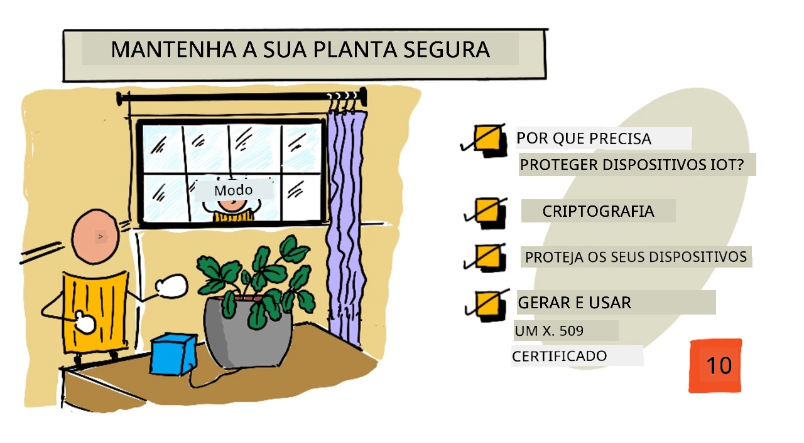
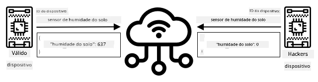
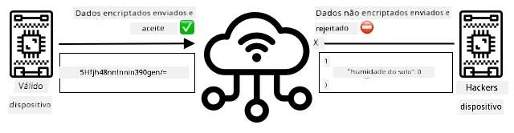
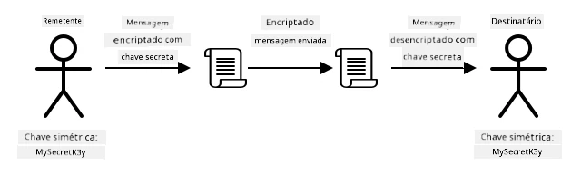
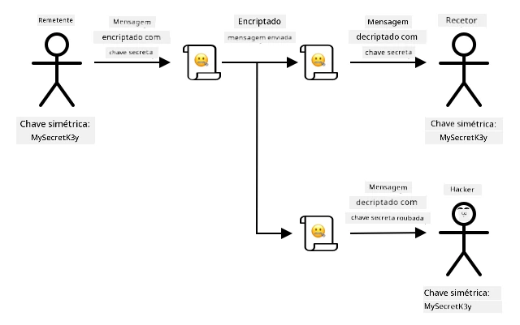
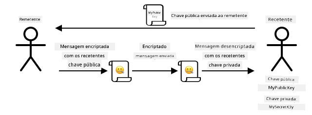
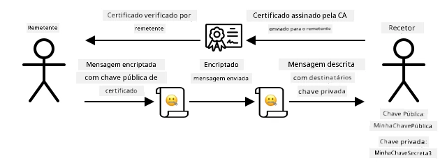

# Mantenha a sua planta segura



> Ilustração por [Nitya Narasimhan](https://github.com/nitya). Clique na imagem para uma versão maior.

## Questionário pré-aula

[Questionário pré-aula](https://black-meadow-040d15503.1.azurestaticapps.net/quiz/19)

## Introdução

Nas últimas lições, criou um dispositivo IoT para monitorização do solo e conectou-o à nuvem. Mas e se hackers a trabalhar para um agricultor rival conseguissem tomar controlo dos seus dispositivos IoT? E se eles enviassem leituras de humidade do solo muito altas para que as suas plantas nunca fossem regadas, ou ligassem o sistema de rega continuamente, matando as plantas por excesso de água e gerando custos elevados com água?

Nesta lição, aprenderá a proteger dispositivos IoT. Como esta é a última lição deste projeto, também aprenderá a limpar os seus recursos na nuvem, reduzindo potenciais custos.

Nesta lição, abordaremos:

* [Por que é necessário proteger dispositivos IoT?](../../../../../2-farm/lessons/6-keep-your-plant-secure)
* [Criptografia](../../../../../2-farm/lessons/6-keep-your-plant-secure)
* [Proteja os seus dispositivos IoT](../../../../../2-farm/lessons/6-keep-your-plant-secure)
* [Gerar e usar um certificado X.509](../../../../../2-farm/lessons/6-keep-your-plant-secure)

> 🗑 Esta é a última lição deste projeto, por isso, após concluir esta lição e o exercício, não se esqueça de limpar os seus serviços na nuvem. Precisará dos serviços para concluir o exercício, por isso certifique-se de o fazer primeiro.
>
> Consulte [o guia para limpar o seu projeto](../../../clean-up.md) se necessário, para obter instruções sobre como fazê-lo.

## Por que é necessário proteger dispositivos IoT?

A segurança em IoT envolve garantir que apenas dispositivos esperados possam conectar-se ao seu serviço IoT na nuvem e enviar telemetria, e que apenas o seu serviço na nuvem possa enviar comandos aos seus dispositivos. Os dados de IoT também podem ser pessoais, incluindo informações médicas ou íntimas, por isso toda a aplicação precisa considerar a segurança para evitar que esses dados sejam expostos.

Se a sua aplicação IoT não for segura, existem vários riscos:

* Um dispositivo falso pode enviar dados incorretos, fazendo com que a sua aplicação responda de forma errada. Por exemplo, podem enviar leituras constantes de alta humidade do solo, o que significa que o sistema de irrigação nunca será ativado e as suas plantas morrerão por falta de água.
* Utilizadores não autorizados podem ler dados de dispositivos IoT, incluindo dados pessoais ou críticos para o negócio.
* Hackers podem enviar comandos para controlar um dispositivo de forma a causar danos ao dispositivo ou ao hardware conectado.
* Ao conectar-se a um dispositivo IoT, hackers podem usar isso para aceder a redes adicionais e obter acesso a sistemas privados.
* Utilizadores mal-intencionados podem aceder a dados pessoais e usá-los para chantagem.

Estes são cenários do mundo real e acontecem frequentemente. Alguns exemplos foram dados em lições anteriores, mas aqui estão mais alguns:

* Em 2018, hackers usaram um ponto de acesso WiFi aberto num termóstato de aquário para aceder à rede de um casino e roubar dados. [The Hacker News - Casino Gets Hacked Through Its Internet-Connected Fish Tank Thermometer](https://thehackernews.com/2018/04/iot-hacking-thermometer.html)
* Em 2016, o Mirai Botnet lançou um ataque de negação de serviço contra a Dyn, um fornecedor de serviços de Internet, derrubando grandes partes da Internet. Este botnet usou malware para conectar-se a dispositivos IoT, como DVRs e câmaras, que usavam nomes de utilizador e senhas padrão, e a partir daí lançou o ataque. [The Guardian - DDoS attack that disrupted internet was largest of its kind in history, experts say](https://www.theguardian.com/technology/2016/oct/26/ddos-attack-dyn-mirai-botnet)
* A Spiral Toys tinha uma base de dados de utilizadores dos seus brinquedos conectados CloudPets disponível publicamente na Internet. [Troy Hunt - Data from connected CloudPets teddy bears leaked and ransomed, exposing kids' voice messages](https://www.troyhunt.com/data-from-connected-cloudpets-teddy-bears-leaked-and-ransomed-exposing-kids-voice-messages/).
* A Strava identificava corredores que passavam por si e mostrava as suas rotas, permitindo que estranhos vissem onde você mora. [Kim Komando - Fitness app could lead a stranger right to your home — change this setting](https://www.komando.com/security-privacy/strava-fitness-app-privacy/755349/).

✅ Faça uma pesquisa: Procure mais exemplos de ataques e violações de dados em IoT, especialmente com itens pessoais, como escovas de dentes ou balanças conectadas à Internet. Pense no impacto que esses ataques podem ter nas vítimas ou clientes.

> 💁 A segurança é um tópico vasto, e esta lição abordará apenas alguns dos conceitos básicos relacionados com a conexão do seu dispositivo à nuvem. Outros tópicos que não serão abordados incluem monitorização de alterações de dados em trânsito, hacking direto de dispositivos ou alterações nas configurações dos dispositivos. O hacking de IoT é uma ameaça tão grande que ferramentas como [Azure Defender for IoT](https://azure.microsoft.com/services/azure-defender-for-iot/?WT.mc_id=academic-17441-jabenn) foram desenvolvidas. Estas ferramentas são semelhantes aos antivírus e ferramentas de segurança que pode ter no seu computador, mas projetadas para dispositivos IoT pequenos e de baixo consumo.

## Criptografia

Quando um dispositivo conecta-se a um serviço IoT, ele usa um ID para se identificar. O problema é que este ID pode ser clonado - um hacker pode configurar um dispositivo malicioso que usa o mesmo ID de um dispositivo real, mas envia dados falsos.



A solução para isso é converter os dados enviados num formato codificado, usando um valor conhecido apenas pelo dispositivo e pela nuvem para codificar os dados. Este processo é chamado de *encriptação*, e o valor usado para encriptar os dados é chamado de *chave de encriptação*.



O serviço na nuvem pode então converter os dados de volta para um formato legível, usando um processo chamado *desencriptação*, utilizando a mesma chave de encriptação ou uma *chave de desencriptação*. Se a mensagem encriptada não puder ser desencriptada pela chave, o dispositivo foi hackeado e a mensagem é rejeitada.

A técnica para realizar encriptação e desencriptação é chamada de *criptografia*.

### Criptografia antiga

Os primeiros tipos de criptografia eram cifras de substituição, datando de 3.500 anos atrás. As cifras de substituição envolvem substituir uma letra por outra. Por exemplo, a [cifra de César](https://wikipedia.org/wiki/Caesar_cipher) envolve deslocar o alfabeto por uma quantidade definida, sendo que apenas o remetente da mensagem encriptada e o destinatário pretendido sabem quantas letras deslocar.

A [cifra de Vigenère](https://wikipedia.org/wiki/Vigenère_cipher) levou isso mais longe, usando palavras para encriptar texto, de forma que cada letra no texto original fosse deslocada por uma quantidade diferente, em vez de sempre deslocar pelo mesmo número de letras.

A criptografia foi usada para uma ampla gama de propósitos, como proteger receitas de esmalte de cerâmica na antiga Mesopotâmia, escrever bilhetes de amor secretos na Índia ou manter feitiços mágicos egípcios em segredo.

### Criptografia moderna

A criptografia moderna é muito mais avançada, tornando-a mais difícil de decifrar do que os métodos antigos. A criptografia moderna usa matemática complexa para encriptar dados, com um número de chaves possíveis tão grande que ataques de força bruta tornam-se inviáveis.

A criptografia é usada de várias formas para comunicações seguras. Se está a ler esta página no GitHub, pode notar que o endereço do site começa com *HTTPS*, o que significa que a comunicação entre o seu navegador e os servidores do GitHub está encriptada. Se alguém conseguisse ler o tráfego da Internet entre o seu navegador e o GitHub, não conseguiria ler os dados, pois estão encriptados. O seu computador pode até encriptar todos os dados no disco rígido, para que, se alguém o roubar, não consiga ler os seus dados sem a sua palavra-passe.

> 🎓 HTTPS significa HyperText Transfer Protocol **Secure**

Infelizmente, nem tudo é seguro. Alguns dispositivos não têm segurança, outros são protegidos com chaves fáceis de decifrar, ou às vezes todos os dispositivos do mesmo tipo usam a mesma chave. Há relatos de dispositivos IoT muito pessoais que têm a mesma palavra-passe para se conectarem via WiFi ou Bluetooth. Se consegue conectar-se ao seu próprio dispositivo, pode conectar-se ao de outra pessoa. Uma vez conectado, pode aceder a dados muito privados ou controlar o dispositivo de outra pessoa.

> 💁 Apesar da complexidade da criptografia moderna e das alegações de que quebrar a encriptação pode levar bilhões de anos, o avanço da computação quântica trouxe a possibilidade de quebrar toda a encriptação conhecida em muito pouco tempo!

### Chaves simétricas e assimétricas

A encriptação pode ser de dois tipos - simétrica e assimétrica.

A encriptação **simétrica** usa a mesma chave para encriptar e desencriptar os dados. Tanto o remetente quanto o destinatário precisam conhecer a mesma chave. Este é o tipo menos seguro, pois a chave precisa ser partilhada de alguma forma. Para que um remetente envie uma mensagem encriptada a um destinatário, o remetente pode primeiro ter que enviar a chave ao destinatário.



Se a chave for roubada durante o envio, ou se o remetente ou destinatário forem hackeados e a chave for descoberta, a encriptação pode ser comprometida.



A encriptação **assimétrica** usa 2 chaves - uma chave de encriptação e uma chave de desencriptação, conhecidas como par de chaves pública/privada. A chave pública é usada para encriptar a mensagem, mas não pode ser usada para desencriptá-la; a chave privada é usada para desencriptar a mensagem, mas não pode ser usada para encriptá-la.



O destinatário partilha a sua chave pública, e o remetente usa-a para encriptar a mensagem. Depois de enviada, o destinatário desencripta-a com a sua chave privada. A encriptação assimétrica é mais segura, pois a chave privada é mantida em segredo pelo destinatário e nunca é partilhada. Qualquer pessoa pode ter a chave pública, pois ela só pode ser usada para encriptar mensagens.

A encriptação simétrica é mais rápida do que a assimétrica, mas a assimétrica é mais segura. Alguns sistemas usam ambas - utilizam a encriptação assimétrica para encriptar e partilhar a chave simétrica, e depois usam a chave simétrica para encriptar todos os dados. Isso torna mais seguro partilhar a chave simétrica entre remetente e destinatário, e mais rápido encriptar e desencriptar os dados.

## Proteja os seus dispositivos IoT

Os dispositivos IoT podem ser protegidos usando encriptação simétrica ou assimétrica. A simétrica é mais fácil, mas menos segura.

### Chaves simétricas

Quando configurou o seu dispositivo IoT para interagir com o IoT Hub, utilizou uma string de conexão. Um exemplo de string de conexão é:

```output
HostName=soil-moisture-sensor.azure-devices.net;DeviceId=soil-moisture-sensor;SharedAccessKey=Bhry+ind7kKEIDxubK61RiEHHRTrPl7HUow8cEm/mU0=
```

Esta string de conexão é composta por três partes separadas por ponto e vírgula, com cada parte sendo uma chave e um valor:

| Chave | Valor | Descrição |
| --- | ----- | ----------- |
| HostName | `soil-moisture-sensor.azure-devices.net` | O URL do IoT Hub |
| DeviceId | `soil-moisture-sensor` | O ID único do dispositivo |
| SharedAccessKey | `Bhry+ind7kKEIDxubK61RiEHHRTrPl7HUow8cEm/mU0=` | Uma chave simétrica conhecida pelo dispositivo e pelo IoT Hub |

A última parte desta string de conexão, o `SharedAccessKey`, é a chave simétrica conhecida tanto pelo dispositivo quanto pelo IoT Hub. Esta chave nunca é enviada do dispositivo para a nuvem, nem da nuvem para o dispositivo. Em vez disso, é usada para encriptar os dados enviados ou recebidos.

✅ Faça uma experiência. O que acha que acontecerá se alterar a parte `SharedAccessKey` da string de conexão ao conectar o seu dispositivo IoT? Experimente.

Quando o dispositivo tenta conectar-se pela primeira vez, ele envia um token de assinatura de acesso partilhado (SAS) que consiste no URL do IoT Hub, um carimbo de data/hora indicando quando a assinatura de acesso expirará (geralmente 1 dia a partir do momento atual) e uma assinatura. Esta assinatura consiste no URL e no tempo de expiração encriptados com a chave de acesso partilhada da string de conexão.

O IoT Hub desencripta esta assinatura com a chave de acesso partilhada e, se o valor desencriptado corresponder ao URL e à expiração, o dispositivo é autorizado a conectar-se. Ele também verifica se o horário atual é anterior à expiração, para impedir que um dispositivo malicioso capture o token SAS de um dispositivo real e o utilize.

Esta é uma forma elegante de verificar se o remetente é o dispositivo correto. Ao enviar alguns dados conhecidos tanto em forma desencriptada quanto encriptada, o servidor pode verificar o dispositivo garantindo que, ao desencriptar os dados encriptados, o resultado corresponde à versão desencriptada enviada. Se corresponder, então tanto o remetente quanto o destinatário possuem a mesma chave de encriptação simétrica.
💁 Devido ao tempo de expiração, o seu dispositivo IoT precisa saber a hora exata, geralmente obtida de um servidor [NTP](https://wikipedia.org/wiki/Network_Time_Protocol). Se a hora não estiver correta, a ligação falhará.
Após a conexão, todos os dados enviados para o IoT Hub a partir do dispositivo, ou para o dispositivo a partir do IoT Hub, serão encriptados com a chave de acesso partilhada.

✅ O que acha que acontecerá se vários dispositivos partilharem a mesma string de conexão?

> 💁 Não é uma boa prática de segurança armazenar esta chave no código. Se um hacker obtiver o seu código-fonte, poderá aceder à sua chave. Além disso, torna-se mais difícil ao lançar o código, pois seria necessário recompilar com uma chave atualizada para cada dispositivo. É melhor carregar esta chave a partir de um módulo de segurança de hardware - um chip no dispositivo IoT que armazena valores encriptados que podem ser lidos pelo seu código.
>
> Quando está a aprender IoT, muitas vezes é mais fácil colocar a chave no código, como fez numa lição anterior, mas deve garantir que esta chave não seja incluída num controlo de código-fonte público.

Os dispositivos têm 2 chaves e 2 strings de conexão correspondentes. Isto permite rodar as chaves - ou seja, alternar de uma chave para outra caso a primeira seja comprometida, e gerar novamente a primeira chave.

### Certificados X.509

Quando utiliza encriptação assimétrica com um par de chaves pública/privada, precisa de fornecer a sua chave pública a quem quiser enviar-lhe dados. O problema é: como é que o destinatário da sua chave pode ter a certeza de que é realmente a sua chave pública e não de alguém a fingir ser você? Em vez de fornecer uma chave, pode fornecer a sua chave pública dentro de um certificado que foi verificado por uma terceira parte confiável, chamado certificado X.509.

Os certificados X.509 são documentos digitais que contêm a parte pública do par de chaves pública/privada. Normalmente, são emitidos por uma das várias organizações confiáveis chamadas [Autoridades de Certificação](https://wikipedia.org/wiki/Certificate_authority) (CAs) e assinados digitalmente pela CA para indicar que a chave é válida e vem de si. Confia no certificado e na chave pública porque confia na CA, de forma semelhante a como confiaria num passaporte ou carta de condução porque confia no país que os emitiu. Os certificados têm um custo, mas também pode "auto-assinar", ou seja, criar um certificado você mesmo e assiná-lo para fins de teste.

> 💁 Nunca deve usar um certificado auto-assinado numa versão de produção.

Estes certificados têm vários campos, incluindo quem é o proprietário da chave pública, os detalhes da CA que o emitiu, o período de validade e a própria chave pública. Antes de usar um certificado, é uma boa prática verificá-lo, confirmando que foi assinado pela CA original.

✅ Pode consultar uma lista completa dos campos do certificado no [tutorial da Microsoft sobre Certificados de Chave Pública X.509](https://docs.microsoft.com/azure/iot-hub/tutorial-x509-certificates?WT.mc_id=academic-17441-jabenn#certificate-fields)

Ao usar certificados X.509, tanto o remetente quanto o destinatário terão as suas próprias chaves públicas e privadas, bem como certificados X.509 que contêm as chaves públicas. Eles trocam os certificados X.509 de alguma forma, usando as chaves públicas um do outro para encriptar os dados que enviam e as suas próprias chaves privadas para desencriptar os dados que recebem.



Uma grande vantagem de usar certificados X.509 é que podem ser partilhados entre dispositivos. Pode criar um certificado, carregá-lo para o IoT Hub e usá-lo para todos os seus dispositivos. Cada dispositivo só precisa de conhecer a chave privada para desencriptar as mensagens que recebe do IoT Hub.

O certificado usado pelo seu dispositivo para encriptar mensagens enviadas para o IoT Hub é publicado pela Microsoft. É o mesmo certificado que muitos serviços do Azure utilizam e, por vezes, está integrado nos SDKs.

> 💁 Lembre-se, uma chave pública é exatamente isso - pública. A chave pública do Azure só pode ser usada para encriptar dados enviados para o Azure, não para os desencriptar, por isso pode ser partilhada em qualquer lugar, incluindo no código-fonte. Por exemplo, pode vê-la no [código-fonte do SDK C do Azure IoT](https://github.com/Azure/azure-iot-sdk-c/blob/master/certs/certs.c).

✅ Há muitos termos técnicos associados aos certificados X.509. Pode consultar as definições de alguns dos termos que poderá encontrar no [Guia simplificado sobre o jargão dos certificados X.509](https://techcommunity.microsoft.com/t5/internet-of-things/the-layman-s-guide-to-x-509-certificate-jargon/ba-p/2203540?WT.mc_id=academic-17441-jabenn)

## Gerar e usar um certificado X.509

Os passos para gerar um certificado X.509 são:

1. Criar um par de chaves pública/privada. Um dos algoritmos mais amplamente utilizados para gerar um par de chaves pública/privada é chamado [Rivest–Shamir–Adleman](https://wikipedia.org/wiki/RSA_(cryptosystem)) (RSA).

1. Submeter a chave pública com os dados associados para assinatura, seja por uma CA ou por auto-assinatura.

O Azure CLI tem comandos para criar uma nova identidade de dispositivo no IoT Hub, gerar automaticamente o par de chaves pública/privada e criar um certificado auto-assinado.

> 💁 Se quiser ver os passos em detalhe, em vez de usar o Azure CLI, pode encontrá-los no [tutorial sobre como usar o OpenSSL para criar certificados auto-assinados na documentação do Microsoft IoT Hub](https://docs.microsoft.com/azure/iot-hub/tutorial-x509-self-sign?WT.mc_id=academic-17441-jabenn)

### Tarefa - criar uma identidade de dispositivo usando um certificado X.509

1. Execute o seguinte comando para registar a nova identidade de dispositivo, gerando automaticamente as chaves e os certificados:

    ```sh
    az iot hub device-identity create --device-id soil-moisture-sensor-x509 \
                                      --am x509_thumbprint \
                                      --output-dir . \
                                      --hub-name <hub_name>
    ```

    Substitua `<hub_name>` pelo nome que utilizou para o seu IoT Hub.

    Isto criará um dispositivo com o ID `soil-moisture-sensor-x509` para o distinguir da identidade de dispositivo que criou na última lição. Este comando também criará 2 ficheiros no diretório atual:

    * `soil-moisture-sensor-x509-key.pem` - este ficheiro contém a chave privada do dispositivo.
    * `soil-moisture-sensor-x509-cert.pem` - este é o ficheiro de certificado X.509 do dispositivo.

    Guarde estes ficheiros em segurança! O ficheiro da chave privada não deve ser incluído num controlo de código-fonte público.

### Tarefa - usar o certificado X.509 no código do seu dispositivo

Siga o guia relevante para conectar o seu dispositivo IoT à cloud usando o certificado X.509:

* [Arduino - Wio Terminal](wio-terminal-x509.md)
* [Computador de placa única - Raspberry Pi/Dispositivo IoT Virtual](single-board-computer-x509.md)

---

## 🚀 Desafio

Existem várias formas de criar, gerir e eliminar serviços Azure, como Grupos de Recursos e IoT Hubs. Uma delas é o [Azure Portal](https://portal.azure.com?WT.mc_id=academic-17441-jabenn) - uma interface web que oferece um GUI para gerir os seus serviços Azure.

Aceda a [portal.azure.com](https://portal.azure.com?WT.mc_id=academic-17441-jabenn) e explore o portal. Veja se consegue criar um IoT Hub através do portal e, em seguida, eliminá-lo.

**Dica** - ao criar serviços através do portal, não precisa de criar um Grupo de Recursos antecipadamente, pode criá-lo durante a criação do serviço. Certifique-se de que o elimina quando terminar!

Pode encontrar muita documentação, tutoriais e guias sobre o Azure Portal na [documentação do Azure Portal](https://docs.microsoft.com/azure/azure-portal/?WT.mc_id=academic-17441-jabenn).

## Questionário pós-aula

[Questionário pós-aula](https://black-meadow-040d15503.1.azurestaticapps.net/quiz/20)

## Revisão e Estudo Individual

* Leia sobre a história da criptografia na [página da História da Criptografia na Wikipedia](https://wikipedia.org/wiki/History_of_cryptography).
* Leia sobre certificados X.509 na [página X.509 na Wikipedia](https://wikipedia.org/wiki/X.509).

## Tarefa

[Crie um novo dispositivo IoT](assignment.md)

**Aviso Legal**:  
Este documento foi traduzido utilizando o serviço de tradução por IA [Co-op Translator](https://github.com/Azure/co-op-translator). Embora nos esforcemos para garantir a precisão, é importante notar que traduções automáticas podem conter erros ou imprecisões. O documento original na sua língua nativa deve ser considerado a fonte autoritária. Para informações críticas, recomenda-se a tradução profissional realizada por humanos. Não nos responsabilizamos por quaisquer mal-entendidos ou interpretações incorretas decorrentes da utilização desta tradução.