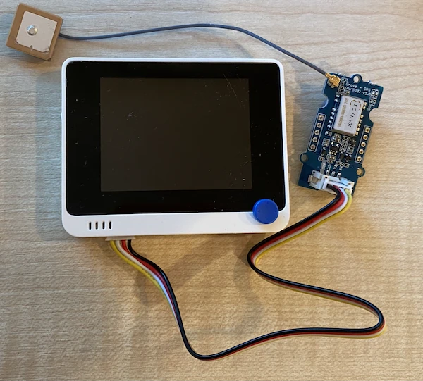

# Ler dados de GPS - Wio Terminal

Nesta parte da lição, irá adicionar um sensor GPS ao seu Wio Terminal e ler os valores obtidos.

## Hardware

O Wio Terminal necessita de um sensor GPS.

O sensor que irá utilizar é o [sensor Grove GPS Air530](https://www.seeedstudio.com/Grove-GPS-Air530-p-4584.html). Este sensor pode conectar-se a múltiplos sistemas GPS para obter uma localização rápida e precisa. O sensor é composto por 2 partes - a eletrónica principal do sensor e uma antena externa conectada por um fio fino para captar as ondas de rádio dos satélites.

Este é um sensor UART, o que significa que envia dados GPS através de UART.

### Conectar o sensor GPS

O sensor Grove GPS pode ser conectado ao Wio Terminal.

#### Tarefa - conectar o sensor GPS

Conecte o sensor GPS.


1. Insira uma extremidade de um cabo Grove na entrada do sensor GPS. O cabo só encaixa de uma forma.

1. Com o Wio Terminal desconectado do seu computador ou de outra fonte de energia, conecte a outra extremidade do cabo Grove à entrada Grove do lado esquerdo do Wio Terminal, olhando para o ecrã. Esta é a entrada mais próxima do botão de energia.

    

1. Posicione o sensor GPS de forma que a antena conectada tenha visibilidade para o céu - idealmente próximo de uma janela aberta ou no exterior. É mais fácil obter um sinal claro sem obstruções à antena.

1. Agora pode conectar o Wio Terminal ao seu computador.

1. O sensor GPS tem 2 LEDs - um LED azul que pisca quando os dados são transmitidos e um LED verde que pisca a cada segundo ao receber dados dos satélites. Certifique-se de que o LED azul está a piscar quando ligar o Wio Terminal. Após alguns minutos, o LED verde começará a piscar - se não, pode ser necessário reposicionar a antena.

## Programar o sensor GPS

O Wio Terminal pode agora ser programado para utilizar o sensor GPS conectado.

### Tarefa - programar o sensor GPS

Programe o dispositivo.

1. Crie um novo projeto Wio Terminal utilizando o PlatformIO. Chame este projeto `gps-sensor`. Adicione código na função `setup` para configurar a porta serial.

1. Adicione a seguinte diretiva de inclusão no topo do ficheiro `main.cpp`. Isto inclui um ficheiro de cabeçalho com funções para configurar a entrada Grove do lado esquerdo para UART.

    ```cpp
    #include <wiring_private.h>
    ```

1. Abaixo disso, adicione a seguinte linha de código para declarar uma conexão de porta serial para a porta UART:

    ```cpp
    static Uart Serial3(&sercom3, PIN_WIRE_SCL, PIN_WIRE_SDA, SERCOM_RX_PAD_1, UART_TX_PAD_0);
    ```

1. É necessário adicionar algum código para redirecionar alguns manipuladores de sinal internos para esta porta serial. Adicione o seguinte código abaixo da declaração `Serial3`:

    ```cpp
    void SERCOM3_0_Handler()
    {
        Serial3.IrqHandler();
    }
    
    void SERCOM3_1_Handler()
    {
        Serial3.IrqHandler();
    }
    
    void SERCOM3_2_Handler()
    {
        Serial3.IrqHandler();
    }
    
    void SERCOM3_3_Handler()
    {
        Serial3.IrqHandler();
    }
    ```

1. Na função `setup`, abaixo da configuração da porta `Serial`, configure a porta serial UART com o seguinte código:

    ```cpp
    Serial3.begin(9600);

    while (!Serial3)
        ; // Wait for Serial3 to be ready

    delay(1000);
    ```

1. Abaixo deste código na função `setup`, adicione o seguinte código para conectar o pino Grove à porta serial:

    ```cpp
    pinPeripheral(PIN_WIRE_SCL, PIO_SERCOM_ALT);
    ```

1. Adicione a seguinte função antes da função `loop` para enviar os dados do GPS para o monitor serial:

    ```cpp
    void printGPSData()
    {
        Serial.println(Serial3.readStringUntil('\n'));
    }
    ```

1. Na função `loop`, adicione o seguinte código para ler da porta serial UART e imprimir a saída no monitor serial:

    ```cpp
    while (Serial3.available() > 0)
    {
        printGPSData();
    }
    
    delay(1000);
    ```

    Este código lê da porta serial UART. A função `readStringUntil` lê até encontrar um carácter terminador, neste caso uma nova linha. Isto irá ler uma frase completa em formato NMEA (as frases NMEA terminam com um carácter de nova linha). Enquanto houver dados para ler da porta serial UART, estes são lidos e enviados para o monitor serial através da função `printGPSData`. Quando não houver mais dados para ler, o `loop` faz uma pausa de 1 segundo (1.000ms).

1. Compile e carregue o código no Wio Terminal.

1. Após o carregamento, pode monitorizar os dados do GPS utilizando o monitor serial.

    ```output
    > Executing task: platformio device monitor <
    
    --- Available filters and text transformations: colorize, debug, default, direct, hexlify, log2file, nocontrol, printable, send_on_enter, time
    --- More details at http://bit.ly/pio-monitor-filters
    --- Miniterm on /dev/cu.usbmodem1201  9600,8,N,1 ---
    --- Quit: Ctrl+C | Menu: Ctrl+T | Help: Ctrl+T followed by Ctrl+H ---
    $GNGGA,020604.001,4738.538654,N,12208.341758,W,1,3,,164.7,M,-17.1,M,,*67
    $GPGSA,A,1,,,,,,,,,,,,,,,*1E
    $BDGSA,A,1,,,,,,,,,,,,,,,*0F
    $GPGSV,1,1,00*79
    $BDGSV,1,1,00*68
    ```

> 💁 Pode encontrar este código na pasta [code-gps/wio-terminal](../../../../../3-transport/lessons/1-location-tracking/code-gps/wio-terminal).

😀 O seu programa para o sensor GPS foi um sucesso!

**Aviso Legal**:  
Este documento foi traduzido utilizando o serviço de tradução por IA [Co-op Translator](https://github.com/Azure/co-op-translator). Embora nos esforcemos para garantir a precisão, é importante notar que traduções automáticas podem conter erros ou imprecisões. O documento original na sua língua nativa deve ser considerado a fonte autoritária. Para informações críticas, recomenda-se a tradução profissional realizada por humanos. Não nos responsabilizamos por quaisquer mal-entendidos ou interpretações incorretas decorrentes do uso desta tradução.