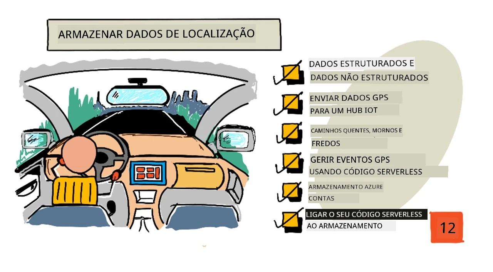
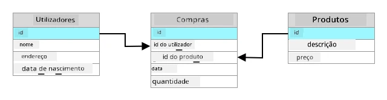
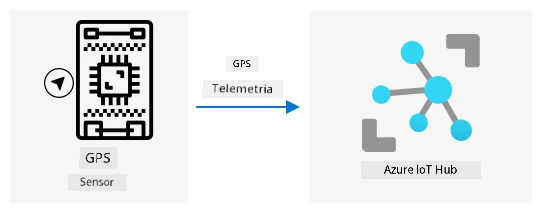
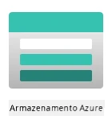
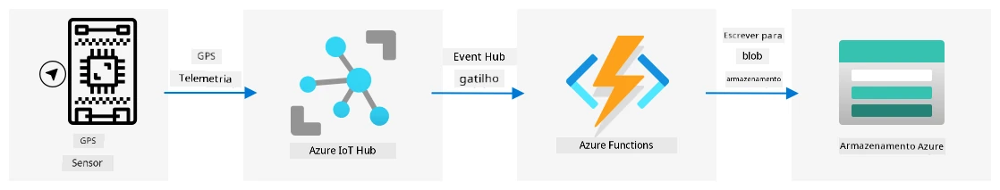

# Dados de localização da loja



> Ilustração por [Nitya Narasimhan](https://github.com/nitya). Clique na imagem para uma versão maior.

## Questionário pré-aula

[Questionário pré-aula](https://black-meadow-040d15503.1.azurestaticapps.net/quiz/23)

## Introdução

Na última lição, aprendeste a usar um sensor GPS para capturar dados de localização. Para utilizar esses dados e visualizar a localização de um camião carregado de alimentos e a sua jornada, é necessário enviá-los para um serviço IoT na nuvem e armazená-los em algum lugar.

Nesta lição, vais aprender sobre as diferentes formas de armazenar dados IoT e como armazenar dados do teu serviço IoT utilizando código sem servidor.

Nesta lição, abordaremos:

* [Dados estruturados e não estruturados](../../../../../3-transport/lessons/2-store-location-data)
* [Enviar dados GPS para um IoT Hub](../../../../../3-transport/lessons/2-store-location-data)
* [Caminhos quente, morno e frio](../../../../../3-transport/lessons/2-store-location-data)
* [Lidar com eventos GPS usando código sem servidor](../../../../../3-transport/lessons/2-store-location-data)
* [Contas de armazenamento Azure](../../../../../3-transport/lessons/2-store-location-data)
* [Conectar o teu código sem servidor ao armazenamento](../../../../../3-transport/lessons/2-store-location-data)

## Dados estruturados e não estruturados

Os sistemas informáticos lidam com dados, e esses dados podem ter diferentes formas e tamanhos. Podem variar de números simples a grandes quantidades de texto, vídeos e imagens, e até dados IoT. Os dados geralmente podem ser divididos em duas categorias: *dados estruturados* e *dados não estruturados*.

* **Dados estruturados** são dados com uma estrutura bem definida e rígida que não muda e geralmente se mapeiam para tabelas de dados com relações. Um exemplo é os detalhes de uma pessoa, incluindo o nome, data de nascimento e morada.

* **Dados não estruturados** são dados sem uma estrutura bem definida e rígida, incluindo dados que podem mudar de estrutura frequentemente. Um exemplo são documentos como textos escritos ou folhas de cálculo.

✅ Faz uma pesquisa: Consegues pensar noutros exemplos de dados estruturados e não estruturados?

> 💁 Também existem dados semi-estruturados que são estruturados, mas não se encaixam em tabelas fixas de dados.

Os dados IoT geralmente são considerados dados não estruturados.

Imagina que estás a adicionar dispositivos IoT a uma frota de veículos de uma grande exploração agrícola comercial. Poderias querer usar dispositivos diferentes para diferentes tipos de veículos. Por exemplo:

* Para veículos agrícolas como tratores, queres dados GPS para garantir que estão a trabalhar nos campos corretos.
* Para camiões de entrega que transportam alimentos para armazéns, queres dados GPS, bem como dados de velocidade e aceleração para garantir que o motorista está a conduzir de forma segura, além de dados de identidade do motorista e início/paragem para garantir conformidade com as leis locais sobre horas de trabalho.
* Para camiões refrigerados, também queres dados de temperatura para garantir que os alimentos não ficam demasiado quentes ou frios e estragam durante o transporte.

Esses dados podem mudar constantemente. Por exemplo, se o dispositivo IoT estiver na cabine de um camião, os dados enviados podem mudar conforme o reboque muda, enviando dados de temperatura apenas quando um reboque refrigerado é usado.

✅ Que outros dados IoT poderiam ser capturados? Pensa nos tipos de cargas que os camiões podem transportar, bem como nos dados de manutenção.

Esses dados variam de veículo para veículo, mas todos são enviados para o mesmo serviço IoT para processamento. O serviço IoT precisa ser capaz de processar esses dados não estruturados, armazenando-os de forma que possam ser pesquisados ou analisados, mas que funcione com diferentes estruturas desses dados.

### Armazenamento SQL vs NoSQL

Bases de dados são serviços que permitem armazenar e consultar dados. As bases de dados podem ser de dois tipos: SQL e NoSQL.

#### Bases de dados SQL

As primeiras bases de dados foram Sistemas de Gestão de Bases de Dados Relacionais (RDBMS), ou bases de dados relacionais. Estas também são conhecidas como bases de dados SQL devido à Linguagem de Consulta Estruturada (SQL) usada para interagir com elas para adicionar, remover, atualizar ou consultar dados. Estas bases de dados consistem num esquema - um conjunto bem definido de tabelas de dados, semelhante a uma folha de cálculo. Cada tabela tem várias colunas nomeadas. Quando inseres dados, adicionas uma linha à tabela, colocando valores em cada uma das colunas. Isso mantém os dados numa estrutura muito rígida - embora possas deixar colunas vazias, se quiseres adicionar uma nova coluna, tens de fazer isso na base de dados, preenchendo valores para as linhas existentes. Estas bases de dados são relacionais - uma tabela pode ter uma relação com outra.



Por exemplo, se armazenares os detalhes pessoais de um utilizador numa tabela, terás algum tipo de ID único interno por utilizador que é usado numa linha numa tabela que contém o nome e a morada do utilizador. Se quiseres armazenar outros detalhes sobre esse utilizador, como as suas compras, noutra tabela, terás uma coluna na nova tabela para o ID desse utilizador. Quando procuras um utilizador, podes usar o ID para obter os seus detalhes pessoais de uma tabela e as suas compras de outra.

Bases de dados SQL são ideais para armazenar dados estruturados e para quando queres garantir que os dados correspondem ao teu esquema.

✅ Se nunca usaste SQL antes, tira um momento para ler sobre isso na [página de SQL na Wikipedia](https://wikipedia.org/wiki/SQL).

Algumas bases de dados SQL conhecidas são Microsoft SQL Server, MySQL e PostgreSQL.

✅ Faz uma pesquisa: Lê sobre algumas dessas bases de dados SQL e as suas capacidades.

#### Bases de dados NoSQL

Bases de dados NoSQL são chamadas NoSQL porque não têm a mesma estrutura rígida das bases de dados SQL. Também são conhecidas como bases de dados de documentos, pois podem armazenar dados não estruturados, como documentos.

> 💁 Apesar do nome, algumas bases de dados NoSQL permitem usar SQL para consultar os dados.


Bases de dados NoSQL não têm um esquema pré-definido que limite como os dados são armazenados; em vez disso, podes inserir qualquer dado não estruturado, geralmente usando documentos JSON. Esses documentos podem ser organizados em pastas, semelhante a ficheiros no teu computador. Cada documento pode ter campos diferentes de outros documentos - por exemplo, se estivesses a armazenar dados IoT dos teus veículos agrícolas, alguns poderiam ter campos para dados de acelerómetro e velocidade, outros poderiam ter campos para a temperatura no reboque. Se adicionasses um novo tipo de camião, como um com balanças integradas para rastrear o peso dos produtos transportados, o teu dispositivo IoT poderia adicionar este novo campo e ele poderia ser armazenado sem alterações na base de dados.

Algumas bases de dados NoSQL conhecidas incluem Azure CosmosDB, MongoDB e CouchDB.

✅ Faz uma pesquisa: Lê sobre algumas dessas bases de dados NoSQL e as suas capacidades.

Nesta lição, vais usar armazenamento NoSQL para armazenar dados IoT.

## Enviar dados GPS para um IoT Hub

Na última lição, capturaste dados GPS de um sensor GPS conectado ao teu dispositivo IoT. Para armazenar esses dados IoT na nuvem, precisas enviá-los para um serviço IoT. Mais uma vez, vais usar o Azure IoT Hub, o mesmo serviço IoT na nuvem que usaste no projeto anterior.



### Tarefa - enviar dados GPS para um IoT Hub

1. Cria um novo IoT Hub usando o nível gratuito.

    > ⚠️ Podes consultar as [instruções para criar um IoT Hub do projeto 2, lição 4](../../../2-farm/lessons/4-migrate-your-plant-to-the-cloud/README.md#create-an-iot-service-in-the-cloud) se necessário.

    Lembra-te de criar um novo Grupo de Recursos. Nomeia o novo Grupo de Recursos como `gps-sensor` e o novo IoT Hub com um nome único baseado em `gps-sensor`, como `gps-sensor-<teu nome>`.

    > 💁 Se ainda tiveres o teu IoT Hub do projeto anterior, podes reutilizá-lo. Lembra-te de usar o nome deste IoT Hub e o Grupo de Recursos em que está ao criar outros serviços.

1. Adiciona um novo dispositivo ao IoT Hub. Chama este dispositivo `gps-sensor`. Obtém a string de conexão para o dispositivo.

1. Atualiza o código do teu dispositivo para enviar os dados GPS para o novo IoT Hub usando a string de conexão do dispositivo obtida no passo anterior.

    > ⚠️ Podes consultar as [instruções para conectar o teu dispositivo ao IoT do projeto 2, lição 4](../../../2-farm/lessons/4-migrate-your-plant-to-the-cloud/README.md#connect-your-device-to-the-iot-service) se necessário.

1. Quando enviares os dados GPS, faz isso em formato JSON no seguinte formato:

    ```json
    {
        "gps" :
        {
            "lat" : <latitude>,
            "lon" : <longitude>
        }
    }
    ```

1. Envia dados GPS a cada minuto para não ultrapassares a tua alocação diária de mensagens.

Se estiveres a usar o Wio Terminal, lembra-te de adicionar todas as bibliotecas necessárias e definir a hora usando um servidor NTP. O teu código também precisará garantir que leu todos os dados da porta serial antes de enviar a localização GPS, usando o código existente da última lição. Usa o seguinte código para construir o documento JSON:

```cpp
DynamicJsonDocument doc(1024);
doc["gps"]["lat"] = gps.location.lat();
doc["gps"]["lon"] = gps.location.lng();
```

Se estiveres a usar um dispositivo IoT virtual, lembra-te de instalar todas as bibliotecas necessárias usando um ambiente virtual.

Para o Raspberry Pi e o dispositivo IoT virtual, usa o código existente da última lição para obter os valores de latitude e longitude e, em seguida, envia-os no formato JSON correto com o seguinte código:

```python
message_json = { "gps" : { "lat":lat, "lon":lon } }
print("Sending telemetry", message_json)
message = Message(json.dumps(message_json))
```

> 💁 Podes encontrar este código na pasta [code/wio-terminal](../../../../../3-transport/lessons/2-store-location-data/code/wio-terminal), [code/pi](../../../../../3-transport/lessons/2-store-location-data/code/pi) ou [code/virtual-device](../../../../../3-transport/lessons/2-store-location-data/code/virtual-device).

Executa o código do teu dispositivo e garante que as mensagens estão a fluir para o IoT Hub usando o comando CLI `az iot hub monitor-events`.

## Caminhos quente, morno e frio

Os dados que fluem de um dispositivo IoT para a nuvem nem sempre são processados em tempo real. Alguns dados precisam de processamento em tempo real, outros podem ser processados pouco tempo depois, e outros podem ser processados muito mais tarde. O fluxo de dados para diferentes serviços que processam os dados em diferentes momentos é referido como caminhos quente, morno e frio.

### Caminho quente

O caminho quente refere-se a dados que precisam ser processados em tempo real ou quase em tempo real. Usarias dados do caminho quente para alertas, como receber notificações de que um veículo está a aproximar-se de um depósito ou que a temperatura num camião refrigerado está demasiado alta.

Para usar dados do caminho quente, o teu código responderia a eventos assim que fossem recebidos pelos teus serviços na nuvem.

### Caminho morno

O caminho morno refere-se a dados que podem ser processados pouco tempo depois de serem recebidos, por exemplo, para relatórios ou análises de curto prazo. Usarias dados do caminho morno para relatórios diários sobre a quilometragem dos veículos, usando dados recolhidos no dia anterior.

Os dados do caminho morno são armazenados assim que são recebidos pelo serviço na nuvem dentro de algum tipo de armazenamento que pode ser rapidamente acessado.

### Caminho frio

O caminho frio refere-se a dados históricos, armazenando dados a longo prazo para serem processados sempre que necessário. Por exemplo, poderias usar o caminho frio para obter relatórios anuais de quilometragem dos veículos ou realizar análises sobre rotas para encontrar a rota mais eficiente para reduzir custos de combustível.

Os dados do caminho frio são armazenados em armazéns de dados - bases de dados projetadas para armazenar grandes quantidades de dados que nunca mudam e podem ser consultados de forma rápida e fácil. Normalmente, terias uma tarefa regular na tua aplicação na nuvem que seria executada num horário regular, diariamente, semanalmente ou mensalmente, para mover dados do armazenamento do caminho morno para o armazém de dados.

✅ Pensa nos dados que capturaste até agora nestas lições. São dados do caminho quente, morno ou frio?

## Lidar com eventos GPS usando código sem servidor

Assim que os dados estiverem a fluir para o teu IoT Hub, podes escrever algum código sem servidor para ouvir eventos publicados no endpoint compatível com Event-Hub. Este é o caminho morno - esses dados serão armazenados e usados na próxima lição para relatórios sobre a jornada.


### Tarefa - lidar com eventos GPS usando código sem servidor

1. Cria uma aplicação Azure Functions usando o CLI do Azure Functions. Usa o runtime Python e cria-a numa pasta chamada `gps-trigger`, usando o mesmo nome para o nome do projeto da aplicação Functions. Certifica-te de criar um ambiente virtual para isso.
> ⚠️ Pode consultar as [instruções para criar um Projeto Azure Functions a partir do projeto 2, lição 5](../../../2-farm/lessons/5-migrate-application-to-the-cloud/README.md#create-a-serverless-application) se necessário.
1. Adicione um gatilho de evento do IoT Hub que utilize o endpoint compatível com Event Hub do IoT Hub.

    > ⚠️ Pode consultar as [instruções para criar um gatilho de evento do IoT Hub no projeto 2, lição 5](../../../2-farm/lessons/5-migrate-application-to-the-cloud/README.md#create-an-iot-hub-event-trigger) se necessário.

1. Defina a string de conexão do endpoint compatível com Event Hub no ficheiro `local.settings.json` e utilize a chave dessa entrada no ficheiro `function.json`.

1. Utilize a aplicação Azurite como emulador de armazenamento local.

1. Execute a aplicação de funções para garantir que está a receber eventos do seu dispositivo GPS. Certifique-se de que o seu dispositivo IoT também está a funcionar e a enviar dados GPS.

    ```output
    Python EventHub trigger processed an event: {"gps": {"lat": 47.73481, "lon": -122.25701}}
    ```

## Contas de Armazenamento Azure



As Contas de Armazenamento Azure são um serviço de armazenamento de propósito geral que pode armazenar dados de várias formas diferentes. Pode armazenar dados como blobs, em filas, em tabelas ou como ficheiros, tudo ao mesmo tempo.

### Armazenamento de blobs

A palavra *Blob* significa objetos binários grandes, mas tornou-se o termo para qualquer dado não estruturado. Pode armazenar qualquer tipo de dados no armazenamento de blobs, desde documentos JSON contendo dados de IoT até ficheiros de imagem e vídeo. O armazenamento de blobs tem o conceito de *containers*, que são baldes nomeados onde pode armazenar dados, semelhante a tabelas numa base de dados relacional. Estes containers podem ter uma ou mais pastas para armazenar blobs, e cada pasta pode conter outras pastas, semelhante à forma como os ficheiros são armazenados no disco rígido do seu computador.

Utilizará o armazenamento de blobs nesta lição para armazenar dados de IoT.

✅ Faça uma pesquisa: Leia sobre [Azure Blob Storage](https://docs.microsoft.com/azure/storage/blobs/storage-blobs-overview?WT.mc_id=academic-17441-jabenn)

### Armazenamento de tabelas

O armazenamento de tabelas permite armazenar dados semi-estruturados. O armazenamento de tabelas é, na verdade, uma base de dados NoSQL, por isso não requer um conjunto definido de tabelas previamente, mas é projetado para armazenar dados em uma ou mais tabelas, com chaves únicas para definir cada linha.

✅ Faça uma pesquisa: Leia sobre [Azure Table Storage](https://docs.microsoft.com/azure/storage/tables/table-storage-overview?WT.mc_id=academic-17441-jabenn)

### Armazenamento de filas

O armazenamento de filas permite armazenar mensagens de até 64KB de tamanho numa fila. Pode adicionar mensagens ao final da fila e lê-las do início. As filas armazenam mensagens indefinidamente, desde que ainda haja espaço de armazenamento, permitindo que as mensagens sejam armazenadas a longo prazo e lidas quando necessário. Por exemplo, se quiser executar um trabalho mensal para processar dados GPS, pode adicioná-los a uma fila todos os dias durante um mês e, no final do mês, processar todas as mensagens da fila.

✅ Faça uma pesquisa: Leia sobre [Azure Queue Storage](https://docs.microsoft.com/azure/storage/queues/storage-queues-introduction?WT.mc_id=academic-17441-jabenn)

### Armazenamento de ficheiros

O armazenamento de ficheiros é o armazenamento de ficheiros na nuvem, e qualquer aplicação ou dispositivo pode conectar-se utilizando protocolos padrão da indústria. Pode escrever ficheiros no armazenamento de ficheiros e montá-lo como uma unidade no seu PC ou Mac.

✅ Faça uma pesquisa: Leia sobre [Azure File Storage](https://docs.microsoft.com/azure/storage/files/storage-files-introduction?WT.mc_id=academic-17441-jabenn)

## Conecte o seu código serverless ao armazenamento

A sua aplicação de funções agora precisa de se conectar ao armazenamento de blobs para armazenar as mensagens do IoT Hub. Há duas formas de fazer isso:

* Dentro do código da função, conecte-se ao armazenamento de blobs utilizando o SDK de Python para blobs e escreva os dados como blobs.
* Utilize uma ligação de saída da função para vincular o valor de retorno da função ao armazenamento de blobs e ter o blob guardado automaticamente.

Nesta lição, utilizará o SDK de Python para ver como interagir com o armazenamento de blobs.



Os dados serão guardados como um blob JSON com o seguinte formato:

```json
{
    "device_id": <device_id>,
    "timestamp" : <time>,
    "gps" :
    {
        "lat" : <latitude>,
        "lon" : <longitude>
    }
}
```

### Tarefa - conectar o seu código serverless ao armazenamento

1. Crie uma conta de armazenamento Azure. Nomeie-a algo como `gps<seu nome>`.

    > ⚠️ Pode consultar as [instruções para criar uma conta de armazenamento no projeto 2, lição 5](../../../2-farm/lessons/5-migrate-application-to-the-cloud/README.md#task---create-the-cloud-resources) se necessário.

    Se ainda tiver uma conta de armazenamento do projeto anterior, pode reutilizá-la.

    > 💁 Poderá utilizar a mesma conta de armazenamento para implementar a sua aplicação Azure Functions mais tarde nesta lição.

1. Execute o seguinte comando para obter a string de conexão da conta de armazenamento:

    ```sh
    az storage account show-connection-string --output table \
                                              --name <storage_name>
    ```

    Substitua `<storage_name>` pelo nome da conta de armazenamento que criou no passo anterior.

1. Adicione uma nova entrada ao ficheiro `local.settings.json` para a string de conexão da conta de armazenamento, utilizando o valor do passo anterior. Nomeie-a `STORAGE_CONNECTION_STRING`.

1. Adicione o seguinte ao ficheiro `requirements.txt` para instalar os pacotes Pip do armazenamento Azure:

    ```sh
    azure-storage-blob
    ```

    Instale os pacotes deste ficheiro no seu ambiente virtual.

    > Se receber um erro, atualize a versão do Pip no seu ambiente virtual para a versão mais recente com o seguinte comando e tente novamente:
    >
    > ```sh
    > pip install --upgrade pip
    > ```

1. No ficheiro `__init__.py` para o `iot-hub-trigger`, adicione as seguintes instruções de importação:

    ```python
    import json
    import os
    import uuid
    from azure.storage.blob import BlobServiceClient, PublicAccess
    ```

    O módulo de sistema `json` será utilizado para ler e escrever JSON, o módulo de sistema `os` será utilizado para ler a string de conexão, e o módulo de sistema `uuid` será utilizado para gerar um ID único para a leitura GPS.

    O pacote `azure.storage.blob` contém o SDK de Python para trabalhar com armazenamento de blobs.

1. Antes do método `main`, adicione a seguinte função auxiliar:

    ```python
    def get_or_create_container(name):
        connection_str = os.environ['STORAGE_CONNECTION_STRING']
        blob_service_client = BlobServiceClient.from_connection_string(connection_str)
    
        for container in blob_service_client.list_containers():
            if container.name == name:
                return blob_service_client.get_container_client(container.name)
        
        return blob_service_client.create_container(name, public_access=PublicAccess.Container)
    ```

    O SDK de blobs para Python não tem um método auxiliar para criar um container caso ele não exista. Este código irá carregar a string de conexão do ficheiro `local.settings.json` (ou das Configurações de Aplicação uma vez implementado na nuvem), e depois criar uma classe `BlobServiceClient` a partir disso para interagir com a conta de armazenamento de blobs. Em seguida, percorre todos os containers da conta de armazenamento de blobs, procurando um com o nome fornecido - se encontrar, retornará uma classe `ContainerClient` que pode interagir com o container para criar blobs. Se não encontrar, o container será criado e o cliente para o novo container será retornado.

    Quando o novo container é criado, é concedido acesso público para consultar os blobs no container. Isto será utilizado na próxima lição para visualizar os dados GPS num mapa.

1. Diferentemente do sensor de humidade do solo, com este código queremos armazenar todos os eventos, então adicione o seguinte código dentro do loop `for event in events:` na função `main`, abaixo da instrução `logging`:

    ```python
    device_id = event.iothub_metadata['connection-device-id']
    blob_name = f'{device_id}/{str(uuid.uuid1())}.json'
    ```

    Este código obtém o ID do dispositivo a partir dos metadados do evento e utiliza-o para criar um nome de blob. Os blobs podem ser armazenados em pastas, e o ID do dispositivo será utilizado como o nome da pasta, para que cada dispositivo tenha todos os seus eventos GPS numa pasta. O nome do blob é esta pasta, seguido por um nome de documento, separado por barras, semelhante aos caminhos do Linux e macOS (semelhante ao Windows também, mas o Windows utiliza barras invertidas). O nome do documento é um ID único gerado utilizando o módulo `uuid` do Python, com o tipo de ficheiro `json`.

    Por exemplo, para o ID do dispositivo `gps-sensor`, o nome do blob pode ser `gps-sensor/a9487ac2-b9cf-11eb-b5cd-1e00621e3648.json`.

1. Adicione o seguinte código abaixo deste:

    ```python
    container_client = get_or_create_container('gps-data')
    blob = container_client.get_blob_client(blob_name)
    ```

    Este código obtém o cliente do container utilizando a classe auxiliar `get_or_create_container`, e depois obtém um objeto cliente de blob utilizando o nome do blob. Estes clientes de blob podem referir-se a blobs existentes ou, como neste caso, a novos blobs.

1. Adicione o seguinte código depois disto:

    ```python
    event_body = json.loads(event.get_body().decode('utf-8'))
    blob_body = {
        'device_id' : device_id,
        'timestamp' : event.iothub_metadata['enqueuedtime'],
        'gps': event_body['gps']
    }
    ```

    Isto constrói o corpo do blob que será escrito no armazenamento de blobs. É um documento JSON contendo o ID do dispositivo, o tempo em que a telemetria foi enviada para o IoT Hub e as coordenadas GPS da telemetria.

    > 💁 É importante utilizar o tempo de enfileiramento da mensagem em vez do tempo atual para obter o momento em que a mensagem foi enviada. Ela pode estar no hub por algum tempo antes de ser captada, caso a aplicação de funções não esteja a funcionar.

1. Adicione o seguinte abaixo deste código:

    ```python
    logging.info(f'Writing blob to {blob_name} - {blob_body}')
    blob.upload_blob(json.dumps(blob_body).encode('utf-8'))
    ```

    Este código regista que um blob está prestes a ser escrito com os seus detalhes e, em seguida, carrega o corpo do blob como o conteúdo do novo blob.

1. Execute a aplicação de funções. Verá blobs sendo escritos para todos os eventos GPS na saída:

    ```output
    [2021-05-21T01:31:14.325Z] Python EventHub trigger processed an event: {"gps": {"lat": 47.73092, "lon": -122.26206}}
    ...
    [2021-05-21T01:31:14.351Z] Writing blob to gps-sensor/4b6089fe-ba8d-11eb-bc7b-1e00621e3648.json - {'device_id': 'gps-sensor', 'timestamp': '2021-05-21T00:57:53.878Z', 'gps': {'lat': 47.73092, 'lon': -122.26206}}
    ```

    > 💁 Certifique-se de que não está a executar o monitor de eventos do IoT Hub ao mesmo tempo.

> 💁 Pode encontrar este código na pasta [code/functions](../../../../../3-transport/lessons/2-store-location-data/code/functions).

### Tarefa - verificar os blobs carregados

1. Para visualizar os blobs criados, pode utilizar o [Azure Storage Explorer](https://azure.microsoft.com/features/storage-explorer/?WT.mc_id=academic-17441-jabenn), uma ferramenta gratuita que permite visualizar e gerir as suas contas de armazenamento, ou através da CLI.

    1. Para utilizar a CLI, primeiro precisará de uma chave de conta. Execute o seguinte comando para obter esta chave:

        ```sh
        az storage account keys list --output table \
                                     --account-name <storage_name>
        ```

        Substitua `<storage_name>` pelo nome da conta de armazenamento.

        Copie o valor de `key1`.

    1. Execute o seguinte comando para listar os blobs no container:

        ```sh
        az storage blob list --container-name gps-data \
                             --output table \
                             --account-name <storage_name> \
                             --account-key <key1>
        ```

        Substitua `<storage_name>` pelo nome da conta de armazenamento e `<key1>` pelo valor de `key1` que copiou no último passo.

        Isto listará todos os blobs no container:

        ```output
        Name                                                  Blob Type    Blob Tier    Length    Content Type              Last Modified              Snapshot
        ----------------------------------------------------  -----------  -----------  --------  ------------------------  -------------------------  ----------
        gps-sensor/1810d55e-b9cf-11eb-9f5b-1e00621e3648.json  BlockBlob    Hot          45        application/octet-stream  2021-05-21T00:54:27+00:00
        gps-sensor/18293e46-b9cf-11eb-9f5b-1e00621e3648.json  BlockBlob    Hot          45        application/octet-stream  2021-05-21T00:54:28+00:00
        gps-sensor/1844549c-b9cf-11eb-9f5b-1e00621e3648.json  BlockBlob    Hot          45        application/octet-stream  2021-05-21T00:54:28+00:00
        gps-sensor/1894d714-b9cf-11eb-9f5b-1e00621e3648.json  BlockBlob    Hot          45        application/octet-stream  2021-05-21T00:54:28+00:00
        ```

    1. Faça o download de um dos blobs utilizando o seguinte comando:

        ```sh
        az storage blob download --container-name gps-data \
                                 --account-name <storage_name> \
                                 --account-key <key1> \
                                 --name <blob_name> \
                                 --file <file_name>
        ```

        Substitua `<storage_name>` pelo nome da conta de armazenamento e `<key1>` pelo valor de `key1` que copiou no passo anterior.

        Substitua `<blob_name>` pelo nome completo da coluna `Name` da saída do último passo, incluindo o nome da pasta. Substitua `<file_name>` pelo nome de um ficheiro local para guardar o blob.

    Depois de descarregado, pode abrir o ficheiro JSON no VS Code e verá o blob contendo os detalhes da localização GPS:

    ```json
    {"device_id": "gps-sensor", "timestamp": "2021-05-21T00:57:53.878Z", "gps": {"lat": 47.73092, "lon": -122.26206}}
    ```

### Tarefa - implementar a sua aplicação de funções na nuvem

Agora que a sua aplicação de funções está a funcionar, pode implementá-la na nuvem.

1. Crie uma nova aplicação Azure Functions, utilizando a conta de armazenamento que criou anteriormente. Nomeie-a algo como `gps-sensor-` e adicione um identificador único no final, como algumas palavras aleatórias ou o seu nome.

    > ⚠️ Pode consultar as [instruções para criar uma aplicação de funções no projeto 2, lição 5](../../../2-farm/lessons/5-migrate-application-to-the-cloud/README.md#task---create-the-cloud-resources) se necessário.

1. Carregue os valores `IOT_HUB_CONNECTION_STRING` e `STORAGE_CONNECTION_STRING` para as Configurações de Aplicação.

    > ⚠️ Pode consultar as [instruções para carregar Configurações de Aplicação no projeto 2, lição 5](../../../2-farm/lessons/5-migrate-application-to-the-cloud/README.md#task---upload-your-application-settings) se necessário.

1. Implemente a sua aplicação de funções local na nuvem.
⚠️ Pode consultar as [instruções para implementar a sua aplicação de Funções do projeto 2, lição 5](../../../2-farm/lessons/5-migrate-application-to-the-cloud/README.md#task---deploy-your-functions-app-to-the-cloud) caso seja necessário.
---

## 🚀 Desafio

Os dados de GPS não são perfeitamente precisos, e as localizações detectadas podem estar deslocadas por alguns metros, ou até mais, especialmente em túneis e áreas com edifícios altos.

Pense em como a navegação por satélite poderia superar isso. Que dados o seu sistema de navegação por satélite possui que poderiam permitir previsões mais precisas sobre a sua localização?

## Questionário pós-aula

[Questionário pós-aula](https://black-meadow-040d15503.1.azurestaticapps.net/quiz/24)

## Revisão e Autoestudo

* Leia sobre dados estruturados na [página sobre Modelos de Dados na Wikipedia](https://wikipedia.org/wiki/Data_model)
* Leia sobre dados semi-estruturados na [página sobre Dados Semi-Estruturados na Wikipedia](https://wikipedia.org/wiki/Semi-structured_data)
* Leia sobre dados não estruturados na [página sobre Dados Não Estruturados na Wikipedia](https://wikipedia.org/wiki/Unstructured_data)
* Leia mais sobre o Azure Storage e os diferentes tipos de armazenamento na [documentação do Azure Storage](https://docs.microsoft.com/azure/storage/?WT.mc_id=academic-17441-jabenn)

## Tarefa

[Investigue ligações de funções](assignment.md)

**Aviso Legal**:  
Este documento foi traduzido utilizando o serviço de tradução por IA [Co-op Translator](https://github.com/Azure/co-op-translator). Embora nos esforcemos pela precisão, esteja ciente de que traduções automáticas podem conter erros ou imprecisões. O documento original na sua língua nativa deve ser considerado a fonte autoritária. Para informações críticas, recomenda-se a tradução profissional realizada por humanos. Não nos responsabilizamos por quaisquer mal-entendidos ou interpretações incorretas decorrentes do uso desta tradução.