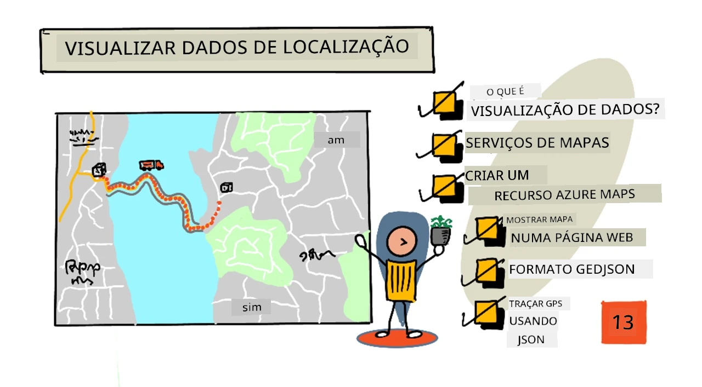
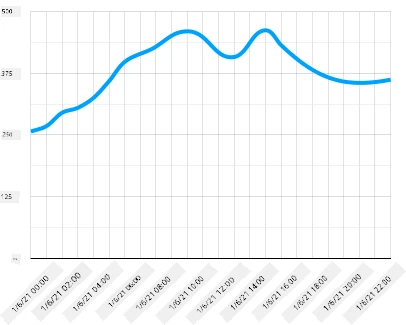
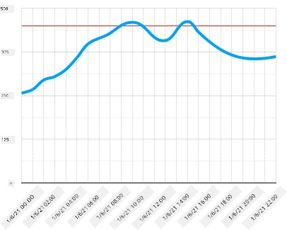
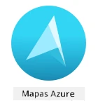
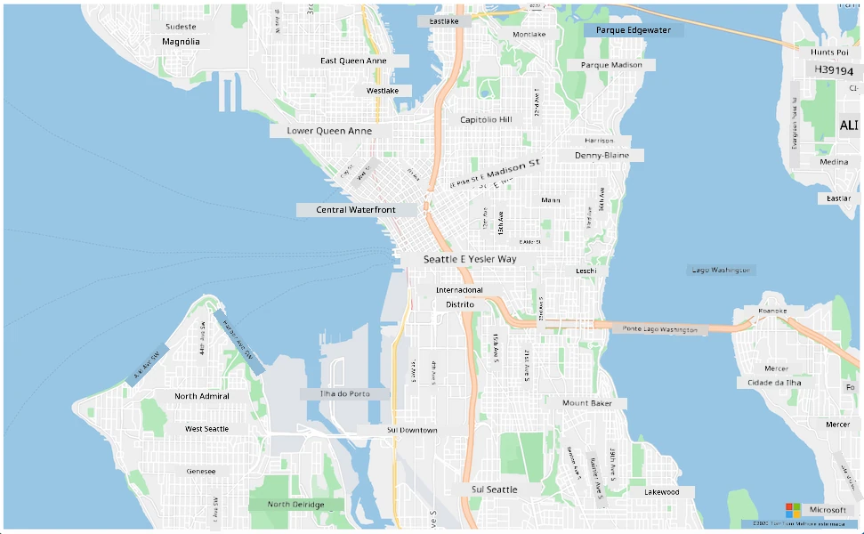
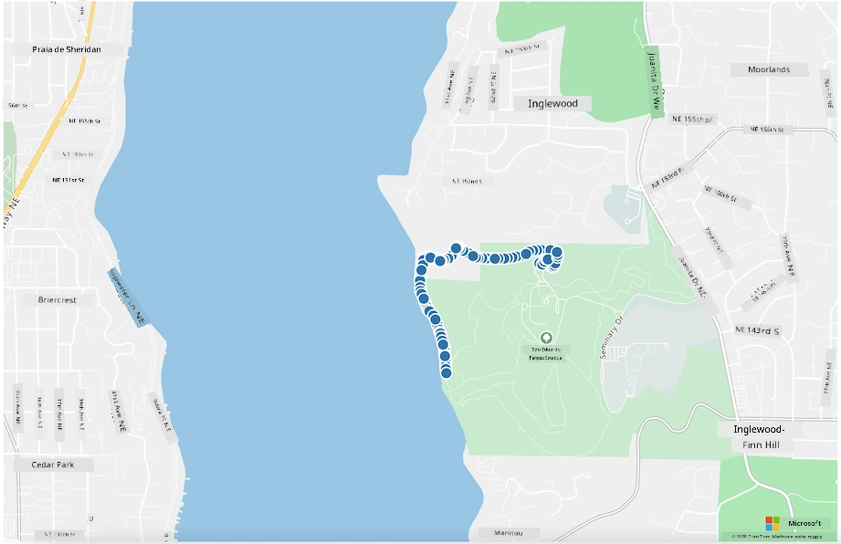

# Visualizar dados de localização



> Ilustração por [Nitya Narasimhan](https://github.com/nitya). Clique na imagem para uma versão maior.

Este vídeo oferece uma visão geral do Azure Maps com IoT, um serviço que será abordado nesta lição.

[](https://www.youtube.com/watch?v=P5i2GFTtb2s)

> 🎥 Clique na imagem acima para assistir ao vídeo

## Questionário pré-aula

[Questionário pré-aula](https://black-meadow-040d15503.1.azurestaticapps.net/quiz/25)

## Introdução

Na última lição, aprendeste como obter dados de GPS dos teus sensores e guardá-los na nuvem num contentor de armazenamento usando código sem servidor. Agora vais descobrir como visualizar esses pontos num mapa do Azure. Vais aprender a criar um mapa numa página web, conhecer o formato de dados GeoJSON e como usá-lo para plotar todos os pontos de GPS capturados no teu mapa.

Nesta lição, vamos abordar:

* [O que é visualização de dados](../../../../../3-transport/lessons/3-visualize-location-data)
* [Serviços de mapas](../../../../../3-transport/lessons/3-visualize-location-data)
* [Criar um recurso do Azure Maps](../../../../../3-transport/lessons/3-visualize-location-data)
* [Exibir um mapa numa página web](../../../../../3-transport/lessons/3-visualize-location-data)
* [O formato GeoJSON](../../../../../3-transport/lessons/3-visualize-location-data)
* [Plotar dados de GPS num mapa usando GeoJSON](../../../../../3-transport/lessons/3-visualize-location-data)

> 💁 Esta lição envolverá uma pequena quantidade de HTML e JavaScript. Se quiseres aprender mais sobre desenvolvimento web usando HTML e JavaScript, consulta [Desenvolvimento Web para Iniciantes](https://github.com/microsoft/Web-Dev-For-Beginners).

## O que é visualização de dados

A visualização de dados, como o nome sugere, trata de representar dados de forma visual para facilitar a compreensão humana. Geralmente está associada a gráficos e tabelas, mas refere-se a qualquer forma de representação pictórica de dados que ajude os humanos a entender melhor os dados e tomar decisões.

Tomando um exemplo simples - no projeto da quinta, capturaste leituras de humidade do solo. Uma tabela de dados de humidade do solo capturados a cada hora no dia 1 de junho de 2021 poderia ser algo como o seguinte:

| Data             | Leitura |
| ---------------- | ------: |
| 01/06/2021 00:00 |     257 |
| 01/06/2021 01:00 |     268 |
| 01/06/2021 02:00 |     295 |
| 01/06/2021 03:00 |     305 |
| 01/06/2021 04:00 |     325 |
| 01/06/2021 05:00 |     359 |
| 01/06/2021 06:00 |     398 |
| 01/06/2021 07:00 |     410 |
| 01/06/2021 08:00 |     429 |
| 01/06/2021 09:00 |     451 |
| 01/06/2021 10:00 |     460 |
| 01/06/2021 11:00 |     452 |
| 01/06/2021 12:00 |     420 |
| 01/06/2021 13:00 |     408 |
| 01/06/2021 14:00 |     431 |
| 01/06/2021 15:00 |     462 |
| 01/06/2021 16:00 |     432 |
| 01/06/2021 17:00 |     402 |
| 01/06/2021 18:00 |     387 |
| 01/06/2021 19:00 |     360 |
| 01/06/2021 20:00 |     358 |
| 01/06/2021 21:00 |     354 |
| 01/06/2021 22:00 |     356 |
| 01/06/2021 23:00 |     362 |

Para um humano, entender esses dados pode ser difícil. É uma parede de números sem muito significado. Como primeiro passo para visualizar esses dados, eles podem ser plotados num gráfico de linhas:



Isso pode ser ainda mais aprimorado adicionando uma linha para indicar quando o sistema de rega automática foi ativado a uma leitura de humidade do solo de 450:



Este gráfico mostra rapidamente não apenas os níveis de humidade do solo, mas também os pontos onde o sistema de rega foi ativado.

Os gráficos não são a única ferramenta para visualizar dados. Dispositivos IoT que monitorizam o clima podem ter aplicações web ou móveis que visualizam as condições climáticas usando símbolos, como um símbolo de nuvem para dias nublados, uma nuvem de chuva para dias chuvosos e assim por diante. Existem inúmeras formas de visualizar dados, algumas sérias, outras divertidas.

✅ Pensa em formas como já viste dados visualizados. Quais métodos foram mais claros e permitiram-te tomar decisões mais rapidamente?

As melhores visualizações permitem que os humanos tomem decisões rapidamente. Por exemplo, ter uma parede de mostradores mostrando todos os tipos de leituras de máquinas industriais é difícil de processar, mas uma luz vermelha piscando quando algo dá errado permite que um humano tome uma decisão. Às vezes, a melhor visualização é uma luz piscando!

Ao trabalhar com dados de GPS, a visualização mais clara pode ser plotar os dados num mapa. Um mapa mostrando camiões de entrega, por exemplo, pode ajudar os trabalhadores numa fábrica a ver quando os camiões vão chegar. Se este mapa mostrar mais do que apenas imagens dos camiões nas suas localizações atuais, mas também der uma ideia do conteúdo de um camião, então os trabalhadores da fábrica podem planear de acordo - se virem um camião refrigerado próximo, sabem que devem preparar espaço num frigorífico.

## Serviços de mapas

Trabalhar com mapas é um exercício interessante, e há muitos para escolher, como Bing Maps, Leaflet, Open Street Maps e Google Maps. Nesta lição, vais aprender sobre [Azure Maps](https://azure.microsoft.com/services/azure-maps/?WT.mc_id=academic-17441-jabenn) e como eles podem exibir os teus dados de GPS.



Azure Maps é "uma coleção de serviços geoespaciais e SDKs que utilizam dados de mapas atualizados para fornecer contexto geográfico a aplicações web e móveis." Os programadores têm à disposição ferramentas para criar mapas bonitos e interativos que podem fazer coisas como fornecer rotas de trânsito recomendadas, dar informações sobre incidentes de trânsito, navegação interna, capacidades de pesquisa, informações de elevação, serviços meteorológicos e muito mais.

✅ Experimenta alguns [exemplos de código de mapas](https://docs.microsoft.com/samples/browse?WT.mc_id=academic-17441-jabenn&products=azure-maps)

Podes exibir os mapas como uma tela em branco, imagens de satélite, imagens de satélite com estradas sobrepostas, vários tipos de mapas em escala de cinza, mapas com relevo sombreado para mostrar elevação, mapas de visão noturna e um mapa de alto contraste. Podes obter atualizações em tempo real nos teus mapas ao integrá-los com [Azure Event Grid](https://azure.microsoft.com/services/event-grid/?WT.mc_id=academic-17441-jabenn). Podes controlar o comportamento e a aparência dos teus mapas ativando vários controlos para permitir que o mapa reaja a eventos como pinçar, arrastar e clicar. Para controlar a aparência do teu mapa, podes adicionar camadas que incluem bolhas, linhas, polígonos, mapas de calor e mais. O estilo de mapa que implementares depende da tua escolha de SDK.

Podes aceder às APIs do Azure Maps utilizando a sua [REST API](https://docs.microsoft.com/javascript/api/azure-maps-rest/?WT.mc_id=academic-17441-jabenn&view=azure-maps-typescript-latest), o seu [Web SDK](https://docs.microsoft.com/azure/azure-maps/how-to-use-map-control?WT.mc_id=academic-17441-jabenn), ou, se estiveres a criar uma aplicação móvel, o seu [Android SDK](https://docs.microsoft.com/azure/azure-maps/how-to-use-android-map-control-library?WT.mc_id=academic-17441-jabenn&pivots=programming-language-java-android).

Nesta lição, vais usar o Web SDK para desenhar um mapa e exibir o percurso da localização GPS do teu sensor.

## Criar um recurso do Azure Maps

O primeiro passo é criar uma conta do Azure Maps.

### Tarefa - criar um recurso do Azure Maps

1. Executa o seguinte comando no teu Terminal ou Prompt de Comando para criar um recurso do Azure Maps no teu grupo de recursos `gps-sensor`:

    ```sh
    az maps account create --name gps-sensor \
                           --resource-group gps-sensor \
                           --accept-tos \
                           --sku S1
    ```

    Isto criará um recurso do Azure Maps chamado `gps-sensor`. O nível utilizado é `S1`, que é um nível pago que inclui uma gama de funcionalidades, mas com uma quantidade generosa de chamadas gratuitas.

    > 💁 Para ver o custo de usar o Azure Maps, consulta a [página de preços do Azure Maps](https://azure.microsoft.com/pricing/details/azure-maps/?WT.mc_id=academic-17441-jabenn).

1. Vais precisar de uma chave API para o recurso de mapas. Usa o seguinte comando para obter esta chave:

    ```sh
    az maps account keys list --name gps-sensor \
                              --resource-group gps-sensor \
                              --output table
    ```

    Faz uma cópia do valor `PrimaryKey`.

## Exibir um mapa numa página web

Agora podes dar o próximo passo, que é exibir o teu mapa numa página web. Vamos usar apenas um ficheiro `html` para a tua pequena aplicação web; lembra-te que num ambiente de produção ou equipa, a tua aplicação web provavelmente terá mais partes móveis!

### Tarefa - exibir um mapa numa página web

1. Cria um ficheiro chamado index.html numa pasta qualquer no teu computador local. Adiciona marcação HTML para conter um mapa:

    ```html
    <html>
    <head>
        <style>
            #myMap {
                width:100%;
                height:100%;
            }
        </style>
    </head>
    
    <body onload="init()">
        <div id="myMap"></div>
    </body>
    </html>
    ```

    O mapa será carregado na `div` `myMap`. Alguns estilos permitem que ele ocupe a largura e altura da página.

    > 🎓 uma `div` é uma secção de uma página web que pode ser nomeada e estilizada.

1. Sob a tag `<head>` de abertura, adiciona uma folha de estilo externa para controlar a exibição do mapa e um script externo do Web SDK para gerir o seu comportamento:

    ```html
    <link rel="stylesheet" href="https://atlas.microsoft.com/sdk/javascript/mapcontrol/2/atlas.min.css" type="text/css" />
    <script src="https://atlas.microsoft.com/sdk/javascript/mapcontrol/2/atlas.min.js"></script>
    ```

    Esta folha de estilo contém as configurações de como o mapa será exibido, e o ficheiro de script contém código para carregar o mapa. Adicionar este código é semelhante a incluir ficheiros de cabeçalho em C++ ou importar módulos em Python.

1. Sob esse script, adiciona um bloco de script para lançar o mapa.

    ```javascript
    <script type='text/javascript'>
        function init() {
            var map = new atlas.Map('myMap', {
                center: [-122.26473, 47.73444],
                zoom: 12,
                authOptions: {
                    authType: "subscriptionKey",
                    subscriptionKey: "<subscription_key>",

                }
            });
        }
    </script>
    ```

    Substitui `<subscription_key>` pela chave API da tua conta do Azure Maps.

    Se abrires o teu ficheiro `index.html` num navegador web, deverás ver um mapa carregado, focado na área de Seattle.

    

    ✅ Experimenta os parâmetros de zoom e centro para alterar a exibição do mapa. Podes adicionar diferentes coordenadas correspondentes à latitude e longitude dos teus dados para recentrar o mapa.

> 💁 Uma forma melhor de trabalhar com aplicações web localmente é instalar [http-server](https://www.npmjs.com/package/http-server). Vais precisar de [node.js](https://nodejs.org/) e [npm](https://www.npmjs.com/) instalados antes de usar esta ferramenta. Depois de instalar essas ferramentas, podes navegar até à localização do teu ficheiro `index.html` e digitar `http-server`. A aplicação web será aberta num servidor web local [http://127.0.0.1:8080/](http://127.0.0.1:8080/).

## O formato GeoJSON

Agora que tens a tua aplicação web configurada com o mapa exibido, precisas de extrair os dados de GPS da tua conta de armazenamento e exibi-los numa camada de marcadores sobre o mapa. Antes de fazermos isso, vamos olhar para o formato [GeoJSON](https://wikipedia.org/wiki/GeoJSON) que é necessário pelo Azure Maps.

[GeoJSON](https://geojson.org/) é um padrão aberto de especificação JSON com formatação especial projetada para lidar com dados específicos geográficos. Podes aprender sobre ele testando dados de exemplo usando [geojson.io](https://geojson.io), que também é uma ferramenta útil para depurar ficheiros GeoJSON.

Dados de exemplo em GeoJSON têm este aspeto:

```json
{
  "type": "FeatureCollection",
  "features": [
    {
      "type": "Feature",
      "geometry": {
        "type": "Point",
        "coordinates": [
          -2.10237979888916,
          57.164918677004714
        ]
      }
    }
  ]
}
```

De particular interesse é a forma como os dados estão aninhados como um `Feature` dentro de um `FeatureCollection`. Dentro desse objeto pode ser encontrado `geometry` com as `coordinates` indicando latitude e longitude.

✅ Ao construir o teu GeoJSON, presta atenção à ordem de `latitude` e `longitude` no objeto, ou os teus pontos não aparecerão onde deveriam! O GeoJSON espera dados na ordem `lon,lat` para pontos, e não `lat,lon`.

`Geometry` pode ter diferentes tipos, como um único ponto ou um polígono. Neste exemplo, é um ponto com duas coordenadas especificadas, a longitude e a latitude.
✅ O Azure Maps suporta GeoJSON padrão, além de algumas [funcionalidades avançadas](https://docs.microsoft.com/azure/azure-maps/extend-geojson?WT.mc_id=academic-17441-jabenn), incluindo a capacidade de desenhar círculos e outras geometrias.

## Plotar dados GPS num mapa usando GeoJSON

Agora está pronto para consumir os dados do armazenamento que criou na lição anterior. Para relembrar, os dados estão armazenados como vários ficheiros no armazenamento de blobs, por isso será necessário recuperar os ficheiros e analisá-los para que o Azure Maps possa utilizar os dados.

### Tarefa - configurar o armazenamento para ser acedido a partir de uma página web

Se fizer uma chamada ao seu armazenamento para buscar os dados, pode ficar surpreendido ao ver erros a ocorrer na consola do navegador. Isso acontece porque é necessário definir permissões para [CORS](https://developer.mozilla.org/docs/Web/HTTP/CORS) neste armazenamento para permitir que aplicações web externas leiam os seus dados.

> 🎓 CORS significa "Cross-Origin Resource Sharing" e geralmente precisa ser configurado explicitamente no Azure por razões de segurança. Impede que sites inesperados acedam aos seus dados.

1. Execute o seguinte comando para ativar o CORS:

    ```sh
    az storage cors add --methods GET \
                        --origins "*" \
                        --services b \
                        --account-name <storage_name> \
                        --account-key <key1>
    ```

    Substitua `<storage_name>` pelo nome da sua conta de armazenamento. Substitua `<key1>` pela chave da conta do seu armazenamento.

    Este comando permite que qualquer site (o wildcard `*` significa qualquer) faça uma solicitação *GET*, ou seja, obtenha dados da sua conta de armazenamento. O `--services b` significa que esta configuração será aplicada apenas para blobs.

### Tarefa - carregar os dados GPS do armazenamento

1. Substitua todo o conteúdo da função `init` pelo seguinte código:

    ```javascript
    fetch("https://<storage_name>.blob.core.windows.net/gps-data/?restype=container&comp=list")
        .then(response => response.text())
        .then(str => new window.DOMParser().parseFromString(str, "text/xml"))
        .then(xml => {
            let blobList = Array.from(xml.querySelectorAll("Url"));
                blobList.forEach(async blobUrl => {
                    loadJSON(blobUrl.innerHTML)                
        });
    })
    .then( response => {
        map = new atlas.Map('myMap', {
            center: [-122.26473, 47.73444],
            zoom: 14,
            authOptions: {
                authType: "subscriptionKey",
                subscriptionKey: "<subscription_key>",
    
            }
        });
        map.events.add('ready', function () {
            var source = new atlas.source.DataSource();
            map.sources.add(source);
            map.layers.add(new atlas.layer.BubbleLayer(source));
            source.add(features);
        })
    })
    ```

    Substitua `<storage_name>` pelo nome da sua conta de armazenamento. Substitua `<subscription_key>` pela chave API da sua conta do Azure Maps.

    Há várias coisas a acontecer aqui. Primeiro, o código busca os seus dados GPS do seu contentor de blobs usando um endpoint de URL construído com o nome da sua conta de armazenamento. Este URL recupera de `gps-data`, indicando que o tipo de recurso é um contentor (`restype=container`), e lista informações sobre todos os blobs. Esta lista não retorna os blobs propriamente ditos, mas retorna um URL para cada blob que pode ser usado para carregar os dados do blob.

    > 💁 Pode colocar este URL no seu navegador para ver os detalhes de todos os blobs no seu contentor. Cada item terá uma propriedade `Url` que também pode ser carregada no navegador para ver o conteúdo do blob.

    Este código então carrega cada blob, chamando uma função `loadJSON`, que será criada a seguir. Depois, cria o controlo do mapa e adiciona código ao evento `ready`. Este evento é chamado quando o mapa é exibido na página web.

    O evento `ready` cria uma fonte de dados do Azure Maps - um contentor que contém dados GeoJSON que serão preenchidos posteriormente. Esta fonte de dados é então usada para criar uma camada de bolhas - ou seja, um conjunto de círculos no mapa centrados em cada ponto no GeoJSON.

1. Adicione a função `loadJSON` ao seu bloco de script, abaixo da função `init`:

    ```javascript
    var map, features;

    function loadJSON(file) {
        var xhr = new XMLHttpRequest();
        features = [];
        xhr.onreadystatechange = function () {
            if (xhr.readyState === XMLHttpRequest.DONE) {
                if (xhr.status === 200) {
                    gps = JSON.parse(xhr.responseText)
                    features.push(
                        new atlas.data.Feature(new atlas.data.Point([parseFloat(gps.gps.lon), parseFloat(gps.gps.lat)]))
                    )
                }
            }
        };
        xhr.open("GET", file, true);
        xhr.send();
    }    
    ```

    Esta função é chamada pela rotina de busca para analisar os dados JSON e convertê-los para serem lidos como coordenadas de longitude e latitude em GeoJSON.  
    Uma vez analisados, os dados são definidos como parte de uma `Feature` GeoJSON. O mapa será inicializado e pequenas bolhas aparecerão ao longo do caminho que os seus dados estão a traçar:

1. Carregue a página HTML no seu navegador. Ela irá carregar o mapa, depois carregar todos os dados GPS do armazenamento e plotá-los no mapa.

    

> 💁 Pode encontrar este código na [pasta de código](../../../../../3-transport/lessons/3-visualize-location-data/code).

---

## 🚀 Desafio

É bom poder exibir dados estáticos num mapa como marcadores. Consegue melhorar esta aplicação web para adicionar animação e mostrar o percurso dos marcadores ao longo do tempo, usando os ficheiros JSON com carimbo de data/hora? Aqui estão [alguns exemplos](https://azuremapscodesamples.azurewebsites.net/) de como usar animação em mapas.

## Questionário pós-aula

[Questionário pós-aula](https://black-meadow-040d15503.1.azurestaticapps.net/quiz/26)

## Revisão e Estudo Individual

O Azure Maps é particularmente útil para trabalhar com dispositivos IoT.

* Pesquise algumas das utilizações na [documentação do Azure Maps nos Microsoft docs](https://docs.microsoft.com/azure/azure-maps/tutorial-iot-hub-maps?WT.mc_id=academic-17441-jabenn).
* Aprofunde os seus conhecimentos sobre criação de mapas e pontos de referência com o [módulo de aprendizagem auto-guiado "crie a sua primeira aplicação de busca de rotas com Azure Maps" no Microsoft Learn](https://docs.microsoft.com/learn/modules/create-your-first-app-with-azure-maps/?WT.mc_id=academic-17441-jabenn).

## Tarefa

[Implemente a sua aplicação](assignment.md)

**Aviso Legal**:  
Este documento foi traduzido utilizando o serviço de tradução por IA [Co-op Translator](https://github.com/Azure/co-op-translator). Embora nos esforcemos pela precisão, esteja ciente de que traduções automáticas podem conter erros ou imprecisões. O documento original na sua língua nativa deve ser considerado a fonte autoritária. Para informações críticas, recomenda-se uma tradução profissional realizada por humanos. Não nos responsabilizamos por quaisquer mal-entendidos ou interpretações incorretas decorrentes do uso desta tradução.