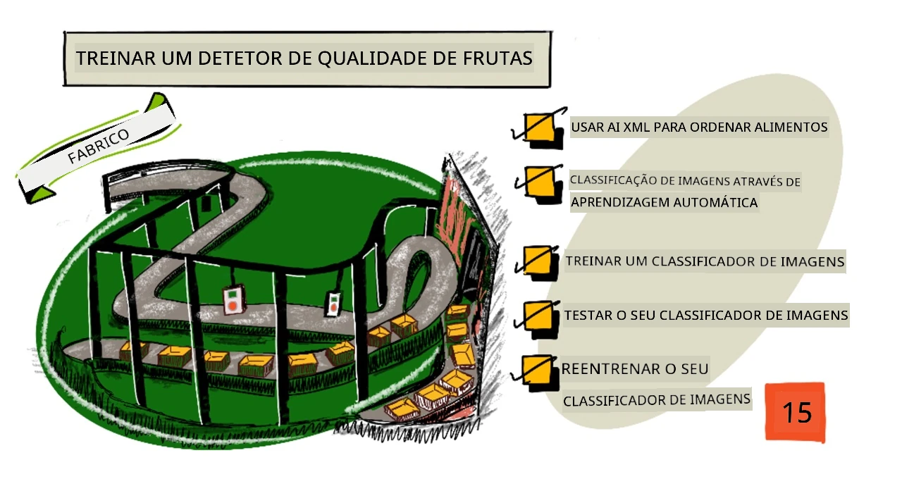
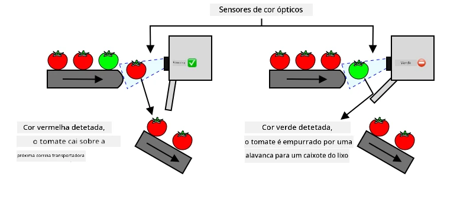
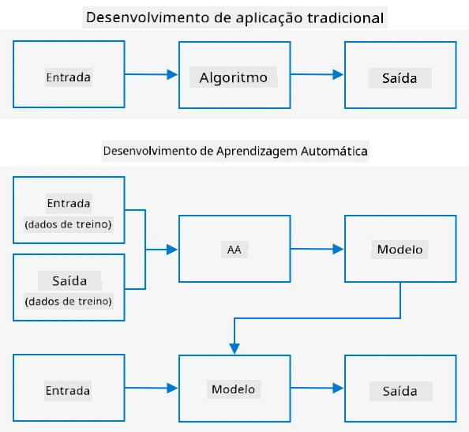
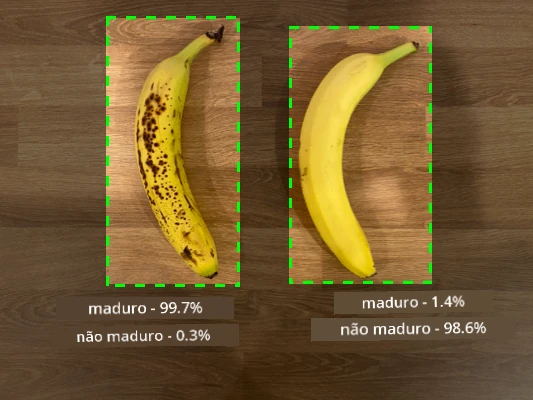
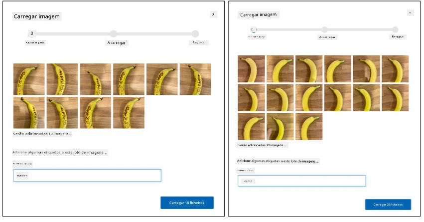
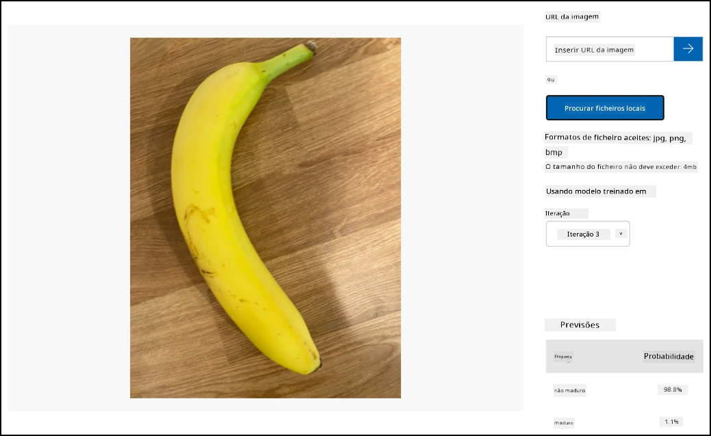

# Treinar um detector de qualidade de frutas



> Ilustração por [Nitya Narasimhan](https://github.com/nitya). Clique na imagem para uma versão maior.

Este vídeo oferece uma visão geral do serviço Azure Custom Vision, que será abordado nesta lição.

[](https://www.youtube.com/watch?v=TETcDLJlWR4)

> 🎥 Clique na imagem acima para assistir ao vídeo

## Questionário pré-aula

[Questionário pré-aula](https://black-meadow-040d15503.1.azurestaticapps.net/quiz/29)

## Introdução

O recente avanço na Inteligência Artificial (IA) e no Machine Learning (ML) está proporcionando uma ampla gama de capacidades aos desenvolvedores de hoje. Modelos de ML podem ser treinados para reconhecer diferentes elementos em imagens, incluindo frutas não maduras, e isso pode ser usado em dispositivos IoT para ajudar a classificar produtos, seja durante a colheita ou no processamento em fábricas ou armazéns.

Nesta lição, você aprenderá sobre classificação de imagens - usando modelos de ML para distinguir entre imagens de diferentes objetos. Você aprenderá como treinar um classificador de imagens para diferenciar entre frutas boas e ruins, seja por estarem maduras demais, machucadas ou podres.

Nesta lição, abordaremos:

* [Usando IA e ML para classificar alimentos](../../../../../4-manufacturing/lessons/1-train-fruit-detector)
* [Classificação de imagens via Machine Learning](../../../../../4-manufacturing/lessons/1-train-fruit-detector)
* [Treinar um classificador de imagens](../../../../../4-manufacturing/lessons/1-train-fruit-detector)
* [Testar seu classificador de imagens](../../../../../4-manufacturing/lessons/1-train-fruit-detector)
* [Re-treinar seu classificador de imagens](../../../../../4-manufacturing/lessons/1-train-fruit-detector)

## Usando IA e ML para classificar alimentos

Alimentar a população global é um desafio, especialmente a um preço que torne os alimentos acessíveis para todos. Um dos maiores custos é a mão de obra, então os agricultores estão cada vez mais recorrendo à automação e ferramentas como IoT para reduzir esses custos. A colheita manual é intensiva em trabalho (e muitas vezes exaustiva), sendo substituída por máquinas, especialmente em países mais ricos. Apesar da economia de custos ao usar máquinas para colher, há uma desvantagem - a capacidade de classificar os alimentos durante a colheita.

Nem todas as culturas amadurecem uniformemente. Os tomates, por exemplo, podem ainda ter frutos verdes na planta quando a maioria está pronta para a colheita. Embora seja um desperdício colher esses frutos verdes, é mais barato e fácil para o agricultor colher tudo usando máquinas e descartar os produtos não maduros posteriormente.

✅ Observe diferentes frutas ou vegetais, seja crescendo perto de você em fazendas ou no seu jardim, ou em lojas. Eles estão todos na mesma fase de maturação ou você vê variações?

O avanço na colheita automatizada transferiu a classificação dos produtos da colheita para a fábrica. Os alimentos viajavam em longas esteiras com equipes de pessoas examinando os produtos e removendo qualquer coisa que não atendesse aos padrões de qualidade exigidos. A colheita ficou mais barata graças às máquinas, mas ainda havia um custo para classificar os alimentos manualmente.



A próxima evolução foi usar máquinas para classificar, seja integradas à colheitadeira ou nas plantas de processamento. A primeira geração dessas máquinas usava sensores ópticos para detectar cores, controlando atuadores para empurrar tomates verdes para uma lixeira usando alavancas ou jatos de ar, deixando os tomates vermelhos continuarem em uma rede de esteiras.

Neste vídeo, à medida que os tomates caem de uma esteira para outra, os tomates verdes são detectados e jogados em uma lixeira usando alavancas.

✅ Quais condições seriam necessárias em uma fábrica ou no campo para que esses sensores ópticos funcionassem corretamente?

As evoluções mais recentes dessas máquinas de classificação aproveitam a IA e o ML, usando modelos treinados para distinguir produtos bons de ruins, não apenas por diferenças óbvias de cor, como tomates verdes versus vermelhos, mas por diferenças mais sutis na aparência que podem indicar doenças ou machucados.

## Classificação de imagens via Machine Learning

A programação tradicional é onde você pega dados, aplica um algoritmo aos dados e obtém um resultado. Por exemplo, no último projeto, você usou coordenadas de GPS e uma geofence, aplicou um algoritmo fornecido pelo Azure Maps e obteve um resultado indicando se o ponto estava dentro ou fora da geofence. Você insere mais dados e obtém mais resultados.



O aprendizado de máquina inverte esse processo - você começa com dados e saídas conhecidas, e o algoritmo de aprendizado de máquina aprende com os dados. Você pode então usar esse algoritmo treinado, chamado de *modelo de aprendizado de máquina* ou *modelo*, e inserir novos dados para obter novos resultados.

> 🎓 O processo de um algoritmo de aprendizado de máquina aprender com os dados é chamado de *treinamento*. Os dados de entrada e as saídas conhecidas são chamados de *dados de treinamento*.

Por exemplo, você poderia fornecer a um modelo milhões de fotos de bananas não maduras como dados de treinamento de entrada, com a saída de treinamento definida como `não madura`, e milhões de fotos de bananas maduras como dados de treinamento com a saída definida como `madura`. O algoritmo de ML então criaria um modelo baseado nesses dados. Você poderia então fornecer a esse modelo uma nova foto de uma banana e ele preveria se a nova foto é de uma banana madura ou não madura.

> 🎓 Os resultados dos modelos de ML são chamados de *previsões*



Os modelos de ML não fornecem uma resposta binária, mas sim probabilidades. Por exemplo, um modelo pode receber uma foto de uma banana e prever `madura` com 99,7% e `não madura` com 0,3%. Seu código então escolheria a melhor previsão e decidiria que a banana está madura.

O modelo de ML usado para detectar imagens como esta é chamado de *classificador de imagens* - ele recebe imagens rotuladas e classifica novas imagens com base nesses rótulos.

> 💁 Esta é uma simplificação, e existem muitas outras formas de treinar modelos que nem sempre precisam de saídas rotuladas, como o aprendizado não supervisionado. Se quiser aprender mais sobre ML, confira [ML para iniciantes, um currículo de 24 lições sobre aprendizado de máquina](https://aka.ms/ML-beginners).

## Treinar um classificador de imagens

Para treinar com sucesso um classificador de imagens, você precisa de milhões de imagens. No entanto, uma vez que você tenha um classificador de imagens treinado com milhões ou bilhões de imagens variadas, pode reutilizá-lo e re-treiná-lo usando um pequeno conjunto de imagens e obter ótimos resultados, usando um processo chamado *transfer learning*.

> 🎓 Transfer learning é quando você transfere o aprendizado de um modelo de ML existente para um novo modelo baseado em novos dados.

Uma vez que um classificador de imagens tenha sido treinado para uma ampla variedade de imagens, seus componentes internos são ótimos em reconhecer formas, cores e padrões. O transfer learning permite que o modelo aproveite o que já aprendeu ao reconhecer partes de imagens e use isso para reconhecer novas imagens.


Você pode pensar nisso como livros infantis de formas, onde, uma vez que você pode reconhecer um semicírculo, um retângulo e um triângulo, pode reconhecer um barco ou um gato dependendo da configuração dessas formas. O classificador de imagens pode reconhecer as formas, e o transfer learning ensina-o qual combinação forma um barco ou um gato - ou uma banana madura.

Existem uma ampla gama de ferramentas que podem ajudá-lo a fazer isso, incluindo serviços baseados na nuvem que podem ajudá-lo a treinar seu modelo e usá-lo via APIs web.

> 💁 Treinar esses modelos exige muito poder computacional, geralmente via Unidades de Processamento Gráfico (GPUs). O mesmo hardware especializado que torna os jogos no seu Xbox incríveis também pode ser usado para treinar modelos de aprendizado de máquina. Ao usar a nuvem, você pode alugar tempo em computadores poderosos com GPUs para treinar esses modelos, obtendo acesso ao poder computacional necessário apenas pelo tempo que precisar.

## Custom Vision

Custom Vision é uma ferramenta baseada na nuvem para treinar classificadores de imagens. Ela permite treinar um classificador usando apenas um pequeno número de imagens. Você pode carregar imagens através de um portal web, API web ou SDK, atribuindo a cada imagem uma *etiqueta* que classifica essa imagem. Em seguida, você treina o modelo e testa para ver como ele se comporta. Quando estiver satisfeito com o modelo, pode publicar versões dele que podem ser acessadas por meio de uma API web ou SDK.


> 💁 Você pode treinar um modelo Custom Vision com apenas 5 imagens por classificação, mas mais imagens são melhores. Você pode obter resultados melhores com pelo menos 30 imagens.

Custom Vision faz parte de uma gama de ferramentas de IA da Microsoft chamadas Cognitive Services. Estas são ferramentas de IA que podem ser usadas sem nenhum treinamento ou com uma pequena quantidade de treinamento. Elas incluem reconhecimento e tradução de fala, compreensão de linguagem e análise de imagens. Estão disponíveis com um nível gratuito como serviços no Azure.

> 💁 O nível gratuito é mais do que suficiente para criar um modelo, treiná-lo e usá-lo para trabalho de desenvolvimento. Você pode ler sobre os limites do nível gratuito na [página de limites e cotas do Custom Vision na documentação da Microsoft](https://docs.microsoft.com/azure/cognitive-services/custom-vision-service/limits-and-quotas?WT.mc_id=academic-17441-jabenn).

### Tarefa - criar um recurso de serviços cognitivos

Para usar o Custom Vision, você primeiro precisa criar dois recursos de serviços cognitivos no Azure usando o Azure CLI, um para treinamento do Custom Vision e outro para previsão do Custom Vision.

1. Crie um Grupo de Recursos para este projeto chamado `fruit-quality-detector`.

1. Use o seguinte comando para criar um recurso de treinamento do Custom Vision gratuito:

    ```sh
    az cognitiveservices account create --name fruit-quality-detector-training \
                                        --resource-group fruit-quality-detector \
                                        --kind CustomVision.Training \
                                        --sku F0 \
                                        --yes \
                                        --location <location>
    ```

    Substitua `<location>` pela localização que você usou ao criar o Grupo de Recursos.

    Isso criará um recurso de treinamento do Custom Vision no seu Grupo de Recursos. Ele será chamado `fruit-quality-detector-training` e usará o SKU `F0`, que é o nível gratuito. A opção `--yes` significa que você concorda com os termos e condições dos serviços cognitivos.

> 💁 Use o SKU `S0` se já tiver uma conta gratuita usando qualquer um dos Serviços Cognitivos.

1. Use o seguinte comando para criar um recurso de previsão do Custom Vision gratuito:

    ```sh
    az cognitiveservices account create --name fruit-quality-detector-prediction \
                                        --resource-group fruit-quality-detector \
                                        --kind CustomVision.Prediction \
                                        --sku F0 \
                                        --yes \
                                        --location <location>
    ```

    Substitua `<location>` pela localização que você usou ao criar o Grupo de Recursos.

    Isso criará um recurso de previsão do Custom Vision no seu Grupo de Recursos. Ele será chamado `fruit-quality-detector-prediction` e usará o SKU `F0`, que é o nível gratuito. A opção `--yes` significa que você concorda com os termos e condições dos serviços cognitivos.

### Tarefa - criar um projeto de classificador de imagens

1. Acesse o portal do Custom Vision em [CustomVision.ai](https://customvision.ai) e faça login com a conta Microsoft que você usou para sua conta Azure.

1. Siga a [seção de criação de um novo projeto do guia rápido de construção de um classificador na documentação da Microsoft](https://docs.microsoft.com/azure/cognitive-services/custom-vision-service/getting-started-build-a-classifier?WT.mc_id=academic-17441-jabenn#create-a-new-project) para criar um novo projeto Custom Vision. A interface pode mudar e essa documentação é sempre a referência mais atualizada.

    Nomeie seu projeto como `fruit-quality-detector`.

    Ao criar seu projeto, certifique-se de usar o recurso `fruit-quality-detector-training` que você criou anteriormente. Use o tipo de projeto *Classificação*, o tipo de classificação *Multiclasse* e o domínio *Alimentos*.

    

✅ Reserve um tempo para explorar a interface do Custom Vision para seu classificador de imagens.

### Tarefa - treinar seu projeto de classificador de imagens

Para treinar um classificador de imagens, você precisará de várias fotos de frutas, tanto de boa quanto de má qualidade, para etiquetar como boas e ruins, como uma banana madura e uma banana passada.
💁 Estes classificadores podem classificar imagens de qualquer coisa, por isso, se não tiver frutas de diferentes qualidades à mão, pode usar dois tipos diferentes de frutas, ou gatos e cães!
Idealmente, cada imagem deve mostrar apenas a fruta, com um fundo consistente ou uma grande variedade de fundos. Certifique-se de que não há nada no fundo que seja específico para frutas maduras ou verdes.

> 💁 É importante não ter fundos específicos ou itens que não estejam relacionados ao objeto sendo classificado para cada etiqueta. Caso contrário, o classificador pode acabar classificando com base no fundo. Houve um classificador de câncer de pele que foi treinado com imagens de sinais normais e cancerosos, e os sinais cancerosos sempre tinham réguas ao lado para medir o tamanho. Descobriu-se que o classificador era quase 100% preciso em identificar réguas nas imagens, mas não sinais cancerosos.

Classificadores de imagem operam em resoluções muito baixas. Por exemplo, o Custom Vision pode usar imagens de treinamento e previsão de até 10240x10240, mas treina e executa o modelo em imagens de 227x227. Imagens maiores são reduzidas para esse tamanho, então certifique-se de que o objeto que está sendo classificado ocupa uma grande parte da imagem. Caso contrário, pode ser muito pequeno na imagem reduzida usada pelo classificador.

1. Reúna imagens para o seu classificador. Você precisará de pelo menos 5 imagens para cada etiqueta para treinar o classificador, mas quanto mais, melhor. Também será necessário algumas imagens adicionais para testar o classificador. Essas imagens devem ser diferentes entre si, mas do mesmo objeto. Por exemplo:

    * Usando 2 bananas maduras, tire algumas fotos de cada uma de diferentes ângulos, tirando pelo menos 7 fotos (5 para treinar, 2 para testar), mas idealmente mais.

        

    * Repita o mesmo processo com 2 bananas verdes.

    Você deve ter pelo menos 10 imagens de treinamento, com pelo menos 5 maduras e 5 verdes, e 4 imagens de teste, 2 maduras e 2 verdes. Suas imagens devem ser em formato png ou jpeg, com tamanho inferior a 6MB. Se forem criadas com um iPhone, por exemplo, podem ser imagens HEIC de alta resolução, que precisarão ser convertidas e possivelmente reduzidas. Quanto mais imagens, melhor, e você deve ter um número semelhante de maduras e verdes.

    Se não tiver frutas maduras e verdes, pode usar frutas diferentes ou quaisquer dois objetos disponíveis. Também pode encontrar algumas imagens de exemplo na pasta [images](../../../../../4-manufacturing/lessons/1-train-fruit-detector/images) de bananas maduras e verdes que pode usar.

1. Siga a [seção de upload e etiquetagem de imagens do guia rápido para criar um classificador nos documentos da Microsoft](https://docs.microsoft.com/azure/cognitive-services/custom-vision-service/getting-started-build-a-classifier?WT.mc_id=academic-17441-jabenn#upload-and-tag-images) para carregar suas imagens de treinamento. Etiquete as frutas maduras como `ripe` e as verdes como `unripe`.

    

1. Siga a [seção de treinamento do classificador do guia rápido para criar um classificador nos documentos da Microsoft](https://docs.microsoft.com/azure/cognitive-services/custom-vision-service/getting-started-build-a-classifier?WT.mc_id=academic-17441-jabenn#train-the-classifier) para treinar o classificador de imagens com suas imagens carregadas.

    Você terá a opção de tipo de treinamento. Selecione **Quick Training**.

O classificador será treinado. O processo levará alguns minutos para ser concluído.

> 🍌 Se decidir comer sua fruta enquanto o classificador está sendo treinado, certifique-se de ter imagens suficientes para testar antes!

## Teste o seu classificador de imagens

Depois que o classificador estiver treinado, você pode testá-lo fornecendo uma nova imagem para classificar.

### Tarefa - teste o seu classificador de imagens

1. Siga a [documentação de teste do modelo nos documentos da Microsoft](https://docs.microsoft.com/azure/cognitive-services/custom-vision-service/test-your-model?WT.mc_id=academic-17441-jabenn#test-your-model) para testar o seu classificador de imagens. Use as imagens de teste que criou anteriormente, e não as imagens usadas para treinamento.

    

1. Teste todas as imagens de teste que tiver e observe as probabilidades.

## Re-treine o seu classificador de imagens

Quando testar o seu classificador, ele pode não fornecer os resultados esperados. Classificadores de imagem usam aprendizado de máquina para fazer previsões sobre o que está em uma imagem, com base em probabilidades de que determinadas características da imagem correspondam a uma etiqueta específica. Ele não entende o que está na imagem - não sabe o que é uma banana ou o que faz uma banana ser uma banana em vez de um barco. Você pode melhorar o seu classificador re-treinando-o com imagens que ele classifica incorretamente.

Cada vez que fizer uma previsão usando a opção de teste rápido, a imagem e os resultados são armazenados. Você pode usar essas imagens para re-treinar o modelo.

### Tarefa - re-treine o seu classificador de imagens

1. Siga a [documentação sobre usar a imagem prevista para treinamento nos documentos da Microsoft](https://docs.microsoft.com/azure/cognitive-services/custom-vision-service/test-your-model?WT.mc_id=academic-17441-jabenn#use-the-predicted-image-for-training) para re-treinar o modelo, usando a etiqueta correta para cada imagem.

1. Depois que o modelo for re-treinado, teste com novas imagens.

---

## 🚀 Desafio

O que acha que aconteceria se usasse uma imagem de um morango com um modelo treinado em bananas, ou uma imagem de uma banana inflável, ou uma pessoa vestida de banana, ou até mesmo um personagem amarelo de desenho animado como alguém dos Simpsons?

Experimente e veja quais são as previsões. Pode encontrar imagens para testar usando [Bing Image search](https://www.bing.com/images/trending).

## Questionário pós-aula

[Questionário pós-aula](https://black-meadow-040d15503.1.azurestaticapps.net/quiz/30)

## Revisão e Autoestudo

* Quando treinou o seu classificador, deve ter visto valores para *Precision*, *Recall* e *AP* que avaliam o modelo criado. Leia sobre o que esses valores significam usando [a seção de avaliação do classificador do guia rápido para criar um classificador nos documentos da Microsoft](https://docs.microsoft.com/azure/cognitive-services/custom-vision-service/getting-started-build-a-classifier?WT.mc_id=academic-17441-jabenn#evaluate-the-classifier)
* Leia sobre como melhorar o seu classificador na [documentação sobre como melhorar o modelo Custom Vision nos documentos da Microsoft](https://docs.microsoft.com/azure/cognitive-services/custom-vision-service/getting-started-improving-your-classifier?WT.mc_id=academic-17441-jabenn)

## Tarefa

[Treine o seu classificador para múltiplas frutas e vegetais](assignment.md)

**Aviso Legal**:  
Este documento foi traduzido utilizando o serviço de tradução por IA [Co-op Translator](https://github.com/Azure/co-op-translator). Embora nos esforcemos pela precisão, esteja ciente de que traduções automáticas podem conter erros ou imprecisões. O documento original na sua língua nativa deve ser considerado a fonte autoritária. Para informações críticas, recomenda-se a tradução profissional realizada por humanos. Não nos responsabilizamos por quaisquer mal-entendidos ou interpretações incorretas decorrentes do uso desta tradução.