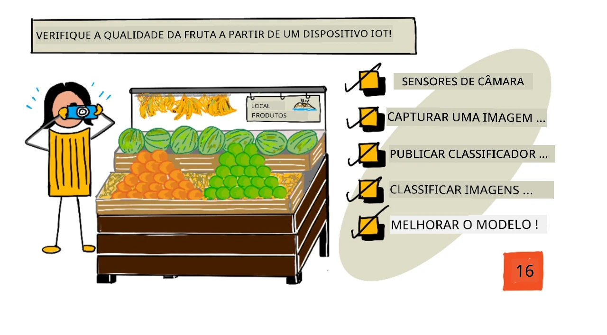
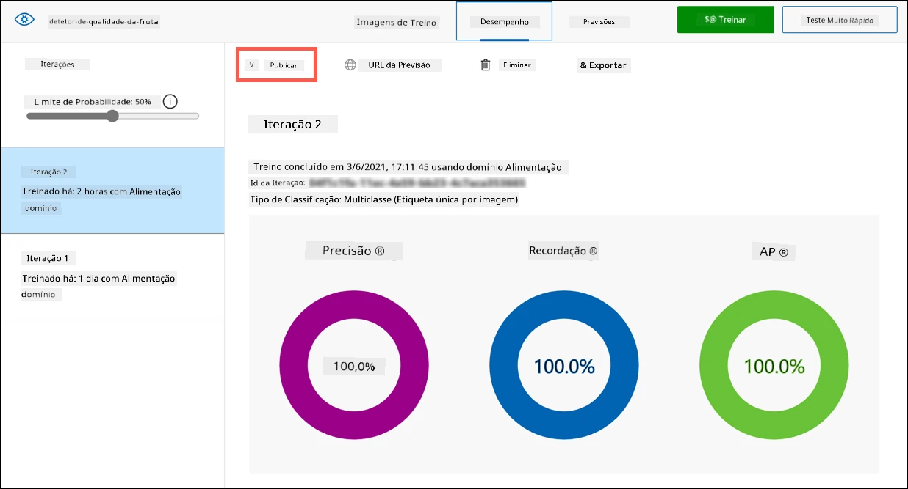
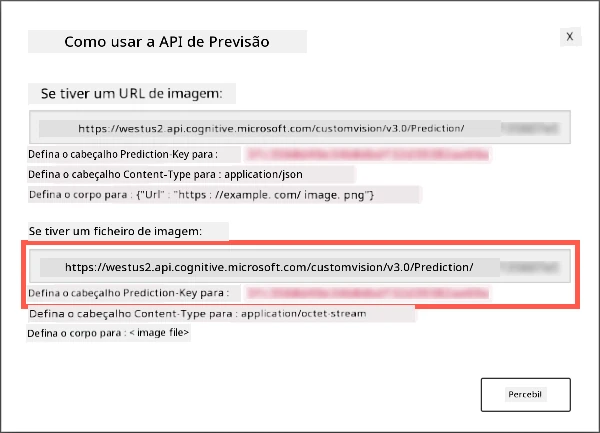

# Verificar a qualidade de frutas com um dispositivo IoT



> Ilustração por [Nitya Narasimhan](https://github.com/nitya). Clique na imagem para uma versão maior.

## Questionário pré-aula

[Questionário pré-aula](https://black-meadow-040d15503.1.azurestaticapps.net/quiz/31)

## Introdução

Na última lição, aprendeste sobre classificadores de imagens e como treiná-los para detetar frutas boas e más. Para usar este classificador de imagens numa aplicação IoT, precisas de capturar uma imagem com algum tipo de câmara e enviá-la para a nuvem para ser classificada.

Nesta lição, vais aprender sobre sensores de câmara e como usá-los com um dispositivo IoT para capturar uma imagem. Também vais aprender a chamar o classificador de imagens a partir do teu dispositivo IoT.

Nesta lição, abordaremos:

* [Sensores de câmara](../../../../../4-manufacturing/lessons/2-check-fruit-from-device)
* [Capturar uma imagem usando um dispositivo IoT](../../../../../4-manufacturing/lessons/2-check-fruit-from-device)
* [Publicar o teu classificador de imagens](../../../../../4-manufacturing/lessons/2-check-fruit-from-device)
* [Classificar imagens a partir do teu dispositivo IoT](../../../../../4-manufacturing/lessons/2-check-fruit-from-device)
* [Melhorar o modelo](../../../../../4-manufacturing/lessons/2-check-fruit-from-device)

## Sensores de câmara

Os sensores de câmara, como o nome sugere, são câmaras que podes conectar ao teu dispositivo IoT. Eles podem tirar imagens estáticas ou capturar vídeo em streaming. Alguns retornam dados de imagem brutos, enquanto outros comprimem os dados em ficheiros de imagem como JPEG ou PNG. Normalmente, as câmaras que funcionam com dispositivos IoT são muito menores e têm uma resolução mais baixa do que aquelas a que estás habituado, mas também existem câmaras de alta resolução que rivalizam com os melhores telemóveis. Podes encontrar lentes intercambiáveis, configurações com várias câmaras, câmaras térmicas de infravermelhos ou câmaras UV.


A maioria dos sensores de câmara utiliza sensores de imagem onde cada pixel é um fotodíodo. Uma lente foca a imagem no sensor de imagem, e milhares ou milhões de fotodíodos detetam a luz que incide sobre cada um, registando-a como dados de pixel.

> 💁 As lentes invertem as imagens, e o sensor da câmara depois corrige a imagem para a orientação correta. O mesmo acontece nos teus olhos - o que vês é detetado de cabeça para baixo na parte de trás do olho, e o teu cérebro corrige isso.

> 🎓 O sensor de imagem é conhecido como Sensor de Pixel Ativo (APS), e o tipo mais popular de APS é o sensor de semicondutor de óxido metálico complementar, ou CMOS. Talvez já tenhas ouvido o termo sensor CMOS usado para sensores de câmara.

Os sensores de câmara são digitais, enviando dados de imagem como dados digitais, geralmente com a ajuda de uma biblioteca que fornece a comunicação. As câmaras conectam-se usando protocolos como SPI para permitir o envio de grandes quantidades de dados - as imagens são substancialmente maiores do que números únicos de sensores como um sensor de temperatura.

✅ Quais são as limitações em relação ao tamanho das imagens em dispositivos IoT? Pensa nas restrições, especialmente no hardware de microcontroladores.

## Capturar uma imagem usando um dispositivo IoT

Podes usar o teu dispositivo IoT para capturar uma imagem a ser classificada.

### Tarefa - capturar uma imagem usando um dispositivo IoT

Segue o guia relevante para capturar uma imagem usando o teu dispositivo IoT:

* [Arduino - Wio Terminal](wio-terminal-camera.md)
* [Computador de placa única - Raspberry Pi](pi-camera.md)
* [Computador de placa única - Dispositivo virtual](virtual-device-camera.md)

## Publicar o teu classificador de imagens

Treinaste o teu classificador de imagens na última lição. Antes de o usares no teu dispositivo IoT, precisas de publicar o modelo.

### Iterações do modelo

Quando o teu modelo estava a ser treinado na última lição, talvez tenhas notado que o separador **Performance** mostra iterações no lado. Quando treinaste o modelo pela primeira vez, viste *Iteration 1* em treino. Quando melhoraste o modelo usando as imagens de previsão, viste *Iteration 2* em treino.

Sempre que treinas o modelo, obténs uma nova iteração. Esta é uma forma de acompanhar as diferentes versões do teu modelo treinadas em diferentes conjuntos de dados. Quando fazes um **Quick Test**, há um menu suspenso que podes usar para selecionar a iteração, permitindo comparar os resultados entre várias iterações.

Quando estiveres satisfeito com uma iteração, podes publicá-la para que fique disponível para ser usada por aplicações externas. Desta forma, podes ter uma versão publicada que é usada pelos teus dispositivos, enquanto trabalhas numa nova versão ao longo de várias iterações, publicando-a apenas quando estiveres satisfeito com ela.

### Tarefa - publicar uma iteração

As iterações são publicadas a partir do portal Custom Vision.

1. Acede ao portal Custom Vision em [CustomVision.ai](https://customvision.ai) e inicia sessão, caso ainda não o tenhas aberto. Depois, abre o teu projeto `fruit-quality-detector`.

1. Seleciona o separador **Performance** nas opções no topo.

1. Seleciona a iteração mais recente na lista *Iterations* no lado.

1. Clica no botão **Publish** para a iteração.

    

1. Na janela *Publish Model*, define o *Prediction resource* como o recurso `fruit-quality-detector-prediction` que criaste na última lição. Mantém o nome como `Iteration2` e clica no botão **Publish**.

1. Depois de publicado, clica no botão **Prediction URL**. Isto mostrará os detalhes da API de previsão, que precisarás para chamar o modelo a partir do teu dispositivo IoT. A secção inferior está rotulada como *If you have an image file*, e são estes os detalhes que precisas. Copia o URL mostrado, que será algo como:

    ```output
    https://<location>.api.cognitive.microsoft.com/customvision/v3.0/Prediction/<id>/classify/iterations/Iteration2/image
    ```

    Onde `<location>` será a localização que usaste ao criar o teu recurso de visão personalizada, e `<id>` será um ID longo composto por letras e números.

    Também copia o valor da *Prediction-Key*. Esta é uma chave segura que tens de passar ao chamar o modelo. Apenas aplicações que fornecem esta chave podem usar o modelo; quaisquer outras aplicações serão rejeitadas.

    

✅ Quando uma nova iteração é publicada, terá um nome diferente. Como achas que podes alterar a iteração que um dispositivo IoT está a usar?

## Classificar imagens a partir do teu dispositivo IoT

Agora podes usar estes detalhes de conexão para chamar o classificador de imagens a partir do teu dispositivo IoT.

### Tarefa - classificar imagens a partir do teu dispositivo IoT

Segue o guia relevante para classificar imagens usando o teu dispositivo IoT:

* [Arduino - Wio Terminal](wio-terminal-classify-image.md)
* [Computador de placa única - Raspberry Pi/Dispositivo IoT virtual](single-board-computer-classify-image.md)

## Melhorar o modelo

Podes descobrir que os resultados obtidos ao usar a câmara conectada ao teu dispositivo IoT não correspondem ao que esperavas. As previsões nem sempre são tão precisas quanto as imagens carregadas a partir do teu computador. Isto acontece porque o modelo foi treinado com dados diferentes dos usados para previsões.

Para obter os melhores resultados de um classificador de imagens, deves treinar o modelo com imagens o mais semelhantes possível às usadas para previsões. Por exemplo, se usaste a câmara do teu telemóvel para capturar imagens para treino, a qualidade, nitidez e cor da imagem serão diferentes de uma câmara conectada a um dispositivo IoT.


Na imagem acima, a foto da banana à esquerda foi tirada com uma câmara Raspberry Pi, enquanto a da direita foi tirada da mesma banana no mesmo local com um iPhone. Há uma diferença notável na qualidade - a foto do iPhone é mais nítida, com cores mais vivas e maior contraste.

✅ O que mais pode causar previsões incorretas nas imagens capturadas pelo teu dispositivo IoT? Pensa no ambiente em que um dispositivo IoT pode ser usado e nos fatores que podem afetar a imagem capturada.

Para melhorar o modelo, podes treiná-lo novamente usando as imagens capturadas pelo dispositivo IoT.

### Tarefa - melhorar o modelo

1. Classifica várias imagens de frutas maduras e não maduras usando o teu dispositivo IoT.

1. No portal Custom Vision, treina novamente o modelo usando as imagens no separador *Predictions*.

    > ⚠️ Podes consultar [as instruções para treinar novamente o teu classificador na lição 1, se necessário](../1-train-fruit-detector/README.md#retrain-your-image-classifier).

1. Se as tuas imagens forem muito diferentes das originais usadas para treino, podes eliminar todas as imagens originais selecionando-as no separador *Training Images* e clicando no botão **Delete**. Para selecionar uma imagem, move o cursor sobre ela e aparecerá um visto; clica nesse visto para selecionar ou desmarcar a imagem.

1. Treina uma nova iteração do modelo e publica-a usando os passos acima.

1. Atualiza o URL do endpoint no teu código e executa novamente a aplicação.

1. Repete estes passos até estares satisfeito com os resultados das previsões.

---

## 🚀 Desafio

Quanto a resolução da imagem ou a iluminação afetam a previsão?

Tenta alterar a resolução das imagens no código do teu dispositivo e vê se isso faz diferença na qualidade das imagens. Também experimenta alterar a iluminação.

Se fosses criar um dispositivo de produção para vender a quintas ou fábricas, como garantias resultados consistentes o tempo todo?

## Questionário pós-aula

[Questionário pós-aula](https://black-meadow-040d15503.1.azurestaticapps.net/quiz/32)

## Revisão e Autoestudo

Treinaste o teu modelo de visão personalizada usando o portal. Isto depende de teres imagens disponíveis - e no mundo real, pode não ser possível obter dados de treino que correspondam ao que a câmara do teu dispositivo captura. Podes contornar isto treinando diretamente a partir do teu dispositivo usando a API de treino, para treinar um modelo com imagens capturadas pelo teu dispositivo IoT.

* Lê sobre a API de treino no [início rápido do SDK de Custom Vision](https://docs.microsoft.com/azure/cognitive-services/custom-vision-service/quickstarts/image-classification?WT.mc_id=academic-17441-jabenn&tabs=visual-studio&pivots=programming-language-python)

## Tarefa

[Responder aos resultados da classificação](assignment.md)

**Aviso Legal**:  
Este documento foi traduzido utilizando o serviço de tradução por IA [Co-op Translator](https://github.com/Azure/co-op-translator). Embora nos esforcemos pela precisão, esteja ciente de que traduções automáticas podem conter erros ou imprecisões. O documento original na sua língua nativa deve ser considerado a fonte autoritária. Para informações críticas, recomenda-se a tradução profissional realizada por humanos. Não nos responsabilizamos por quaisquer mal-entendidos ou interpretações incorretas decorrentes do uso desta tradução.