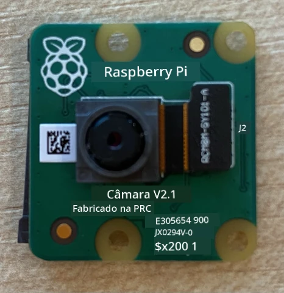
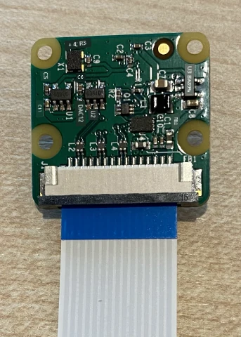
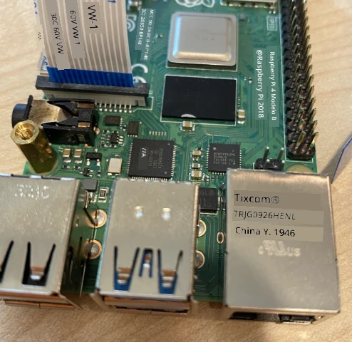

# Capturar uma imagem - Raspberry Pi

Nesta parte da lição, irá adicionar um sensor de câmara ao seu Raspberry Pi e ler imagens a partir dele.

## Hardware

O Raspberry Pi necessita de uma câmara.

A câmara que irá utilizar é o [Módulo de Câmara Raspberry Pi](https://www.raspberrypi.org/products/camera-module-v2/). Esta câmara foi projetada para funcionar com o Raspberry Pi e conecta-se através de um conector dedicado no Pi.

> 💁 Esta câmara utiliza o [Camera Serial Interface, um protocolo da Mobile Industry Processor Interface Alliance](https://wikipedia.org/wiki/Camera_Serial_Interface), conhecido como MIPI-CSI. Este é um protocolo dedicado para envio de imagens.

## Conectar a câmara

A câmara pode ser conectada ao Raspberry Pi utilizando um cabo de fita.

### Tarefa - conectar a câmara



1. Desligue o Pi.

1. Conecte o cabo de fita que vem com a câmara à câmara. Para fazer isso, puxe suavemente o clipe de plástico preto no suporte para que ele saia um pouco, depois deslize o cabo para dentro do encaixe, com o lado azul virado para longe da lente e as tiras metálicas viradas para a lente. Quando estiver completamente inserido, empurre o clipe de plástico preto de volta ao lugar.

    Pode encontrar uma animação que mostra como abrir o clipe e inserir o cabo na [documentação de introdução ao módulo de câmara do Raspberry Pi](https://projects.raspberrypi.org/en/projects/getting-started-with-picamera/2).

    

1. Remova o Grove Base Hat do Pi.

1. Passe o cabo de fita através da abertura para câmara no Grove Base Hat. Certifique-se de que o lado azul do cabo está virado para as portas analógicas rotuladas **A0**, **A1**, etc.

    

1. Insira o cabo de fita na porta da câmara no Pi. Mais uma vez, puxe o clipe de plástico preto para cima, insira o cabo e depois empurre o clipe de volta ao lugar. O lado azul do cabo deve estar virado para as portas USB e ethernet.

    

1. Recoloque o Grove Base Hat.

## Programar a câmara

O Raspberry Pi pode agora ser programado para utilizar a câmara usando a biblioteca Python [PiCamera](https://pypi.org/project/picamera/).

### Tarefa - ativar o modo de câmara legado

Infelizmente, com o lançamento do Raspberry Pi OS Bullseye, o software da câmara que vinha com o sistema operativo foi alterado, o que significa que, por padrão, o PiCamera já não funciona. Existe um substituto em desenvolvimento, chamado PiCamera2, mas ainda não está pronto para ser utilizado.

Por agora, pode configurar o seu Pi no modo de câmara legado para permitir que o PiCamera funcione. A porta da câmara também está desativada por padrão, mas ativar o software de câmara legado habilita automaticamente a porta.

1. Ligue o Pi e aguarde que ele inicialize.

1. Abra o VS Code, diretamente no Pi ou conecte-se através da extensão Remote SSH.

1. Execute os seguintes comandos no terminal:

    ```sh
    sudo raspi-config nonint do_legacy 0
    sudo reboot
    ```

    Isto irá alternar uma configuração para ativar o software de câmara legado e, em seguida, reiniciar o Pi para que a configuração entre em vigor.

1. Aguarde o Pi reiniciar e, em seguida, reabra o VS Code.

### Tarefa - programar a câmara

Programe o dispositivo.

1. No terminal, crie uma nova pasta no diretório home do utilizador `pi` chamada `fruit-quality-detector`. Crie um ficheiro nesta pasta chamado `app.py`.

1. Abra esta pasta no VS Code.

1. Para interagir com a câmara, pode usar a biblioteca Python PiCamera. Instale o pacote Pip com o seguinte comando:

    ```sh
    pip3 install picamera
    ```

1. Adicione o seguinte código ao seu ficheiro `app.py`:

    ```python
    import io
    import time
    from picamera import PiCamera
    ```

    Este código importa algumas bibliotecas necessárias, incluindo a biblioteca `PiCamera`.

1. Adicione o seguinte código abaixo para inicializar a câmara:

    ```python
    camera = PiCamera()
    camera.resolution = (640, 480)
    camera.rotation = 0
    
    time.sleep(2)
    ```

    Este código cria um objeto PiCamera e define a resolução para 640x480. Embora resoluções mais altas sejam suportadas (até 3280x2464), o classificador de imagens funciona com imagens muito menores (227x227), por isso não há necessidade de capturar e enviar imagens maiores.

    A linha `camera.rotation = 0` define a rotação da imagem. O cabo de fita entra na parte inferior da câmara, mas se a sua câmara estiver girada para facilitar o apontamento para o objeto que deseja classificar, pode alterar esta linha para o número de graus de rotação.

    

    Por exemplo, se suspender o cabo de fita sobre algo de forma que ele fique na parte superior da câmara, defina a rotação para 180:

    ```python
    camera.rotation = 180
    ```

    A câmara demora alguns segundos para iniciar, daí a linha `time.sleep(2)`.

1. Adicione o seguinte código abaixo para capturar a imagem como dados binários:

    ```python
    image = io.BytesIO()
    camera.capture(image, 'jpeg')
    image.seek(0)
    ```

    Este código cria um objeto `BytesIO` para armazenar dados binários. A imagem é lida da câmara como um ficheiro JPEG e armazenada neste objeto. Este objeto tem um indicador de posição para saber onde está nos dados, permitindo que mais dados sejam escritos no final, se necessário. A linha `image.seek(0)` move esta posição de volta ao início para que todos os dados possam ser lidos posteriormente.

1. Abaixo disso, adicione o seguinte para guardar a imagem num ficheiro:

    ```python
    with open('image.jpg', 'wb') as image_file:
        image_file.write(image.read())
    ```

    Este código abre um ficheiro chamado `image.jpg` para escrita, depois lê todos os dados do objeto `BytesIO` e escreve-os no ficheiro.

    > 💁 Pode capturar a imagem diretamente num ficheiro em vez de um objeto `BytesIO` ao passar o nome do ficheiro para a chamada `camera.capture`. A razão para usar o objeto `BytesIO` é que, mais tarde nesta lição, poderá enviar a imagem para o seu classificador de imagens.

1. Aponte a câmara para algo e execute este código.

1. Uma imagem será capturada e guardada como `image.jpg` na pasta atual. Verá este ficheiro no explorador do VS Code. Selecione o ficheiro para visualizar a imagem. Se precisar de rotação, atualize a linha `camera.rotation = 0` conforme necessário e tire outra foto.

> 💁 Pode encontrar este código na pasta [code-camera/pi](../../../../../4-manufacturing/lessons/2-check-fruit-from-device/code-camera/pi).

😀 O programa da sua câmara foi um sucesso!

**Aviso Legal**:  
Este documento foi traduzido utilizando o serviço de tradução por IA [Co-op Translator](https://github.com/Azure/co-op-translator). Embora nos esforcemos para garantir a precisão, esteja ciente de que traduções automáticas podem conter erros ou imprecisões. O documento original na sua língua nativa deve ser considerado a fonte autoritária. Para informações críticas, recomenda-se a tradução profissional realizada por humanos. Não nos responsabilizamos por quaisquer mal-entendidos ou interpretações incorretas decorrentes do uso desta tradução.