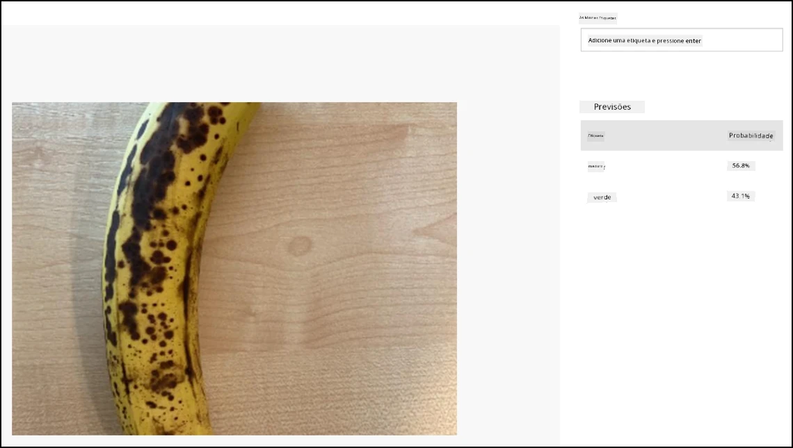

# Classificar uma imagem - Hardware Virtual IoT e Raspberry Pi

Nesta parte da lição, irá enviar a imagem capturada pela câmara para o serviço Custom Vision para classificá-la.

## Enviar imagens para o Custom Vision

O serviço Custom Vision tem um SDK em Python que pode ser usado para classificar imagens.

### Tarefa - enviar imagens para o Custom Vision

1. Abra a pasta `fruit-quality-detector` no VS Code. Se estiver a usar um dispositivo IoT virtual, certifique-se de que o ambiente virtual está a ser executado no terminal.

1. O SDK em Python para enviar imagens para o Custom Vision está disponível como um pacote Pip. Instale-o com o seguinte comando:

    ```sh
    pip3 install azure-cognitiveservices-vision-customvision
    ```

1. Adicione as seguintes instruções de importação no topo do ficheiro `app.py`:

    ```python
    from msrest.authentication import ApiKeyCredentials
    from azure.cognitiveservices.vision.customvision.prediction import CustomVisionPredictionClient
    ```

    Isto importa alguns módulos das bibliotecas do Custom Vision, um para autenticar com a chave de previsão e outro para fornecer uma classe cliente de previsão que pode chamar o Custom Vision.

1. Adicione o seguinte código ao final do ficheiro:

    ```python
    prediction_url = '<prediction_url>'
    prediction_key = '<prediction key>'
    ```

    Substitua `<prediction_url>` pelo URL que copiou do diálogo *Prediction URL* anteriormente nesta lição. Substitua `<prediction key>` pela chave de previsão que copiou do mesmo diálogo.

1. O URL de previsão fornecido pelo diálogo *Prediction URL* foi concebido para ser usado ao chamar diretamente o endpoint REST. O SDK em Python utiliza partes do URL em locais diferentes. Adicione o seguinte código para dividir este URL nas partes necessárias:

    ```python
    parts = prediction_url.split('/')
    endpoint = 'https://' + parts[2]
    project_id = parts[6]
    iteration_name = parts[9]
    ```

    Isto divide o URL, extraindo o endpoint `https://<location>.api.cognitive.microsoft.com`, o ID do projeto e o nome da iteração publicada.

1. Crie um objeto preditor para realizar a previsão com o seguinte código:

    ```python
    prediction_credentials = ApiKeyCredentials(in_headers={"Prediction-key": prediction_key})
    predictor = CustomVisionPredictionClient(endpoint, prediction_credentials)
    ```

    As `prediction_credentials` encapsulam a chave de previsão. Estas são então usadas para criar um objeto cliente de previsão apontando para o endpoint.

1. Envie a imagem para o Custom Vision usando o seguinte código:

    ```python
    image.seek(0)
    results = predictor.classify_image(project_id, iteration_name, image)
    ```

    Isto rebobina a imagem para o início e, em seguida, envia-a para o cliente de previsão.

1. Por fim, mostre os resultados com o seguinte código:

    ```python
    for prediction in results.predictions:
        print(f'{prediction.tag_name}:\t{prediction.probability * 100:.2f}%')
    ```

    Isto irá percorrer todas as previsões que foram retornadas e mostrá-las no terminal. As probabilidades retornadas são números de ponto flutuante de 0-1, sendo 0 uma probabilidade de 0% de corresponder à etiqueta, e 1 uma probabilidade de 100%.

    > 💁 Os classificadores de imagens irão retornar as percentagens para todas as etiquetas que foram usadas. Cada etiqueta terá uma probabilidade de que a imagem corresponda a essa etiqueta.

1. Execute o seu código, com a câmara apontada para alguma fruta, ou um conjunto de imagens apropriado, ou fruta visível na sua webcam se estiver a usar hardware IoT virtual. Verá a saída no console:

    ```output
    (.venv) ➜  fruit-quality-detector python app.py
    ripe:   56.84%
    unripe: 43.16%
    ```

    Poderá ver a imagem que foi capturada e estes valores no separador **Predictions** no Custom Vision.

    

> 💁 Pode encontrar este código na pasta [code-classify/pi](../../../../../4-manufacturing/lessons/2-check-fruit-from-device/code-classify/pi) ou [code-classify/virtual-iot-device](../../../../../4-manufacturing/lessons/2-check-fruit-from-device/code-classify/virtual-iot-device).

😀 O seu programa de classificação da qualidade da fruta foi um sucesso!

**Aviso Legal**:  
Este documento foi traduzido utilizando o serviço de tradução por IA [Co-op Translator](https://github.com/Azure/co-op-translator). Embora nos esforcemos para garantir a precisão, é importante notar que traduções automáticas podem conter erros ou imprecisões. O documento original na sua língua nativa deve ser considerado a fonte autoritária. Para informações críticas, recomenda-se a tradução profissional realizada por humanos. Não nos responsabilizamos por quaisquer mal-entendidos ou interpretações incorretas decorrentes do uso desta tradução.