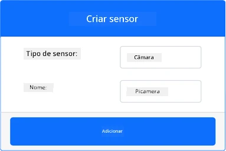
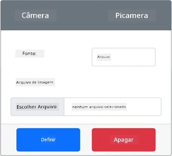
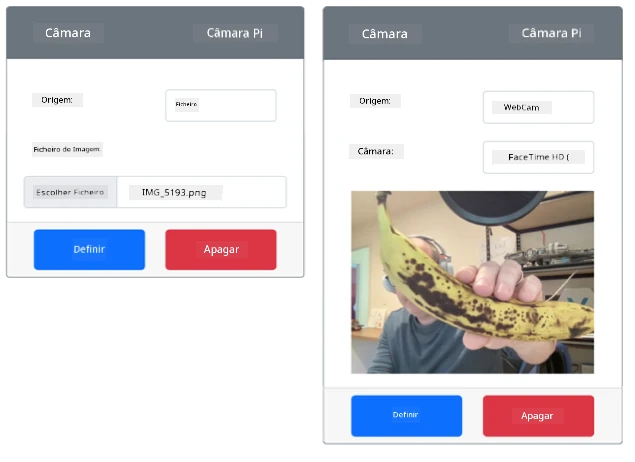

# Capturar uma imagem - Hardware IoT Virtual

Nesta parte da lição, irá adicionar um sensor de câmara ao seu dispositivo IoT virtual e ler imagens a partir dele.

## Hardware

O dispositivo IoT virtual utilizará uma câmara simulada que envia imagens a partir de ficheiros ou da sua webcam.

### Adicionar a câmara ao CounterFit

Para usar uma câmara virtual, precisa de adicionar uma à aplicação CounterFit.

#### Tarefa - adicionar a câmara ao CounterFit

Adicione a câmara à aplicação CounterFit.

1. Crie uma nova aplicação Python no seu computador numa pasta chamada `fruit-quality-detector` com um único ficheiro chamado `app.py` e um ambiente virtual Python, e adicione os pacotes pip do CounterFit.

    > ⚠️ Pode consultar [as instruções para criar e configurar um projeto Python do CounterFit na lição 1, se necessário](../../../1-getting-started/lessons/1-introduction-to-iot/virtual-device.md).

1. Instale um pacote Pip adicional para adicionar um shim do CounterFit que pode comunicar com sensores de câmara simulando algumas funcionalidades do [pacote Pip Picamera](https://pypi.org/project/picamera/). Certifique-se de que está a instalar isto a partir de um terminal com o ambiente virtual ativado.

    ```sh
    pip install counterfit-shims-picamera
    ```

1. Certifique-se de que a aplicação web do CounterFit está em execução.

1. Crie uma câmara:

    1. Na caixa *Create sensor* no painel *Sensors*, abra o menu suspenso *Sensor type* e selecione *Camera*.

    1. Defina o *Name* como `Picamera`.

    1. Selecione o botão **Add** para criar a câmara.

    

    A câmara será criada e aparecerá na lista de sensores.

    

## Programar a câmara

O dispositivo IoT virtual pode agora ser programado para usar a câmara virtual.

### Tarefa - programar a câmara

Programe o dispositivo.

1. Certifique-se de que a aplicação `fruit-quality-detector` está aberta no VS Code.

1. Abra o ficheiro `app.py`.

1. Adicione o seguinte código ao início do ficheiro `app.py` para ligar a aplicação ao CounterFit:

    ```python
    from counterfit_connection import CounterFitConnection
    CounterFitConnection.init('127.0.0.1', 5000)
    ```

1. Adicione o seguinte código ao ficheiro `app.py`:

    ```python
    import io
    from counterfit_shims_picamera import PiCamera
    ```

    Este código importa algumas bibliotecas necessárias, incluindo a classe `PiCamera` da biblioteca counterfit_shims_picamera.

1. Adicione o seguinte código abaixo deste para inicializar a câmara:

    ```python
    camera = PiCamera()
    camera.resolution = (640, 480)
    camera.rotation = 0
    ```

    Este código cria um objeto PiCamera e define a resolução para 640x480. Embora resoluções mais altas sejam suportadas, o classificador de imagens funciona com imagens muito menores (227x227), por isso não é necessário capturar e enviar imagens maiores.

    A linha `camera.rotation = 0` define a rotação da imagem em graus. Se precisar de rodar a imagem da webcam ou do ficheiro, ajuste este valor conforme necessário. Por exemplo, se quiser alterar a imagem de uma banana numa webcam em modo paisagem para modo retrato, defina `camera.rotation = 90`.

1. Adicione o seguinte código abaixo deste para capturar a imagem como dados binários:

    ```python
    image = io.BytesIO()
    camera.capture(image, 'jpeg')
    image.seek(0)
    ```

    Este código cria um objeto `BytesIO` para armazenar dados binários. A imagem é lida da câmara como um ficheiro JPEG e armazenada neste objeto. Este objeto tem um indicador de posição para saber onde está nos dados, permitindo que mais dados sejam escritos no final, se necessário. A linha `image.seek(0)` move esta posição de volta para o início, para que todos os dados possam ser lidos mais tarde.

1. Abaixo deste, adicione o seguinte para guardar a imagem num ficheiro:

    ```python
    with open('image.jpg', 'wb') as image_file:
        image_file.write(image.read())
    ```

    Este código abre um ficheiro chamado `image.jpg` para escrita, depois lê todos os dados do objeto `BytesIO` e escreve-os no ficheiro.

    > 💁 Pode capturar a imagem diretamente para um ficheiro em vez de usar um objeto `BytesIO`, passando o nome do ficheiro para a chamada `camera.capture`. A razão para usar o objeto `BytesIO` é que, mais tarde nesta lição, poderá enviar a imagem para o seu classificador de imagens.

1. Configure a imagem que a câmara no CounterFit irá capturar. Pode definir a *Source* como *File* e carregar um ficheiro de imagem, ou definir a *Source* como *WebCam*, e as imagens serão capturadas da sua webcam. Certifique-se de selecionar o botão **Set** após escolher uma imagem ou a sua webcam.

    

1. Uma imagem será capturada e guardada como `image.jpg` na pasta atual. Verá este ficheiro no explorador do VS Code. Selecione o ficheiro para visualizar a imagem. Se precisar de rotação, atualize a linha `camera.rotation = 0` conforme necessário e tire outra fotografia.

> 💁 Pode encontrar este código na pasta [code-camera/virtual-iot-device](../../../../../4-manufacturing/lessons/2-check-fruit-from-device/code-camera/virtual-iot-device).

😀 O programa da sua câmara foi um sucesso!

**Aviso Legal**:  
Este documento foi traduzido utilizando o serviço de tradução por IA [Co-op Translator](https://github.com/Azure/co-op-translator). Embora nos esforcemos para garantir a precisão, esteja ciente de que traduções automáticas podem conter erros ou imprecisões. O documento original no seu idioma nativo deve ser considerado a fonte autoritativa. Para informações críticas, recomenda-se uma tradução profissional realizada por humanos. Não nos responsabilizamos por quaisquer mal-entendidos ou interpretações incorretas resultantes do uso desta tradução.