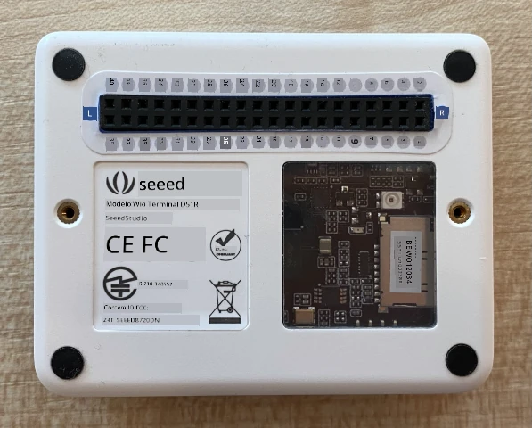
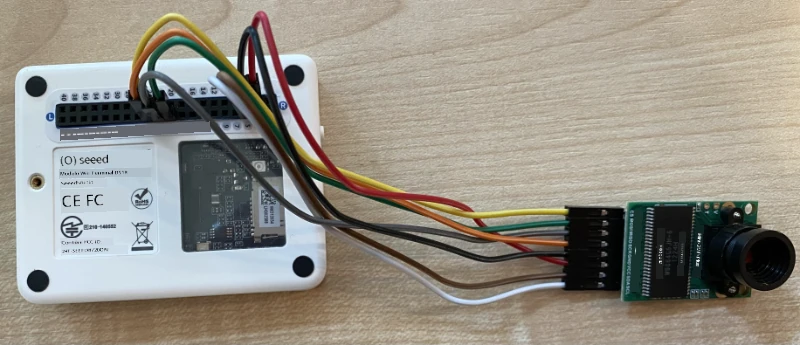
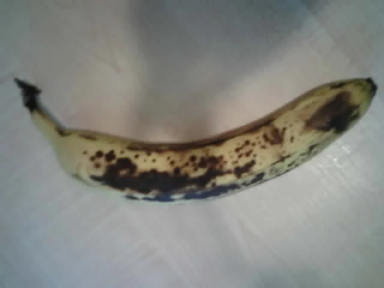

# Capturar uma imagem - Wio Terminal

Nesta parte da lição, irá adicionar uma câmara ao seu Wio Terminal e capturar imagens com ela.

## Hardware

O Wio Terminal necessita de uma câmara.

A câmara que irá utilizar é uma [ArduCam Mini 2MP Plus](https://www.arducam.com/product/arducam-2mp-spi-camera-b0067-arduino/). Esta é uma câmara de 2 megapixels baseada no sensor de imagem OV2640. Comunica através de uma interface SPI para capturar imagens e utiliza I²C para configurar o sensor.

## Ligar a câmara

A ArduCam não possui um conector Grove; em vez disso, liga-se aos barramentos SPI e I²C através dos pinos GPIO no Wio Terminal.

### Tarefa - ligar a câmara

Ligue a câmara.


1. Os pinos na base da ArduCam precisam de ser ligados aos pinos GPIO no Wio Terminal. Para facilitar a identificação dos pinos corretos, cole o autocolante dos pinos GPIO que vem com o Wio Terminal à volta dos pinos:

    

1. Usando fios de ligação, faça as seguintes conexões:

    | Pino ArduCAM | Pino Wio Terminal | Descrição                                |
    | ------------ | ----------------- | ---------------------------------------- |
    | CS           | 24 (SPI_CS)       | Seleção de Chip SPI                      |
    | MOSI         | 19 (SPI_MOSI)     | Saída do Controlador SPI, Entrada do Periférico |
    | MISO         | 21 (SPI_MISO)     | Entrada do Controlador SPI, Saída do Periférico |
    | SCK          | 23 (SPI_SCLK)     | Relógio Serial SPI                       |
    | GND          | 6 (GND)           | Terra - 0V                               |
    | VCC          | 4 (5V)            | Alimentação de 5V                        |
    | SDA          | 3 (I2C1_SDA)      | Dados Seriais I²C                        |
    | SCL          | 5 (I2C1_SCL)      | Relógio Serial I²C                       |

    

    As conexões GND e VCC fornecem uma alimentação de 5V à ArduCam. Funciona a 5V, ao contrário dos sensores Grove que funcionam a 3V. Esta alimentação vem diretamente da ligação USB-C que alimenta o dispositivo.

    > 💁 Para a ligação SPI, as etiquetas dos pinos na ArduCam e os nomes dos pinos do Wio Terminal usados no código ainda utilizam a convenção de nomenclatura antiga. As instruções nesta lição usarão a nova convenção de nomenclatura, exceto quando os nomes dos pinos forem usados no código.

1. Agora pode ligar o Wio Terminal ao seu computador.

## Programar o dispositivo para ligar à câmara

O Wio Terminal pode agora ser programado para utilizar a câmara ArduCAM conectada.

### Tarefa - programar o dispositivo para ligar à câmara

1. Crie um novo projeto para o Wio Terminal utilizando o PlatformIO. Chame este projeto `fruit-quality-detector`. Adicione código na função `setup` para configurar a porta serial.

1. Adicione código para ligar ao Wi-Fi, com as suas credenciais de Wi-Fi num ficheiro chamado `config.h`. Não se esqueça de adicionar as bibliotecas necessárias ao ficheiro `platformio.ini`.

1. A biblioteca ArduCam não está disponível como uma biblioteca Arduino que pode ser instalada a partir do ficheiro `platformio.ini`. Em vez disso, terá de ser instalada a partir do código-fonte na página GitHub deles. Pode obtê-la de duas formas:

    * Clonando o repositório de [https://github.com/ArduCAM/Arduino.git](https://github.com/ArduCAM/Arduino.git)
    * Acedendo ao repositório no GitHub em [github.com/ArduCAM/Arduino](https://github.com/ArduCAM/Arduino) e descarregando o código como um ficheiro zip através do botão **Code**

1. Apenas precisa da pasta `ArduCAM` deste código. Copie a pasta inteira para a pasta `lib` no seu projeto.

    > ⚠️ A pasta inteira deve ser copiada, de forma que o código esteja em `lib/ArduCam`. Não copie apenas o conteúdo da pasta `ArduCam` para a pasta `lib`, copie a pasta inteira.

1. O código da biblioteca ArduCam funciona para vários tipos de câmaras. O tipo de câmara que deseja utilizar é configurado através de flags do compilador - isto mantém a biblioteca compilada o mais pequena possível, removendo o código para câmaras que não está a utilizar. Para configurar a biblioteca para a câmara OV2640, adicione o seguinte ao final do ficheiro `platformio.ini`:

    ```ini
    build_flags =
        -DARDUCAM_SHIELD_V2
        -DOV2640_CAM
    ```

    Isto define 2 flags do compilador:

      * `ARDUCAM_SHIELD_V2` para informar a biblioteca de que a câmara está numa placa Arduino, conhecida como shield.
      * `OV2640_CAM` para informar a biblioteca de que deve incluir apenas o código para a câmara OV2640.

1. Adicione um ficheiro de cabeçalho na pasta `src` chamado `camera.h`. Este conterá o código para comunicar com a câmara. Adicione o seguinte código a este ficheiro:

    ```cpp
    #pragma once
    
    #include <ArduCAM.h>
    #include <Wire.h>
    
    class Camera
    {
    public:
        Camera(int format, int image_size) : _arducam(OV2640, PIN_SPI_SS)
        {
            _format = format;
            _image_size = image_size;
        }
    
        bool init()
        {
            // Reset the CPLD
            _arducam.write_reg(0x07, 0x80);
            delay(100);
    
            _arducam.write_reg(0x07, 0x00);
            delay(100);
    
            // Check if the ArduCAM SPI bus is OK
            _arducam.write_reg(ARDUCHIP_TEST1, 0x55);
            if (_arducam.read_reg(ARDUCHIP_TEST1) != 0x55)
            {
                return false;
            }
                
            // Change MCU mode
            _arducam.set_mode(MCU2LCD_MODE);
    
            uint8_t vid, pid;
    
            // Check if the camera module type is OV2640
            _arducam.wrSensorReg8_8(0xff, 0x01);
            _arducam.rdSensorReg8_8(OV2640_CHIPID_HIGH, &vid);
            _arducam.rdSensorReg8_8(OV2640_CHIPID_LOW, &pid);
            if ((vid != 0x26) && ((pid != 0x41) || (pid != 0x42)))
            {
                return false;
            }
            
            _arducam.set_format(_format);
            _arducam.InitCAM();
            _arducam.OV2640_set_JPEG_size(_image_size);
            _arducam.OV2640_set_Light_Mode(Auto);
            _arducam.OV2640_set_Special_effects(Normal);
            delay(1000);
    
            return true;
        }
    
        void startCapture()
        {
            _arducam.flush_fifo();
            _arducam.clear_fifo_flag();
            _arducam.start_capture();
        }
    
        bool captureReady()
        {
            return _arducam.get_bit(ARDUCHIP_TRIG, CAP_DONE_MASK);
        }
    
        bool readImageToBuffer(byte **buffer, uint32_t &buffer_length)
        {
            if (!captureReady()) return false;
    
            // Get the image file length
            uint32_t length = _arducam.read_fifo_length();
            buffer_length = length;
    
            if (length >= MAX_FIFO_SIZE)
            {
                return false;
            }
            if (length == 0)
            {
                return false;
            }
    
            // create the buffer
            byte *buf = new byte[length];
    
            uint8_t temp = 0, temp_last = 0;
            int i = 0;
            uint32_t buffer_pos = 0;
            bool is_header = false;
    
            _arducam.CS_LOW();
            _arducam.set_fifo_burst();
            
            while (length--)
            {
                temp_last = temp;
                temp = SPI.transfer(0x00);
                //Read JPEG data from FIFO
                if ((temp == 0xD9) && (temp_last == 0xFF)) //If find the end ,break while,
                {
                    buf[buffer_pos] = temp;
    
                    buffer_pos++;
                    i++;
                    
                    _arducam.CS_HIGH();
                }
                if (is_header == true)
                {
                    //Write image data to buffer if not full
                    if (i < 256)
                    {
                        buf[buffer_pos] = temp;
                        buffer_pos++;
                        i++;
                    }
                    else
                    {
                        _arducam.CS_HIGH();
    
                        i = 0;
                        buf[buffer_pos] = temp;
    
                        buffer_pos++;
                        i++;
    
                        _arducam.CS_LOW();
                        _arducam.set_fifo_burst();
                    }
                }
                else if ((temp == 0xD8) & (temp_last == 0xFF))
                {
                    is_header = true;
    
                    buf[buffer_pos] = temp_last;
                    buffer_pos++;
                    i++;
    
                    buf[buffer_pos] = temp;
                    buffer_pos++;
                    i++;
                }
            }
            
            _arducam.clear_fifo_flag();
    
            _arducam.set_format(_format);
            _arducam.InitCAM();
            _arducam.OV2640_set_JPEG_size(_image_size);
    
            // return the buffer
            *buffer = buf;
        }
    
    private:
        ArduCAM _arducam;
        int _format;
        int _image_size;
    };
    ```

    Este é um código de baixo nível que configura a câmara utilizando as bibliotecas ArduCam e extrai as imagens quando necessário através do barramento SPI. Este código é muito específico para a ArduCam, por isso não precisa de se preocupar com o seu funcionamento neste momento.

1. No `main.cpp`, adicione o seguinte código abaixo das outras declarações `include` para incluir este novo ficheiro e criar uma instância da classe da câmara:

    ```cpp
    #include "camera.h"

    Camera camera = Camera(JPEG, OV2640_640x480);
    ```

    Isto cria uma `Camera` que guarda as imagens como JPEGs numa resolução de 640 por 480. Embora resoluções mais altas sejam suportadas (até 3280x2464), o classificador de imagens funciona com imagens muito menores (227x227), por isso não há necessidade de capturar e enviar imagens maiores.

1. Adicione o seguinte código abaixo disto para definir uma função para configurar a câmara:

    ```cpp
    void setupCamera()
    {
        pinMode(PIN_SPI_SS, OUTPUT);
        digitalWrite(PIN_SPI_SS, HIGH);
    
        Wire.begin();
        SPI.begin();
    
        if (!camera.init())
        {
            Serial.println("Error setting up the camera!");
        }
    }
    ```

    Esta função `setupCamera` começa por configurar o pino de seleção de chip SPI (`PIN_SPI_SS`) como alto, tornando o Wio Terminal o controlador SPI. Em seguida, inicia os barramentos I²C e SPI. Finalmente, inicializa a classe da câmara, que configura as definições do sensor da câmara e garante que tudo está corretamente ligado.

1. Chame esta função no final da função `setup`:

    ```cpp
    setupCamera();
    ```

1. Compile e carregue este código e verifique a saída no monitor serial. Se vir `Error setting up the camera!`, verifique as ligações para garantir que todos os cabos estão a ligar os pinos corretos na ArduCam aos pinos GPIO corretos no Wio Terminal e que todos os cabos de ligação estão bem encaixados.

## Capturar uma imagem

O Wio Terminal pode agora ser programado para capturar uma imagem quando um botão for pressionado.

### Tarefa - capturar uma imagem

1. Microcontroladores executam o seu código continuamente, por isso não é fácil acionar algo como tirar uma foto sem reagir a um sensor. O Wio Terminal tem botões, por isso a câmara pode ser configurada para ser acionada por um dos botões. Adicione o seguinte código ao final da função `setup` para configurar o botão C (um dos três botões na parte superior, o mais próximo do interruptor de alimentação).

    

    ```cpp
    pinMode(WIO_KEY_C, INPUT_PULLUP);
    ```

    O modo `INPUT_PULLUP` essencialmente inverte uma entrada. Por exemplo, normalmente um botão enviaria um sinal baixo quando não pressionado e um sinal alto quando pressionado. Quando configurado como `INPUT_PULLUP`, envia um sinal alto quando não pressionado e um sinal baixo quando pressionado.

1. Adicione uma função vazia para responder à pressão do botão antes da função `loop`:

    ```cpp
    void buttonPressed()
    {
        
    }
    ```

1. Chame esta função na função `loop` quando o botão for pressionado:

    ```cpp
    void loop()
    {
        if (digitalRead(WIO_KEY_C) == LOW)
        {
            buttonPressed();
            delay(2000);
        }
    
        delay(200);
    }
    ```

    Este código verifica se o botão foi pressionado. Se for pressionado, a função `buttonPressed` é chamada e o loop atrasa por 2 segundos. Isto é para dar tempo para o botão ser solto, para que uma pressão longa não seja registada duas vezes.

    > 💁 O botão no Wio Terminal está configurado como `INPUT_PULLUP`, por isso envia um sinal alto quando não pressionado e um sinal baixo quando pressionado.

1. Adicione o seguinte código à função `buttonPressed`:

    ```cpp
    camera.startCapture();
 
    while (!camera.captureReady())
        delay(100);

    Serial.println("Image captured");

    byte *buffer;
    uint32_t length;

    if (camera.readImageToBuffer(&buffer, length))
    {
        Serial.print("Image read to buffer with length ");
        Serial.println(length);

        delete(buffer);
    }
    ```

    Este código inicia a captura da câmara chamando `startCapture`. O hardware da câmara não funciona retornando os dados quando solicitados; em vez disso, envia-se uma instrução para iniciar a captura, e a câmara trabalha em segundo plano para capturar a imagem, convertê-la para JPEG e armazená-la num buffer local na própria câmara. A chamada `captureReady` verifica se a captura da imagem foi concluída.

    Quando a captura é concluída, os dados da imagem são copiados do buffer na câmara para um buffer local (array de bytes) com a chamada `readImageToBuffer`. O comprimento do buffer é então enviado para o monitor serial.

1. Compile e carregue este código e verifique a saída no monitor serial. Sempre que pressionar o botão C, uma imagem será capturada e verá o tamanho da imagem enviado para o monitor serial.

    ```output
    Connecting to WiFi..
    Connected!
    Image captured
    Image read to buffer with length 9224
    Image captured
    Image read to buffer with length 11272
    ```

    Imagens diferentes terão tamanhos diferentes. Elas são comprimidas como JPEGs e o tamanho de um ficheiro JPEG para uma determinada resolução depende do que está na imagem.

> 💁 Pode encontrar este código na pasta [code-camera/wio-terminal](../../../../../4-manufacturing/lessons/2-check-fruit-from-device/code-camera/wio-terminal).

😀 Capturou com sucesso imagens com o seu Wio Terminal.

## Opcional - verificar as imagens da câmara usando um cartão SD

A forma mais fácil de ver as imagens capturadas pela câmara é gravá-las num cartão SD no Wio Terminal e depois visualizá-las no seu computador. Faça este passo se tiver um cartão microSD de sobra e uma entrada para cartões microSD no seu computador ou um adaptador.

O Wio Terminal suporta apenas cartões microSD de até 16GB. Se tiver um cartão SD maior, ele não funcionará.

### Tarefa - verificar as imagens da câmara usando um cartão SD

1. Formate um cartão microSD como FAT32 ou exFAT utilizando as aplicações relevantes no seu computador (Utilitário de Disco no macOS, Explorador de Ficheiros no Windows ou ferramentas de linha de comando no Linux).

1. Insira o cartão microSD na entrada logo abaixo do interruptor de alimentação. Certifique-se de que está completamente inserido até ouvir um clique e que fica no lugar. Pode precisar de empurrá-lo com uma unha ou uma ferramenta fina.

1. Adicione as seguintes declarações `include` no topo do ficheiro `main.cpp`:

    ```cpp
    #include "SD/Seeed_SD.h"
    #include <Seeed_FS.h>
    ```

1. Adicione a seguinte função antes da função `setup`:

    ```cpp
    void setupSDCard()
    {
        while (!SD.begin(SDCARD_SS_PIN, SDCARD_SPI))
        {
            Serial.println("SD Card Error");
        }
    }
    ```

    Isto configura o cartão SD utilizando o barramento SPI.

1. Chame esta função a partir da função `setup`:

    ```cpp
    setupSDCard();
    ```

1. Adicione o seguinte código acima da função `buttonPressed`:

    ```cpp
    int fileNum = 1;

    void saveToSDCard(byte *buffer, uint32_t length)
    {
        char buff[16];
        sprintf(buff, "%d.jpg", fileNum);
        fileNum++;
    
        File outFile = SD.open(buff, FILE_WRITE );
        outFile.write(buffer, length);
        outFile.close();

        Serial.print("Image written to file ");
        Serial.println(buff);
    }
    ```

    Isto define uma variável global para contar os ficheiros. Esta é usada para os nomes dos ficheiros de imagem, para que várias imagens possam ser capturadas com nomes de ficheiros incrementais - `1.jpg`, `2.jpg` e assim por diante.

    Em seguida, define a função `saveToSDCard`, que recebe um buffer de dados em bytes e o comprimento do buffer. Um nome de ficheiro é criado utilizando a contagem de ficheiros, e a contagem é incrementada para o próximo ficheiro. Os dados binários do buffer são então gravados no ficheiro.

1. Chame a função `saveToSDCard` a partir da função `buttonPressed`. A chamada deve ser **antes** de o buffer ser eliminado:

    ```cpp
    Serial.print("Image read to buffer with length ");
    Serial.println(length);

    saveToSDCard(buffer, length);
    
    delete(buffer);
    ```

1. Compile e carregue este código e verifique a saída no monitor serial. Sempre que pressionar o botão C, uma imagem será capturada e guardada no cartão SD.

    ```output
    Connecting to WiFi..
    Connected!
    Image captured
    Image read to buffer with length 16392
    Image written to file 1.jpg
    Image captured
    Image read to buffer with length 14344
    Image written to file 2.jpg
    ```

1. Desligue o cartão microSD e ejete-o pressionando-o ligeiramente para dentro e soltando-o, e ele sairá. Pode precisar de usar uma ferramenta fina para fazer isto. Ligue o cartão microSD ao seu computador para visualizar as imagens.

    
💁 Pode levar algumas imagens para que o balanço de brancos da câmara se ajuste. Notará isto com base na cor das imagens capturadas, as primeiras podem parecer com cores desajustadas. Pode sempre contornar isto alterando o código para capturar algumas imagens que são ignoradas na função `setup`.


**Aviso Legal**:  
Este documento foi traduzido utilizando o serviço de tradução por IA [Co-op Translator](https://github.com/Azure/co-op-translator). Embora nos esforcemos para garantir a precisão, esteja ciente de que traduções automáticas podem conter erros ou imprecisões. O documento original na sua língua nativa deve ser considerado a fonte autoritária. Para informações críticas, recomenda-se a tradução profissional realizada por humanos. Não nos responsabilizamos por quaisquer mal-entendidos ou interpretações incorretas decorrentes do uso desta tradução.