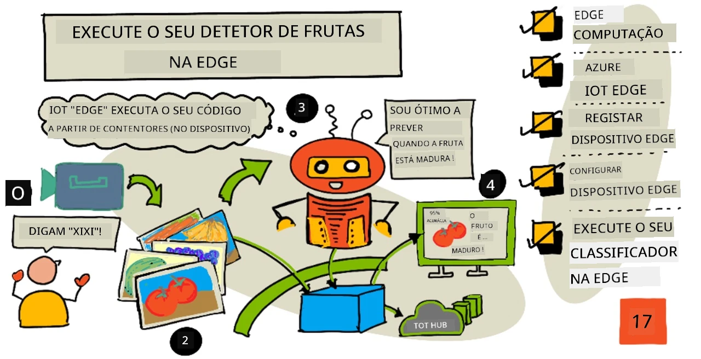
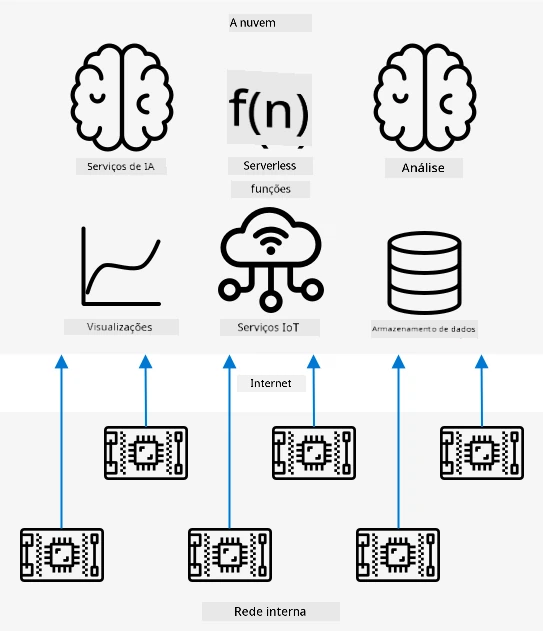
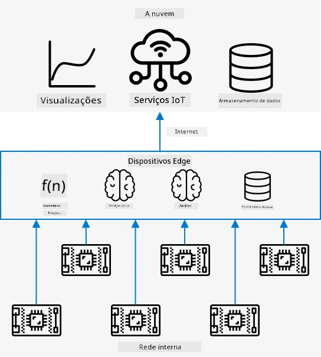
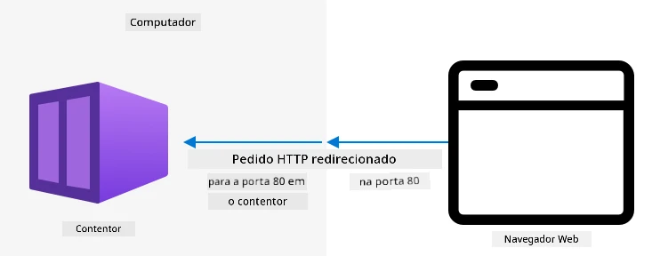
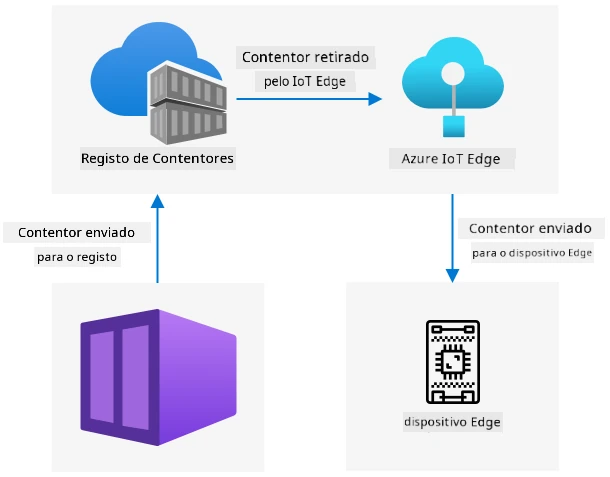

# Execute o seu detector de frutas na edge



> Ilustração por [Nitya Narasimhan](https://github.com/nitya). Clique na imagem para uma versão maior.

Este vídeo oferece uma visão geral sobre como executar classificadores de imagens em dispositivos IoT, o tema abordado nesta lição.

[](https://www.youtube.com/watch?v=_K5fqGLO8us)

## Questionário pré-aula

[Questionário pré-aula](https://black-meadow-040d15503.1.azurestaticapps.net/quiz/33)

## Introdução

Na última lição, utilizou o seu classificador de imagens para classificar frutas maduras e verdes, enviando uma imagem capturada pela câmara do seu dispositivo IoT através da internet para um serviço na nuvem. Estas chamadas demoram tempo, têm custos e, dependendo do tipo de dados de imagem que está a utilizar, podem ter implicações de privacidade.

Nesta lição, aprenderá como executar modelos de machine learning (ML) na edge - em dispositivos IoT que operam na sua própria rede, em vez de na nuvem. Aprenderá os benefícios e desvantagens da computação na edge em comparação com a computação na nuvem, como implementar o seu modelo de IA na edge e como aceder a este a partir do seu dispositivo IoT.

Nesta lição, abordaremos:

* [Computação na edge](../../../../../4-manufacturing/lessons/3-run-fruit-detector-edge)
* [Azure IoT Edge](../../../../../4-manufacturing/lessons/3-run-fruit-detector-edge)
* [Registar um dispositivo IoT Edge](../../../../../4-manufacturing/lessons/3-run-fruit-detector-edge)
* [Configurar um dispositivo IoT Edge](../../../../../4-manufacturing/lessons/3-run-fruit-detector-edge)
* [Exportar o seu modelo](../../../../../4-manufacturing/lessons/3-run-fruit-detector-edge)
* [Preparar o seu contentor para implementação](../../../../../4-manufacturing/lessons/3-run-fruit-detector-edge)
* [Implementar o seu contentor](../../../../../4-manufacturing/lessons/3-run-fruit-detector-edge)
* [Utilizar o seu dispositivo IoT Edge](../../../../../4-manufacturing/lessons/3-run-fruit-detector-edge)

## Computação na edge

A computação na edge envolve ter computadores que processam dados de IoT o mais próximo possível de onde os dados são gerados. Em vez de realizar este processamento na nuvem, ele é movido para a extremidade da nuvem - a sua rede interna.



Nas lições anteriores, teve dispositivos a recolher dados e a enviar esses dados para a nuvem para serem analisados, executando funções sem servidor ou modelos de IA na nuvem.



A computação na edge envolve mover alguns dos serviços da nuvem para computadores que operam na mesma rede que os dispositivos IoT, comunicando com a nuvem apenas quando necessário. Por exemplo, pode executar modelos de IA em dispositivos edge para analisar a maturação de frutas e enviar apenas análises para a nuvem, como o número de frutas maduras versus verdes.

✅ Pense nas aplicações de IoT que já construiu. Quais partes delas poderiam ser movidas para a edge?

### Vantagens

As vantagens da computação na edge são:

1. **Velocidade** - a computação na edge é ideal para dados sensíveis ao tempo, pois as ações são realizadas na mesma rede que o dispositivo, em vez de fazer chamadas pela internet. Isto permite velocidades mais altas, já que redes internas podem operar a velocidades substancialmente maiores do que conexões de internet, com os dados a percorrerem distâncias muito mais curtas.

    > 💁 Apesar de os cabos óticos usados em conexões de internet permitirem que os dados viajem à velocidade da luz, os dados podem demorar a viajar pelo mundo até aos fornecedores de nuvem. Por exemplo, se estiver a enviar dados da Europa para serviços na nuvem nos EUA, demora pelo menos 28ms para os dados atravessarem o Atlântico num cabo ótico, sem contar o tempo necessário para os dados chegarem ao cabo transatlântico, serem convertidos de sinais elétricos para óticos e vice-versa do outro lado, e depois do cabo ótico para o fornecedor de nuvem.

    A computação na edge também requer menos tráfego de rede, reduzindo o risco de os seus dados desacelerarem devido à congestão na largura de banda limitada disponível numa conexão de internet.

1. **Acessibilidade remota** - a computação na edge funciona quando tem conectividade limitada ou inexistente, ou quando a conectividade é demasiado cara para ser usada continuamente. Por exemplo, ao trabalhar em áreas de desastres humanitários onde a infraestrutura é limitada ou em países em desenvolvimento.

1. **Custos mais baixos** - realizar a recolha, armazenamento, análise de dados e ações em dispositivos edge reduz o uso de serviços na nuvem, o que pode diminuir o custo geral da sua aplicação de IoT. Tem havido um aumento recente de dispositivos projetados para computação na edge, como placas aceleradoras de IA, como a [Jetson Nano da NVIDIA](https://developer.nvidia.com/embedded/jetson-nano-developer-kit), que podem executar cargas de trabalho de IA usando hardware baseado em GPU em dispositivos que custam menos de 100 USD.

1. **Privacidade e segurança** - com a computação na edge, os dados permanecem na sua rede e não são carregados para a nuvem. Isto é frequentemente preferido para informações sensíveis e identificáveis pessoalmente, especialmente porque os dados não precisam de ser armazenados após serem analisados, o que reduz significativamente o risco de vazamento de dados. Exemplos incluem dados médicos e imagens de câmaras de segurança.

1. **Gestão de dispositivos inseguros** - se tiver dispositivos com falhas de segurança conhecidas que não deseja conectar diretamente à sua rede ou à internet, pode conectá-los a uma rede separada através de um dispositivo IoT Edge gateway. Este dispositivo edge pode então ter uma conexão com a sua rede mais ampla ou com a internet e gerir os fluxos de dados entre ambos.

1. **Suporte para dispositivos incompatíveis** - se tiver dispositivos que não podem conectar-se ao IoT Hub, por exemplo, dispositivos que só podem conectar-se usando conexões HTTP ou dispositivos que só têm Bluetooth para conectar, pode usar um dispositivo IoT Edge como gateway para encaminhar mensagens para o IoT Hub.

✅ Faça uma pesquisa: Quais outras vantagens podem existir na computação na edge?

### Desvantagens

Existem desvantagens na computação na edge, onde a nuvem pode ser uma opção preferida:

1. **Escalabilidade e flexibilidade** - a computação na nuvem pode ajustar-se às necessidades de rede e dados em tempo real, adicionando ou reduzindo servidores e outros recursos. Para adicionar mais computadores edge, é necessário adicionar dispositivos manualmente.

1. **Confiabilidade e resiliência** - a computação na nuvem oferece múltiplos servidores, frequentemente em várias localizações, para redundância e recuperação de desastres. Para ter o mesmo nível de redundância na edge, são necessários grandes investimentos e muito trabalho de configuração.

1. **Manutenção** - os fornecedores de serviços na nuvem fornecem manutenção e atualizações do sistema.

✅ Faça uma pesquisa: Quais outras desvantagens podem existir na computação na edge?

As desvantagens são, na verdade, o oposto das vantagens de usar a nuvem - tem de construir e gerir estes dispositivos por si mesmo, em vez de depender da experiência e escala dos fornecedores de nuvem.

Alguns dos riscos são mitigados pela própria natureza da computação na edge. Por exemplo, se tiver um dispositivo edge a operar numa fábrica a recolher dados de máquinas, não precisa de pensar em alguns cenários de recuperação de desastres. Se faltar energia na fábrica, não precisa de um dispositivo edge de backup, pois as máquinas que geram os dados que o dispositivo edge processa também estarão sem energia.

Para sistemas de IoT, muitas vezes desejará uma combinação de computação na nuvem e na edge, aproveitando cada serviço com base nas necessidades do sistema, dos seus clientes e dos seus mantenedores.

## Azure IoT Edge


O Azure IoT Edge é um serviço que pode ajudá-lo a mover cargas de trabalho da nuvem para a edge. Configura um dispositivo como um dispositivo edge e, a partir da nuvem, pode implementar código nesse dispositivo edge. Isto permite misturar as capacidades da nuvem e da edge.

> 🎓 *Cargas de trabalho* é um termo usado para qualquer serviço que realiza algum tipo de trabalho, como modelos de IA, aplicações ou funções sem servidor.

Por exemplo, pode treinar um classificador de imagens na nuvem e, em seguida, implementá-lo num dispositivo edge a partir da nuvem. O seu dispositivo IoT envia imagens para o dispositivo edge para classificação, em vez de enviar as imagens pela internet. Se precisar de implementar uma nova versão do modelo, pode treiná-lo na nuvem e usar o IoT Edge para atualizar o modelo no dispositivo edge para a nova versão.

> 🎓 O software que é implementado no IoT Edge é conhecido como *módulos*. Por padrão, o IoT Edge executa módulos que comunicam com o IoT Hub, como os módulos `edgeAgent` e `edgeHub`. Quando implementa um classificador de imagens, este é implementado como um módulo adicional.

O IoT Edge está integrado no IoT Hub, permitindo que os dispositivos edge sejam geridos usando o mesmo serviço que utilizaria para gerir dispositivos IoT, com o mesmo nível de segurança.

O IoT Edge executa código a partir de *contentores* - aplicações autónomas que são executadas isoladamente do resto das aplicações no seu computador. Quando executa um contentor, ele funciona como um computador separado dentro do seu computador, com o seu próprio software, serviços e aplicações em execução. Na maioria das vezes, os contentores não podem aceder a nada no seu computador, a menos que escolha partilhar algo, como uma pasta, com o contentor. O contentor expõe serviços através de uma porta aberta que pode ser conectada ou exposta à sua rede.



Por exemplo, pode ter um contentor com um site a funcionar na porta 80, a porta padrão do HTTP, e pode expô-lo no seu computador também na porta 80.

✅ Faça uma pesquisa: Leia sobre contentores e serviços como Docker ou Moby.

Pode usar o Custom Vision para descarregar classificadores de imagens e implementá-los como contentores, seja diretamente num dispositivo ou implementados via IoT Edge. Uma vez que estejam a funcionar num contentor, podem ser acedidos usando a mesma API REST que a versão na nuvem, mas com o endpoint apontando para o dispositivo Edge que executa o contentor.

## Registar um dispositivo IoT Edge

Para usar um dispositivo IoT Edge, é necessário registá-lo no IoT Hub.

### Tarefa - registar um dispositivo IoT Edge

1. Crie um IoT Hub no grupo de recursos `fruit-quality-detector`. Dê-lhe um nome único baseado em `fruit-quality-detector`.

1. Registe um dispositivo IoT Edge chamado `fruit-quality-detector-edge` no seu IoT Hub. O comando para fazer isto é semelhante ao usado para registar um dispositivo não-edge, exceto que passa o parâmetro `--edge-enabled`.

    ```sh
    az iot hub device-identity create --edge-enabled \
                                      --device-id fruit-quality-detector-edge \
                                      --hub-name <hub_name>
    ```

    Substitua `<hub_name>` pelo nome do seu IoT Hub.

1. Obtenha a string de conexão para o seu dispositivo usando o seguinte comando:

    ```sh
    az iot hub device-identity connection-string show --device-id fruit-quality-detector-edge \
                                                      --output table \
                                                      --hub-name <hub_name>
    ```

    Substitua `<hub_name>` pelo nome do seu IoT Hub.

    Copie a string de conexão exibida no output.

## Configurar um dispositivo IoT Edge

Depois de criar o registo do dispositivo edge no seu IoT Hub, pode configurar o dispositivo edge.

### Tarefa - Instalar e iniciar o IoT Edge Runtime

**O IoT Edge Runtime apenas executa contentores Linux.** Pode ser executado em Linux ou em Windows usando máquinas virtuais Linux.

* Se estiver a usar um Raspberry Pi como o seu dispositivo IoT, este executa uma versão suportada do Linux e pode hospedar o IoT Edge Runtime. Siga o [guia de instalação do Azure IoT Edge para Linux na documentação da Microsoft](https://docs.microsoft.com/azure/iot-edge/how-to-install-iot-edge?WT.mc_id=academic-17441-jabenn) para instalar o IoT Edge e configurar a string de conexão.

    > 💁 Lembre-se, o Raspberry Pi OS é uma variante do Debian Linux.

* Se não estiver a usar um Raspberry Pi, mas tiver um computador Linux, pode executar o IoT Edge Runtime. Siga o [guia de instalação do Azure IoT Edge para Linux na documentação da Microsoft](https://docs.microsoft.com/azure/iot-edge/how-to-install-iot-edge?WT.mc_id=academic-17441-jabenn) para instalar o IoT Edge e configurar a string de conexão.

* Se estiver a usar Windows, pode instalar o IoT Edge Runtime numa máquina virtual Linux seguindo a [secção de instalação e início do IoT Edge Runtime do guia rápido de implementação do seu primeiro módulo IoT Edge num dispositivo Windows na documentação da Microsoft](https://docs.microsoft.com/azure/iot-edge/quickstart?WT.mc_id=academic-17441-jabenn#install-and-start-the-iot-edge-runtime). Pode parar quando chegar à secção *Implementar um módulo*.

* Se estiver a usar macOS, pode criar uma máquina virtual (VM) na nuvem para usar como o seu dispositivo IoT Edge. Estas são computadores que pode criar na nuvem e aceder pela internet. Pode criar uma VM Linux que tenha o IoT Edge instalado. Siga o [guia para criar uma máquina virtual que execute o IoT Edge](vm-iotedge.md) para instruções sobre como fazer isto.

## Exportar o seu modelo

Para executar o classificador na edge, é necessário exportá-lo do Custom Vision. O Custom Vision pode gerar dois tipos de modelos - modelos padrão e modelos compactos. Os modelos compactos utilizam várias técnicas para reduzir o tamanho do modelo, tornando-o pequeno o suficiente para ser descarregado e implementado em dispositivos IoT.

Quando criou o classificador de imagens, utilizou o domínio *Food*, uma versão do modelo otimizada para treino em imagens de alimentos. No Custom Vision, pode alterar o domínio do seu projeto, utilizando os seus dados de treino para treinar um novo modelo com o novo domínio. Todos os domínios suportados pelo Custom Vision estão disponíveis como padrão e compacto.

### Tarefa - treinar o seu modelo usando o domínio Food (compacto)
1. Aceda ao portal do Custom Vision em [CustomVision.ai](https://customvision.ai) e inicie sessão, caso ainda não o tenha aberto. Em seguida, abra o seu projeto `fruit-quality-detector`.

1. Selecione o botão **Settings** (o ícone ⚙).

1. Na lista de *Domains*, selecione *Food (compact)*.

1. Em *Export Capabilities*, certifique-se de que a opção *Basic platforms (Tensorflow, CoreML, ONNX, ...)* está selecionada.

1. Na parte inferior da página de configurações, selecione **Save Changes**.

1. Re-treine o modelo com o botão **Train**, escolhendo a opção *Quick training*.

### Tarefa - exportar o seu modelo

Depois de treinar o modelo, será necessário exportá-lo como um contentor.

1. Selecione o separador **Performance** e encontre a iteração mais recente treinada com o domínio compacto.

1. Clique no botão **Export** no topo.

1. Escolha **DockerFile** e selecione uma versão compatível com o seu dispositivo edge:

    * Se estiver a executar o IoT Edge num computador Linux, Windows ou numa Máquina Virtual, selecione a versão *Linux*.
    * Se estiver a executar o IoT Edge num Raspberry Pi, selecione a versão *ARM (Raspberry Pi 3)*.

> 🎓 O Docker é uma das ferramentas mais populares para gerir contentores, e um DockerFile é um conjunto de instruções para configurar o contentor.

1. Clique em **Export** para que o Custom Vision crie os ficheiros necessários e, em seguida, clique em **Download** para os descarregar num ficheiro zip.

1. Guarde os ficheiros no seu computador e extraia a pasta.

## Preparar o seu contentor para implementação



Depois de descarregar o seu modelo, será necessário construí-lo num contentor e enviá-lo para um registo de contentores - um local online onde pode armazenar contentores. O IoT Edge pode então descarregar o contentor do registo e enviá-lo para o seu dispositivo.


O registo de contentores que será utilizado nesta lição é o Azure Container Registry. Este não é um serviço gratuito, por isso, para poupar dinheiro, certifique-se de que [limpa o seu projeto](../../../clean-up.md) assim que terminar.

> 💁 Pode consultar os custos de utilização do Azure Container Registry na [página de preços do Azure Container Registry](https://azure.microsoft.com/pricing/details/container-registry/?WT.mc_id=academic-17441-jabenn).

### Tarefa - instalar o Docker

Para construir e implementar o classificador, poderá ser necessário instalar o [Docker](https://www.docker.com/).

Só precisará de o fazer se planeia construir o contentor num dispositivo diferente daquele onde instalou o IoT Edge - como parte da instalação do IoT Edge, o Docker é instalado automaticamente.

1. Se estiver a construir o contentor Docker num dispositivo diferente do seu dispositivo IoT Edge, siga as instruções de instalação do Docker na [página de instalação do Docker](https://www.docker.com/products/docker-desktop) para instalar o Docker Desktop ou o motor Docker. Certifique-se de que está em execução após a instalação.

### Tarefa - criar um recurso de registo de contentores

1. Execute o seguinte comando no seu Terminal ou linha de comandos para criar um recurso Azure Container Registry:

    ```sh
    az acr create --resource-group fruit-quality-detector \
                  --sku Basic \
                  --name <Container registry name>
    ```

    Substitua `<Container registry name>` por um nome único para o seu registo de contentores, utilizando apenas letras e números. Baseie-se em `fruitqualitydetector`. Este nome fará parte do URL para aceder ao registo de contentores, pelo que precisa de ser globalmente único.

1. Inicie sessão no Azure Container Registry com o seguinte comando:

    ```sh
    az acr login --name <Container registry name>
    ```

    Substitua `<Container registry name>` pelo nome que utilizou para o seu registo de contentores.

1. Ative o modo de administrador no registo de contentores para gerar uma palavra-passe com o seguinte comando:

    ```sh
    az acr update --admin-enabled true \
                 --name <Container registry name>
    ```

    Substitua `<Container registry name>` pelo nome que utilizou para o seu registo de contentores.

1. Gere palavras-passe para o seu registo de contentores com o seguinte comando:

    ```sh
     az acr credential renew --password-name password \
                             --output table \
                             --name <Container registry name>
    ```

    Substitua `<Container registry name>` pelo nome que utilizou para o seu registo de contentores.

    Guarde o valor de `PASSWORD`, pois irá precisar dele mais tarde.

### Tarefa - construir o seu contentor

O que descarregou do Custom Vision foi um DockerFile com instruções sobre como o contentor deve ser construído, juntamente com o código da aplicação que será executado dentro do contentor para hospedar o seu modelo Custom Vision, bem como uma API REST para o chamar. Pode usar o Docker para construir um contentor com uma etiqueta a partir do DockerFile e, em seguida, enviá-lo para o seu registo de contentores.

> 🎓 Os contentores recebem uma etiqueta que define um nome e uma versão. Quando precisar de atualizar um contentor, pode construí-lo com a mesma etiqueta, mas com uma versão mais recente.

1. Abra o seu terminal ou linha de comandos e navegue até ao modelo extraído que descarregou do Custom Vision.

1. Execute o seguinte comando para construir e etiquetar a imagem:

    ```sh
    docker build --platform <platform> -t <Container registry name>.azurecr.io/classifier:v1 .
    ```

    Substitua `<platform>` pela plataforma onde este contentor será executado. Se estiver a executar o IoT Edge num Raspberry Pi, defina como `linux/armhf`, caso contrário, defina como `linux/amd64`.

    > 💁 Se estiver a executar este comando no dispositivo onde está a executar o IoT Edge, como no seu Raspberry Pi, pode omitir a parte `--platform <platform>`, pois o padrão será a plataforma atual.

    Substitua `<Container registry name>` pelo nome que utilizou para o seu registo de contentores.

    > 💁 Se estiver a executar no Linux ou no Raspberry Pi OS, poderá precisar de usar `sudo` para executar este comando.

    O Docker irá construir a imagem, configurando todo o software necessário. A imagem será então etiquetada como `classifier:v1`.

    ```output
    ➜  d4ccc45da0bb478bad287128e1274c3c.DockerFile.Linux docker build --platform linux/amd64 -t  fruitqualitydetectorjimb.azurecr.io/classifier:v1 .
    [+] Building 102.4s (11/11) FINISHED
     => [internal] load build definition from Dockerfile
     => => transferring dockerfile: 131B
     => [internal] load .dockerignore
     => => transferring context: 2B
     => [internal] load metadata for docker.io/library/python:3.7-slim
     => [internal] load build context
     => => transferring context: 905B
     => [1/6] FROM docker.io/library/python:3.7-slim@sha256:b21b91c9618e951a8cbca5b696424fa5e820800a88b7e7afd66bba0441a764d6
     => => resolve docker.io/library/python:3.7-slim@sha256:b21b91c9618e951a8cbca5b696424fa5e820800a88b7e7afd66bba0441a764d6
     => => sha256:b4d181a07f8025e00e0cb28f1cc14613da2ce26450b80c54aea537fa93cf3bda 27.15MB / 27.15MB
     => => sha256:de8ecf497b753094723ccf9cea8a46076e7cb845f333df99a6f4f397c93c6ea9 2.77MB / 2.77MB
     => => sha256:707b80804672b7c5d8f21e37c8396f319151e1298d976186b4f3b76ead9f10c8 10.06MB / 10.06MB
     => => sha256:b21b91c9618e951a8cbca5b696424fa5e820800a88b7e7afd66bba0441a764d6 1.86kB / 1.86kB
     => => sha256:44073386687709c437586676b572ff45128ff1f1570153c2f727140d4a9accad 1.37kB / 1.37kB
     => => sha256:3d94f0f2ca798607808b771a7766f47ae62a26f820e871dd488baeccc69838d1 8.31kB / 8.31kB
     => => sha256:283715715396fd56d0e90355125fd4ec57b4f0773f306fcd5fa353b998beeb41 233B / 233B
     => => sha256:8353afd48f6b84c3603ea49d204bdcf2a1daada15f5d6cad9cc916e186610a9f 2.64MB / 2.64MB
     => => extracting sha256:b4d181a07f8025e00e0cb28f1cc14613da2ce26450b80c54aea537fa93cf3bda
     => => extracting sha256:de8ecf497b753094723ccf9cea8a46076e7cb845f333df99a6f4f397c93c6ea9
     => => extracting sha256:707b80804672b7c5d8f21e37c8396f319151e1298d976186b4f3b76ead9f10c8
     => => extracting sha256:283715715396fd56d0e90355125fd4ec57b4f0773f306fcd5fa353b998beeb41
     => => extracting sha256:8353afd48f6b84c3603ea49d204bdcf2a1daada15f5d6cad9cc916e186610a9f
     => [2/6] RUN pip install -U pip
     => [3/6] RUN pip install --no-cache-dir numpy~=1.17.5 tensorflow~=2.0.2 flask~=1.1.2 pillow~=7.2.0
     => [4/6] RUN pip install --no-cache-dir mscviplib==2.200731.16
     => [5/6] COPY app /app
     => [6/6] WORKDIR /app
     => exporting to image
     => => exporting layers
     => => writing image sha256:1846b6f134431f78507ba7c079358ed66d944c0e185ab53428276bd822400386
     => => naming to fruitqualitydetectorjimb.azurecr.io/classifier:v1
    ```

### Tarefa - enviar o seu contentor para o registo de contentores

1. Use o seguinte comando para enviar o seu contentor para o registo de contentores:

    ```sh
    docker push <Container registry name>.azurecr.io/classifier:v1
    ```

    Substitua `<Container registry name>` pelo nome que utilizou para o seu registo de contentores.

    > 💁 Se estiver a executar no Linux, poderá precisar de usar `sudo` para executar este comando.

    O contentor será enviado para o registo de contentores.

    ```output
    ➜  d4ccc45da0bb478bad287128e1274c3c.DockerFile.Linux docker push fruitqualitydetectorjimb.azurecr.io/classifier:v1
    The push refers to repository [fruitqualitydetectorjimb.azurecr.io/classifier]
    5f70bf18a086: Pushed 
    8a1ba9294a22: Pushed 
    56cf27184a76: Pushed 
    b32154f3f5dd: Pushed 
    36103e9a3104: Pushed 
    e2abb3cacca0: Pushed 
    4213fd357bbe: Pushed 
    7ea163ba4dce: Pushed 
    537313a13d90: Pushed 
    764055ebc9a7: Pushed 
    v1: digest: sha256:ea7894652e610de83a5a9e429618e763b8904284253f4fa0c9f65f0df3a5ded8 size: 2423
    ```

1. Para verificar o envio, pode listar os contentores no seu registo com o seguinte comando:

    ```sh
    az acr repository list --output table \
                           --name <Container registry name> 
    ```

    Substitua `<Container registry name>` pelo nome que utilizou para o seu registo de contentores.

    ```output
    ➜  d4ccc45da0bb478bad287128e1274c3c.DockerFile.Linux az acr repository list --name fruitqualitydetectorjimb --output table
    Result
    ----------
    classifier
    ```

    Verá o seu classificador listado na saída.

## Implementar o seu contentor

O seu contentor pode agora ser implementado no seu dispositivo IoT Edge. Para implementar, é necessário definir um manifesto de implementação - um documento JSON que lista os módulos que serão implementados no dispositivo edge.

### Tarefa - criar o manifesto de implementação

1. Crie um novo ficheiro chamado `deployment.json` em algum lugar no seu computador.

1. Adicione o seguinte ao ficheiro:

    ```json
    {
        "content": {
            "modulesContent": {
                "$edgeAgent": {
                    "properties.desired": {
                        "schemaVersion": "1.1",
                        "runtime": {
                            "type": "docker",
                            "settings": {
                                "minDockerVersion": "v1.25",
                                "loggingOptions": "",
                                "registryCredentials": {
                                    "ClassifierRegistry": {
                                        "username": "<Container registry name>",
                                        "password": "<Container registry password>",
                                        "address": "<Container registry name>.azurecr.io"
                                      }
                                }
                            }
                        },
                        "systemModules": {
                            "edgeAgent": {
                                "type": "docker",
                                "settings": {
                                    "image": "mcr.microsoft.com/azureiotedge-agent:1.1",
                                    "createOptions": "{}"
                                }
                            },
                            "edgeHub": {
                                "type": "docker",
                                "status": "running",
                                "restartPolicy": "always",
                                "settings": {
                                    "image": "mcr.microsoft.com/azureiotedge-hub:1.1",
                                    "createOptions": "{\"HostConfig\":{\"PortBindings\":{\"5671/tcp\":[{\"HostPort\":\"5671\"}],\"8883/tcp\":[{\"HostPort\":\"8883\"}],\"443/tcp\":[{\"HostPort\":\"443\"}]}}}"
                                }
                            }
                        },
                        "modules": {
                            "ImageClassifier": {
                                "version": "1.0",
                                "type": "docker",
                                "status": "running",
                                "restartPolicy": "always",
                                "settings": {
                                    "image": "<Container registry name>.azurecr.io/classifier:v1",
                                    "createOptions": "{\"ExposedPorts\": {\"80/tcp\": {}},\"HostConfig\": {\"PortBindings\": {\"80/tcp\": [{\"HostPort\": \"80\"}]}}}"
                                }
                            }
                        }
                    }
                },
                "$edgeHub": {
                    "properties.desired": {
                        "schemaVersion": "1.1",
                        "routes": {
                            "upstream": "FROM /messages/* INTO $upstream"
                        },
                        "storeAndForwardConfiguration": {
                            "timeToLiveSecs": 7200
                        }
                    }
                }
            }
        }
    }
    ```

    > 💁 Pode encontrar este ficheiro na pasta [code-deployment/deployment](../../../../../4-manufacturing/lessons/3-run-fruit-detector-edge/code-deployment/deployment).

    Substitua as três instâncias de `<Container registry name>` pelo nome que utilizou para o seu registo de contentores. Uma está na secção do módulo `ImageClassifier`, as outras duas estão na secção `registryCredentials`.

    Substitua `<Container registry password>` na secção `registryCredentials` pela palavra-passe do seu registo de contentores.

1. A partir da pasta que contém o seu manifesto de implementação, execute o seguinte comando:

    ```sh
    az iot edge set-modules --device-id fruit-quality-detector-edge \
                            --content deployment.json \
                            --hub-name <hub_name>
    ```

    Substitua `<hub_name>` pelo nome do seu IoT Hub.

    O módulo do classificador de imagens será implementado no seu dispositivo edge.

### Tarefa - verificar se o classificador está a funcionar

1. Conecte-se ao dispositivo IoT Edge:

    * Se estiver a usar um Raspberry Pi para executar o IoT Edge, conecte-se via SSH a partir do seu terminal ou através de uma sessão remota SSH no VS Code.
    * Se estiver a executar o IoT Edge num contentor Linux no Windows, siga os passos no [guia de verificação de configuração bem-sucedida](https://docs.microsoft.com/azure/iot-edge/how-to-install-iot-edge-on-windows?WT.mc_id=academic-17441-jabenn&view=iotedge-2018-06&tabs=powershell#verify-successful-configuration) para se conectar ao dispositivo IoT Edge.
    * Se estiver a executar o IoT Edge numa máquina virtual, pode usar SSH para aceder à máquina utilizando o `adminUsername` e a `password` definidos ao criar a VM, e usando o endereço IP ou o nome DNS:

        ```sh
        ssh <adminUsername>@<IP address>
        ```

        Ou:

        ```sh
        ssh <adminUsername>@<DNS Name>
        ```

        Insira a sua palavra-passe quando solicitado.

1. Uma vez conectado, execute o seguinte comando para obter a lista de módulos IoT Edge:

    ```sh
    iotedge list
    ```

    > 💁 Poderá precisar de executar este comando com `sudo`.

    Verá os módulos em execução:

    ```output
    jim@fruit-quality-detector-jimb:~$ iotedge list
    NAME             STATUS           DESCRIPTION      CONFIG
    ImageClassifier  running          Up 42 minutes    fruitqualitydetectorjimb.azurecr.io/classifier:v1
    edgeAgent        running          Up 42 minutes    mcr.microsoft.com/azureiotedge-agent:1.1
    edgeHub          running          Up 42 minutes    mcr.microsoft.com/azureiotedge-hub:1.1
    ```

1. Verifique os registos do módulo do classificador de imagens com o seguinte comando:

    ```sh
    iotedge logs ImageClassifier
    ```

    > 💁 Poderá precisar de executar este comando com `sudo`.

    ```output
    jim@fruit-quality-detector-jimb:~$ iotedge logs ImageClassifier
    2021-07-05 20:30:15.387144: I tensorflow/core/platform/cpu_feature_guard.cc:142] Your CPU supports instructions that this TensorFlow binary was not compiled to use: AVX2 FMA
    2021-07-05 20:30:15.392185: I tensorflow/core/platform/profile_utils/cpu_utils.cc:94] CPU Frequency: 2394450000 Hz
    2021-07-05 20:30:15.392712: I tensorflow/compiler/xla/service/service.cc:168] XLA service 0x55ed9ac83470 executing computations on platform Host. Devices:
    2021-07-05 20:30:15.392806: I tensorflow/compiler/xla/service/service.cc:175]   StreamExecutor device (0): Host, Default Version
    Loading model...Success!
    Loading labels...2 found. Success!
     * Serving Flask app "app" (lazy loading)
     * Environment: production
       WARNING: This is a development server. Do not use it in a production deployment.
       Use a production WSGI server instead.
     * Debug mode: off
     * Running on http://0.0.0.0:80/ (Press CTRL+C to quit)
    ```

### Tarefa - testar o classificador de imagens

1. Pode usar o CURL para testar o classificador de imagens utilizando o endereço IP ou o nome do host do computador que está a executar o agente IoT Edge. Encontre o endereço IP:

    * Se estiver no mesmo dispositivo onde o IoT Edge está a ser executado, pode usar `localhost` como nome do host.
    * Se estiver a usar uma VM, pode usar o endereço IP ou o nome DNS da VM.
    * Caso contrário, pode obter o endereço IP do dispositivo que está a executar o IoT Edge:
      * No Windows 10, siga o [guia para encontrar o seu endereço IP](https://support.microsoft.com/windows/find-your-ip-address-f21a9bbc-c582-55cd-35e0-73431160a1b9?WT.mc_id=academic-17441-jabenn).
      * No macOS, siga o [guia para encontrar o endereço IP num Mac](https://www.hellotech.com/guide/for/how-to-find-ip-address-on-mac).
      * No Linux, siga a secção sobre encontrar o endereço IP privado no [guia para encontrar o endereço IP no Linux](https://opensource.com/article/18/5/how-find-ip-address-linux).

1. Pode testar o contentor com um ficheiro local executando o seguinte comando curl:

    ```sh
    curl --location \
         --request POST 'http://<IP address or name>/image' \
         --header 'Content-Type: image/png' \
         --data-binary '@<file_Name>' 
    ```

    Substitua `<IP address or name>` pelo endereço IP ou nome do host do computador que está a executar o IoT Edge. Substitua `<file_Name>` pelo nome do ficheiro a testar.

    Verá os resultados da previsão na saída:

    ```output
    {
        "created": "2021-07-05T21:44:39.573181",
        "id": "",
        "iteration": "",
        "predictions": [
            {
                "boundingBox": null,
                "probability": 0.9995615482330322,
                "tagId": "",
                "tagName": "ripe"
            },
            {
                "boundingBox": null,
                "probability": 0.0004384400090202689,
                "tagId": "",
                "tagName": "unripe"
            }
        ],
        "project": ""
    }
    ```

    > 💁 Não é necessário fornecer uma chave de previsão aqui, pois não está a usar um recurso Azure. Em vez disso, a segurança seria configurada na rede interna com base nas necessidades de segurança internas, em vez de depender de um ponto final público e de uma chave API.

## Usar o seu dispositivo IoT Edge

Agora que o seu classificador de imagens foi implementado num dispositivo IoT Edge, pode utilizá-lo a partir do seu dispositivo IoT.

### Tarefa - usar o seu dispositivo IoT Edge

Siga o guia relevante para classificar imagens usando o classificador IoT Edge:

* [Arduino - Wio Terminal](wio-terminal.md)
* [Computador de placa única - Raspberry Pi/Dispositivo IoT Virtual](single-board-computer.md)

### Re-treino do modelo

Uma das desvantagens de executar classificadores de imagens no IoT Edge é que eles não estão conectados ao seu projeto Custom Vision. Se verificar o separador **Predictions** no Custom Vision, não verá as imagens classificadas usando o classificador baseado no Edge.

Este é o comportamento esperado - as imagens não são enviadas para a cloud para classificação, por isso não estarão disponíveis na cloud. Uma das vantagens de usar o IoT Edge é a privacidade, garantindo que as imagens não saem da sua rede. Outra vantagem é poder trabalhar offline, sem depender de carregar imagens quando o dispositivo não tem ligação à internet. A desvantagem é melhorar o seu modelo - seria necessário implementar outra forma de armazenar imagens que possam ser reclassificadas manualmente para melhorar e re-treinar o classificador de imagens.

✅ Pense em formas de carregar imagens para re-treinar o classificador.

---

## 🚀 Desafio

Executar modelos de IA em dispositivos edge pode ser mais rápido do que na cloud - o salto na rede é mais curto. Também pode ser mais lento, pois o hardware que executa o modelo pode não ser tão poderoso quanto o da cloud.

Faça medições de tempo e compare se a chamada para o seu dispositivo edge é mais rápida ou mais lenta do que a chamada para a cloud. Pense em razões para explicar a diferença, ou a falta dela. Pesquise formas de executar modelos de IA mais rapidamente no edge usando hardware especializado.

## Questionário pós-aula

[Questionário pós-aula](https://black-meadow-040d15503.1.azurestaticapps.net/quiz/34)

## Revisão e Autoestudo

* Leia mais sobre contentores na [página de virtualização ao nível do sistema operativo na Wikipedia](https://wikipedia.org/wiki/OS-level_virtualization).
* Leia mais sobre computação de edge, com ênfase em como o 5G pode ajudar a expandir a computação de edge no [artigo "o que é computação de edge e por que é importante?" no NetworkWorld](https://www.networkworld.com/article/3224893/what-is-edge-computing-and-how-its-changing-the-network.html)
* Saiba mais sobre como executar serviços de IA no IoT Edge assistindo ao [episódio "aprenda a usar o Azure IoT Edge num serviço de IA pré-construído no Edge para deteção de linguagem" do Learn Live no Microsoft Channel9](https://channel9.msdn.com/Shows/Learn-Live/Sharpen-Your-AI-Edge-Skills-Episode-4-Learn-How-to-Use-Azure-IoT-Edge-on-a-Pre-Built-AI-Service-on-t?WT.mc_id=academic-17441-jabenn)

## Tarefa

[Execute outros serviços no edge](assignment.md)

**Aviso Legal**:  
Este documento foi traduzido utilizando o serviço de tradução por IA [Co-op Translator](https://github.com/Azure/co-op-translator). Embora nos esforcemos para garantir a precisão, é importante notar que traduções automáticas podem conter erros ou imprecisões. O documento original na sua língua nativa deve ser considerado a fonte autoritária. Para informações críticas, recomenda-se a tradução profissional realizada por humanos. Não nos responsabilizamos por quaisquer mal-entendidos ou interpretações incorretas decorrentes da utilização desta tradução.