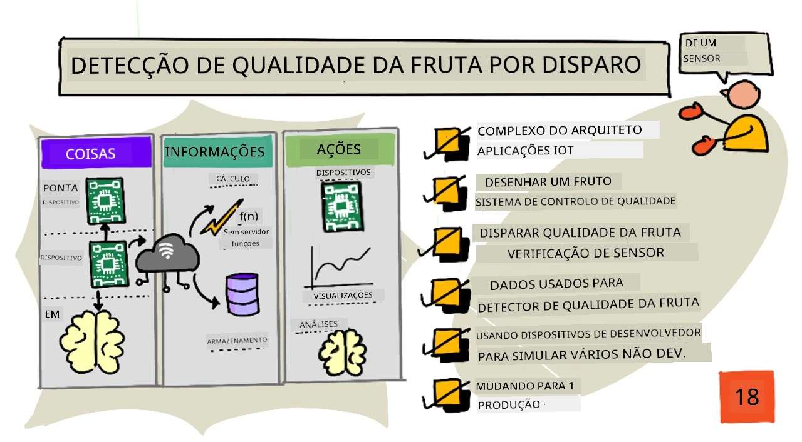
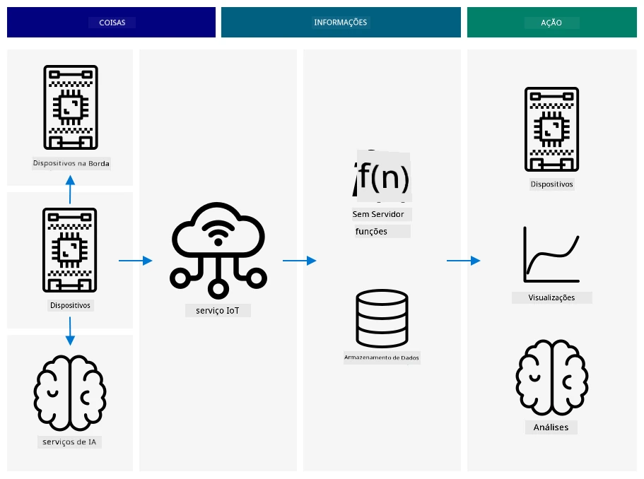
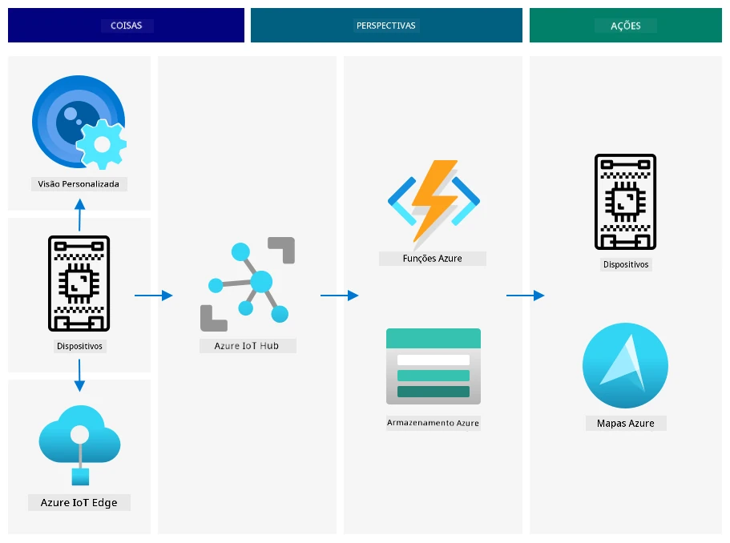
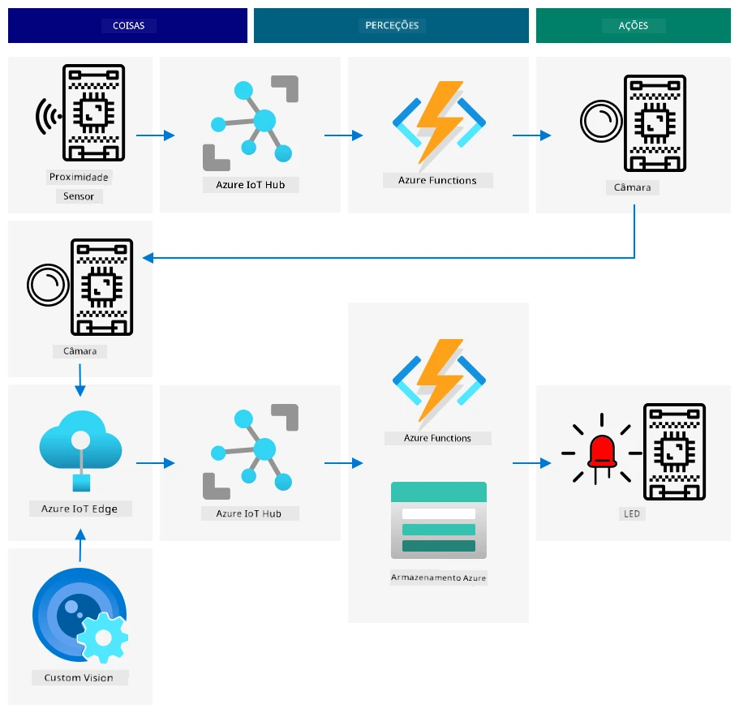
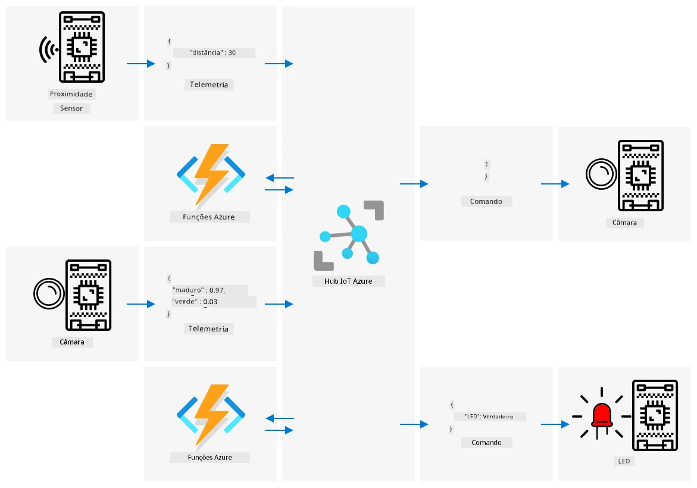

# Detetar a qualidade da fruta através de um sensor



> Ilustração por [Nitya Narasimhan](https://github.com/nitya). Clique na imagem para uma versão maior.

## Questionário pré-aula

[Questionário pré-aula](https://black-meadow-040d15503.1.azurestaticapps.net/quiz/35)

## Introdução

Uma aplicação IoT não é apenas um único dispositivo a capturar dados e enviá-los para a nuvem; frequentemente envolve múltiplos dispositivos a trabalhar em conjunto para capturar dados do mundo físico através de sensores, tomar decisões com base nesses dados e interagir com o mundo físico através de atuadores ou visualizações.

Nesta lição, vais aprender mais sobre como arquitetar aplicações IoT complexas, incorporando múltiplos sensores, vários serviços na nuvem para analisar e armazenar dados, e mostrar uma resposta através de um atuador. Vais aprender a arquitetar um protótipo de sistema de controlo de qualidade de fruta, incluindo o uso de sensores de proximidade para ativar a aplicação IoT e como seria a arquitetura deste protótipo.

Nesta lição, vamos abordar:

* [Arquitetar aplicações IoT complexas](../../../../../4-manufacturing/lessons/4-trigger-fruit-detector)
* [Desenhar um sistema de controlo de qualidade de fruta](../../../../../4-manufacturing/lessons/4-trigger-fruit-detector)
* [Ativar a verificação da qualidade da fruta através de um sensor](../../../../../4-manufacturing/lessons/4-trigger-fruit-detector)
* [Dados utilizados para um detetor de qualidade de fruta](../../../../../4-manufacturing/lessons/4-trigger-fruit-detector)
* [Usar dispositivos de desenvolvimento para simular múltiplos dispositivos IoT](../../../../../4-manufacturing/lessons/4-trigger-fruit-detector)
* [Passar para produção](../../../../../4-manufacturing/lessons/4-trigger-fruit-detector)

> 🗑 Esta é a última lição deste projeto, por isso, depois de completares esta lição e o exercício, não te esqueças de limpar os serviços na nuvem. Vais precisar dos serviços para completar o exercício, por isso certifica-te de que o concluis primeiro.
>
> Consulta [o guia de limpeza do projeto](../../../clean-up.md) se necessário para obter instruções sobre como fazer isto.

## Arquitetar aplicações IoT complexas

As aplicações IoT são compostas por muitos componentes, incluindo uma variedade de dispositivos e serviços na internet.

As aplicações IoT podem ser descritas como *coisas* (dispositivos) que enviam dados que geram *insights*. Esses *insights* geram *ações* para melhorar um negócio ou processo. Um exemplo é um motor (a coisa) que envia dados de temperatura. Esses dados são usados para avaliar se o motor está a funcionar como esperado (o insight). O insight é usado para priorizar proativamente o cronograma de manutenção do motor (a ação).

* Diferentes coisas recolhem diferentes tipos de dados.
* Os serviços IoT fornecem insights sobre esses dados, por vezes complementando-os com dados de fontes adicionais.
* Esses insights impulsionam ações, incluindo o controlo de atuadores em dispositivos ou a visualização de dados.

### Arquitetura de referência IoT



O diagrama acima mostra uma arquitetura de referência IoT.

> 🎓 Uma *arquitetura de referência* é um exemplo de arquitetura que podes usar como referência ao desenhar novos sistemas. Neste caso, se estivesses a construir um novo sistema IoT, poderias seguir a arquitetura de referência, substituindo os dispositivos e serviços pelos teus próprios, conforme necessário.

* **Coisas** são dispositivos que recolhem dados de sensores, podendo interagir com serviços na periferia para interpretar esses dados, como classificadores de imagem para interpretar dados de imagem. Os dados dos dispositivos são enviados para um serviço IoT.
* **Insights** vêm de aplicações sem servidor ou de análises realizadas sobre dados armazenados.
* **Ações** podem ser comandos enviados para dispositivos ou visualizações de dados que permitem que os humanos tomem decisões.



O diagrama acima mostra alguns dos componentes e serviços abordados até agora nestas lições e como se ligam numa arquitetura de referência IoT.

* **Coisas** - escreveste código para dispositivos que capturam dados de sensores e analisam imagens usando o Custom Vision, tanto na nuvem como num dispositivo na periferia. Esses dados foram enviados para o IoT Hub.
* **Insights** - usaste Azure Functions para responder a mensagens enviadas para um IoT Hub e armazenaste dados para análise posterior no Azure Storage.
* **Ações** - controlaste atuadores com base em decisões tomadas na nuvem e comandos enviados para os dispositivos, e visualizaste dados usando Azure Maps.

✅ Pensa noutros dispositivos IoT que já utilizaste, como eletrodomésticos inteligentes. Quais são as coisas, insights e ações envolvidos nesses dispositivos e no seu software?

Este padrão pode ser ampliado conforme necessário, adicionando mais dispositivos e mais serviços.

### Dados e segurança

Ao definires a arquitetura do teu sistema, precisas de considerar constantemente os dados e a segurança.

* Que dados o teu dispositivo envia e recebe?
* Como esses dados devem ser protegidos e mantidos seguros?
* Como deve ser controlado o acesso ao dispositivo e ao serviço na nuvem?

✅ Pensa na segurança dos dados de qualquer dispositivo IoT que possuas. Quantos desses dados são pessoais e devem ser mantidos privados, tanto em trânsito como quando armazenados? Que dados não devem ser armazenados?

## Desenhar um sistema de controlo de qualidade de fruta

Vamos agora aplicar a ideia de coisas, insights e ações ao nosso detetor de qualidade de fruta para desenhar uma aplicação maior de ponta a ponta.

Imagina que te foi dada a tarefa de construir um detetor de qualidade de fruta para ser usado numa fábrica de processamento. A fruta viaja num sistema de tapete rolante onde atualmente os funcionários passam tempo a verificar a fruta manualmente e a remover qualquer fruta não madura à medida que chega. Para reduzir custos, o proprietário da fábrica quer um sistema automatizado.

✅ Uma das tendências com o aumento do IoT (e da tecnologia em geral) é que trabalhos manuais estão a ser substituídos por máquinas. Faz alguma pesquisa: Quantos empregos estão estimados a ser perdidos devido ao IoT? Quantos novos empregos serão criados para construir dispositivos IoT?

Precisas de construir um sistema onde a fruta é detetada à medida que chega ao tapete rolante, é fotografada e verificada usando um modelo de IA a funcionar na periferia. Os resultados são enviados para a nuvem para serem armazenados e, se a fruta estiver não madura, é emitida uma notificação para que a fruta não madura possa ser removida.

|   |   |
| - | - |
| **Coisas** | Detetor para fruta a chegar ao tapete rolante<br>Câmara para fotografar e classificar a fruta<br>Dispositivo na periferia a executar o classificador<br>Dispositivo para notificar sobre fruta não madura |
| **Insights** | Decidir verificar a maturidade da fruta<br>Armazenar os resultados da classificação de maturidade<br>Determinar se é necessário alertar sobre fruta não madura |
| **Ações** | Enviar um comando para um dispositivo fotografar a fruta e verificá-la com um classificador de imagem<br>Enviar um comando para um dispositivo alertar que a fruta está não madura |

### Prototipar a tua aplicação



O diagrama acima mostra uma arquitetura de referência para esta aplicação protótipo.

* Um dispositivo IoT com um sensor de proximidade deteta a chegada da fruta. Este envia uma mensagem para a nuvem a indicar que foi detetada fruta.
* Uma aplicação sem servidor na nuvem envia um comando para outro dispositivo tirar uma fotografia e classificar a imagem.
* Um dispositivo IoT com uma câmara tira uma fotografia e envia-a para um classificador de imagem a funcionar na periferia. Os resultados são então enviados para a nuvem.
* Uma aplicação sem servidor na nuvem armazena esta informação para ser analisada mais tarde e verificar que percentagem da fruta está não madura. Se a fruta estiver não madura, envia um comando para outro dispositivo IoT alertar os trabalhadores da fábrica através de um LED.

> 💁 Toda esta aplicação IoT poderia ser implementada como um único dispositivo, com toda a lógica para iniciar a classificação de imagem e controlar o LED integrada. Poderia usar um IoT Hub apenas para rastrear o número de frutas não maduras detetadas e configurar o dispositivo. Nesta lição, é expandida para demonstrar os conceitos de aplicações IoT em grande escala.

Para o protótipo, vais implementar tudo isto num único dispositivo. Se estiveres a usar um microcontrolador, então vais usar um dispositivo na periferia separado para executar o classificador de imagem. Já aprendeste a maior parte das coisas que vais precisar para construir isto.

## Ativar a verificação da qualidade da fruta através de um sensor

O dispositivo IoT precisa de algum tipo de gatilho para indicar quando a fruta está pronta para ser classificada. Um gatilho para isto seria medir quando a fruta está na posição certa no tapete rolante, medindo a distância até um sensor.


Sensores de proximidade podem ser usados para medir a distância entre o sensor e um objeto. Normalmente, transmitem um feixe de radiação eletromagnética, como um feixe de laser ou luz infravermelha, e depois detetam a radiação refletida por um objeto. O tempo entre o envio do feixe de laser e o sinal refletido pode ser usado para calcular a distância até ao sensor.

> 💁 Provavelmente já usaste sensores de proximidade sem sequer saber. A maioria dos smartphones desliga o ecrã quando os encostas ao ouvido para evitar que termines acidentalmente uma chamada com o lóbulo da orelha, e isto funciona com um sensor de proximidade, que deteta um objeto próximo do ecrã durante uma chamada e desativa as capacidades de toque até o telefone estar a uma certa distância.

### Tarefa - ativar a deteção de qualidade da fruta com um sensor de distância

Segue o guia relevante para usar um sensor de proximidade e detetar um objeto usando o teu dispositivo IoT:

* [Arduino - Wio Terminal](wio-terminal-proximity.md)
* [Computador de placa única - Raspberry Pi](pi-proximity.md)
* [Computador de placa única - Dispositivo virtual](virtual-device-proximity.md)

## Dados utilizados para um detetor de qualidade de fruta

O protótipo do detetor de fruta tem múltiplos componentes a comunicar entre si.



* Um sensor de proximidade que mede a distância até uma peça de fruta e envia esta informação para o IoT Hub
* O comando para controlar a câmara vindo do IoT Hub para o dispositivo da câmara
* Os resultados da classificação de imagem enviados para o IoT Hub
* O comando para controlar um LED para alertar quando a fruta está não madura enviado do IoT Hub para o dispositivo com o LED

É bom definir a estrutura destas mensagens antecipadamente, antes de construíres a aplicação.

> 💁 Praticamente todos os programadores experientes já passaram horas, dias ou até semanas a resolver problemas causados por diferenças entre os dados enviados e os dados esperados.

Por exemplo - se estás a enviar informações de temperatura, como definirias o JSON? Poderias ter um campo chamado `temperature`, ou poderias usar a abreviação comum `temp`.

```json
{
    "temperature": 20.7
}
```

comparado com:

```json
{
    "temp": 20.7
}
```

Também tens de considerar as unidades - a temperatura está em °C ou °F? Se estiveres a medir a temperatura com um dispositivo de consumidor e este mudar as unidades exibidas, precisas de garantir que as unidades enviadas para a nuvem permanecem consistentes.

✅ Faz alguma pesquisa: Como é que problemas com unidades causaram o acidente do Mars Climate Orbiter de $125 milhões?

Pensa nos dados que estão a ser enviados para o detetor de qualidade de fruta. Como definirias cada mensagem? Onde analisarias os dados e tomarias decisões sobre que dados enviar?

Por exemplo - ativar a classificação de imagem usando o sensor de proximidade. O dispositivo IoT mede a distância, mas onde é tomada a decisão? O dispositivo decide que a fruta está suficientemente próxima e envia uma mensagem para o IoT Hub para ativar a classificação? Ou envia medições de proximidade e deixa o IoT Hub decidir?

A resposta a perguntas como esta é - depende. Cada caso de uso é diferente, por isso, como programador IoT, precisas de entender o sistema que estás a construir, como é usado e os dados que estão a ser detetados.

* Se a decisão for tomada pelo IoT Hub, precisas de enviar múltiplas medições de distância.
* Se enviares demasiadas mensagens, aumentas o custo do IoT Hub e a quantidade de largura de banda necessária pelos teus dispositivos IoT (especialmente numa fábrica com milhões de dispositivos). Também pode abrandar o teu dispositivo.
* Se tomares a decisão no dispositivo, precisas de fornecer uma forma de configurar o dispositivo para ajustar a máquina.

## Usar dispositivos de desenvolvimento para simular múltiplos dispositivos IoT

Para construir o teu protótipo, vais precisar que o teu kit de desenvolvimento IoT funcione como múltiplos dispositivos, enviando telemetria e respondendo a comandos.

### Simular múltiplos dispositivos IoT num Raspberry Pi ou hardware IoT virtual

Ao usar um computador de placa única como um Raspberry Pi, podes executar múltiplas aplicações ao mesmo tempo. Isto significa que podes simular múltiplos dispositivos IoT criando múltiplas aplicações, uma por 'dispositivo IoT'. Por exemplo, podes implementar cada dispositivo como um ficheiro Python separado e executá-los em diferentes sessões de terminal.
> 💁 Esteja ciente de que alguns dispositivos de hardware não funcionarão quando forem acedidos por várias aplicações a correr simultaneamente.
### Simular múltiplos dispositivos num microcontrolador

Os microcontroladores são mais complicados para simular múltiplos dispositivos. Ao contrário dos computadores de placa única, não é possível executar várias aplicações ao mesmo tempo; é necessário incluir toda a lógica para todos os dispositivos IoT num único programa.

Algumas sugestões para facilitar este processo são:

* Criar uma ou mais classes para cada dispositivo IoT - por exemplo, classes chamadas `DistanceSensor`, `ClassifierCamera`, `LEDController`. Cada uma pode ter os seus próprios métodos `setup` e `loop`, que são chamados pelas funções principais `setup` e `loop`.
* Gerir os comandos num único local e direcioná-los para a classe de dispositivo relevante, conforme necessário.
* Na função principal `loop`, será necessário considerar o tempo de execução de cada dispositivo. Por exemplo, se tiver uma classe de dispositivo que precisa de ser processada a cada 10 segundos e outra que precisa de ser processada a cada 1 segundo, então na função principal `loop` utilize um atraso de 1 segundo. Cada chamada de `loop` aciona o código relevante para o dispositivo que precisa de ser processado a cada segundo e utiliza um contador para contar cada ciclo, processando o outro dispositivo quando o contador atingir 10 (reiniciando o contador depois disso).

## Passar para produção

O protótipo será a base de um sistema final de produção. Algumas das diferenças ao passar para produção incluem:

* Componentes robustos - utilização de hardware projetado para resistir ao ruído, calor, vibração e stress de uma fábrica.
* Utilização de comunicações internas - alguns dos componentes comunicariam diretamente, evitando o salto para a nuvem, enviando dados para a nuvem apenas para armazenamento. Como isso é feito depende da configuração da fábrica, seja através de comunicações diretas ou executando parte do serviço IoT na borda utilizando um dispositivo gateway.
* Opções de configuração - cada fábrica e caso de uso são diferentes, por isso o hardware precisaria ser configurável. Por exemplo, o sensor de proximidade pode precisar de detetar diferentes frutas a diferentes distâncias. Em vez de codificar a distância para acionar a classificação, seria ideal que isso fosse configurável através da nuvem, por exemplo, utilizando um device twin.
* Remoção automatizada de frutas - em vez de utilizar um LED para alertar que a fruta está verde, dispositivos automatizados removeriam a fruta.

✅ Faça alguma pesquisa: De que outras formas os dispositivos de produção diferem dos kits de desenvolvimento?

---

## 🚀 Desafio

Nesta lição, aprendeu alguns dos conceitos necessários para arquitetar um sistema IoT. Pense nos projetos anteriores. Como se encaixam na arquitetura de referência apresentada acima?

Escolha um dos projetos realizados até agora e pense no design de uma solução mais complexa que combine múltiplas capacidades além do que foi abordado nos projetos. Desenhe a arquitetura e pense em todos os dispositivos e serviços necessários.

Por exemplo - um dispositivo de rastreamento de veículos que combina GPS com sensores para monitorizar coisas como temperaturas num camião refrigerado, os tempos de ligar e desligar o motor, e a identidade do condutor. Quais são os dispositivos envolvidos, os serviços necessários, os dados transmitidos e as considerações de segurança e privacidade?

## Questionário pós-aula

[Questionário pós-aula](https://black-meadow-040d15503.1.azurestaticapps.net/quiz/36)

## Revisão & Estudo Individual

* Leia mais sobre arquitetura IoT na [documentação de arquitetura de referência IoT do Azure nos Microsoft docs](https://docs.microsoft.com/azure/architecture/reference-architectures/iot?WT.mc_id=academic-17441-jabenn)
* Leia mais sobre device twins na [documentação sobre compreender e utilizar device twins no IoT Hub nos Microsoft docs](https://docs.microsoft.com/azure/iot-hub/iot-hub-devguide-device-twins?WT.mc_id=academic-17441-jabenn)
* Leia sobre OPC-UA, um protocolo de comunicação máquina a máquina utilizado na automação industrial na [página OPC-UA na Wikipedia](https://wikipedia.org/wiki/OPC_Unified_Architecture)

## Tarefa

[Construa um detetor de qualidade de frutas](assignment.md)

**Aviso Legal**:  
Este documento foi traduzido utilizando o serviço de tradução por IA [Co-op Translator](https://github.com/Azure/co-op-translator). Embora nos esforcemos para garantir a precisão, esteja ciente de que traduções automáticas podem conter erros ou imprecisões. O documento original na sua língua nativa deve ser considerado a fonte autoritária. Para informações críticas, recomenda-se uma tradução profissional realizada por humanos. Não nos responsabilizamos por quaisquer mal-entendidos ou interpretações incorretas decorrentes do uso desta tradução.