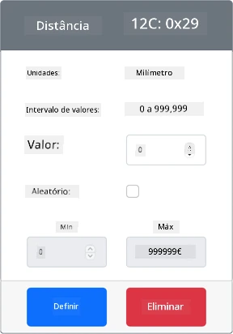

# Detetar proximidade - Hardware IoT Virtual

Nesta parte da lição, vais adicionar um sensor de proximidade ao teu dispositivo IoT virtual e ler a distância a partir dele.

## Hardware

O dispositivo IoT virtual irá usar um sensor de distância simulado.

Num dispositivo IoT físico, utilizarias um sensor com um módulo de medição a laser para detetar a distância.

### Adicionar o sensor de distância ao CounterFit

Para usar um sensor de distância virtual, precisas de adicionar um à aplicação CounterFit.

#### Tarefa - adicionar o sensor de distância ao CounterFit

Adiciona o sensor de distância à aplicação CounterFit.

1. Abre o código `fruit-quality-detector` no VS Code e certifica-te de que o ambiente virtual está ativado.

1. Instala um pacote adicional do Pip para instalar um shim do CounterFit que pode comunicar com sensores de distância simulando o pacote [rpi-vl53l0x Pip](https://pypi.org/project/rpi-vl53l0x/), um pacote Python que interage com [um sensor de distância VL53L0X baseado em tempo de voo](https://wiki.seeedstudio.com/Grove-Time_of_Flight_Distance_Sensor-VL53L0X/). Certifica-te de que estás a instalar isto a partir de um terminal com o ambiente virtual ativado.

    ```sh
    pip install counterfit-shims-rpi-vl53l0x
    ```

1. Certifica-te de que a aplicação web CounterFit está a funcionar.

1. Cria um sensor de distância:

    1. Na caixa *Create sensor* no painel *Sensors*, abre a caixa *Sensor type* e seleciona *Distance*.

    1. Deixa as *Units* como `Millimeter`.

    1. Este sensor é um sensor I²C, por isso define o endereço como `0x29`. Se utilizasses um sensor físico VL53L0X, este estaria codificado para este endereço.

    1. Seleciona o botão **Add** para criar o sensor de distância.

    

    O sensor de distância será criado e aparecerá na lista de sensores.

    

## Programar o sensor de distância

O dispositivo IoT virtual pode agora ser programado para usar o sensor de distância simulado.

### Tarefa - programar o sensor de tempo de voo

1. Cria um novo ficheiro no projeto `fruit-quality-detector` chamado `distance-sensor.py`.

    > 💁 Uma forma fácil de simular múltiplos dispositivos IoT é fazer cada um num ficheiro Python diferente e executá-los ao mesmo tempo.

1. Inicia uma ligação ao CounterFit com o seguinte código:

    ```python
    from counterfit_connection import CounterFitConnection
    CounterFitConnection.init('127.0.0.1', 5000)
    ```

1. Adiciona o seguinte código abaixo deste:

    ```python
    import time
    
    from counterfit_shims_rpi_vl53l0x.vl53l0x import VL53L0X
    ```

    Isto importa a biblioteca shim do sensor para o sensor de tempo de voo VL53L0X.

1. Abaixo disto, adiciona o seguinte código para aceder ao sensor:

    ```python
    distance_sensor = VL53L0X()
    distance_sensor.begin()
    ```

    Este código declara um sensor de distância e, em seguida, inicia o sensor.

1. Finalmente, adiciona um loop infinito para ler as distâncias:

    ```python
    while True:
        distance_sensor.wait_ready()
        print(f'Distance = {distance_sensor.get_distance()} mm')
        time.sleep(1)
    ```

    Este código espera que um valor esteja pronto para ser lido do sensor e, em seguida, imprime-o na consola.

1. Executa este código.

    > 💁 Não te esqueças de que este ficheiro se chama `distance-sensor.py`! Certifica-te de que o executas via Python, não `app.py`.

1. Vais ver medições de distância aparecer na consola. Altera o valor no CounterFit para ver este valor mudar ou usa valores aleatórios.

    ```output
    (.venv) ➜  fruit-quality-detector python distance-sensor.py 
    Distance = 37 mm
    Distance = 42 mm
    Distance = 29 mm
    ```

> 💁 Podes encontrar este código na pasta [code-proximity/virtual-iot-device](../../../../../4-manufacturing/lessons/4-trigger-fruit-detector/code-proximity/virtual-iot-device).

😀 O teu programa de sensor de proximidade foi um sucesso!

**Aviso Legal**:  
Este documento foi traduzido utilizando o serviço de tradução por IA [Co-op Translator](https://github.com/Azure/co-op-translator). Embora nos esforcemos pela precisão, esteja ciente de que traduções automáticas podem conter erros ou imprecisões. O documento original na sua língua nativa deve ser considerado a fonte autoritária. Para informações críticas, recomenda-se a tradução profissional realizada por humanos. Não nos responsabilizamos por quaisquer mal-entendidos ou interpretações incorretas decorrentes do uso desta tradução.