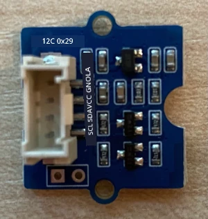
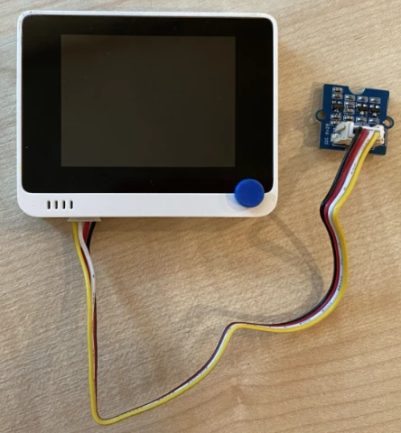

# Detetar proximidade - Wio Terminal

Nesta parte da lição, irá adicionar um sensor de proximidade ao seu Wio Terminal e ler a distância a partir dele.

## Hardware

O Wio Terminal necessita de um sensor de proximidade.

O sensor que irá utilizar é um [Grove Time of Flight distance sensor](https://www.seeedstudio.com/Grove-Time-of-Flight-Distance-Sensor-VL53L0X.html). Este sensor utiliza um módulo de medição a laser para detetar distâncias. Tem um alcance de 10mm a 2000mm (1cm - 2m) e reporta valores dentro desse intervalo com bastante precisão, sendo que distâncias acima de 1000mm são reportadas como 8109mm.

O medidor de distância a laser está na parte de trás do sensor, no lado oposto ao conector Grove.

Este é um socket I2C.

### Ligar o sensor time of flight

O sensor Grove time of flight pode ser ligado ao Wio Terminal.

#### Tarefa - ligar o sensor time of flight

Ligue o sensor time of flight.



1. Insira uma extremidade de um cabo Grove no conector do sensor time of flight. O cabo só encaixa de uma forma.

1. Com o Wio Terminal desligado do computador ou de outra fonte de alimentação, ligue a outra extremidade do cabo Grove ao conector Grove do lado esquerdo do Wio Terminal, olhando para o ecrã. Este é o conector mais próximo do botão de energia. Este é um socket combinado digital e I2C.



1. Agora pode ligar o Wio Terminal ao seu computador.

## Programar o sensor time of flight

O Wio Terminal pode agora ser programado para utilizar o sensor time of flight ligado.

### Tarefa - programar o sensor time of flight

1. Crie um novo projeto Wio Terminal utilizando o PlatformIO. Chame este projeto `distance-sensor`. Adicione código na função `setup` para configurar a porta serial.

1. Adicione uma dependência de biblioteca para a biblioteca Seeed Grove time of flight distance sensor no ficheiro `platformio.ini` do projeto:

    ```ini
    lib_deps =
        seeed-studio/Grove Ranging sensor - VL53L0X @ ^1.1.1
    ```

1. No ficheiro `main.cpp`, adicione o seguinte abaixo das diretivas de inclusão existentes para declarar uma instância da classe `Seeed_vl53l0x` para interagir com o sensor time of flight:

    ```cpp
    #include "Seeed_vl53l0x.h"
    
    Seeed_vl53l0x VL53L0X;
    ```

1. Adicione o seguinte ao final da função `setup` para inicializar o sensor:

    ```cpp
    VL53L0X.VL53L0X_common_init();
    VL53L0X.VL53L0X_high_accuracy_ranging_init();
    ```

1. Na função `loop`, leia um valor do sensor:

    ```cpp
    VL53L0X_RangingMeasurementData_t RangingMeasurementData;
    memset(&RangingMeasurementData, 0, sizeof(VL53L0X_RangingMeasurementData_t));

    VL53L0X.PerformSingleRangingMeasurement(&RangingMeasurementData);
    ```

    Este código inicializa uma estrutura de dados para ler os dados, depois passa-a para o método `PerformSingleRangingMeasurement`, onde será preenchida com a medição da distância.

1. Abaixo disso, escreva a medição da distância e depois adicione um atraso de 1 segundo:

    ```cpp
    Serial.print("Distance = ");
    Serial.print(RangingMeasurementData.RangeMilliMeter);
    Serial.println(" mm");

    delay(1000);
    ```

1. Compile, carregue e execute este código. Poderá ver as medições de distância no monitor serial. Posicione objetos perto do sensor e verá a medição da distância:

    ```output
    Distance = 29 mm
    Distance = 28 mm
    Distance = 30 mm
    Distance = 151 mm
    ```

    O medidor de distância está na parte de trás do sensor, por isso certifique-se de usar o lado correto ao medir a distância.

    

> 💁 Pode encontrar este código na pasta [code-proximity/wio-terminal](../../../../../4-manufacturing/lessons/4-trigger-fruit-detector/code-proximity/wio-terminal).

😀 O seu programa para o sensor de proximidade foi um sucesso!

**Aviso Legal**:  
Este documento foi traduzido utilizando o serviço de tradução por IA [Co-op Translator](https://github.com/Azure/co-op-translator). Embora nos esforcemos para garantir a precisão, esteja ciente de que traduções automáticas podem conter erros ou imprecisões. O documento original na sua língua nativa deve ser considerado a fonte autoritária. Para informações críticas, recomenda-se a tradução profissional realizada por humanos. Não nos responsabilizamos por quaisquer mal-entendidos ou interpretações incorretas decorrentes do uso desta tradução.