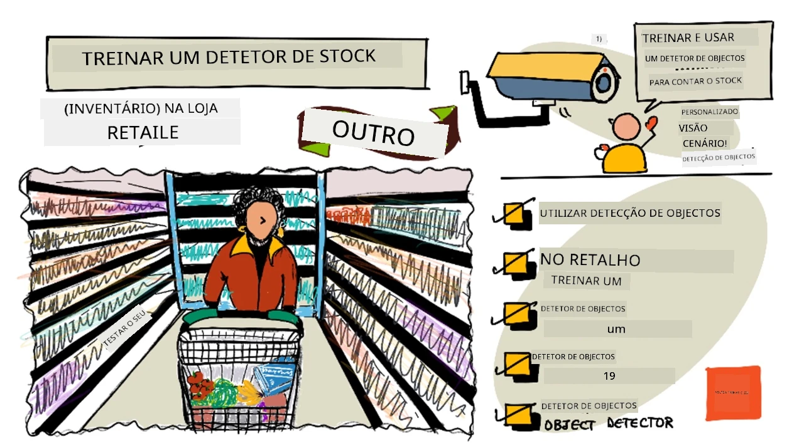
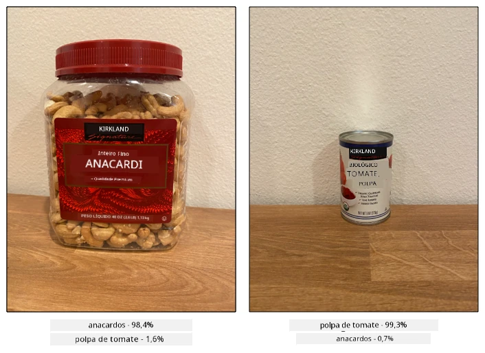
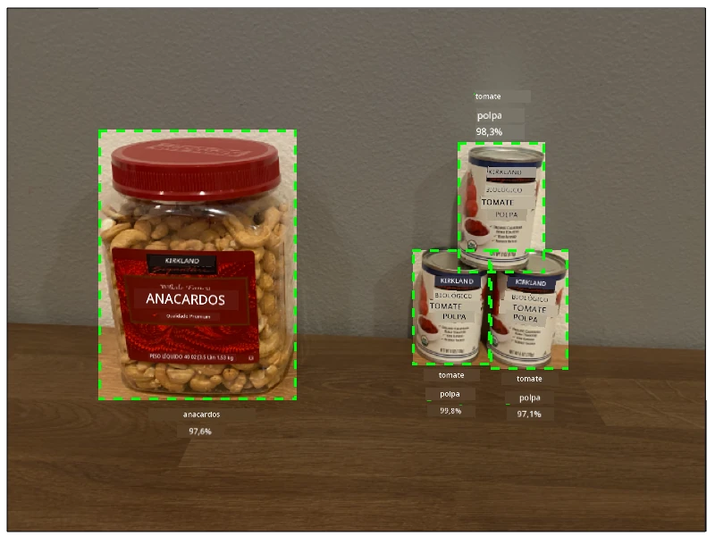
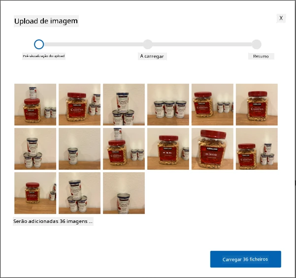
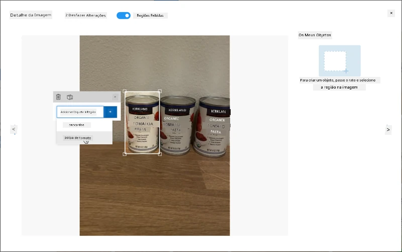
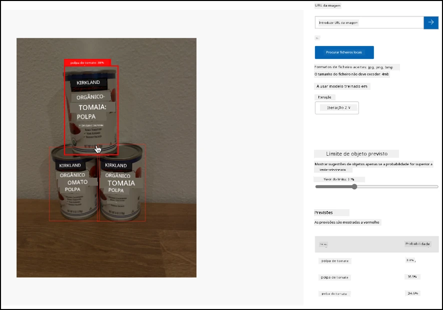

# Treinar um detetor de stock

> Ilustração por [Nitya Narasimhan](https://github.com/nitya). Clique na imagem para uma versão maior.

Este vídeo oferece uma visão geral sobre deteção de objetos com o serviço Azure Custom Vision, um serviço que será abordado nesta lição.

> 🎥 Clique na imagem acima para assistir ao vídeo

## Questionário pré-aula

[Questionário pré-aula](https://black-meadow-040d15503.1.azurestaticapps.net/quiz/37)

## Introdução

No projeto anterior, utilizaste IA para treinar um classificador de imagens - um modelo que pode identificar se uma imagem contém algo, como fruta madura ou fruta verde. Outro tipo de modelo de IA que pode ser usado com imagens é a deteção de objetos. Estes modelos não classificam uma imagem com etiquetas, mas são treinados para reconhecer objetos e localizá-los em imagens, não apenas detetando que o objeto está presente, mas também onde ele está na imagem. Isto permite contar objetos em imagens.

Nesta lição, vais aprender sobre deteção de objetos, incluindo como pode ser usada no retalho. Também vais aprender a treinar um detetor de objetos na cloud.

Nesta lição, abordaremos:

* [Deteção de objetos](../../../../../5-retail/lessons/1-train-stock-detector)
* [Usar deteção de objetos no retalho](../../../../../5-retail/lessons/1-train-stock-detector)
* [Treinar um detetor de objetos](../../../../../5-retail/lessons/1-train-stock-detector)
* [Testar o teu detetor de objetos](../../../../../5-retail/lessons/1-train-stock-detector)
* [Re-treinar o teu detetor de objetos](../../../../../5-retail/lessons/1-train-stock-detector)

## Deteção de objetos

A deteção de objetos envolve identificar objetos em imagens usando IA. Ao contrário do classificador de imagens que treinaste no último projeto, a deteção de objetos não se trata de prever a melhor etiqueta para uma imagem como um todo, mas sim de encontrar um ou mais objetos numa imagem.

### Deteção de objetos vs classificação de imagens

A classificação de imagens consiste em classificar uma imagem como um todo - quais são as probabilidades de que a imagem inteira corresponda a cada etiqueta. Recebes de volta probabilidades para cada etiqueta usada para treinar o modelo.

No exemplo acima, duas imagens são classificadas usando um modelo treinado para classificar embalagens de frutos secos de caju ou latas de polpa de tomate. A primeira imagem é uma embalagem de frutos secos de caju e tem dois resultados do classificador de imagens:

| Etiqueta        | Probabilidade |
| --------------- | ------------: |
| `frutos secos`  | 98.4%         |
| `polpa de tomate` | 1.6%        |

A segunda imagem é de uma lata de polpa de tomate, e os resultados são:

| Etiqueta        | Probabilidade |
| --------------- | ------------: |
| `frutos secos`  | 0.7%          |
| `polpa de tomate` | 99.3%       |

Poderias usar estes valores com um limite percentual para prever o que está na imagem. Mas e se uma imagem contivesse várias latas de polpa de tomate ou tanto frutos secos como polpa de tomate? Os resultados provavelmente não te dariam o que procuras. É aqui que entra a deteção de objetos.

A deteção de objetos envolve treinar um modelo para reconhecer objetos. Em vez de fornecer imagens contendo o objeto e dizer que cada imagem é uma etiqueta ou outra, destacas a secção de uma imagem que contém o objeto específico e etiquetas essa secção. Podes etiquetar um único objeto numa imagem ou vários. Desta forma, o modelo aprende como o objeto em si parece, e não apenas como as imagens que contêm o objeto parecem.

Quando o utilizas para prever imagens, em vez de receberes uma lista de etiquetas e percentagens, recebes uma lista de objetos detetados, com as suas caixas delimitadoras e a probabilidade de que o objeto corresponda à etiqueta atribuída.

> 🎓 *Caixas delimitadoras* são as caixas em torno de um objeto.

A imagem acima contém tanto uma embalagem de frutos secos de caju como três latas de polpa de tomate. O detetor de objetos detetou os frutos secos, devolvendo a caixa delimitadora que contém os frutos secos com a percentagem de probabilidade de que a caixa delimitadora contenha o objeto, neste caso 97.6%. O detetor de objetos também detetou três latas de polpa de tomate e fornece três caixas delimitadoras separadas, uma para cada lata detetada, e cada uma tem uma probabilidade percentual de que a caixa delimitadora contenha uma lata de polpa de tomate.

✅ Pensa em alguns cenários diferentes em que poderias querer usar modelos de IA baseados em imagens. Quais precisariam de classificação e quais precisariam de deteção de objetos?

### Como funciona a deteção de objetos

A deteção de objetos utiliza modelos de ML complexos. Estes modelos funcionam dividindo a imagem em várias células e verificando se o centro da caixa delimitadora é o centro de uma imagem que corresponde a uma das imagens usadas para treinar o modelo. Podes pensar nisto como uma espécie de execução de um classificador de imagens em diferentes partes da imagem para procurar correspondências.

> 💁 Esta é uma simplificação drástica. Existem muitas técnicas para deteção de objetos, e podes ler mais sobre elas na [página de deteção de objetos na Wikipédia](https://wikipedia.org/wiki/Object_detection).

Existem vários modelos diferentes que podem realizar deteção de objetos. Um modelo particularmente famoso é o [YOLO (You Only Look Once)](https://pjreddie.com/darknet/yolo/), que é incrivelmente rápido e pode detetar 20 classes diferentes de objetos, como pessoas, cães, garrafas e carros.

✅ Lê mais sobre o modelo YOLO em [pjreddie.com/darknet/yolo/](https://pjreddie.com/darknet/yolo/)

Os modelos de deteção de objetos podem ser re-treinados usando aprendizagem por transferência para detetar objetos personalizados.

## Usar deteção de objetos no retalho

A deteção de objetos tem múltiplas utilizações no retalho. Algumas incluem:

* **Verificação e contagem de stock** - reconhecer quando o stock está baixo nas prateleiras. Se o stock estiver muito baixo, notificações podem ser enviadas para funcionários ou robôs para reabastecer as prateleiras.
* **Deteção de máscaras** - em lojas com políticas de uso de máscara durante eventos de saúde pública, a deteção de objetos pode reconhecer pessoas com máscaras e sem máscaras.
* **Faturação automatizada** - detetar itens retirados das prateleiras em lojas automatizadas e faturar os clientes de forma apropriada.
* **Deteção de perigos** - reconhecer itens partidos no chão ou líquidos derramados, alertando as equipas de limpeza.

✅ Faz alguma pesquisa: Quais são outros casos de uso para deteção de objetos no retalho?

## Treinar um detetor de objetos

Podes treinar um detetor de objetos usando o Custom Vision, de forma semelhante a como treinaste um classificador de imagens.

### Tarefa - criar um detetor de objetos

1. Cria um Grupo de Recursos para este projeto chamado `stock-detector`.

1. Cria um recurso gratuito de treino do Custom Vision e um recurso gratuito de previsão do Custom Vision no grupo de recursos `stock-detector`. Nomeia-os `stock-detector-training` e `stock-detector-prediction`.

    > 💁 Só podes ter um recurso gratuito de treino e previsão, por isso certifica-te de que limpaste o teu projeto das lições anteriores.

    > ⚠️ Podes consultar [as instruções para criar recursos de treino e previsão do projeto 4, lição 1, se necessário](../../../4-manufacturing/lessons/1-train-fruit-detector/README.md#task---create-a-cognitive-services-resource).

1. Acede ao portal do Custom Vision em [CustomVision.ai](https://customvision.ai) e inicia sessão com a conta Microsoft que usaste para a tua conta Azure.

1. Segue a [secção Criar um novo projeto do guia rápido Construir um detetor de objetos na documentação da Microsoft](https://docs.microsoft.com/azure/cognitive-services/custom-vision-service/get-started-build-detector?WT.mc_id=academic-17441-jabenn#create-a-new-project) para criar um novo projeto no Custom Vision. A interface pode mudar, e esta documentação é sempre a referência mais atualizada.

    Nomeia o teu projeto `stock-detector`.

    Ao criares o teu projeto, certifica-te de usar o recurso `stock-detector-training` que criaste anteriormente. Usa o tipo de projeto *Object Detection* e o domínio *Products on Shelves*.

    

    ✅ O domínio de produtos em prateleiras é especificamente direcionado para detetar stock em prateleiras de lojas. Lê mais sobre os diferentes domínios na [documentação Selecionar um domínio na Microsoft Docs](https://docs.microsoft.com/azure/cognitive-services/custom-vision-service/select-domain?WT.mc_id=academic-17441-jabenn#object-detection).

✅ Dedica algum tempo a explorar a interface do Custom Vision para o teu detetor de objetos.

### Tarefa - treinar o teu detetor de objetos

Para treinares o teu modelo, vais precisar de um conjunto de imagens contendo os objetos que queres detetar.

1. Reúne imagens que contenham o objeto a detetar. Vais precisar de pelo menos 15 imagens contendo cada objeto a detetar, de uma variedade de ângulos diferentes e em diferentes condições de iluminação, mas quanto mais, melhor. Este detetor de objetos usa o domínio *Products on Shelves*, por isso tenta configurar os objetos como se estivessem numa prateleira de loja. Também vais precisar de algumas imagens para testar o modelo. Se estiveres a detetar mais de um objeto, vais querer algumas imagens de teste que contenham todos os objetos.

    > 💁 Imagens com vários objetos diferentes contam para o mínimo de 15 imagens para todos os objetos na imagem.

    As tuas imagens devem ser png ou jpeg, com menos de 6MB. Se as criares com um iPhone, por exemplo, podem ser imagens HEIC de alta resolução, por isso precisarão de ser convertidas e possivelmente reduzidas. Quanto mais imagens, melhor, e deves ter um número semelhante de imagens de objetos maduros e imaturos.

    O modelo é projetado para produtos em prateleiras, por isso tenta tirar as fotos dos objetos em prateleiras.

    Podes encontrar algumas imagens de exemplo que podes usar na pasta [images](../../../../../5-retail/lessons/1-train-stock-detector/images) de frutos secos de caju e polpa de tomate.

1. Segue a [secção Carregar e etiquetar imagens do guia rápido Construir um detetor de objetos na documentação da Microsoft](https://docs.microsoft.com/azure/cognitive-services/custom-vision-service/get-started-build-detector?WT.mc_id=academic-17441-jabenn#upload-and-tag-images) para carregar as tuas imagens de treino. Cria etiquetas relevantes dependendo dos tipos de objetos que queres detetar.

    

    Quando desenhares caixas delimitadoras para os objetos, mantém-nas bem ajustadas ao redor do objeto. Pode demorar algum tempo a delinear todas as imagens, mas a ferramenta detetará o que acha que são as caixas delimitadoras, tornando o processo mais rápido.

    

    > 💁 Se tiveres mais de 15 imagens para cada objeto, podes treinar após 15 e depois usar a funcionalidade **Etiquetas sugeridas**. Isto usará o modelo treinado para detetar os objetos na imagem não etiquetada. Podes então confirmar os objetos detetados ou rejeitar e redesenhar as caixas delimitadoras. Isto pode poupar *muito* tempo.

1. Segue a [secção Treinar o detetor do guia rápido Construir um detetor de objetos na documentação da Microsoft](https://docs.microsoft.com/azure/cognitive-services/custom-vision-service/get-started-build-detector?WT.mc_id=academic-17441-jabenn#train-the-detector) para treinar o detetor de objetos nas tuas imagens etiquetadas.

    Ser-te-á dada uma escolha de tipo de treino. Seleciona **Treino Rápido**.

O detetor de objetos será então treinado. O treino demorará alguns minutos a ser concluído.

## Testar o teu detetor de objetos

Depois de treinares o teu detetor de objetos, podes testá-lo fornecendo-lhe novas imagens para detetar objetos.

### Tarefa - testar o teu detetor de objetos

1. Usa o botão **Teste Rápido** para carregar imagens de teste e verificar se os objetos são detetados. Usa as imagens de teste que criaste anteriormente, não as imagens que usaste para treinar.

    

1. Experimenta todas as imagens de teste que tens disponíveis e observa as probabilidades.

## Re-treinar o teu detetor de objetos

Quando testares o teu detetor de objetos, pode não dar os resultados que esperas, tal como com os classificadores de imagens no projeto anterior. Podes melhorar o teu detetor de objetos re-treinando-o com imagens que ele interpreta de forma incorreta.

Sempre que fazes uma previsão usando a opção de teste rápido, a imagem e os resultados são armazenados. Podes usar estas imagens para re-treinar o teu modelo.

1. Usa o separador **Previsões** para localizar as imagens que usaste para testar.

1. Confirma quaisquer deteções corretas, elimina as incorretas e adiciona quaisquer objetos em falta.

1. Re-treina e volta a testar o modelo.

---

## 🚀 Desafio

O que aconteceria se usasses o detetor de objetos com itens de aparência semelhante, como latas da mesma marca de polpa de tomate e de tomate em pedaços?

Se tiveres itens de aparência semelhante, experimenta adicioná-los ao teu detetor de objetos e testa o resultado.

## Questionário pós-aula
[Questionário pós-aula](https://black-meadow-040d15503.1.azurestaticapps.net/quiz/38)

## Revisão e Autoestudo

* Quando treinaste o teu detetor de objetos, deves ter visto valores para *Precisão*, *Recall* e *mAP* que avaliam o modelo criado. Lê mais sobre o que significam esses valores na [secção Avaliar o detetor do guia rápido Construir um detetor de objetos na documentação da Microsoft](https://docs.microsoft.com/azure/cognitive-services/custom-vision-service/get-started-build-detector?WT.mc_id=academic-17441-jabenn#evaluate-the-detector)
* Lê mais sobre deteção de objetos na [página de Deteção de Objetos na Wikipédia](https://wikipedia.org/wiki/Object_detection)

## Tarefa

[Comparar domínios](assignment.md)

**Aviso Legal**:  
Este documento foi traduzido utilizando o serviço de tradução por IA [Co-op Translator](https://github.com/Azure/co-op-translator). Embora nos esforcemos pela precisão, esteja ciente de que traduções automáticas podem conter erros ou imprecisões. O documento original na sua língua nativa deve ser considerado a fonte autoritária. Para informações críticas, recomenda-se a tradução profissional realizada por humanos. Não nos responsabilizamos por quaisquer mal-entendidos ou interpretações incorretas decorrentes do uso desta tradução.