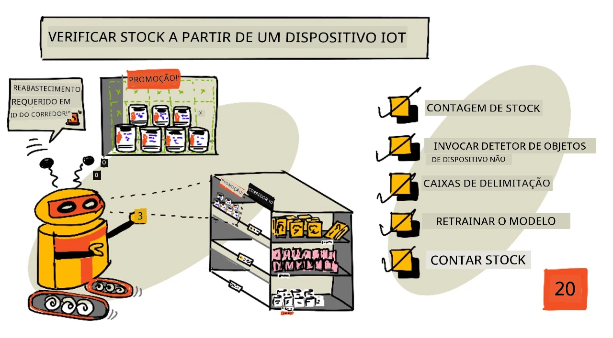
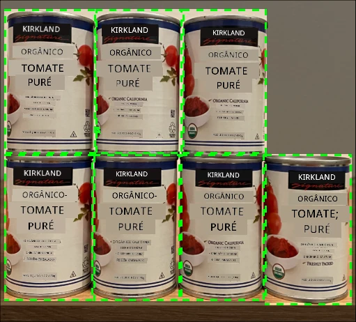
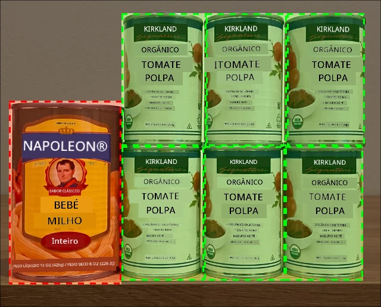
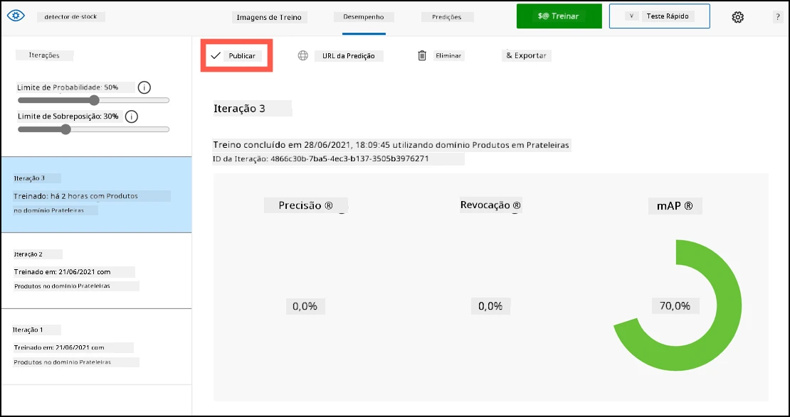
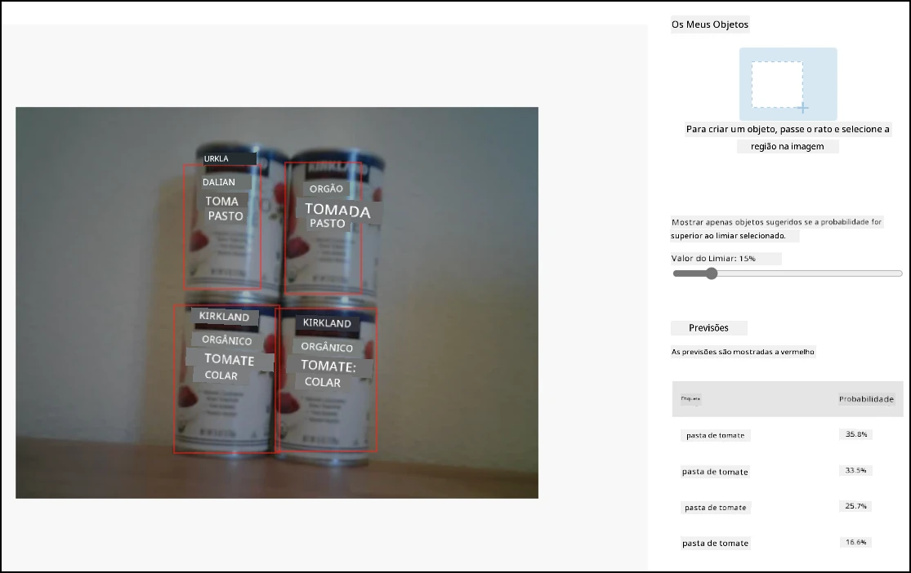
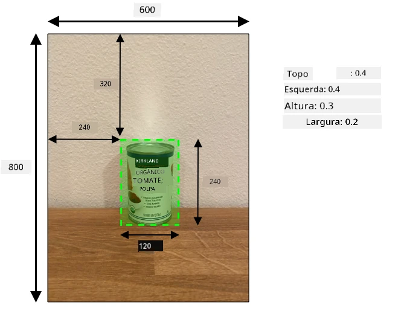
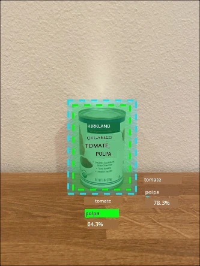

# Verificar stock a partir de um dispositivo IoT



> Ilustração por [Nitya Narasimhan](https://github.com/nitya). Clique na imagem para uma versão maior.

## Questionário pré-aula

[Questionário pré-aula](https://black-meadow-040d15503.1.azurestaticapps.net/quiz/39)

## Introdução

Na lição anterior, aprendeste sobre os diferentes usos da deteção de objetos no setor de retalho. Também aprendeste a treinar um detetor de objetos para identificar stock. Nesta lição, vais aprender a usar o teu detetor de objetos a partir de um dispositivo IoT para contar stock.

Nesta lição, vamos abordar:

* [Contagem de stock](../../../../../5-retail/lessons/2-check-stock-device)
* [Chamar o teu detetor de objetos a partir do teu dispositivo IoT](../../../../../5-retail/lessons/2-check-stock-device)
* [Caixas delimitadoras](../../../../../5-retail/lessons/2-check-stock-device)
* [Re-treinar o modelo](../../../../../5-retail/lessons/2-check-stock-device)
* [Contar stock](../../../../../5-retail/lessons/2-check-stock-device)

> 🗑 Esta é a última lição deste projeto, por isso, depois de completares esta lição e o exercício, não te esqueças de limpar os serviços na nuvem. Vais precisar dos serviços para completar o exercício, por isso certifica-te de que o fazes primeiro.
>
> Consulta [o guia para limpar o teu projeto](../../../clean-up.md) se necessário para obter instruções sobre como fazer isso.

## Contagem de stock

Os detetores de objetos podem ser usados para verificar stock, seja contando os itens ou garantindo que estão no local correto. Dispositivos IoT com câmaras podem ser instalados por toda a loja para monitorizar o stock, começando por áreas críticas onde é importante repor os itens, como zonas onde são armazenados poucos produtos de alto valor.

Por exemplo, se uma câmara estiver apontada para uma prateleira que pode conter 8 latas de polpa de tomate, e o detetor de objetos apenas detetar 7 latas, então falta uma e precisa de ser reposta.



Na imagem acima, um detetor de objetos detetou 7 latas de polpa de tomate numa prateleira que pode conter 8 latas. Não só o dispositivo IoT pode enviar uma notificação sobre a necessidade de reposição, como também pode indicar a localização do item em falta, informação importante caso estejas a usar robôs para repor prateleiras.

> 💁 Dependendo da loja e da popularidade do produto, provavelmente não seria necessário repor se apenas uma lata estivesse em falta. Terias de construir um algoritmo que determine quando repor com base nos teus produtos, clientes e outros critérios.

✅ Em que outros cenários poderias combinar deteção de objetos e robôs?

Por vezes, o stock errado pode estar nas prateleiras. Isto pode acontecer devido a erro humano ao repor, ou clientes que mudam de ideia sobre uma compra e colocam um item no primeiro espaço disponível. Quando se trata de um item não perecível, como produtos enlatados, isto é apenas um incómodo. Se for um item perecível, como produtos congelados ou refrigerados, pode significar que o produto já não pode ser vendido, pois pode ser impossível determinar quanto tempo esteve fora do congelador.

A deteção de objetos pode ser usada para identificar itens inesperados, alertando novamente um humano ou robô para devolver o item assim que for detetado.



Na imagem acima, uma lata de milho bebé foi colocada na prateleira ao lado da polpa de tomate. O detetor de objetos detetou isto, permitindo que o dispositivo IoT notifique um humano ou robô para devolver a lata ao local correto.

## Chamar o teu detetor de objetos a partir do teu dispositivo IoT

O detetor de objetos que treinaste na última lição pode ser chamado a partir do teu dispositivo IoT.

### Tarefa - publicar uma iteração do teu detetor de objetos

As iterações são publicadas a partir do portal Custom Vision.

1. Abre o portal Custom Vision em [CustomVision.ai](https://customvision.ai) e inicia sessão se ainda não o tiveres aberto. Depois, abre o teu projeto `stock-detector`.

1. Seleciona o separador **Performance** nas opções no topo.

1. Seleciona a última iteração na lista *Iterations* na lateral.

1. Clica no botão **Publish** para a iteração.

    

1. No diálogo *Publish Model*, define o *Prediction resource* como o recurso `stock-detector-prediction` que criaste na última lição. Mantém o nome como `Iteration2` e clica no botão **Publish**.

1. Depois de publicado, clica no botão **Prediction URL**. Isto mostrará os detalhes da API de previsão, e vais precisar deles para chamar o modelo a partir do teu dispositivo IoT. A secção inferior está rotulada como *If you have an image file*, e são esses os detalhes que precisas. Copia o URL mostrado, que será algo como:

    ```output
    https://<location>.api.cognitive.microsoft.com/customvision/v3.0/Prediction/<id>/detect/iterations/Iteration2/image
    ```

    Onde `<location>` será a localização que usaste ao criar o recurso Custom Vision, e `<id>` será um ID longo composto por letras e números.

    Também copia o valor *Prediction-Key*. Esta é uma chave segura que tens de passar ao chamar o modelo. Apenas aplicações que passam esta chave podem usar o modelo; quaisquer outras aplicações serão rejeitadas.

    

✅ Quando uma nova iteração é publicada, terá um nome diferente. Como achas que poderias alterar a iteração que um dispositivo IoT está a usar?

### Tarefa - chamar o teu detetor de objetos a partir do teu dispositivo IoT

Segue o guia relevante abaixo para usar o detetor de objetos a partir do teu dispositivo IoT:

* [Arduino - Wio Terminal](wio-terminal-object-detector.md)
* [Computador de placa única - Raspberry Pi/Dispositivo virtual](single-board-computer-object-detector.md)

## Caixas delimitadoras

Quando usas o detetor de objetos, não só recebes os objetos detetados com as suas etiquetas e probabilidades, mas também as caixas delimitadoras dos objetos. Estas definem onde o detetor de objetos identificou o objeto com a probabilidade dada.

> 💁 Uma caixa delimitadora é uma área que define os limites do objeto detetado.

Os resultados de uma previsão no separador **Predictions** no Custom Vision têm as caixas delimitadoras desenhadas na imagem enviada para previsão.



Na imagem acima, foram detetadas 4 latas de polpa de tomate. Nos resultados, um quadrado vermelho é sobreposto para cada objeto detetado na imagem, indicando a caixa delimitadora para o objeto.

✅ Abre as previsões no Custom Vision e verifica as caixas delimitadoras.

As caixas delimitadoras são definidas com 4 valores - topo, esquerda, altura e largura. Estes valores estão numa escala de 0-1, representando as posições como uma percentagem do tamanho da imagem. A origem (posição 0,0) é o canto superior esquerdo da imagem, então o valor de topo é a distância desde o topo, e o fundo da caixa delimitadora é o topo mais a altura.



A imagem acima tem 600 pixels de largura e 800 pixels de altura. A caixa delimitadora começa a 320 pixels abaixo, dando uma coordenada de topo de 0.4 (800 x 0.4 = 320). A partir da esquerda, a caixa delimitadora começa a 240 pixels, dando uma coordenada de esquerda de 0.4 (600 x 0.4 = 240). A altura da caixa delimitadora é de 240 pixels, dando um valor de altura de 0.3 (800 x 0.3 = 240). A largura da caixa delimitadora é de 120 pixels, dando um valor de largura de 0.2 (600 x 0.2 = 120).

| Coordenada | Valor |
| ---------- | ----: |
| Topo       | 0.4   |
| Esquerda   | 0.4   |
| Altura     | 0.3   |
| Largura    | 0.2   |

Usar valores percentuais de 0-1 significa que, independentemente do tamanho da imagem, a caixa delimitadora começa a 0.4 do caminho ao longo e abaixo, e tem 0.3 da altura e 0.2 da largura.

Podes usar caixas delimitadoras combinadas com probabilidades para avaliar a precisão de uma deteção. Por exemplo, um detetor de objetos pode detetar múltiplos objetos que se sobrepõem, como detetar uma lata dentro de outra. O teu código pode analisar as caixas delimitadoras, perceber que isso é impossível e ignorar quaisquer objetos que tenham uma sobreposição significativa com outros objetos.



No exemplo acima, uma caixa delimitadora indicou uma lata de polpa de tomate prevista com 78.3%. Uma segunda caixa delimitadora é ligeiramente menor e está dentro da primeira, com uma probabilidade de 64.3%. O teu código pode verificar as caixas delimitadoras, ver que se sobrepõem completamente e ignorar a probabilidade mais baixa, pois não há como uma lata estar dentro de outra.

✅ Consegues pensar numa situação em que seria válido detetar um objeto dentro de outro?

## Re-treinar o modelo

Tal como com o classificador de imagens, podes re-treinar o teu modelo usando dados capturados pelo teu dispositivo IoT. Usar estes dados do mundo real garantirá que o teu modelo funciona bem quando usado a partir do teu dispositivo IoT.

Ao contrário do classificador de imagens, não podes simplesmente etiquetar uma imagem. Em vez disso, precisas de rever cada caixa delimitadora detetada pelo modelo. Se a caixa estiver em torno do objeto errado, precisa de ser eliminada; se estiver na localização errada, precisa de ser ajustada.

### Tarefa - re-treinar o modelo

1. Certifica-te de que capturaste uma variedade de imagens usando o teu dispositivo IoT.

1. No separador **Predictions**, seleciona uma imagem. Vais ver caixas vermelhas indicando as caixas delimitadoras dos objetos detetados.

1. Analisa cada caixa delimitadora. Seleciona-a primeiro e vais ver um pop-up mostrando a etiqueta. Usa os controlos nos cantos da caixa delimitadora para ajustar o tamanho, se necessário. Se a etiqueta estiver errada, remove-a com o botão **X** e adiciona a etiqueta correta. Se a caixa delimitadora não contiver um objeto, elimina-a com o botão de caixote do lixo.

1. Fecha o editor quando terminares e a imagem será movida do separador **Predictions** para o separador **Training Images**. Repete o processo para todas as previsões.

1. Usa o botão **Train** para re-treinar o teu modelo. Depois de treinado, publica a iteração e atualiza o teu dispositivo IoT para usar o URL da nova iteração.

1. Reimplementa o teu código e testa o teu dispositivo IoT.

## Contar stock

Usando uma combinação do número de objetos detetados e das caixas delimitadoras, podes contar o stock numa prateleira.

### Tarefa - contar stock

Segue o guia relevante abaixo para contar stock usando os resultados do detetor de objetos a partir do teu dispositivo IoT:

* [Arduino - Wio Terminal](wio-terminal-count-stock.md)
* [Computador de placa única - Raspberry Pi/Dispositivo virtual](single-board-computer-count-stock.md)

---

## 🚀 Desafio

Consegues detetar stock incorreto? Treina o teu modelo com múltiplos objetos e depois atualiza a tua aplicação para te alertar se for detetado o stock errado.

Talvez até possas levar isto mais longe e detetar stock lado a lado na mesma prateleira, verificando se algo foi colocado no lugar errado ao definir limites nas caixas delimitadoras.

## Questionário pós-aula

[Questionário pós-aula](https://black-meadow-040d15503.1.azurestaticapps.net/quiz/40)

## Revisão & Estudo Individual

* Aprende mais sobre como arquitetar um sistema de deteção de stock de ponta a ponta no guia [Out of stock detection at the edge pattern guide on Microsoft Docs](https://docs.microsoft.com/hybrid/app-solutions/pattern-out-of-stock-at-edge?WT.mc_id=academic-17441-jabenn)
* Descobre outras formas de construir soluções de retalho de ponta a ponta combinando uma variedade de serviços IoT e na nuvem assistindo ao vídeo [Behind the scenes of a retail solution - Hands On! no YouTube](https://www.youtube.com/watch?v=m3Pc300x2Mw).

## Exercício

[Usa o teu detetor de objetos na ponta](assignment.md)

**Aviso Legal**:  
Este documento foi traduzido utilizando o serviço de tradução por IA [Co-op Translator](https://github.com/Azure/co-op-translator). Embora nos esforcemos pela precisão, esteja ciente de que traduções automáticas podem conter erros ou imprecisões. O documento original na sua língua nativa deve ser considerado a fonte autoritária. Para informações críticas, recomenda-se a tradução profissional realizada por humanos. Não nos responsabilizamos por quaisquer mal-entendidos ou interpretações incorretas decorrentes do uso desta tradução.