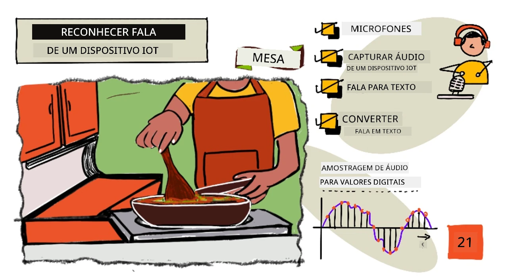
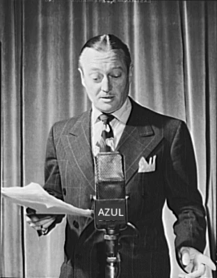
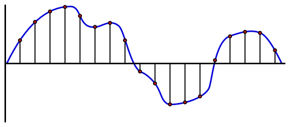

# Reconhecer fala com um dispositivo IoT



> Ilustração por [Nitya Narasimhan](https://github.com/nitya). Clique na imagem para uma versão maior.

Este vídeo oferece uma visão geral do serviço de fala do Azure, um tópico que será abordado nesta lição:

[](https://www.youtube.com/watch?v=iW0Fw0l3mrA)

> 🎥 Clique na imagem acima para assistir ao vídeo

## Questionário pré-aula

[Questionário pré-aula](https://black-meadow-040d15503.1.azurestaticapps.net/quiz/41)

## Introdução

'Alexa, define um temporizador de 12 minutos'

'Alexa, qual o status do temporizador?'

'Alexa, define um temporizador de 8 minutos chamado cozer brócolos a vapor'

Os dispositivos inteligentes estão a tornar-se cada vez mais comuns. Não apenas como colunas inteligentes como HomePods, Echos e Google Homes, mas também integrados nos nossos telemóveis, relógios, e até em luminárias e termostatos.

> 💁 Tenho pelo menos 19 dispositivos na minha casa com assistentes de voz, e isso são apenas os que conheço!

O controlo por voz aumenta a acessibilidade, permitindo que pessoas com mobilidade limitada interajam com dispositivos. Seja uma deficiência permanente, como nascer sem braços, ou uma deficiência temporária, como braços partidos, ou até mesmo ter as mãos ocupadas com compras ou crianças pequenas, poder controlar a nossa casa com a voz em vez das mãos abre um mundo de possibilidades. Gritar 'Hey Siri, fecha a porta da garagem' enquanto lida com uma troca de fralda e uma criança irrequieta pode ser uma pequena, mas eficaz, melhoria na vida.

Um dos usos mais populares para assistentes de voz é definir temporizadores, especialmente na cozinha. Poder definir múltiplos temporizadores apenas com a voz é uma grande ajuda - não é necessário parar de amassar massa, mexer sopa ou limpar as mãos sujas de recheio de bolinhos para usar um temporizador físico.

Nesta lição, aprenderá a integrar reconhecimento de voz em dispositivos IoT. Aprenderá sobre microfones como sensores, como capturar áudio de um microfone ligado a um dispositivo IoT e como usar IA para converter o que é ouvido em texto. Ao longo deste projeto, construirá um temporizador de cozinha inteligente, capaz de definir temporizadores usando a sua voz em vários idiomas.

Nesta lição, abordaremos:

* [Microfones](../../../../../6-consumer/lessons/1-speech-recognition)
* [Capturar áudio do seu dispositivo IoT](../../../../../6-consumer/lessons/1-speech-recognition)
* [Fala para texto](../../../../../6-consumer/lessons/1-speech-recognition)
* [Converter fala em texto](../../../../../6-consumer/lessons/1-speech-recognition)

## Microfones

Os microfones são sensores analógicos que convertem ondas sonoras em sinais elétricos. Vibrações no ar fazem com que componentes no microfone se movam ligeiramente, causando pequenas alterações nos sinais elétricos. Estas alterações são então amplificadas para gerar uma saída elétrica.

### Tipos de microfones

Os microfones existem em vários tipos:

* Dinâmico - Microfones dinâmicos têm um íman ligado a um diafragma móvel que se move numa bobina de fio, criando uma corrente elétrica. Isto é o oposto da maioria das colunas, que usam uma corrente elétrica para mover um íman numa bobina de fio, movendo um diafragma para criar som. Isso significa que colunas podem ser usadas como microfones dinâmicos, e microfones dinâmicos podem ser usados como colunas. Em dispositivos como interfones, onde o utilizador está a ouvir ou a falar, mas não ambos ao mesmo tempo, um único dispositivo pode atuar como coluna e microfone.

    Microfones dinâmicos não precisam de energia para funcionar, o sinal elétrico é criado inteiramente pelo microfone.

    

* Fita - Microfones de fita são semelhantes aos dinâmicos, exceto que têm uma fita metálica em vez de um diafragma. Esta fita move-se num campo magnético, gerando uma corrente elétrica. Tal como os microfones dinâmicos, os de fita não precisam de energia para funcionar.

    

* Condensador - Microfones de condensador têm um diafragma metálico fino e uma placa metálica fixa. A eletricidade é aplicada a ambos e, à medida que o diafragma vibra, a carga estática entre as placas muda, gerando um sinal. Microfones de condensador precisam de energia para funcionar - chamada de *Phantom power*.

    

* MEMS - Microfones de sistemas microeletromecânicos, ou MEMS, são microfones num chip. Eles têm um diafragma sensível à pressão gravado num chip de silício e funcionam de forma semelhante a um microfone de condensador. Estes microfones podem ser minúsculos e integrados em circuitos.

    

    Na imagem acima, o chip etiquetado como **LEFT** é um microfone MEMS, com um diafragma minúsculo com menos de um milímetro de largura.

✅ Faça uma pesquisa: Que microfones tem à sua volta - seja no seu computador, telemóvel, auscultadores ou noutros dispositivos? Que tipo de microfones são?

### Áudio digital

O áudio é um sinal analógico que transporta informações muito detalhadas. Para converter este sinal em digital, o áudio precisa de ser amostrado milhares de vezes por segundo.

> 🎓 Amostragem é o processo de converter o sinal de áudio num valor digital que representa o sinal naquele momento específico.



O áudio digital é amostrado usando Modulação por Código de Pulso, ou PCM. O PCM envolve a leitura da voltagem do sinal e a seleção do valor discreto mais próximo dessa voltagem usando um tamanho definido.

> 💁 Pode pensar no PCM como a versão de sensor da modulação por largura de pulso, ou PWM (PWM foi abordado na [lição 3 do projeto introdutório](../../../1-getting-started/lessons/3-sensors-and-actuators/README.md#pulse-width-modulation)). O PCM envolve converter um sinal analógico em digital, enquanto o PWM converte um sinal digital em analógico.

Por exemplo, a maioria dos serviços de streaming de música oferece áudio de 16 bits ou 24 bits. Isso significa que convertem a voltagem num valor que cabe num número inteiro de 16 bits ou 24 bits. O áudio de 16 bits ajusta o valor num intervalo de -32.768 a 32.767, enquanto o de 24 bits está no intervalo de -8.388.608 a 8.388.607. Quanto mais bits, mais próximo o som amostrado estará do que os nossos ouvidos realmente ouvem.

> 💁 Talvez já tenha ouvido falar de áudio de 8 bits, frequentemente referido como LoFi. Este é o áudio amostrado usando apenas 8 bits, ou seja, -128 a 127. O áudio dos primeiros computadores era limitado a 8 bits devido a restrições de hardware, sendo frequentemente associado a jogos retro.

Estas amostras são feitas milhares de vezes por segundo, usando taxas de amostragem bem definidas, medidas em KHz (milhares de leituras por segundo). Os serviços de streaming de música usam 48KHz para a maioria dos áudios, mas alguns áudios 'sem perdas' usam até 96KHz ou mesmo 192KHz. Quanto maior a taxa de amostragem, mais próximo o áudio estará do original, até certo ponto. Há debate sobre se os humanos conseguem perceber a diferença acima de 48KHz.

✅ Faça uma pesquisa: Se usa um serviço de streaming de música, qual a taxa de amostragem e tamanho que ele utiliza? Se usa CDs, qual a taxa de amostragem e tamanho do áudio em CD?

Existem vários formatos diferentes para dados de áudio. Provavelmente já ouviu falar de ficheiros mp3 - dados de áudio comprimidos para serem menores sem perder qualidade. O áudio não comprimido é frequentemente armazenado como um ficheiro WAV - este é um ficheiro com 44 bytes de informações de cabeçalho, seguido por dados de áudio brutos. O cabeçalho contém informações como a taxa de amostragem (por exemplo, 16000 para 16KHz), tamanho da amostra (16 para 16 bits) e o número de canais. Após o cabeçalho, o ficheiro WAV contém os dados de áudio brutos.

> 🎓 Canais referem-se a quantos fluxos de áudio diferentes compõem o áudio. Por exemplo, para áudio estéreo com esquerda e direita, haveria 2 canais. Para som surround 7.1 num sistema de cinema em casa, seriam 8.

### Tamanho dos dados de áudio

Os dados de áudio são relativamente grandes. Por exemplo, capturar áudio não comprimido de 16 bits a 16KHz (uma taxa suficiente para uso com modelos de reconhecimento de fala) consome 32KB de dados por segundo de áudio:

* 16 bits significam 2 bytes por amostra (1 byte equivale a 8 bits).
* 16KHz são 16.000 amostras por segundo.
* 16.000 x 2 bytes = 32.000 bytes por segundo.

Isto pode parecer uma pequena quantidade de dados, mas se estiver a usar um microcontrolador com memória limitada, pode ser muito. Por exemplo, o Wio Terminal tem 192KB de memória, que precisa de armazenar o código do programa e variáveis. Mesmo que o código do programa fosse minúsculo, não poderia capturar mais de 5 segundos de áudio.

Os microcontroladores podem aceder a armazenamento adicional, como cartões SD ou memória flash. Ao construir um dispositivo IoT que captura áudio, precisará garantir não apenas que tem armazenamento adicional, mas que o seu código grava o áudio capturado diretamente nesse armazenamento. Quando enviar para a nuvem, deve transmitir do armazenamento para a solicitação web. Assim, evita esgotar a memória ao tentar armazenar todo o bloco de dados de áudio na memória de uma só vez.

## Capturar áudio do seu dispositivo IoT

O seu dispositivo IoT pode ser ligado a um microfone para capturar áudio, pronto para conversão em texto. Também pode ser ligado a colunas para reproduzir áudio. Em lições futuras, isso será usado para fornecer feedback de áudio, mas é útil configurar as colunas agora para testar o microfone.

### Tarefa - configurar o microfone e as colunas

Siga o guia relevante para configurar o microfone e as colunas para o seu dispositivo IoT:

* [Arduino - Wio Terminal](wio-terminal-microphone.md)
* [Computador de placa única - Raspberry Pi](pi-microphone.md)
* [Computador de placa única - Dispositivo virtual](virtual-device-microphone.md)

### Tarefa - capturar áudio

Siga o guia relevante para capturar áudio no seu dispositivo IoT:

* [Arduino - Wio Terminal](wio-terminal-audio.md)
* [Computador de placa única - Raspberry Pi](pi-audio.md)
* [Computador de placa única - Dispositivo virtual](virtual-device-audio.md)

## Fala para texto

Fala para texto, ou reconhecimento de fala, envolve o uso de IA para converter palavras num sinal de áudio em texto.

### Modelos de reconhecimento de fala

Para converter fala em texto, amostras do sinal de áudio são agrupadas e alimentadas num modelo de aprendizagem automática baseado numa Rede Neural Recorrente (RNN). Este é um tipo de modelo de aprendizagem automática que pode usar dados anteriores para tomar decisões sobre dados recebidos. Por exemplo, a RNN pode detetar um bloco de amostras de áudio como o som 'Hel', e quando recebe outro que parece ser o som 'lo', pode combinar isso com o som anterior, descobrir que 'Hello' é uma palavra válida e selecionar isso como o resultado.

Os modelos de ML sempre aceitam dados do mesmo tamanho a cada vez. O classificador de imagens que construiu numa lição anterior redimensiona imagens para um tamanho fixo antes de processá-las. O mesmo acontece com os modelos de fala, que precisam processar blocos de áudio de tamanho fixo. Os modelos de fala precisam ser capazes de combinar as saídas de várias previsões para obter a resposta, permitindo distinguir entre 'Hi' e 'Highway', ou 'flock' e 'floccinaucinihilipilification'.

Os modelos de fala também são avançados o suficiente para entender o contexto e podem corrigir as palavras detetadas à medida que mais sons são processados. Por exemplo, se disser "Fui às lojas para comprar duas bananas e uma maçã também", usaria três palavras que soam iguais, mas são escritas de forma diferente - to, two e too. Os modelos de fala conseguem entender o contexto e usar a grafia apropriada da palavra.
💁 Alguns serviços de voz permitem personalização para funcionar melhor em ambientes ruidosos, como fábricas, ou com palavras específicas de setores, como nomes químicos. Estas personalizações são treinadas fornecendo áudio de exemplo e uma transcrição, e funcionam através de aprendizagem por transferência, da mesma forma que treinaste um classificador de imagens usando apenas algumas imagens numa lição anterior.
### Privacidade

Ao utilizar a conversão de voz para texto num dispositivo IoT de consumo, a privacidade é extremamente importante. Estes dispositivos ouvem continuamente o áudio, e como consumidor, não quer que tudo o que diz seja enviado para a cloud e convertido em texto. Não só isso consome muita largura de banda da Internet, como também tem enormes implicações para a privacidade, especialmente quando alguns fabricantes de dispositivos inteligentes selecionam aleatoriamente áudios para [serem validados por humanos em relação ao texto gerado, para ajudar a melhorar o modelo](https://www.theverge.com/2019/4/10/18305378/amazon-alexa-ai-voice-assistant-annotation-listen-private-recordings).

Quer que o seu dispositivo inteligente envie áudio para a cloud apenas quando o está a utilizar, e não quando ouve sons na sua casa, que podem incluir reuniões privadas ou interações íntimas. A maioria dos dispositivos inteligentes funciona com uma *palavra de ativação*, uma frase-chave como "Alexa", "Hey Siri" ou "OK Google", que faz com que o dispositivo 'acorde' e ouça o que está a dizer até detetar uma pausa no discurso, indicando que terminou de falar com o dispositivo.

> 🎓 A deteção de palavras de ativação também é conhecida como *Keyword spotting* ou *Keyword recognition*.

Estas palavras de ativação são detetadas no dispositivo, e não na cloud. Estes dispositivos inteligentes possuem pequenos modelos de IA que funcionam no próprio dispositivo, ouvindo a palavra de ativação, e quando esta é detetada, começam a transmitir o áudio para a cloud para reconhecimento. Estes modelos são muito especializados e apenas ouvem a palavra de ativação.

> 💁 Algumas empresas de tecnologia estão a adicionar mais privacidade aos seus dispositivos, realizando parte da conversão de voz para texto no próprio dispositivo. A Apple anunciou que, como parte das atualizações do iOS e macOS de 2021, suportará a conversão de voz para texto no dispositivo, sendo capaz de lidar com muitos pedidos sem necessidade de usar a cloud. Isto é possível graças aos processadores potentes nos seus dispositivos, que conseguem executar modelos de ML.

✅ Quais acha que são as implicações éticas e de privacidade de armazenar o áudio enviado para a cloud? Este áudio deve ser armazenado e, se sim, como? Considera que o uso de gravações para aplicação da lei é uma boa troca pela perda de privacidade?

A deteção de palavras de ativação geralmente utiliza uma técnica conhecida como TinyML, que consiste em converter modelos de ML para que possam ser executados em microcontroladores. Estes modelos são pequenos em tamanho e consomem muito pouca energia para funcionar.

Para evitar a complexidade de treinar e usar um modelo de palavra de ativação, o temporizador inteligente que está a construir nesta lição usará um botão para ativar o reconhecimento de voz.

> 💁 Se quiser experimentar criar um modelo de deteção de palavras de ativação para executar no Wio Terminal ou Raspberry Pi, veja este [tutorial de resposta à sua voz da Edge Impulse](https://docs.edgeimpulse.com/docs/responding-to-your-voice). Se quiser usar o seu computador para isso, pode experimentar o [guia rápido de início com palavras-chave personalizadas na documentação da Microsoft](https://docs.microsoft.com/azure/cognitive-services/speech-service/keyword-recognition-overview?WT.mc_id=academic-17441-jabenn).

## Converter voz em texto


Tal como na classificação de imagens num projeto anterior, existem serviços de IA pré-construídos que podem receber áudio como ficheiro e convertê-lo em texto. Um desses serviços é o Speech Service, parte dos Cognitive Services, serviços de IA pré-construídos que pode usar nas suas aplicações.

### Tarefa - configurar um recurso de IA de voz

1. Crie um Grupo de Recursos para este projeto chamado `smart-timer`.

1. Use o seguinte comando para criar um recurso de voz gratuito:

    ```sh
    az cognitiveservices account create --name smart-timer \
                                        --resource-group smart-timer \
                                        --kind SpeechServices \
                                        --sku F0 \
                                        --yes \
                                        --location <location>
    ```

    Substitua `<location>` pela localização que utilizou ao criar o Grupo de Recursos.

1. Vai precisar de uma chave de API para aceder ao recurso de voz a partir do seu código. Execute o seguinte comando para obter a chave:

    ```sh
    az cognitiveservices account keys list --name smart-timer \
                                           --resource-group smart-timer \
                                           --output table
    ```

    Guarde uma cópia de uma das chaves.

### Tarefa - converter voz em texto

Siga o guia relevante para converter voz em texto no seu dispositivo IoT:

* [Arduino - Wio Terminal](wio-terminal-speech-to-text.md)
* [Computador de placa única - Raspberry Pi](pi-speech-to-text.md)
* [Computador de placa única - Dispositivo virtual](virtual-device-speech-to-text.md)

---

## 🚀 Desafio

O reconhecimento de voz existe há muito tempo e está continuamente a melhorar. Pesquise as capacidades atuais e compare como estas evoluíram ao longo do tempo, incluindo a precisão das transcrições feitas por máquinas em comparação com as feitas por humanos.

O que acha que o futuro reserva para o reconhecimento de voz?

## Questionário pós-aula

[Questionário pós-aula](https://black-meadow-040d15503.1.azurestaticapps.net/quiz/42)

## Revisão e Autoestudo

* Leia sobre os diferentes tipos de microfones e como funcionam no [artigo sobre a diferença entre microfones dinâmicos e condensadores no Musician's HQ](https://musicianshq.com/whats-the-difference-between-dynamic-and-condenser-microphones/).
* Leia mais sobre o serviço de voz dos Cognitive Services na [documentação do serviço de voz na Microsoft Docs](https://docs.microsoft.com/azure/cognitive-services/speech-service/?WT.mc_id=academic-17441-jabenn).
* Leia sobre deteção de palavras-chave na [documentação de reconhecimento de palavras-chave na Microsoft Docs](https://docs.microsoft.com/azure/cognitive-services/speech-service/keyword-recognition-overview?WT.mc_id=academic-17441-jabenn).

## Tarefa

[](assignment.md)

**Aviso Legal**:  
Este documento foi traduzido utilizando o serviço de tradução por IA [Co-op Translator](https://github.com/Azure/co-op-translator). Embora nos esforcemos para garantir a precisão, é importante notar que traduções automáticas podem conter erros ou imprecisões. O documento original na sua língua nativa deve ser considerado a fonte autoritária. Para informações críticas, recomenda-se a tradução profissional realizada por humanos. Não nos responsabilizamos por quaisquer mal-entendidos ou interpretações incorretas decorrentes do uso desta tradução.