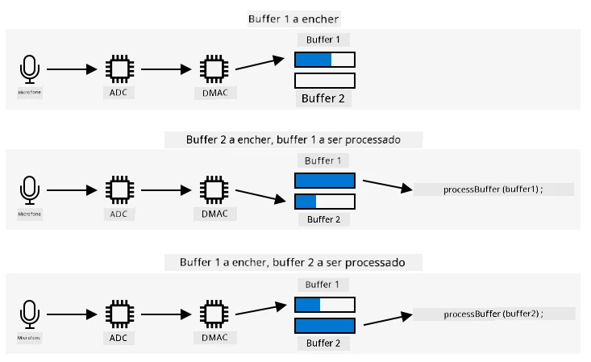

# Capturar áudio - Wio Terminal

Nesta parte da lição, vais escrever código para capturar áudio no teu Wio Terminal. A captura de áudio será controlada por um dos botões na parte superior do Wio Terminal.

## Programar o dispositivo para capturar áudio

Podes capturar áudio do microfone usando código em C++. O Wio Terminal tem apenas 192KB de RAM, o que não é suficiente para capturar mais do que alguns segundos de áudio. No entanto, possui 4MB de memória flash, que pode ser utilizada para guardar o áudio capturado.

O microfone integrado captura um sinal analógico, que é convertido num sinal digital que o Wio Terminal pode usar. Ao capturar áudio, os dados precisam de ser capturados no momento certo - por exemplo, para capturar áudio a 16KHz, o áudio precisa de ser capturado exatamente 16.000 vezes por segundo, com intervalos iguais entre cada amostra. Em vez de usar o teu código para fazer isso, podes usar o controlador de acesso direto à memória (DMAC). Este é um circuito que pode capturar um sinal de algum lugar e gravá-lo na memória, sem interromper o código que está a ser executado no processador.

✅ Lê mais sobre DMA na [página de acesso direto à memória na Wikipedia](https://wikipedia.org/wiki/Direct_memory_access).



O DMAC pode capturar áudio do ADC em intervalos fixos, como 16.000 vezes por segundo para áudio a 16KHz. Ele pode gravar esses dados capturados num buffer de memória pré-alocado e, quando este está cheio, disponibilizá-lo para o teu código processar. Usar esta memória pode atrasar a captura de áudio, mas podes configurar múltiplos buffers. O DMAC escreve no buffer 1 e, quando este está cheio, notifica o teu código para processar o buffer 1, enquanto o DMAC escreve no buffer 2. Quando o buffer 2 está cheio, notifica o teu código e volta a escrever no buffer 1. Desta forma, desde que processe cada buffer em menos tempo do que leva para encher um, não perderás nenhum dado.

Depois de cada buffer ser capturado, pode ser gravado na memória flash. A memória flash precisa de ser escrita usando endereços definidos, especificando onde escrever e o tamanho a escrever, semelhante à atualização de um array de bytes na memória. A memória flash tem granularidade, o que significa que as operações de apagar e escrever dependem não apenas de serem de um tamanho fixo, mas também de estarem alinhadas a esse tamanho. Por exemplo, se a granularidade for de 4096 bytes e pedires para apagar no endereço 4200, pode apagar todos os dados do endereço 4096 até 8192. Isto significa que, ao escrever os dados de áudio na memória flash, tem de ser em blocos do tamanho correto.

### Tarefa - configurar a memória flash

1. Cria um novo projeto Wio Terminal usando o PlatformIO. Chama este projeto `smart-timer`. Adiciona código na função `setup` para configurar a porta serial.

1. Adiciona as seguintes dependências de biblioteca ao ficheiro `platformio.ini` para fornecer acesso à memória flash:

    ```ini
    lib_deps =
        seeed-studio/Seeed Arduino FS @ 2.1.1
        seeed-studio/Seeed Arduino SFUD @ 2.0.2
    ```

1. Abre o ficheiro `main.cpp` e adiciona a seguinte diretiva de inclusão para a biblioteca de memória flash no topo do ficheiro:

    ```cpp
    #include <sfud.h>
    #include <SPI.h>
    ```

    > 🎓 SFUD significa Serial Flash Universal Driver, e é uma biblioteca projetada para funcionar com todos os chips de memória flash.

1. Na função `setup`, adiciona o seguinte código para configurar a biblioteca de armazenamento flash:

    ```cpp
    while (!(sfud_init() == SFUD_SUCCESS))
        ;

    sfud_qspi_fast_read_enable(sfud_get_device(SFUD_W25Q32_DEVICE_INDEX), 2);
    ```

    Este código faz um loop até que a biblioteca SFUD seja inicializada e, em seguida, ativa leituras rápidas. A memória flash integrada pode ser acessada usando uma Queued Serial Peripheral Interface (QSPI), um tipo de controlador SPI que permite acesso contínuo através de uma fila com uso mínimo do processador. Isto torna mais rápido ler e escrever na memória flash.

1. Cria um novo ficheiro na pasta `src` chamado `flash_writer.h`.

1. Adiciona o seguinte ao topo deste ficheiro:

    ```cpp
    #pragma once

    #include <Arduino.h>
    #include <sfud.h>
    ```

    Isto inclui alguns ficheiros de cabeçalho necessários, incluindo o ficheiro de cabeçalho da biblioteca SFUD para interagir com a memória flash.

1. Define uma classe neste novo ficheiro de cabeçalho chamada `FlashWriter`:

    ```cpp
    class FlashWriter
    {
    public:
    
    private:
    };
    ```

1. Na secção `private`, adiciona o seguinte código:

    ```cpp
    byte *_sfudBuffer;
    size_t _sfudBufferSize;
    size_t _sfudBufferPos;
    size_t _sfudBufferWritePos;

    const sfud_flash *_flash;
    ```

    Isto define alguns campos para o buffer a ser usado para armazenar dados antes de escrevê-los na memória flash. Há um array de bytes, `_sfudBuffer`, para escrever dados, e quando este está cheio, os dados são escritos na memória flash. O campo `_sfudBufferPos` armazena a localização atual para escrever neste buffer, e `_sfudBufferWritePos` armazena a localização na memória flash para escrever. `_flash` é um ponteiro para a memória flash onde os dados serão escritos - alguns microcontroladores têm múltiplos chips de memória flash.

1. Adiciona o seguinte método à secção `public` para inicializar esta classe:

    ```cpp
    void init()
    {
        _flash = sfud_get_device_table() + 0;
        _sfudBufferSize = _flash->chip.erase_gran;
        _sfudBuffer = new byte[_sfudBufferSize];
        _sfudBufferPos = 0;
        _sfudBufferWritePos = 0;
    }
    ```

    Isto configura a memória flash no Wio Terminal para escrever e define os buffers com base no tamanho de granularidade da memória flash. Isto está num método `init`, em vez de um construtor, pois precisa de ser chamado após a memória flash ser configurada na função `setup`.

1. Adiciona o seguinte código à secção `public`:

    ```cpp
    void writeSfudBuffer(byte b)
    {
        _sfudBuffer[_sfudBufferPos++] = b;
        if (_sfudBufferPos == _sfudBufferSize)
        {
            sfud_erase_write(_flash, _sfudBufferWritePos, _sfudBufferSize, _sfudBuffer);
            _sfudBufferWritePos += _sfudBufferSize;
            _sfudBufferPos = 0;
        }
    }

    void writeSfudBuffer(byte *b, size_t len)
    {
        for (size_t i = 0; i < len; ++i)
        {
            writeSfudBuffer(b[i]);
        }
    }

    void flushSfudBuffer()
    {
        if (_sfudBufferPos > 0)
        {
            sfud_erase_write(_flash, _sfudBufferWritePos, _sfudBufferSize, _sfudBuffer);
            _sfudBufferWritePos += _sfudBufferSize;
            _sfudBufferPos = 0;
        }
    }
    ```

    Este código define métodos para escrever bytes no sistema de armazenamento flash. Funciona escrevendo num buffer em memória que tem o tamanho correto para a memória flash e, quando este está cheio, é escrito na memória flash, apagando quaisquer dados existentes nesse local. Também há um método `flushSfudBuffer` para escrever um buffer incompleto, já que os dados capturados não serão múltiplos exatos do tamanho de granularidade, então a parte final dos dados precisa de ser escrita.

    > 💁 A parte final dos dados escreverá dados adicionais indesejados, mas isto não é um problema, pois apenas os dados necessários serão lidos.

### Tarefa - configurar a captura de áudio

1. Cria um novo ficheiro na pasta `src` chamado `config.h`.

1. Adiciona o seguinte ao topo deste ficheiro:

    ```cpp
    #pragma once

    #define RATE 16000
    #define SAMPLE_LENGTH_SECONDS 4
    #define SAMPLES RATE * SAMPLE_LENGTH_SECONDS
    #define BUFFER_SIZE (SAMPLES * 2) + 44
    #define ADC_BUF_LEN 1600
    ```

    Este código configura algumas constantes para a captura de áudio.

    | Constante             | Valor  | Descrição |
    | --------------------- | -----: | - |
    | RATE                  | 16000  | A taxa de amostragem para o áudio. 16.000 é 16KHz |
    | SAMPLE_LENGTH_SECONDS | 4      | A duração do áudio a capturar. Está definida para 4 segundos. Para gravar áudio mais longo, aumenta este valor. |
    | SAMPLES               | 64000  | O número total de amostras de áudio que serão capturadas. Definido como a taxa de amostragem * o número de segundos |
    | BUFFER_SIZE           | 128044 | O tamanho do buffer de áudio a capturar. O áudio será capturado como um ficheiro WAV, que tem 44 bytes de cabeçalho, seguido de 128.000 bytes de dados de áudio (cada amostra tem 2 bytes) |
    | ADC_BUF_LEN           | 1600   | O tamanho dos buffers a usar para capturar áudio do DMAC |

    > 💁 Se achares que 4 segundos é muito curto para solicitar um temporizador, podes aumentar o valor de `SAMPLE_LENGTH_SECONDS`, e todos os outros valores serão recalculados.

1. Cria um novo ficheiro na pasta `src` chamado `mic.h`.

1. Adiciona o seguinte ao topo deste ficheiro:

    ```cpp
    #pragma once

    #include <Arduino.h>

    #include "config.h"
    #include "flash_writer.h"
    ```

    Isto inclui alguns ficheiros de cabeçalho necessários, incluindo os ficheiros `config.h` e `FlashWriter`.

1. Adiciona o seguinte para definir uma classe `Mic` que pode capturar do microfone:

    ```cpp
    class Mic
    {
    public:
        Mic()
        {
            _isRecording = false;
            _isRecordingReady = false;
        }
    
        void startRecording()
        {
            _isRecording = true;
            _isRecordingReady = false;
        }
    
        bool isRecording()
        {
            return _isRecording;
        }
    
        bool isRecordingReady()
        {
            return _isRecordingReady;
        }
    
    private:
        volatile bool _isRecording;
        volatile bool _isRecordingReady;
        FlashWriter _writer;
    };
    
    Mic mic;
    ```

    Esta classe atualmente tem apenas alguns campos para rastrear se a gravação foi iniciada e se uma gravação está pronta para ser usada. Quando o DMAC é configurado, ele escreve continuamente em buffers de memória, então o campo `_isRecording` determina se estes devem ser processados ou ignorados. O campo `_isRecordingReady` será definido quando os 4 segundos necessários de áudio forem capturados. O campo `_writer` é usado para guardar os dados de áudio na memória flash.

    Uma variável global é então declarada para uma instância da classe `Mic`.

1. Adiciona o seguinte código à secção `private` da classe `Mic`:

    ```cpp
    typedef struct
    {
        uint16_t btctrl;
        uint16_t btcnt;
        uint32_t srcaddr;
        uint32_t dstaddr;
        uint32_t descaddr;
    } dmacdescriptor;

    // Globals - DMA and ADC
    volatile dmacdescriptor _wrb[DMAC_CH_NUM] __attribute__((aligned(16)));
    dmacdescriptor _descriptor_section[DMAC_CH_NUM] __attribute__((aligned(16)));
    dmacdescriptor _descriptor __attribute__((aligned(16)));

    void configureDmaAdc()
    {
        // Configure DMA to sample from ADC at a regular interval (triggered by timer/counter)
        DMAC->BASEADDR.reg = (uint32_t)_descriptor_section;                    // Specify the location of the descriptors
        DMAC->WRBADDR.reg = (uint32_t)_wrb;                                    // Specify the location of the write back descriptors
        DMAC->CTRL.reg = DMAC_CTRL_DMAENABLE | DMAC_CTRL_LVLEN(0xf);           // Enable the DMAC peripheral
        DMAC->Channel[1].CHCTRLA.reg = DMAC_CHCTRLA_TRIGSRC(TC5_DMAC_ID_OVF) | // Set DMAC to trigger on TC5 timer overflow
                                        DMAC_CHCTRLA_TRIGACT_BURST;             // DMAC burst transfer

        _descriptor.descaddr = (uint32_t)&_descriptor_section[1];                    // Set up a circular descriptor
        _descriptor.srcaddr = (uint32_t)&ADC1->RESULT.reg;                           // Take the result from the ADC0 RESULT register
        _descriptor.dstaddr = (uint32_t)_adc_buf_0 + sizeof(uint16_t) * ADC_BUF_LEN; // Place it in the adc_buf_0 array
        _descriptor.btcnt = ADC_BUF_LEN;                                             // Beat count
        _descriptor.btctrl = DMAC_BTCTRL_BEATSIZE_HWORD |                            // Beat size is HWORD (16-bits)
                                DMAC_BTCTRL_DSTINC |                                    // Increment the destination address
                                DMAC_BTCTRL_VALID |                                     // Descriptor is valid
                                DMAC_BTCTRL_BLOCKACT_SUSPEND;                           // Suspend DMAC channel 0 after block transfer
        memcpy(&_descriptor_section[0], &_descriptor, sizeof(_descriptor));          // Copy the descriptor to the descriptor section

        _descriptor.descaddr = (uint32_t)&_descriptor_section[0];                    // Set up a circular descriptor
        _descriptor.srcaddr = (uint32_t)&ADC1->RESULT.reg;                           // Take the result from the ADC0 RESULT register
        _descriptor.dstaddr = (uint32_t)_adc_buf_1 + sizeof(uint16_t) * ADC_BUF_LEN; // Place it in the adc_buf_1 array
        _descriptor.btcnt = ADC_BUF_LEN;                                             // Beat count
        _descriptor.btctrl = DMAC_BTCTRL_BEATSIZE_HWORD |                            // Beat size is HWORD (16-bits)
                                DMAC_BTCTRL_DSTINC |                                    // Increment the destination address
                                DMAC_BTCTRL_VALID |                                     // Descriptor is valid
                                DMAC_BTCTRL_BLOCKACT_SUSPEND;                           // Suspend DMAC channel 0 after block transfer
        memcpy(&_descriptor_section[1], &_descriptor, sizeof(_descriptor));          // Copy the descriptor to the descriptor section

        // Configure NVIC
        NVIC_SetPriority(DMAC_1_IRQn, 0); // Set the Nested Vector Interrupt Controller (NVIC) priority for DMAC1 to 0 (highest)
        NVIC_EnableIRQ(DMAC_1_IRQn);      // Connect DMAC1 to Nested Vector Interrupt Controller (NVIC)

        // Activate the suspend (SUSP) interrupt on DMAC channel 1
        DMAC->Channel[1].CHINTENSET.reg = DMAC_CHINTENSET_SUSP;

        // Configure ADC
        ADC1->INPUTCTRL.bit.MUXPOS = ADC_INPUTCTRL_MUXPOS_AIN12_Val; // Set the analog input to ADC0/AIN2 (PB08 - A4 on Metro M4)
        while (ADC1->SYNCBUSY.bit.INPUTCTRL)
            ;                              // Wait for synchronization
        ADC1->SAMPCTRL.bit.SAMPLEN = 0x00; // Set max Sampling Time Length to half divided ADC clock pulse (2.66us)
        while (ADC1->SYNCBUSY.bit.SAMPCTRL)
            ;                                         // Wait for synchronization
        ADC1->CTRLA.reg = ADC_CTRLA_PRESCALER_DIV128; // Divide Clock ADC GCLK by 128 (48MHz/128 = 375kHz)
        ADC1->CTRLB.reg = ADC_CTRLB_RESSEL_12BIT |    // Set ADC resolution to 12 bits
                            ADC_CTRLB_FREERUN;          // Set ADC to free run mode
        while (ADC1->SYNCBUSY.bit.CTRLB)
            ;                       // Wait for synchronization
        ADC1->CTRLA.bit.ENABLE = 1; // Enable the ADC
        while (ADC1->SYNCBUSY.bit.ENABLE)
            ;                       // Wait for synchronization
        ADC1->SWTRIG.bit.START = 1; // Initiate a software trigger to start an ADC conversion
        while (ADC1->SYNCBUSY.bit.SWTRIG)
            ; // Wait for synchronization

        // Enable DMA channel 1
        DMAC->Channel[1].CHCTRLA.bit.ENABLE = 1;

        // Configure Timer/Counter 5
        GCLK->PCHCTRL[TC5_GCLK_ID].reg = GCLK_PCHCTRL_CHEN |     // Enable peripheral channel for TC5
                                            GCLK_PCHCTRL_GEN_GCLK1; // Connect generic clock 0 at 48MHz

        TC5->COUNT16.WAVE.reg = TC_WAVE_WAVEGEN_MFRQ; // Set TC5 to Match Frequency (MFRQ) mode
        TC5->COUNT16.CC[0].reg = 3000 - 1;            // Set the trigger to 16 kHz: (4Mhz / 16000) - 1
        while (TC5->COUNT16.SYNCBUSY.bit.CC0)
            ; // Wait for synchronization

        // Start Timer/Counter 5
        TC5->COUNT16.CTRLA.bit.ENABLE = 1; // Enable the TC5 timer
        while (TC5->COUNT16.SYNCBUSY.bit.ENABLE)
            ; // Wait for synchronization
    }

    uint16_t _adc_buf_0[ADC_BUF_LEN];
    uint16_t _adc_buf_1[ADC_BUF_LEN];
    ```

    Este código define um método `configureDmaAdc` que configura o DMAC, conectando-o ao ADC e configurando-o para preencher dois buffers alternados, `_adc_buf_0` e `_adc_buf_1`.

    > 💁 Uma das desvantagens do desenvolvimento para microcontroladores é a complexidade do código necessário para interagir com o hardware, já que o teu código funciona a um nível muito baixo, interagindo diretamente com o hardware. Este código é mais complexo do que o que escreverias para um computador de placa única ou um computador desktop, pois não há sistema operativo para ajudar. Existem algumas bibliotecas disponíveis que podem simplificar isto, mas ainda há muita complexidade.

1. Abaixo disto, adiciona o seguinte código:

    ```cpp
    // WAV files have a header. This struct defines that header
    struct wavFileHeader
    {
        char riff[4];         /* "RIFF"                                  */
        long flength;         /* file length in bytes                    */
        char wave[4];         /* "WAVE"                                  */
        char fmt[4];          /* "fmt "                                  */
        long chunk_size;      /* size of FMT chunk in bytes (usually 16) */
        short format_tag;     /* 1=PCM, 257=Mu-Law, 258=A-Law, 259=ADPCM */
        short num_chans;      /* 1=mono, 2=stereo                        */
        long srate;           /* Sampling rate in samples per second     */
        long bytes_per_sec;   /* bytes per second = srate*bytes_per_samp */
        short bytes_per_samp; /* 2=16-bit mono, 4=16-bit stereo          */
        short bits_per_samp;  /* Number of bits per sample               */
        char data[4];         /* "data"                                  */
        long dlength;         /* data length in bytes (filelength - 44)  */
    };

    void initBufferHeader()
    {
        wavFileHeader wavh;

        strncpy(wavh.riff, "RIFF", 4);
        strncpy(wavh.wave, "WAVE", 4);
        strncpy(wavh.fmt, "fmt ", 4);
        strncpy(wavh.data, "data", 4);

        wavh.chunk_size = 16;
        wavh.format_tag = 1; // PCM
        wavh.num_chans = 1;  // mono
        wavh.srate = RATE;
        wavh.bytes_per_sec = (RATE * 1 * 16 * 1) / 8;
        wavh.bytes_per_samp = 2;
        wavh.bits_per_samp = 16;
        wavh.dlength = RATE * 2 * 1 * 16 / 2;
        wavh.flength = wavh.dlength + 44;

        _writer.writeSfudBuffer((byte *)&wavh, 44);
    }
    ```

    Este código define o cabeçalho WAV como uma estrutura que ocupa 44 bytes de memória. Escreve detalhes sobre a taxa, tamanho e número de canais do ficheiro de áudio. Este cabeçalho é então escrito na memória flash.

1. Abaixo deste código, adiciona o seguinte para declarar um método a ser chamado quando os buffers de áudio estiverem prontos para serem processados:

    ```cpp
    void audioCallback(uint16_t *buf, uint32_t buf_len)
    {
        static uint32_t idx = 44;

        if (_isRecording)
        {
            for (uint32_t i = 0; i < buf_len; i++)
            {
                int16_t audio_value = ((int16_t)buf[i] - 2048) * 16;

                _writer.writeSfudBuffer(audio_value & 0xFF);
                _writer.writeSfudBuffer((audio_value >> 8) & 0xFF);
            }

            idx += buf_len;
                
            if (idx >= BUFFER_SIZE)
            {
                _writer.flushSfudBuffer();
                idx = 44;
                _isRecording = false;
                _isRecordingReady = true;
            }
        }
    }
    ```

    Os buffers de áudio são arrays de inteiros de 16 bits contendo o áudio do ADC. O ADC retorna valores sem sinal de 12 bits (0-1023), então estes precisam de ser convertidos para valores de 16 bits com sinal e depois convertidos em 2 bytes para serem armazenados como dados binários brutos.

    Estes bytes são escritos nos buffers de memória flash. A escrita começa no índice 44 - este é o deslocamento dos 44 bytes escritos como cabeçalho do ficheiro WAV. Assim que todos os bytes necessários para a duração de áudio requerida forem capturados, os dados restantes são escritos na memória flash.

1. Na secção `public` da classe `Mic`, adiciona o seguinte código:

    ```cpp
    void dmaHandler()
    {
        static uint8_t count = 0;

        if (DMAC->Channel[1].CHINTFLAG.bit.SUSP)
        {
            DMAC->Channel[1].CHCTRLB.reg = DMAC_CHCTRLB_CMD_RESUME;
            DMAC->Channel[1].CHINTFLAG.bit.SUSP = 1;

            if (count)
            {
                audioCallback(_adc_buf_0, ADC_BUF_LEN);
            }
            else
            {
                audioCallback(_adc_buf_1, ADC_BUF_LEN);
            }

            count = (count + 1) % 2;
        }
    }
    ```

    Este código será chamado pelo DMAC para informar o teu código que os buffers estão prontos para serem processados. Verifica se há dados para processar e chama o método `audioCallback` com o buffer relevante.

1. Fora da classe, após a declaração `Mic mic;`, adiciona o seguinte código:

    ```cpp
    void DMAC_1_Handler()
    {
        mic.dmaHandler();
    }
    ```

    O `DMAC_1_Handler` será chamado pelo DMAC quando os buffers estiverem prontos para serem processados. Esta função é encontrada pelo nome, então só precisa de existir para ser chamada.

1. Adiciona os seguintes dois métodos à secção `public` da classe `Mic`:

    ```cpp
    void init()
    {
        analogReference(AR_INTERNAL2V23);

        _writer.init();

        initBufferHeader();
        configureDmaAdc();
    }

    void reset()
    {
        _isRecordingReady = false;
        _isRecording = false;

        _writer.reset();

        initBufferHeader();
    }
    ```

    O método `init` contém código para inicializar a classe `Mic`. Este método define a voltagem correta para o pino do microfone, configura o gravador de memória flash, escreve o cabeçalho do ficheiro WAV e configura o DMAC. O método `reset` reinicia a memória flash e reescreve o cabeçalho após o áudio ter sido capturado e utilizado.

### Tarefa - capturar áudio

1. No ficheiro `main.cpp`, adiciona uma diretiva de inclusão para o ficheiro de cabeçalho `mic.h`:

    ```cpp
    #include "mic.h"
    ```

1. Na função `setup`, inicializa o botão C. A captura de áudio começará quando este botão for pressionado e continuará por 4 segundos:

    ```cpp
    pinMode(WIO_KEY_C, INPUT_PULLUP);
    ```

1. Abaixo disto, inicializa o microfone e imprime na consola que o áudio está pronto para ser capturado:

    ```cpp
    mic.init();

    Serial.println("Ready.");
    ```

1. Acima da função `loop`, define uma função para processar o áudio capturado. Por enquanto, esta não faz nada, mas mais tarde nesta lição enviará o discurso para ser convertido em texto:

    ```cpp
    void processAudio()
    {
    
    }
    ```

1. Adiciona o seguinte à função `loop`:

    ```cpp
    void loop()
    {
        if (digitalRead(WIO_KEY_C) == LOW && !mic.isRecording())
        {
            Serial.println("Starting recording...");
            mic.startRecording();
        }
    
        if (!mic.isRecording() && mic.isRecordingReady())
        {
            Serial.println("Finished recording");
    
            processAudio();
    
            mic.reset();
        }
    }
    ```

    Este código verifica o botão C e, se este for pressionado e a gravação ainda não tiver começado, o campo `_isRecording` da classe `Mic` é definido como verdadeiro. Isto fará com que o método `audioCallback` da classe `Mic` armazene áudio até que 4 segundos sejam capturados. Assim que 4 segundos de áudio forem capturados, o campo `_isRecording` é definido como falso e o campo `_isRecordingReady` é definido como verdadeiro. Isto é então verificado na função `loop` e, quando verdadeiro, a função `processAudio` é chamada e a classe `Mic` é reiniciada.

1. Compila este código, carrega-o no teu Wio Terminal e testa-o através do monitor serial. Pressiona o botão C (o botão do lado esquerdo, mais próximo do interruptor de energia) e fala. Serão capturados 4 segundos de áudio.

    ```output
    --- Available filters and text transformations: colorize, debug, default, direct, hexlify, log2file, nocontrol, printable, send_on_enter, time
    --- More details at http://bit.ly/pio-monitor-filters
    --- Miniterm on /dev/cu.usbmodem1101  9600,8,N,1 ---
    --- Quit: Ctrl+C | Menu: Ctrl+T | Help: Ctrl+T followed by Ctrl+H ---
    Ready.
    Starting recording...
    Finished recording
    ```
💁 Pode encontrar este código na pasta [code-record/wio-terminal](../../../../../6-consumer/lessons/1-speech-recognition/code-record/wio-terminal).
😀 O teu programa de gravação de áudio foi um sucesso!

**Aviso Legal**:  
Este documento foi traduzido utilizando o serviço de tradução por IA [Co-op Translator](https://github.com/Azure/co-op-translator). Embora nos esforcemos para garantir a precisão, é importante notar que traduções automáticas podem conter erros ou imprecisões. O documento original na sua língua nativa deve ser considerado a fonte autoritária. Para informações críticas, recomenda-se a tradução profissional realizada por humanos. Não nos responsabilizamos por quaisquer mal-entendidos ou interpretações incorretas decorrentes do uso desta tradução.