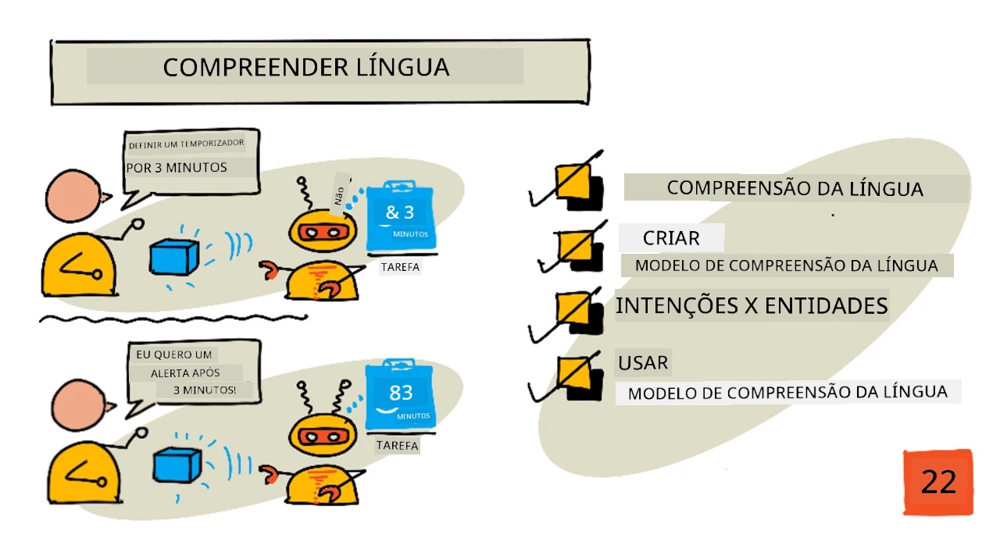
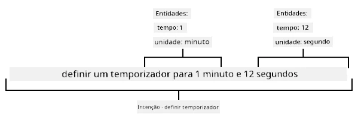
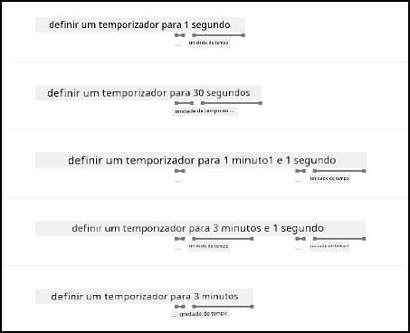

# Compreender a linguagem



> Ilustração por [Nitya Narasimhan](https://github.com/nitya). Clique na imagem para uma versão maior.

## Questionário pré-aula

[Questionário pré-aula](https://black-meadow-040d15503.1.azurestaticapps.net/quiz/43)

## Introdução

Na última lição, converteste fala em texto. Para que isso seja usado para programar um temporizador inteligente, o teu código precisará de compreender o que foi dito. Poderias assumir que o utilizador dirá uma frase fixa, como "Definir um temporizador de 3 minutos", e analisar essa expressão para determinar a duração do temporizador. No entanto, isso não é muito prático para o utilizador. Se um utilizador disser "Definir um temporizador para 3 minutos", tu ou eu entenderíamos o que ele quer dizer, mas o teu código não, pois estaria à espera de uma frase fixa.

É aqui que entra a compreensão da linguagem, utilizando modelos de IA para interpretar texto e devolver os detalhes necessários. Por exemplo, ser capaz de interpretar tanto "Definir um temporizador de 3 minutos" como "Definir um temporizador para 3 minutos" e compreender que é necessário um temporizador de 3 minutos.

Nesta lição, vais aprender sobre modelos de compreensão da linguagem, como criá-los, treiná-los e utilizá-los no teu código.

Nesta lição, abordaremos:

* [Compreensão da linguagem](../../../../../6-consumer/lessons/2-language-understanding)
* [Criar um modelo de compreensão da linguagem](../../../../../6-consumer/lessons/2-language-understanding)
* [Intenções e entidades](../../../../../6-consumer/lessons/2-language-understanding)
* [Utilizar o modelo de compreensão da linguagem](../../../../../6-consumer/lessons/2-language-understanding)

## Compreensão da linguagem

Os humanos utilizam a linguagem para comunicar há centenas de milhares de anos. Comunicamos com palavras, sons ou ações e entendemos o que é dito, tanto o significado das palavras, sons ou ações, como também o seu contexto. Entendemos sinceridade e sarcasmo, permitindo que as mesmas palavras tenham significados diferentes dependendo do tom da nossa voz.

✅ Pensa em algumas das conversas que tiveste recentemente. Quanto dessa conversa seria difícil para um computador entender porque necessita de contexto?

A compreensão da linguagem, também chamada de compreensão de linguagem natural, faz parte de um campo da inteligência artificial chamado processamento de linguagem natural (ou NLP) e lida com a compreensão de leitura, tentando entender os detalhes das palavras ou frases. Se utilizas um assistente de voz como Alexa ou Siri, já utilizaste serviços de compreensão da linguagem. Estes são os serviços de IA nos bastidores que convertem "Alexa, toca o último álbum da Taylor Swift" na minha filha a dançar pela sala ao som das suas músicas favoritas.

> 💁 Os computadores, apesar de todos os seus avanços, ainda têm um longo caminho a percorrer para realmente entender texto. Quando nos referimos à compreensão da linguagem com computadores, não queremos dizer algo remotamente tão avançado quanto a comunicação humana. Em vez disso, referimo-nos a pegar em algumas palavras e extrair detalhes importantes.

Como humanos, entendemos a linguagem sem realmente pensar sobre isso. Se eu pedisse a outro humano para "tocar o último álbum da Taylor Swift", ele saberia instintivamente o que eu quis dizer. Para um computador, isso é mais difícil. Ele teria que pegar nas palavras, convertidas de fala para texto, e determinar as seguintes informações:

* É necessário tocar música
* A música é da artista Taylor Swift
* A música específica é um álbum inteiro com várias faixas em ordem
* Taylor Swift tem muitos álbuns, então eles precisam ser ordenados cronologicamente e o mais recentemente publicado é o que é necessário

✅ Pensa em algumas outras frases que disseste ao fazer pedidos, como encomendar café ou pedir a um familiar para te passar algo. Tenta dividi-las nas informações que um computador precisaria extrair para entender a frase.

Os modelos de compreensão da linguagem são modelos de IA que são treinados para extrair certos detalhes da linguagem e, em seguida, são treinados para tarefas específicas usando aprendizagem por transferência, da mesma forma que treinaste um modelo de Visão Personalizada usando um pequeno conjunto de imagens. Podes pegar num modelo e treiná-lo usando o texto que queres que ele entenda.

## Criar um modelo de compreensão da linguagem


Podes criar modelos de compreensão da linguagem usando o LUIS, um serviço de compreensão da linguagem da Microsoft que faz parte dos Serviços Cognitivos.

### Tarefa - criar um recurso de autoria

Para usar o LUIS, precisas de criar um recurso de autoria.

1. Usa o seguinte comando para criar um recurso de autoria no teu grupo de recursos `smart-timer`:

    ```python
    az cognitiveservices account create --name smart-timer-luis-authoring \
                                        --resource-group smart-timer \
                                        --kind LUIS.Authoring \
                                        --sku F0 \
                                        --yes \
                                        --location <location>
    ```

    Substitui `<location>` pela localização que utilizaste ao criar o Grupo de Recursos.

    > ⚠️ O LUIS não está disponível em todas as regiões, então, se receberes o seguinte erro:
    >
    > ```output
    > InvalidApiSetId: The account type 'LUIS.Authoring' is either invalid or unavailable in given region.
    > ```
    >
    > escolhe uma região diferente.

    Isto criará um recurso de autoria do LUIS na camada gratuita.

### Tarefa - criar uma aplicação de compreensão da linguagem

1. Abre o portal do LUIS em [luis.ai](https://luis.ai?WT.mc_id=academic-17441-jabenn) no teu navegador e inicia sessão com a mesma conta que tens usado para o Azure.

1. Segue as instruções no diálogo para selecionar a tua subscrição do Azure e, em seguida, seleciona o recurso `smart-timer-luis-authoring` que acabaste de criar.

1. Na lista *Aplicações de Conversação*, seleciona o botão **Nova aplicação** para criar uma nova aplicação. Nomeia a nova aplicação como `smart-timer` e define a *Cultura* para a tua língua.

    > 💁 Há um campo para um recurso de previsão. Podes criar um segundo recurso apenas para previsão, mas o recurso de autoria gratuito permite 1.000 previsões por mês, o que deve ser suficiente para desenvolvimento, então podes deixar este campo em branco.

1. Lê o guia que aparece assim que crias a aplicação para entender os passos que precisas de seguir para treinar o modelo de compreensão da linguagem. Fecha este guia quando terminares.

## Intenções e entidades

A compreensão da linguagem baseia-se em *intenções* e *entidades*. Intenções são o objetivo das palavras, por exemplo, tocar música, definir um temporizador ou encomendar comida. Entidades são aquilo a que a intenção se refere, como o álbum, a duração do temporizador ou o tipo de comida. Cada frase que o modelo interpreta deve ter pelo menos uma intenção e, opcionalmente, uma ou mais entidades.

Alguns exemplos:

| Frase                                              | Intenção         | Entidades                                   |
| -------------------------------------------------- | ---------------- | ------------------------------------------ |
| "Tocar o último álbum da Taylor Swift"             | *tocar música*   | *o último álbum da Taylor Swift*           |
| "Definir um temporizador de 3 minutos"             | *definir temporizador* | *3 minutos*                                |
| "Cancelar o meu temporizador"                      | *cancelar temporizador* | Nenhuma                                    |
| "Encomendar 3 pizzas grandes de ananás e uma salada caesar" | *encomendar comida* | *3 pizzas grandes de ananás*, *salada caesar* |

✅ Com as frases que pensaste anteriormente, qual seria a intenção e as entidades dessa frase?

Para treinar o LUIS, primeiro defines as entidades. Estas podem ser uma lista fixa de termos ou aprendidas a partir do texto. Por exemplo, poderias fornecer uma lista fixa de alimentos disponíveis no teu menu, com variações (ou sinónimos) de cada palavra, como *beringela* e *aubergine* como variações de *beringela*. O LUIS também tem entidades pré-construídas que podem ser usadas, como números e localizações.

Para definir um temporizador, poderias ter uma entidade usando as entidades pré-construídas de número para o tempo e outra para as unidades, como minutos e segundos. Cada unidade teria múltiplas variações para cobrir as formas singular e plural - como minuto e minutos.

Depois de definir as entidades, crias intenções. Estas são aprendidas pelo modelo com base em frases de exemplo que forneces (conhecidas como enunciados). Por exemplo, para uma intenção *definir temporizador*, poderias fornecer as seguintes frases:

* `definir um temporizador de 1 segundo`
* `definir um temporizador para 1 minuto e 12 segundos`
* `definir um temporizador para 3 minutos`
* `definir um temporizador de 9 minutos e 30 segundos`

Depois, indicas ao LUIS quais partes dessas frases correspondem às entidades:



A frase `definir um temporizador para 1 minuto e 12 segundos` tem a intenção de `definir temporizador`. Também tem 2 entidades com 2 valores cada:

|            | tempo | unidade   |
| ---------- | ---: | --------- |
| 1 minuto   | 1    | minuto    |
| 12 segundos | 12   | segundo   |

Para treinar um bom modelo, precisas de uma variedade de frases de exemplo diferentes para cobrir as muitas formas como alguém pode pedir a mesma coisa.

> 💁 Como acontece com qualquer modelo de IA, quanto mais dados e mais precisos forem os dados que usares para treinar, melhor será o modelo.

✅ Pensa nas diferentes formas como poderias pedir a mesma coisa e esperar que um humano entendesse.

### Tarefa - adicionar entidades aos modelos de compreensão da linguagem

Para o temporizador, precisas de adicionar 2 entidades - uma para a unidade de tempo (minutos ou segundos) e outra para o número de minutos ou segundos.

Podes encontrar instruções para usar o portal do LUIS na [Documentação de Introdução: Criar a tua aplicação no portal do LUIS na Microsoft Docs](https://docs.microsoft.com/azure/cognitive-services/luis/luis-get-started-create-app?WT.mc_id=academic-17441-jabenn).

1. No portal do LUIS, seleciona o separador *Entidades* e adiciona a entidade pré-construída *número* selecionando o botão **Adicionar entidade pré-construída** e, em seguida, selecionando *número* da lista.

1. Cria uma nova entidade para a unidade de tempo usando o botão **Criar**. Nomeia a entidade como `unidade de tempo` e define o tipo como *Lista*. Adiciona valores para `minuto` e `segundo` à lista de *Valores normalizados*, adicionando as formas singular e plural à lista de *sinónimos*. Pressiona `enter` após adicionar cada sinónimo para o adicionar à lista.

    | Valor normalizado | Sinónimos        |
    | ----------------- | ---------------- |
    | minuto            | minuto, minutos |
    | segundo           | segundo, segundos |

### Tarefa - adicionar intenções aos modelos de compreensão da linguagem

1. No separador *Intenções*, seleciona o botão **Criar** para criar uma nova intenção. Nomeia esta intenção como `definir temporizador`.

1. Nos exemplos, insere diferentes formas de definir um temporizador usando minutos, segundos e minutos e segundos combinados. Exemplos podem ser:

    * `definir um temporizador de 1 segundo`
    * `definir um temporizador de 4 minutos`
    * `definir um temporizador de quatro minutos e seis segundos`
    * `definir um temporizador de 9 minutos e 30 segundos`
    * `definir um temporizador para 1 minuto e 12 segundos`
    * `definir um temporizador para 3 minutos`
    * `definir um temporizador para 3 minutos e 1 segundo`
    * `definir um temporizador para três minutos e um segundo`
    * `definir um temporizador para 1 minuto e 1 segundo`
    * `definir um temporizador para 30 segundos`
    * `definir um temporizador para 1 segundo`

    Mistura números como palavras e números para que o modelo aprenda a lidar com ambos.

1. À medida que inseres cada exemplo, o LUIS começará a detetar entidades e sublinhará e etiquetará qualquer uma que encontrar.

    

### Tarefa - treinar e testar o modelo

1. Depois de configurar as entidades e intenções, podes treinar o modelo usando o botão **Treinar** no menu superior. Seleciona este botão e o modelo deve treinar em alguns segundos. O botão ficará desativado enquanto treina e será reativado quando terminar.

1. Seleciona o botão **Testar** no menu superior para testar o modelo de compreensão da linguagem. Insere texto como `definir um temporizador para 5 minutos e 4 segundos` e pressiona enter. A frase aparecerá numa caixa abaixo da caixa de texto onde a escreveste e, abaixo disso, estará a *intenção principal*, ou seja, a intenção detetada com a maior probabilidade. Esta deve ser `definir temporizador`. O nome da intenção será seguido pela probabilidade de que a intenção detetada seja a correta.

1. Seleciona a opção **Inspecionar** para ver uma análise detalhada dos resultados. Verás a intenção com maior pontuação e a sua probabilidade percentual, juntamente com listas das entidades detetadas.

1. Fecha o painel *Testar* quando terminares de testar.

### Tarefa - publicar o modelo

Para usar este modelo no código, precisas de publicá-lo. Ao publicar no LUIS, podes publicar num ambiente de teste ou num ambiente de produção para um lançamento completo. Nesta lição, um ambiente de teste é suficiente.

1. No portal do LUIS, seleciona o botão **Publicar** no menu superior.

1. Certifica-te de que o *Slot de teste* está selecionado e, em seguida, seleciona **Concluído**. Verás uma notificação quando a aplicação for publicada.

1. Podes testar isto usando curl. Para construir o comando curl, precisas de três valores - o endpoint, o ID da aplicação (App ID) e uma chave de API. Estes podem ser acessados na aba **GERIR** que pode ser selecionada no menu superior.

    1. Na secção *Configurações*, copia o App ID
1. Na secção *Azure Resources*, selecione *Authoring Resource* e copie a *Primary Key* e o *Endpoint URL*.

1. Execute o seguinte comando curl no seu prompt de comando ou terminal:

    ```sh
    curl "<endpoint url>/luis/prediction/v3.0/apps/<app id>/slots/staging/predict" \
          --request GET \
          --get \
          --data "subscription-key=<primary key>" \
          --data "verbose=false" \
          --data "show-all-intents=true" \
          --data-urlencode "query=<sentence>"
    ```

    Substitua `<endpoint url>` pelo Endpoint URL da secção *Azure Resources*.

    Substitua `<app id>` pelo App ID da secção *Settings*.

    Substitua `<primary key>` pela Primary Key da secção *Azure Resources*.

    Substitua `<sentence>` pela frase que deseja testar.

1. O resultado desta chamada será um documento JSON que detalha a consulta, a intenção principal e uma lista de entidades divididas por tipo.

    ```JSON
    {
        "query": "set a timer for 45 minutes and 12 seconds",
        "prediction": {
            "topIntent": "set timer",
            "intents": {
                "set timer": {
                    "score": 0.97031575
                },
                "None": {
                    "score": 0.02205793
                }
            },
            "entities": {
                "number": [
                    45,
                    12
                ],
                "time-unit": [
                    [
                        "minute"
                    ],
                    [
                        "second"
                    ]
                ]
            }
        }
    }
    ```

    O JSON acima foi gerado ao consultar com `set a timer for 45 minutes and 12 seconds`:

    * A intenção principal foi `set timer` com uma probabilidade de 97%.
    * Foram detetadas duas entidades do tipo *number*, `45` e `12`.
    * Foram detetadas duas entidades do tipo *time-unit*, `minute` e `second`.

## Utilizar o modelo de compreensão de linguagem

Depois de publicado, o modelo LUIS pode ser chamado a partir de código. Em lições anteriores, utilizou um IoT Hub para gerir a comunicação com serviços na nuvem, enviando telemetria e ouvindo comandos. Este processo é muito assíncrono - uma vez enviada a telemetria, o código não espera por uma resposta, e se o serviço na nuvem estiver indisponível, não será informado.

Para um temporizador inteligente, queremos uma resposta imediata, para que possamos informar o utilizador que o temporizador foi configurado ou alertá-lo de que os serviços na nuvem estão indisponíveis. Para isso, o dispositivo IoT chamará diretamente um endpoint web, em vez de depender de um IoT Hub.

Em vez de chamar o LUIS diretamente do dispositivo IoT, pode usar código serverless com um tipo diferente de trigger - um trigger HTTP. Isto permite que a sua aplicação de funções ouça pedidos REST e responda a eles. Esta função será um endpoint REST que o seu dispositivo pode chamar.

> 💁 Embora seja possível chamar o LUIS diretamente do dispositivo IoT, é preferível usar algo como código serverless. Desta forma, quando quiser alterar a aplicação LUIS que está a chamar, por exemplo, ao treinar um modelo melhor ou um modelo numa língua diferente, só precisará de atualizar o código na nuvem, sem ter de reimplementar o código em milhares ou milhões de dispositivos IoT.

### Tarefa - criar uma aplicação de funções serverless

1. Crie uma aplicação de funções Azure chamada `smart-timer-trigger` e abra-a no VS Code.

1. Adicione um trigger HTTP a esta aplicação chamado `speech-trigger` usando o seguinte comando no terminal do VS Code:

    ```sh
    func new --name text-to-timer --template "HTTP trigger"
    ```

    Isto criará um trigger HTTP chamado `text-to-timer`.

1. Teste o trigger HTTP executando a aplicação de funções. Quando esta for executada, verá o endpoint listado na saída:

    ```output
    Functions:
    
            text-to-timer: [GET,POST] http://localhost:7071/api/text-to-timer
    ```

    Teste isto carregando o URL [http://localhost:7071/api/text-to-timer](http://localhost:7071/api/text-to-timer) no seu navegador.

    ```output
    This HTTP triggered function executed successfully. Pass a name in the query string or in the request body for a personalized response.
    ```

### Tarefa - utilizar o modelo de compreensão de linguagem

1. O SDK para LUIS está disponível através de um pacote Pip. Adicione a seguinte linha ao ficheiro `requirements.txt` para adicionar a dependência deste pacote:

    ```sh
    azure-cognitiveservices-language-luis
    ```

1. Certifique-se de que o terminal do VS Code tem o ambiente virtual ativado e execute o seguinte comando para instalar os pacotes Pip:

    ```sh
    pip install -r requirements.txt
    ```

    > 💁 Se encontrar erros, pode ser necessário atualizar o pip com o seguinte comando:
    >
    > ```sh
    > pip install --upgrade pip
    > ```

1. Adicione novas entradas ao ficheiro `local.settings.json` para a sua LUIS API Key, Endpoint URL e App ID da aba **MANAGE** do portal LUIS:

    ```JSON
    "LUIS_KEY": "<primary key>",
    "LUIS_ENDPOINT_URL": "<endpoint url>",
    "LUIS_APP_ID": "<app id>"
    ```

    Substitua `<endpoint url>` pelo Endpoint URL da secção *Azure Resources* da aba **MANAGE**. Este será `https://<location>.api.cognitive.microsoft.com/`.

    Substitua `<app id>` pelo App ID da secção *Settings* da aba **MANAGE**.

    Substitua `<primary key>` pela Primary Key da secção *Azure Resources* da aba **MANAGE**.

1. Adicione as seguintes importações ao ficheiro `__init__.py`:

    ```python
    import json
    import os
    from azure.cognitiveservices.language.luis.runtime import LUISRuntimeClient
    from msrest.authentication import CognitiveServicesCredentials
    ```

    Isto importa algumas bibliotecas do sistema, bem como as bibliotecas para interagir com o LUIS.

1. Apague o conteúdo do método `main` e adicione o seguinte código:

    ```python
    luis_key = os.environ['LUIS_KEY']
    endpoint_url = os.environ['LUIS_ENDPOINT_URL']
    app_id = os.environ['LUIS_APP_ID']
    
    credentials = CognitiveServicesCredentials(luis_key)
    client = LUISRuntimeClient(endpoint=endpoint_url, credentials=credentials)
    ```

    Este código carrega os valores que adicionou ao ficheiro `local.settings.json` para a sua aplicação LUIS, cria um objeto de credenciais com a sua API key e, em seguida, cria um cliente LUIS para interagir com a sua aplicação LUIS.

1. Este trigger HTTP será chamado passando o texto a ser compreendido como JSON, com o texto numa propriedade chamada `text`. O seguinte código extrai o valor do corpo do pedido HTTP e regista-o no console. Adicione este código à função `main`:

    ```python
    req_body = req.get_json()
    text = req_body['text']
    logging.info(f'Request - {text}')
    ```

1. As previsões são solicitadas ao LUIS enviando um pedido de previsão - um documento JSON contendo o texto a prever. Crie este pedido com o seguinte código:

    ```python
    prediction_request = { 'query' : text }
    ```

1. Este pedido pode então ser enviado ao LUIS, utilizando o slot de staging para o qual a sua aplicação foi publicada:

    ```python
    prediction_response = client.prediction.get_slot_prediction(app_id, 'Staging', prediction_request)
    ```

1. A resposta de previsão contém a intenção principal - a intenção com a maior pontuação de previsão, juntamente com as entidades. Se a intenção principal for `set timer`, então as entidades podem ser lidas para obter o tempo necessário para o temporizador:

    ```python
    if prediction_response.prediction.top_intent == 'set timer':
        numbers = prediction_response.prediction.entities['number']
        time_units = prediction_response.prediction.entities['time unit']
        total_seconds = 0
    ```

    As entidades do tipo `number` serão um array de números. Por exemplo, se disser *"Set a four minute 17 second timer."*, o array `number` conterá 2 inteiros - 4 e 17.

    As entidades do tipo `time unit` serão um array de arrays de strings, com cada unidade de tempo como um array de strings dentro do array. Por exemplo, se disser *"Set a four minute 17 second timer."*, o array `time unit` conterá 2 arrays com valores únicos - `['minute']` e `['second']`.

    A versão JSON destas entidades para *"Set a four minute 17 second timer."* é:

    ```json
    {
        "number": [4, 17],
        "time unit": [
            ["minute"],
            ["second"]
        ]
    }
    ```

    Este código também define uma contagem para o tempo total do temporizador em segundos. Este será preenchido pelos valores das entidades.

1. As entidades não estão ligadas, mas podemos fazer algumas suposições sobre elas. Estarão na ordem em que foram ditas, então a posição no array pode ser usada para determinar qual número corresponde a qual unidade de tempo. Por exemplo:

    * *"Set a 30 second timer"* - terá um número, `30`, e uma unidade de tempo, `second`, então o único número corresponderá à única unidade de tempo.
    * *"Set a 2 minute and 30 second timer"* - terá dois números, `2` e `30`, e duas unidades de tempo, `minute` e `second`, então o primeiro número será para a primeira unidade de tempo (2 minutos) e o segundo número para a segunda unidade de tempo (30 segundos).

    O seguinte código obtém a contagem de itens nas entidades do tipo número e usa isso para extrair o primeiro item de cada array, depois o segundo e assim por diante. Adicione isto dentro do bloco `if`.

    ```python
    for i in range(0, len(numbers)):
        number = numbers[i]
        time_unit = time_units[i][0]
    ```

    Para *"Set a four minute 17 second timer."*, este código fará duas iterações, dando os seguintes valores:

    | contagem de loop | `number` | `time_unit` |
    | ----------------: | -------: | ----------- |
    | 0                 | 4        | minute      |
    | 1                 | 17       | second      |

1. Dentro deste loop, use o número e a unidade de tempo para calcular o tempo total do temporizador, adicionando 60 segundos para cada minuto e o número de segundos para quaisquer segundos.

    ```python
    if time_unit == 'minute':
        total_seconds += number * 60
    else:
        total_seconds += number
    ```

1. Fora deste loop pelas entidades, registe o tempo total do temporizador:

    ```python
    logging.info(f'Timer required for {total_seconds} seconds')
    ```

1. O número de segundos precisa de ser retornado pela função como uma resposta HTTP. No final do bloco `if`, adicione o seguinte:

    ```python
    payload = {
        'seconds': total_seconds
    }
    return func.HttpResponse(json.dumps(payload), status_code=200)
    ```

    Este código cria um payload contendo o número total de segundos para o temporizador, converte-o numa string JSON e retorna-o como um resultado HTTP com um código de status 200, o que significa que a chamada foi bem-sucedida.

1. Finalmente, fora do bloco `if`, trate o caso em que a intenção não foi reconhecida retornando um código de erro:

    ```python
    return func.HttpResponse(status_code=404)
    ```

    404 é o código de status para *não encontrado*.

1. Execute a aplicação de funções e teste-a usando curl.

    ```sh
    curl --request POST 'http://localhost:7071/api/text-to-timer' \
         --header 'Content-Type: application/json' \
         --include \
         --data '{"text":"<text>"}'
    ```

    Substitua `<text>` pelo texto do seu pedido, por exemplo `set a 2 minutes 27 second timer`.

    Verá a seguinte saída da aplicação de funções:

    ```output
    Functions:

            text-to-timer: [GET,POST] http://localhost:7071/api/text-to-timer
    
    For detailed output, run func with --verbose flag.
    [2021-06-26T19:45:14.502Z] Worker process started and initialized.
    [2021-06-26T19:45:19.338Z] Host lock lease acquired by instance ID '000000000000000000000000951CAE4E'.
    [2021-06-26T19:45:52.059Z] Executing 'Functions.text-to-timer' (Reason='This function was programmatically called via the host APIs.', Id=f68bfb90-30e4-47a5-99da-126b66218e81)
    [2021-06-26T19:45:53.577Z] Timer required for 147 seconds
    [2021-06-26T19:45:53.746Z] Executed 'Functions.text-to-timer' (Succeeded, Id=f68bfb90-30e4-47a5-99da-126b66218e81, Duration=1750ms)
    ```

    A chamada ao curl retornará o seguinte:

    ```output
    HTTP/1.1 200 OK
    Date: Tue, 29 Jun 2021 01:14:11 GMT
    Content-Type: text/plain; charset=utf-8
    Server: Kestrel
    Transfer-Encoding: chunked
    
    {"seconds": 147}
    ```

    O número de segundos para o temporizador estará no valor `"seconds"`.

> 💁 Pode encontrar este código na pasta [code/functions](../../../../../6-consumer/lessons/2-language-understanding/code/functions).

### Tarefa - tornar a sua função acessível ao seu dispositivo IoT

1. Para que o seu dispositivo IoT chame o seu endpoint REST, precisará de saber o URL. Quando o acedeu anteriormente, utilizou `localhost`, que é um atalho para aceder a endpoints REST na sua máquina local. Para permitir que o dispositivo IoT aceda, precisará de publicar na nuvem ou obter o endereço IP para aceder localmente.

    > ⚠️ Se estiver a usar um Wio Terminal, é mais fácil executar a aplicação de funções localmente, pois haverá uma dependência de bibliotecas que significa que não poderá implementar a aplicação de funções da mesma forma que fez anteriormente. Execute a aplicação de funções localmente e aceda-a através do endereço IP do seu computador. Se quiser implementar na nuvem, informações serão fornecidas numa lição posterior sobre como fazê-lo.

    * Publique a aplicação de funções - siga as instruções das lições anteriores para publicar a sua aplicação de funções na nuvem. Uma vez publicada, o URL será `https://<APP_NAME>.azurewebsites.net/api/text-to-timer`, onde `<APP_NAME>` será o nome da sua aplicação de funções. Certifique-se também de publicar as suas configurações locais.

      Ao trabalhar com triggers HTTP, estes são protegidos por padrão com uma chave de aplicação de funções. Para obter esta chave, execute o seguinte comando:

      ```sh
      az functionapp keys list --resource-group smart-timer \
                               --name <APP_NAME>                               
      ```

      Copie o valor da entrada `default` da secção `functionKeys`.

      ```output
      {
        "functionKeys": {
          "default": "sQO1LQaeK9N1qYD6SXeb/TctCmwQEkToLJU6Dw8TthNeUH8VA45hlA=="
        },
        "masterKey": "RSKOAIlyvvQEQt9dfpabJT018scaLpQu9p1poHIMCxx5LYrIQZyQ/g==",
        "systemKeys": {}
      }
      ```

      Esta chave precisará de ser adicionada como um parâmetro de consulta ao URL, então o URL final será `https://<APP_NAME>.azurewebsites.net/api/text-to-timer?code=<FUNCTION_KEY>`, onde `<APP_NAME>` será o nome da sua aplicação de funções e `<FUNCTION_KEY>` será a sua chave de função padrão.

      > 💁 Pode alterar o tipo de autorização do trigger HTTP usando a configuração `authlevel` no ficheiro `function.json`. Pode ler mais sobre isto na [secção de configuração da documentação do trigger HTTP das Azure Functions nos documentos da Microsoft](https://docs.microsoft.com/azure/azure-functions/functions-bindings-http-webhook-trigger?WT.mc_id=academic-17441-jabenn&tabs=python#configuration).

    * Execute a aplicação de funções localmente e aceda usando o endereço IP - pode obter o endereço IP do seu computador na rede local e usá-lo para construir o URL.

      Encontre o seu endereço IP:

      * No Windows 10, siga o [guia para encontrar o seu endereço IP](https://support.microsoft.com/windows/find-your-ip-address-f21a9bbc-c582-55cd-35e0-73431160a1b9?WT.mc_id=academic-17441-jabenn).
      * No macOS, siga o [guia para encontrar o endereço IP num Mac](https://www.hellotech.com/guide/for/how-to-find-ip-address-on-mac).
      * No Linux, siga a secção sobre encontrar o endereço IP privado no [guia para encontrar o endereço IP no Linux](https://opensource.com/article/18/5/how-find-ip-address-linux).

      Uma vez que tenha o seu endereço IP, poderá aceder à função em `http://`.

:7071/api/text-to-timer`, onde `<IP_ADDRESS>` será o endereço IP, por exemplo, `http://192.168.1.10:7071/api/text-to-timer`.

      > 💁 Note que isto utiliza a porta 7071, por isso, após o endereço IP, será necessário incluir `:7071`.

      > 💁 Isto só funcionará se o seu dispositivo IoT estiver na mesma rede que o seu computador.

1. Teste o endpoint acedendo a ele utilizando o curl.

---

## 🚀 Desafio

Existem várias formas de pedir a mesma coisa, como configurar um temporizador. Pense em diferentes maneiras de fazer isso e use-as como exemplos na sua aplicação LUIS. Teste estas formas para ver como o seu modelo lida com múltiplas maneiras de solicitar um temporizador.

## Questionário pós-aula

[Questionário pós-aula](https://black-meadow-040d15503.1.azurestaticapps.net/quiz/44)

## Revisão e Estudo Individual

* Leia mais sobre o LUIS e as suas capacidades na [página de documentação do Language Understanding (LUIS) na Microsoft Docs](https://docs.microsoft.com/azure/cognitive-services/luis/?WT.mc_id=academic-17441-jabenn)
* Leia mais sobre compreensão de linguagem na [página de compreensão de linguagem natural na Wikipédia](https://wikipedia.org/wiki/Natural-language_understanding)
* Leia mais sobre triggers HTTP na [documentação de triggers HTTP do Azure Functions na Microsoft Docs](https://docs.microsoft.com/azure/azure-functions/functions-bindings-http-webhook-trigger?WT.mc_id=academic-17441-jabenn&tabs=python)

## Tarefa

[Cancelar o temporizador](assignment.md)

**Aviso Legal**:  
Este documento foi traduzido utilizando o serviço de tradução por IA [Co-op Translator](https://github.com/Azure/co-op-translator). Embora nos esforcemos pela precisão, tenha em atenção que traduções automáticas podem conter erros ou imprecisões. O documento original na sua língua nativa deve ser considerado a fonte autoritária. Para informações críticas, recomenda-se uma tradução profissional realizada por humanos. Não nos responsabilizamos por quaisquer mal-entendidos ou interpretações incorretas decorrentes da utilização desta tradução.