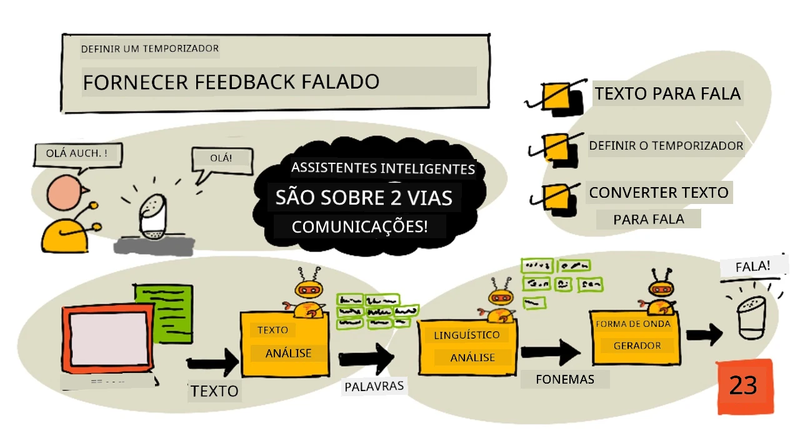
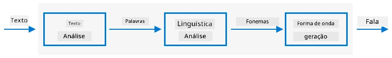

# Definir um temporizador e fornecer feedback falado



> Ilustração por [Nitya Narasimhan](https://github.com/nitya). Clique na imagem para uma versão maior.

## Questionário pré-aula

[Questionário pré-aula](https://black-meadow-040d15503.1.azurestaticapps.net/quiz/45)

## Introdução

Assistentes inteligentes não são dispositivos de comunicação unidirecional. Você fala com eles, e eles respondem:

"Alexa, define um temporizador de 3 minutos"

"Ok, o seu temporizador foi definido para 3 minutos"

Nas últimas 2 lições, aprendeste como transformar fala em texto e, em seguida, extrair um pedido de temporizador desse texto. Nesta lição, vais aprender como definir o temporizador no dispositivo IoT, responder ao utilizador com palavras faladas confirmando o temporizador e alertá-lo quando o temporizador terminar.

Nesta lição, vamos abordar:

* [Texto para fala](../../../../../6-consumer/lessons/3-spoken-feedback)
* [Definir o temporizador](../../../../../6-consumer/lessons/3-spoken-feedback)
* [Converter texto em fala](../../../../../6-consumer/lessons/3-spoken-feedback)

## Texto para fala

Texto para fala, como o nome sugere, é o processo de converter texto em áudio que contém as palavras faladas. O princípio básico é decompor as palavras do texto nos seus sons constituintes (conhecidos como fonemas) e juntar áudio para esses sons, seja usando áudio pré-gravado ou áudio gerado por modelos de IA.



Os sistemas de texto para fala geralmente têm 3 etapas:

* Análise de texto
* Análise linguística
* Geração de forma de onda

### Análise de texto

A análise de texto envolve pegar no texto fornecido e convertê-lo em palavras que podem ser usadas para gerar fala. Por exemplo, se converteres "Olá mundo", não há necessidade de análise de texto, as duas palavras podem ser convertidas diretamente em fala. Se tiveres "1234", no entanto, isso pode precisar ser convertido em "Mil duzentos e trinta e quatro" ou "Um, dois, três, quatro", dependendo do contexto. Para "Eu tenho 1234 maçãs", seria "Mil duzentos e trinta e quatro", mas para "A criança contou 1234", seria "Um, dois, três, quatro".

As palavras criadas variam não apenas para o idioma, mas também para o local desse idioma. Por exemplo, em inglês americano, 120 seria "One hundred twenty", enquanto em inglês britânico seria "One hundred and twenty", com o uso de "and" após os cem.

✅ Alguns outros exemplos que requerem análise de texto incluem "in" como forma abreviada de polegada e "st" como forma abreviada de santo ou rua. Consegues pensar em outros exemplos no teu idioma de palavras que são ambíguas sem contexto?

Depois de definidas as palavras, elas são enviadas para análise linguística.

### Análise linguística

A análise linguística decompõe as palavras em fonemas. Os fonemas baseiam-se não apenas nas letras usadas, mas também nas outras letras da palavra. Por exemplo, em inglês, o som 'a' em 'car' e 'care' é diferente. O idioma inglês tem 44 fonemas diferentes para as 26 letras do alfabeto, alguns compartilhados por letras diferentes, como o mesmo fonema usado no início de 'circle' e 'serpent'.

✅ Faz uma pesquisa: Quais são os fonemas do teu idioma?

Depois de as palavras serem convertidas em fonemas, esses fonemas precisam de dados adicionais para suportar a entoação, ajustando o tom ou a duração dependendo do contexto. Um exemplo é que, em inglês, o aumento de tom pode ser usado para transformar uma frase numa pergunta, com o tom elevado na última palavra a implicar uma pergunta.

Por exemplo - a frase "You have an apple" é uma afirmação dizendo que tens uma maçã. Se o tom subir no final, aumentando na palavra "apple", torna-se a pergunta "You have an apple?", perguntando se tens uma maçã. A análise linguística precisa usar o ponto de interrogação no final para decidir aumentar o tom.

Depois de os fonemas serem gerados, eles podem ser enviados para geração de forma de onda para produzir o áudio.

### Geração de forma de onda

Os primeiros sistemas eletrónicos de texto para fala usavam gravações únicas de áudio para cada fonema, levando a vozes muito monótonas e robóticas. A análise linguística produzia fonemas, que eram carregados de uma base de dados de sons e unidos para criar o áudio.

✅ Faz uma pesquisa: Encontra algumas gravações de áudio de sistemas de síntese de fala antigos. Compara com a síntese de fala moderna, como a usada em assistentes inteligentes.

A geração de forma de onda mais moderna usa modelos de ML construídos com aprendizagem profunda (redes neurais muito grandes que funcionam de forma semelhante aos neurónios no cérebro) para produzir vozes mais naturais que podem ser indistinguíveis das humanas.

> 💁 Alguns desses modelos de ML podem ser re-treinados usando aprendizagem por transferência para soar como pessoas reais. Isso significa que usar a voz como um sistema de segurança, algo que os bancos estão a tentar cada vez mais, já não é uma boa ideia, pois qualquer pessoa com uma gravação de alguns minutos da tua voz pode imitar-te.

Esses grandes modelos de ML estão a ser treinados para combinar todas as três etapas em sintetizadores de fala de ponta a ponta.

## Definir o temporizador

Para definir o temporizador, o teu dispositivo IoT precisa chamar o endpoint REST que criaste usando código serverless e, em seguida, usar o número de segundos resultante para definir um temporizador.

### Tarefa - chamar a função serverless para obter o tempo do temporizador

Segue o guia relevante para chamar o endpoint REST a partir do teu dispositivo IoT e definir um temporizador para o tempo necessário:

* [Arduino - Wio Terminal](wio-terminal-set-timer.md)
* [Computador de placa única - Raspberry Pi/Dispositivo IoT virtual](single-board-computer-set-timer.md)

## Converter texto em fala

O mesmo serviço de fala que usaste para converter fala em texto pode ser usado para converter texto de volta em fala, e isso pode ser reproduzido através de um altifalante no teu dispositivo IoT. O texto a ser convertido é enviado para o serviço de fala, juntamente com o tipo de áudio necessário (como a taxa de amostragem), e dados binários contendo o áudio são retornados.

Quando envias esta solicitação, usas *Speech Synthesis Markup Language* (SSML), uma linguagem de marcação baseada em XML para aplicações de síntese de fala. Isto define não apenas o texto a ser convertido, mas também o idioma do texto, a voz a ser usada e pode até ser usado para definir velocidade, volume e tom para algumas ou todas as palavras no texto.

Por exemplo, este SSML define um pedido para converter o texto "O teu temporizador de 3 minutos e 5 segundos foi definido" em fala usando uma voz em inglês britânico chamada `en-GB-MiaNeural`

```xml
<speak version='1.0' xml:lang='en-GB'>
    <voice xml:lang='en-GB' name='en-GB-MiaNeural'>
        Your 3 minute 5 second time has been set
    </voice>
</speak>
```

> 💁 A maioria dos sistemas de texto para fala tem várias vozes para diferentes idiomas, com sotaques relevantes, como uma voz em inglês britânico com sotaque inglês e uma voz em inglês da Nova Zelândia com sotaque neozelandês.

### Tarefa - converter texto em fala

Segue o guia relevante para converter texto em fala usando o teu dispositivo IoT:

* [Arduino - Wio Terminal](wio-terminal-text-to-speech.md)
* [Computador de placa única - Raspberry Pi](pi-text-to-speech.md)
* [Computador de placa única - Dispositivo virtual](virtual-device-text-to-speech.md)

---

## 🚀 Desafio

O SSML tem formas de alterar como as palavras são faladas, como adicionar ênfase a certas palavras, adicionar pausas ou alterar o tom. Experimenta algumas dessas opções, enviando diferentes SSML a partir do teu dispositivo IoT e comparando os resultados. Podes ler mais sobre SSML, incluindo como alterar a forma como as palavras são faladas, na [especificação Speech Synthesis Markup Language (SSML) Version 1.1 do World Wide Web Consortium](https://www.w3.org/TR/speech-synthesis11/).

## Questionário pós-aula

[Questionário pós-aula](https://black-meadow-040d15503.1.azurestaticapps.net/quiz/46)

## Revisão e Autoestudo

* Lê mais sobre síntese de fala na [página de síntese de fala na Wikipédia](https://wikipedia.org/wiki/Speech_synthesis)
* Lê mais sobre como criminosos estão a usar síntese de fala para roubar na [notícia sobre vozes falsas 'ajudam cibercriminosos a roubar dinheiro' na BBC](https://www.bbc.com/news/technology-48908736)
* Aprende mais sobre os riscos para atores de voz devido a versões sintetizadas das suas vozes no [artigo sobre como esta ação judicial do TikTok está a destacar como a IA está a prejudicar atores de voz no Vice](https://www.vice.com/en/article/z3xqwj/this-tiktok-lawsuit-is-highlighting-how-ai-is-screwing-over-voice-actors)

## Tarefa

[Cancelar o temporizador](assignment.md)

**Aviso Legal**:  
Este documento foi traduzido utilizando o serviço de tradução por IA [Co-op Translator](https://github.com/Azure/co-op-translator). Embora nos esforcemos para garantir a precisão, é importante notar que traduções automáticas podem conter erros ou imprecisões. O documento original na sua língua nativa deve ser considerado a fonte autoritária. Para informações críticas, recomenda-se a tradução profissional realizada por humanos. Não nos responsabilizamos por quaisquer mal-entendidos ou interpretações incorretas decorrentes do uso desta tradução.