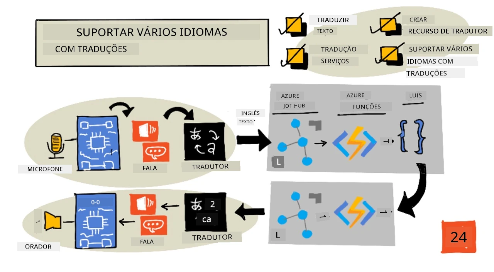
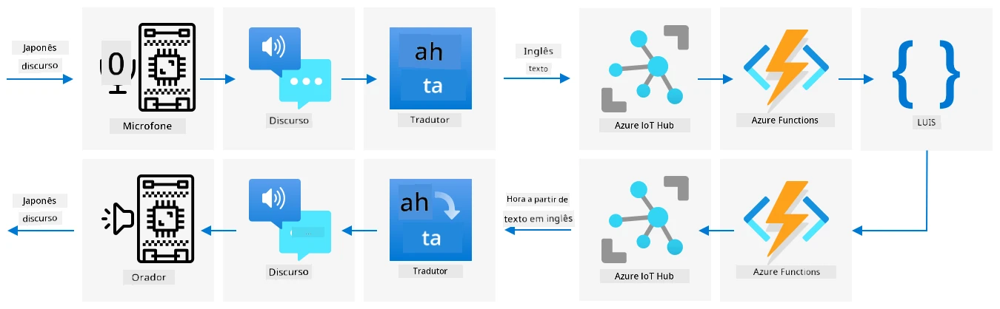

# Suporte a múltiplos idiomas



> Ilustração por [Nitya Narasimhan](https://github.com/nitya). Clique na imagem para uma versão maior.

Este vídeo oferece uma visão geral dos serviços de fala do Azure, abordando conversão de fala para texto e texto para fala das lições anteriores, bem como tradução de fala, um tema abordado nesta lição:

[](https://www.youtube.com/watch?v=h6xbpMPSGEA)

> 🎥 Clique na imagem acima para assistir ao vídeo

## Questionário pré-aula

[Questionário pré-aula](https://black-meadow-040d15503.1.azurestaticapps.net/quiz/47)

## Introdução

Nas últimas 3 lições, aprendeste sobre conversão de fala para texto, compreensão de linguagem e conversão de texto para fala, tudo impulsionado por IA. Outra área da comunicação humana em que a IA pode ajudar é a tradução de idiomas - converter de um idioma para outro, como de inglês para francês.

Nesta lição, vais aprender a usar IA para traduzir texto, permitindo que o teu temporizador inteligente interaja com utilizadores em vários idiomas.

Nesta lição, vamos abordar:

* [Traduzir texto](../../../../../6-consumer/lessons/4-multiple-language-support)
* [Serviços de tradução](../../../../../6-consumer/lessons/4-multiple-language-support)
* [Criar um recurso de tradutor](../../../../../6-consumer/lessons/4-multiple-language-support)
* [Suportar múltiplos idiomas em aplicações com traduções](../../../../../6-consumer/lessons/4-multiple-language-support)
* [Traduzir texto usando um serviço de IA](../../../../../6-consumer/lessons/4-multiple-language-support)

> 🗑 Esta é a última lição deste projeto, então, após completar esta lição e o exercício, não te esqueças de limpar os teus serviços na nuvem. Vais precisar dos serviços para completar o exercício, por isso certifica-te de que o completas primeiro.
>
> Consulta [o guia de limpeza do projeto](../../../clean-up.md) se necessário para instruções sobre como fazer isso.

## Traduzir texto

A tradução de texto tem sido um problema de ciência da computação investigado há mais de 70 anos, e só agora, graças aos avanços em IA e poder computacional, está perto de ser resolvido a um ponto em que é quase tão boa quanto tradutores humanos.

> 💁 As origens podem ser rastreadas ainda mais longe, até [Al-Kindi](https://wikipedia.org/wiki/Al-Kindi), um criptógrafo árabe do século IX que desenvolveu técnicas para tradução de idiomas.

### Traduções automáticas

A tradução de texto começou como uma tecnologia conhecida como Tradução Automática (MT), que pode traduzir entre diferentes pares de idiomas. A MT funciona substituindo palavras de um idioma por outro, adicionando técnicas para selecionar as formas corretas de traduzir frases ou partes de frases quando uma simples tradução palavra por palavra não faz sentido.

> 🎓 Quando tradutores suportam a tradução entre um idioma e outro, estes são conhecidos como *pares de idiomas*. Diferentes ferramentas suportam diferentes pares de idiomas, e estes podem não ser completos. Por exemplo, um tradutor pode suportar inglês para espanhol como um par de idiomas, e espanhol para italiano como outro par, mas não inglês para italiano.

Por exemplo, traduzir "Hello world" de inglês para francês pode ser feito com uma substituição - "Bonjour" para "Hello" e "le monde" para "world", resultando na tradução correta "Bonjour le monde".

Substituições não funcionam quando diferentes idiomas usam formas diferentes de dizer a mesma coisa. Por exemplo, a frase em inglês "My name is Jim" traduz-se para "Je m'appelle Jim" em francês - literalmente "Eu chamo-me Jim". "Je" é francês para "Eu", "moi" é "me", mas é concatenado com o verbo porque começa com uma vogal, tornando-se "m'", "appelle" significa "chamar", e "Jim" não é traduzido porque é um nome e não uma palavra que pode ser traduzida. A ordem das palavras também se torna um problema - uma simples substituição de "Je m'appelle Jim" torna-se "I myself call Jim", com uma ordem de palavras diferente do inglês.

> 💁 Algumas palavras nunca são traduzidas - o meu nome é Jim independentemente do idioma usado para me apresentar. Ao traduzir para idiomas que usam alfabetos diferentes ou letras diferentes para sons diferentes, as palavras podem ser *transliteradas*, ou seja, selecionar letras ou caracteres que reproduzam o som apropriado para soar igual ao nome original.

Idiomas também são um problema para tradução. Estas são frases que têm um significado compreendido diferente de uma interpretação direta das palavras. Por exemplo, em inglês, o idioma "I've got ants in my pants" não se refere literalmente a ter formigas na roupa, mas sim a estar inquieto. Se traduzires isto para alemão, acabarias por confundir o ouvinte, já que a versão alemã é "Eu tenho abelhas no fundo".

> 💁 Diferentes locais adicionam complexidades diferentes. Com o idioma "ants in your pants", no inglês americano "pants" refere-se a roupa exterior, enquanto no inglês britânico, "pants" é roupa interior.

✅ Se falas vários idiomas, pensa em algumas frases que não traduzem diretamente.

Sistemas de tradução automática dependem de grandes bases de dados de regras que descrevem como traduzir certas frases e idiomas, juntamente com métodos estatísticos para escolher as traduções apropriadas entre as opções possíveis. Estes métodos estatísticos usam enormes bases de dados de obras traduzidas por humanos em vários idiomas para escolher a tradução mais provável, uma técnica chamada *tradução automática estatística*. Muitos destes sistemas usam representações intermediárias do idioma, permitindo que um idioma seja traduzido para o intermediário e, depois, do intermediário para outro idioma. Desta forma, adicionar mais idiomas envolve traduções para e do intermediário, e não para e de todos os outros idiomas.

### Traduções neurais

Traduções neurais envolvem usar o poder da IA para traduzir, normalmente traduzindo frases inteiras usando um único modelo. Estes modelos são treinados em enormes conjuntos de dados que foram traduzidos por humanos, como páginas web, livros e documentação das Nações Unidas.

Modelos de tradução neural são geralmente menores do que modelos de tradução automática, pois não precisam de grandes bases de dados de frases e idiomas. Serviços modernos de IA que fornecem traduções frequentemente misturam várias técnicas, combinando tradução automática estatística e tradução neural.

Não existe uma tradução 1:1 para qualquer par de idiomas. Diferentes modelos de tradução produzirão resultados ligeiramente diferentes dependendo dos dados usados para treinar o modelo. Traduções nem sempre são simétricas - ou seja, se traduzires uma frase de um idioma para outro e depois de volta para o primeiro idioma, podes obter uma frase ligeiramente diferente como resultado.

✅ Experimenta diferentes tradutores online, como [Bing Translate](https://www.bing.com/translator), [Google Translate](https://translate.google.com) ou a aplicação de tradução da Apple. Compara as versões traduzidas de algumas frases. Também tenta traduzir numa ferramenta e depois traduzir de volta noutra.

## Serviços de tradução

Existem vários serviços de IA que podem ser usados nas tuas aplicações para traduzir fala e texto.

### Serviço de fala dos serviços cognitivos


O serviço de fala que tens usado nas últimas lições tem capacidades de tradução para reconhecimento de fala. Quando reconheces fala, podes solicitar não apenas o texto da fala no mesmo idioma, mas também noutros idiomas.

> 💁 Isto está disponível apenas no SDK de fala; a API REST não tem traduções integradas.

### Serviço de tradutor dos serviços cognitivos


O serviço de tradutor é um serviço dedicado de tradução que pode traduzir texto de um idioma para um ou mais idiomas-alvo. Além de traduzir, suporta uma ampla gama de recursos adicionais, incluindo mascarar palavrões. Também permite fornecer uma tradução específica para uma palavra ou frase, para trabalhar com termos que não queres traduzir ou que têm uma tradução bem conhecida.

Por exemplo, ao traduzir a frase "I have a Raspberry Pi", referindo-se ao computador de placa única, para outro idioma como francês, querias manter o nome "Raspberry Pi" como está e não traduzi-lo, resultando em "J’ai un Raspberry Pi" em vez de "J’ai une pi aux framboises".

## Criar um recurso de tradutor

Para esta lição, vais precisar de um recurso de tradutor. Vais usar a API REST para traduzir texto.

### Tarefa - criar um recurso de tradutor

1. No teu terminal ou prompt de comando, executa o seguinte comando para criar um recurso de tradutor no teu grupo de recursos `smart-timer`.

    ```sh
    az cognitiveservices account create --name smart-timer-translator \
                                        --resource-group smart-timer \
                                        --kind TextTranslation \
                                        --sku F0 \
                                        --yes \
                                        --location <location>
    ```

    Substitui `<location>` pela localização que usaste ao criar o grupo de recursos.

1. Obtém a chave para o serviço de tradutor:

    ```sh
    az cognitiveservices account keys list --name smart-timer-translator \
                                           --resource-group smart-timer \
                                           --output table
    ```

    Faz uma cópia de uma das chaves.

## Suportar múltiplos idiomas em aplicações com traduções

Num mundo ideal, toda a tua aplicação deveria compreender o maior número possível de idiomas diferentes, desde ouvir fala, até compreender linguagem e responder com fala. Isto dá muito trabalho, então os serviços de tradução podem acelerar o tempo de entrega da tua aplicação.



Imagina que estás a construir um temporizador inteligente que usa inglês de ponta a ponta, compreendendo inglês falado e convertendo-o em texto, executando a compreensão de linguagem em inglês, construindo respostas em inglês e respondendo com fala em inglês. Se quisesses adicionar suporte para japonês, poderias começar por traduzir japonês falado para texto em inglês, mantendo o núcleo da aplicação igual, e depois traduzir o texto da resposta para japonês antes de falar a resposta. Isto permitiria adicionar suporte para japonês rapidamente, e poderias expandir para fornecer suporte completo de ponta a ponta em japonês mais tarde.

> 💁 A desvantagem de depender de tradução automática é que diferentes idiomas e culturas têm formas diferentes de dizer as mesmas coisas, então a tradução pode não corresponder à expressão que estás a esperar.

Traduções automáticas também abrem possibilidades para aplicações e dispositivos que podem traduzir conteúdo criado pelo utilizador à medida que é criado. A ficção científica regularmente apresenta 'tradutores universais', dispositivos que podem traduzir de idiomas alienígenas para (tipicamente) inglês americano. Estes dispositivos são menos ficção científica e mais realidade científica, se ignorarmos a parte dos alienígenas. Já existem aplicações e dispositivos que fornecem tradução em tempo real de fala e texto escrito, usando combinações de serviços de fala e tradução.

Um exemplo é a aplicação para telemóvel [Microsoft Translator](https://www.microsoft.com/translator/apps/?WT.mc_id=academic-17441-jabenn), demonstrada neste vídeo:

[](https://www.youtube.com/watch?v=16yAGeP2FuM)

> 🎥 Clique na imagem acima para assistir ao vídeo

Imagina ter um dispositivo como este disponível, especialmente ao viajar ou interagir com pessoas cujo idioma não conheces. Ter dispositivos de tradução automáticos em aeroportos ou hospitais proporcionaria melhorias muito necessárias em acessibilidade.

✅ Faz alguma pesquisa: Existem dispositivos IoT de tradução disponíveis comercialmente? E capacidades de tradução integradas em dispositivos inteligentes?

> 👽 Embora não existam verdadeiros tradutores universais que nos permitam falar com alienígenas, o [Microsoft Translator suporta Klingon](https://www.microsoft.com/translator/blog/2013/05/14/announcing-klingon-for-bing-translator/?WT.mc_id=academic-17441-jabenn). Qapla’!

## Traduzir texto usando um serviço de IA

Podes usar um serviço de IA para adicionar esta capacidade de tradução ao teu temporizador inteligente.

### Tarefa - traduzir texto usando um serviço de IA

Segue o guia relevante para converter texto traduzido no teu dispositivo IoT:

* [Arduino - Wio Terminal](wio-terminal-translate-speech.md)
* [Computador de placa única - Raspberry Pi](pi-translate-speech.md)
* [Computador de placa única - Dispositivo virtual](virtual-device-translate-speech.md)

---

## 🚀 Desafio

Como podem as traduções automáticas beneficiar outras aplicações IoT além de dispositivos inteligentes? Pensa em diferentes formas de como as traduções podem ajudar, não apenas com palavras faladas, mas também com texto.

## Questionário pós-aula

[Questionário pós-aula](https://black-meadow-040d15503.1.azurestaticapps.net/quiz/48)

## Revisão e Autoestudo

* Lê mais sobre tradução automática na [página de tradução automática na Wikipedia](https://wikipedia.org/wiki/Machine_translation)
* Lê mais sobre tradução automática neural na [página de tradução automática neural na Wikipedia](https://wikipedia.org/wiki/Neural_machine_translation)
* Consulta a lista de idiomas suportados pelos serviços de fala da Microsoft na [documentação de suporte de idiomas e vozes para o serviço de fala no Microsoft Docs](https://docs.microsoft.com/azure/cognitive-services/speech-service/language-support?WT.mc_id=academic-17441-jabenn)

## Exercício

[Constrói um tradutor universal](assignment.md)

**Aviso Legal**:  
Este documento foi traduzido utilizando o serviço de tradução por IA [Co-op Translator](https://github.com/Azure/co-op-translator). Embora nos esforcemos para garantir a precisão, esteja ciente de que traduções automáticas podem conter erros ou imprecisões. O documento original na sua língua nativa deve ser considerado a fonte autoritária. Para informações críticas, recomenda-se a tradução profissional realizada por humanos. Não nos responsabilizamos por quaisquer mal-entendidos ou interpretações incorretas decorrentes do uso desta tradução.