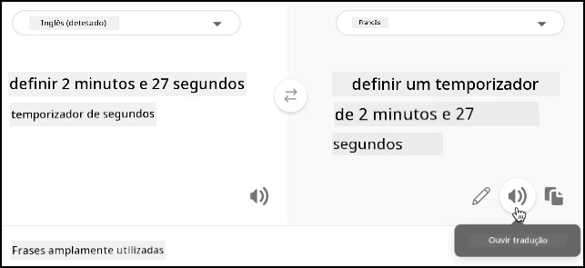

# Traduzir discurso - Wio Terminal

Nesta parte da lição, vais escrever código para traduzir texto utilizando o serviço de tradução.

## Converter texto em discurso utilizando o serviço de tradução

A API REST do serviço de discurso não suporta traduções diretas. Em vez disso, podes usar o serviço Translator para traduzir o texto gerado pelo serviço de discurso para texto, bem como o texto da resposta falada. Este serviço tem uma API REST que podes usar para traduzir o texto, mas para facilitar o uso, será encapsulado num outro trigger HTTP na tua aplicação de funções.

### Tarefa - criar uma função serverless para traduzir texto

1. Abre o teu projeto `smart-timer-trigger` no VS Code e abre o terminal, garantindo que o ambiente virtual está ativado. Caso contrário, termina e recria o terminal.

1. Abre o ficheiro `local.settings.json` e adiciona as definições para a chave da API do Translator e a localização:

    ```json
    "TRANSLATOR_KEY": "<key>",
    "TRANSLATOR_LOCATION": "<location>"
    ```

    Substitui `<key>` pela chave da API do recurso do serviço Translator. Substitui `<location>` pela localização que utilizaste ao criar o recurso do serviço Translator.

1. Adiciona um novo trigger HTTP a esta aplicação chamado `translate-text` utilizando o seguinte comando no terminal do VS Code, na pasta raiz do projeto da aplicação de funções:

    ```sh
    func new --name translate-text --template "HTTP trigger"
    ```

    Isto criará um trigger HTTP chamado `translate-text`.

1. Substitui o conteúdo do ficheiro `__init__.py` na pasta `translate-text` pelo seguinte:

    ```python
    import logging
    import os
    import requests
    
    import azure.functions as func
    
    location = os.environ['TRANSLATOR_LOCATION']
    translator_key = os.environ['TRANSLATOR_KEY']
    
    def main(req: func.HttpRequest) -> func.HttpResponse:
        req_body = req.get_json()
        from_language = req_body['from_language']
        to_language = req_body['to_language']
        text = req_body['text']
        
        logging.info(f'Translating {text} from {from_language} to {to_language}')
    
        url = f'https://api.cognitive.microsofttranslator.com/translate?api-version=3.0'
    
        headers = {
            'Ocp-Apim-Subscription-Key': translator_key,
            'Ocp-Apim-Subscription-Region': location,
            'Content-type': 'application/json'
        }
    
        params = {
            'from': from_language,
            'to': to_language
        }
    
        body = [{
            'text' : text
        }]
        
        response = requests.post(url, headers=headers, params=params, json=body)
        return func.HttpResponse(response.json()[0]['translations'][0]['text'])
    ```

    Este código extrai o texto e os idiomas do pedido HTTP. Em seguida, faz um pedido à API REST do Translator, passando os idiomas como parâmetros para o URL e o texto a traduzir como corpo. Finalmente, a tradução é devolvida.

1. Executa a tua aplicação de funções localmente. Podes então chamá-la utilizando uma ferramenta como o curl, da mesma forma que testaste o trigger HTTP `text-to-timer`. Certifica-te de passar o texto a traduzir e os idiomas como um corpo JSON:

    ```json
    {
        "text": "Définir une minuterie de 30 secondes",
        "from_language": "fr-FR",
        "to_language": "en-US"
    }
    ```

    Este exemplo traduz *Définir une minuterie de 30 secondes* de francês para inglês dos EUA. Ele retornará *Set a 30-second timer*.

> 💁 Podes encontrar este código na pasta [code/functions](../../../../../6-consumer/lessons/4-multiple-language-support/code/functions).

### Tarefa - usar a função Translator para traduzir texto

1. Abre o projeto `smart-timer` no VS Code, caso ainda não esteja aberto.

1. O teu temporizador inteligente terá 2 idiomas definidos - o idioma do servidor que foi usado para treinar o LUIS (o mesmo idioma também é usado para construir as mensagens para falar com o utilizador) e o idioma falado pelo utilizador. Atualiza a constante `LANGUAGE` no ficheiro de cabeçalho `config.h` para ser o idioma que será falado pelo utilizador e adiciona uma nova constante chamada `SERVER_LANGUAGE` para o idioma usado para treinar o LUIS:

    ```cpp
    const char *LANGUAGE = "<user language>";
    const char *SERVER_LANGUAGE = "<server language>";
    ```

    Substitui `<user language>` pelo nome do locale do idioma que vais falar, por exemplo, `fr-FR` para francês ou `zn-HK` para cantonês.

    Substitui `<server language>` pelo nome do locale do idioma usado para treinar o LUIS.

    Podes encontrar uma lista dos idiomas suportados e os seus nomes de locale na [documentação de suporte a idiomas e vozes nos Microsoft docs](https://docs.microsoft.com/azure/cognitive-services/speech-service/language-support?WT.mc_id=academic-17441-jabenn#speech-to-text).

    > 💁 Se não falas vários idiomas, podes usar um serviço como o [Bing Translate](https://www.bing.com/translator) ou o [Google Translate](https://translate.google.com) para traduzir do teu idioma preferido para um idioma à tua escolha. Estes serviços podem reproduzir áudio do texto traduzido.
    >
    > Por exemplo, se treinares o LUIS em inglês, mas quiseres usar francês como idioma do utilizador, podes traduzir frases como "set a 2 minute and 27 second timer" de inglês para francês usando o Bing Translate e, em seguida, usar o botão **Ouvir tradução** para falar a tradução no teu microfone.
    >
    > 

1. Adiciona a chave da API do Translator e a localização abaixo de `SPEECH_LOCATION`:

    ```cpp
    const char *TRANSLATOR_API_KEY = "<KEY>";
    const char *TRANSLATOR_LOCATION = "<LOCATION>";
    ```

    Substitui `<KEY>` pela chave da API do recurso do serviço Translator. Substitui `<LOCATION>` pela localização que utilizaste ao criar o recurso do serviço Translator.

1. Adiciona o URL do trigger do Translator abaixo de `VOICE_URL`:

    ```cpp
    const char *TRANSLATE_FUNCTION_URL = "<URL>";
    ```

    Substitui `<URL>` pelo URL do trigger HTTP `translate-text` na tua aplicação de funções. Este será o mesmo valor de `TEXT_TO_TIMER_FUNCTION_URL`, exceto com o nome da função `translate-text` em vez de `text-to-timer`.

1. Adiciona um novo ficheiro à pasta `src` chamado `text_translator.h`.

1. Este novo ficheiro de cabeçalho `text_translator.h` conterá uma classe para traduzir texto. Adiciona o seguinte a este ficheiro para declarar esta classe:

    ```cpp
    #pragma once
    
    #include <Arduino.h>
    #include <ArduinoJson.h>
    #include <HTTPClient.h>
    #include <WiFiClient.h>
    
    #include "config.h"
    
    class TextTranslator
    {
    public:   
    private:
        WiFiClient _client;
    };
    
    TextTranslator textTranslator;
    ```

    Isto declara a classe `TextTranslator`, juntamente com uma instância desta classe. A classe tem um único campo para o cliente WiFi.

1. Na secção `public` desta classe, adiciona um método para traduzir texto:

    ```cpp
    String translateText(String text, String from_language, String to_language)
    {
    }
    ```

    Este método recebe o idioma de origem e o idioma de destino. Ao lidar com discurso, o discurso será traduzido do idioma do utilizador para o idioma do servidor LUIS, e ao dar respostas, será traduzido do idioma do servidor LUIS para o idioma do utilizador.

1. Neste método, adiciona código para construir um corpo JSON contendo o texto a traduzir e os idiomas:

    ```cpp
    DynamicJsonDocument doc(1024);
    doc["text"] = text;
    doc["from_language"] = from_language;
    doc["to_language"] = to_language;

    String body;
    serializeJson(doc, body);

    Serial.print("Translating ");
    Serial.print(text);
    Serial.print(" from ");
    Serial.print(from_language);
    Serial.print(" to ");
    Serial.print(to_language);
    ```

1. Abaixo disso, adiciona o seguinte código para enviar o corpo para a aplicação de funções serverless:

    ```cpp
    HTTPClient httpClient;
    httpClient.begin(_client, TRANSLATE_FUNCTION_URL);

    int httpResponseCode = httpClient.POST(body);
    ```

1. Em seguida, adiciona código para obter a resposta:

    ```cpp
    String translated_text = "";

    if (httpResponseCode == 200)
    {
        translated_text = httpClient.getString();
        Serial.print("Translated: ");
        Serial.println(translated_text);
    }
    else
    {
        Serial.print("Failed to translate text - error ");
        Serial.println(httpResponseCode);
    }
    ```

1. Finalmente, adiciona código para fechar a conexão e devolver o texto traduzido:

    ```cpp
    httpClient.end();

    return translated_text;
    ```

### Tarefa - traduzir o discurso reconhecido e as respostas

1. Abre o ficheiro `main.cpp`.

1. Adiciona uma diretiva de inclusão no topo do ficheiro para o ficheiro de cabeçalho da classe `TextTranslator`:

    ```cpp
    #include "text_translator.h"
    ```

1. O texto que é dito quando um temporizador é definido ou expira precisa de ser traduzido. Para isso, adiciona o seguinte como a primeira linha da função `say`:

    ```cpp
    text = textTranslator.translateText(text, LANGUAGE, SERVER_LANGUAGE);
    ```

    Isto traduzirá o texto para o idioma do utilizador.

1. Na função `processAudio`, o texto é recuperado do áudio capturado com a chamada `String text = speechToText.convertSpeechToText();`. Após esta chamada, traduz o texto:

    ```cpp
    String text = speechToText.convertSpeechToText();
    text = textTranslator.translateText(text, LANGUAGE, SERVER_LANGUAGE);
    ```

    Isto traduzirá o texto do idioma do utilizador para o idioma usado no servidor.

1. Compila este código, carrega-o no teu Wio Terminal e testa-o através do monitor serial. Assim que vires `Ready` no monitor serial, pressiona o botão C (o do lado esquerdo, mais próximo do interruptor de energia) e fala. Certifica-te de que a tua aplicação de funções está em execução e pede um temporizador no idioma do utilizador, seja falando esse idioma ou usando uma aplicação de tradução.

    ```output
    Connecting to WiFi..
    Connected!
    Got access token.
    Ready.
    Starting recording...
    Finished recording
    Sending speech...
    Speech sent!
    {"RecognitionStatus":"Success","DisplayText":"Définir une minuterie de 2 minutes 27 secondes.","Offset":9600000,"Duration":40400000}
    Translating Définir une minuterie de 2 minutes 27 secondes. from fr-FR to en-US
    Translated: Set a timer of 2 minutes 27 seconds.
    Set a timer of 2 minutes 27 seconds.
    {"seconds": 147}
    Translating 2 minute 27 second timer started. from en-US to fr-FR
    Translated: 2 minute 27 seconde minute a commencé.
    2 minute 27 seconde minute a commencé.
    Translating Times up on your 2 minute 27 second timer. from en-US to fr-FR
    Translated: Chronométrant votre minuterie de 2 minutes 27 secondes.
    Chronométrant votre minuterie de 2 minutes 27 secondes.
    ```

> 💁 Podes encontrar este código na pasta [code/wio-terminal](../../../../../6-consumer/lessons/4-multiple-language-support/code/wio-terminal).

😀 O teu programa de temporizador multilingue foi um sucesso!

**Aviso Legal**:  
Este documento foi traduzido utilizando o serviço de tradução por IA [Co-op Translator](https://github.com/Azure/co-op-translator). Embora nos esforcemos para garantir a precisão, tenha em atenção que traduções automáticas podem conter erros ou imprecisões. O documento original na sua língua nativa deve ser considerado a fonte autoritária. Para informações críticas, recomenda-se a tradução profissional realizada por humanos. Não nos responsabilizamos por quaisquer mal-entendidos ou interpretações incorretas decorrentes da utilização desta tradução.