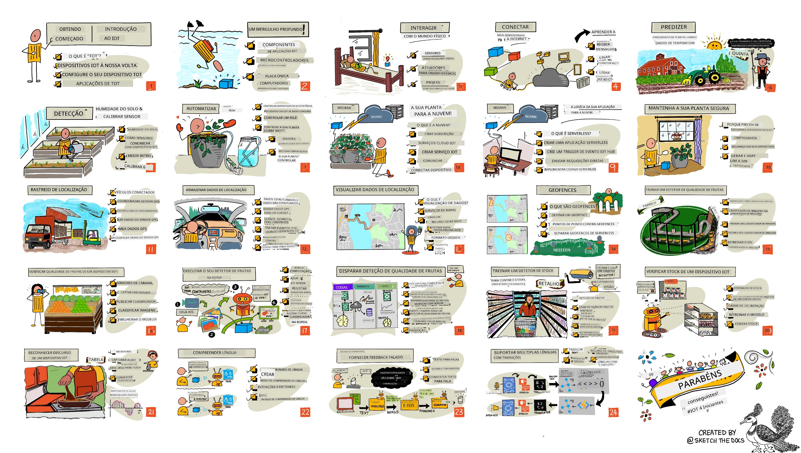

[](https://github.com/microsoft/IoT-For-Beginners/blob/master/LICENSE)
[](https://GitHub.com/microsoft/IoT-For-Beginners/graphs/contributors/)
[](https://GitHub.com/microsoft/IoT-For-Beginners/issues/)
[](https://GitHub.com/microsoft/IoT-For-Beginners/pulls/)
[](http://makeapullrequest.com)

[](https://GitHub.com/microsoft/IoT-For-Beginners/watchers/)
[](https://GitHub.com/microsoft/IoT-For-Beginners/network/)
[](https://GitHub.com/microsoft/IoT-For-Beginners/stargazers/)

### Junte-se à Comunidade Azure AI Foundry 

Se ficar preso ou tiver alguma dúvida sobre como construir aplicações de IA. Junte-se a outros aprendizes e desenvolvedores experientes em discussões sobre MCP. É uma comunidade de apoio onde as perguntas são bem-vindas e o conhecimento é compartilhado livremente.

[](https://discord.gg/nTYy5BXMWG)

Se tiver feedback sobre o produto ou encontrar erros durante a construção, visite:

[](https://aka.ms/foundry/forum)

Siga estes passos para começar a usar estes recursos:
1. **Faça um Fork do Repositório**: Clique [](https://GitHub.com/microsoft/IoT-For-Beginners/fork)
2. **Clone o Repositório**:   `git clone https://github.com/microsoft/IoT-For-Beginners.git`
3. [**Junte-se ao Microsoft Foundry Discord e conheça especialistas e outros desenvolvedores**](https://discord.com/invite/ByRwuEEgH4)


### 🌐 Suporte Multilíngue

#### Suportado via GitHub Action (Automatizado e Sempre Atualizado)

<!-- CO-OP TRANSLATOR LANGUAGES TABLE START -->
[Árabe](../ar/README.md) | [Bengali](../bn/README.md) | [Búlgaro](../bg/README.md) | [Birmanês (Myanmar)](../my/README.md) | [Chinês (Simplificado)](../zh-CN/README.md) | [Chinês (Tradicional, Hong Kong)](../zh-HK/README.md) | [Chinês (Tradicional, Macau)](../zh-MO/README.md) | [Chinês (Tradicional, Taiwan)](../zh-TW/README.md) | [Croata](../hr/README.md) | [Checo](../cs/README.md) | [Dinamarquês](../da/README.md) | [Holandês](../nl/README.md) | [Estónio](../et/README.md) | [Finlandês](../fi/README.md) | [Francês](../fr/README.md) | [Alemão](../de/README.md) | [Grego](../el/README.md) | [Hebraico](../he/README.md) | [Hindi](../hi/README.md) | [Húngaro](../hu/README.md) | [Indonésio](../id/README.md) | [Italiano](../it/README.md) | [Japonês](../ja/README.md) | [Kannada](../kn/README.md) | [Coreano](../ko/README.md) | [Lituano](../lt/README.md) | [Malaio](../ms/README.md) | [Malayalam](../ml/README.md) | [Marati](../mr/README.md) | [Nepalês](../ne/README.md) | [Pidgin Nigeriano](../pcm/README.md) | [Norueguês](../no/README.md) | [Persa (Farsi)](../fa/README.md) | [Polaco](../pl/README.md) | [Português (Brasil)](../pt-BR/README.md) | [Português (Portugal)](./README.md) | [Punjabi (Gurmukhi)](../pa/README.md) | [Romeno](../ro/README.md) | [Russo](../ru/README.md) | [Sérvio (Cirílico)](../sr/README.md) | [Eslovaco](../sk/README.md) | [Esloveno](../sl/README.md) | [Espanhol](../es/README.md) | [Suaíli](../sw/README.md) | [Sueco](../sv/README.md) | [Tagalo (Filipino)](../tl/README.md) | [Tamil](../ta/README.md) | [Telugu](../te/README.md) | [Tailandês](../th/README.md) | [Turco](../tr/README.md) | [Ucraniano](../uk/README.md) | [Urdu](../ur/README.md) | [Vietnamita](../vi/README.md)

> **Prefere Clonar Localmente?**

> Este repositório inclui traduções para mais de 50 línguas, o que aumenta significativamente o tamanho de download. Para clonar sem as traduções, use checkout esparso:
> ```bash
> git clone --filter=blob:none --sparse https://github.com/microsoft/IoT-For-Beginners.git
> cd IoT-For-Beginners
> git sparse-checkout set --no-cone '/*' '!translations' '!translated_images'
> ```
> Isto dá-lhe tudo o que precisa para completar o curso com um download muito mais rápido.
<!-- CO-OP TRANSLATOR LANGUAGES TABLE END -->

# IoT para Iniciantes - Um Currículo

Os Advocates do Azure Cloud na Microsoft têm o prazer de oferecer um currículo de 12 semanas e 24 lições totalmente focado nos fundamentos de IoT. Cada lição inclui questionários antes e depois da aula, instruções escritas para completar a lição, uma solução, uma tarefa e muito mais. A nossa pedagogia baseada em projetos permite que aprenda enquanto constrói, uma forma comprovada para que novas competências sejam assimiladas.

Os projetos cobrem a jornada dos alimentos desde a quinta até à mesa. Isso inclui agricultura, logística, fabrico, retalho e consumidor — todas áreas industriais populares para dispositivos IoT.



> Esquema desenhado por [Nitya Narasimhan](https://github.com/nitya). Clique na imagem para uma versão maior.

**Um grande obrigado aos nossos autores [Jen Fox](https://github.com/jenfoxbot), [Jen Looper](https://github.com/jlooper), [Jim Bennett](https://github.com/jimbobbennett), e ao nosso artista dos esboços [Nitya Narasimhan](https://github.com/nitya).**

**Obrigado também à nossa equipa de [Microsoft Learn Student Ambassadors](https://studentambassadors.microsoft.com?WT.mc_id=academic-17441-jabenn) que têm revisto e traduzido este currículo - [Aditya Garg](https://github.com/AdityaGarg00), [Anurag Sharma](https://github.com/Anurag-0-1-A), [Arpita Das](https://github.com/Arpiiitaaa), [Aryan Jain](https://www.linkedin.com/in/aryan-jain-47a4a1145/), [Bhavesh Suneja](https://github.com/EliteWarrior315), [Faith Hunja](https://faithhunja.github.io/), [Lateefah Bello](https://www.linkedin.com/in/lateefah-bello/), [Manvi Jha](https://github.com/Severus-Matthew), [Mireille Tan](https://www.linkedin.com/in/mireille-tan-a4834819a/), [Mohammad Iftekher (Iftu) Ebne Jalal](https://github.com/Iftu119), [Mohammad Zulfikar](https://github.com/mohzulfikar), [Priyanshu Srivastav](https://www.linkedin.com/in/priyanshu-srivastav-b067241ba), [Thanmai Gowducheruvu](https://github.com/innovation-platform), e [Zina Kamel](https://www.linkedin.com/in/zina-kamel/).**

Conheça a equipa!

[](https://youtu.be/-wippUJRi5k)

**Gif por** [Mohit Jaisal](https://linkedin.com/in/mohitjaisal)

> 🎥 Clique na imagem acima para ver um vídeo sobre o projeto!

> **Professores**, incluímos [algumas sugestões](for-teachers.md) sobre como usar este currículo. Se quiserem criar as vossas próprias lições, também incluímos um [modelo de lição](lesson-template/README.md).

> **[Estudantes](https://aka.ms/student-page)**, para usar este currículo individualmente, façam fork do repositório completo e completem os exercícios por conta própria, começando por um questionário pré-aula, depois lendo a aula e completando as restantes atividades. Tentem criar os projetos compreendendo as lições em vez de copiar o código da solução; no entanto esse código está disponível nas pastas /solutions em cada lição orientada por projetos. Outra ideia seria formar um grupo de estudo com amigos e percorrerem o conteúdo juntos. Para estudo adicional, recomendamos [Microsoft Learn](https://docs.microsoft.com/users/jimbobbennett/collections/ke2ehd351jopwr?WT.mc_id=academic-17441-jabenn).

Para uma visão geral em vídeo deste curso, veja este vídeo:

[](https://youtube.com/watch?v=bccEMm8gRuc "Promo video")

> 🎥 Clique na imagem acima para ver um vídeo sobre o projeto!

## Pedagogia

Escolhemos dois princípios pedagógicos ao construir este currículo: garantir que é baseado em projetos e que inclua questionários frequentes. Ao fim desta série, os alunos terão construído um sistema de monitorização e rega de plantas, um rastreador de veículos, uma instalação de fábrica inteligente para rastrear e verificar alimentos, um temporizador de cozinha controlado por voz, e terão aprendido os fundamentos da Internet das Coisas incluindo como escrever código para dispositivos, conectar à cloud, analisar telemetria e executar IA na edge.

Ao garantir que o conteúdo está alinhado com projetos, o processo torna-se mais envolvente para os alunos e a retenção dos conceitos é aumentada.

Além disso, um questionário de baixo risco antes da aula define a intenção do aluno para aprender um tópico, enquanto um segundo questionário após a aula assegura maior retenção. Este currículo foi desenhado para ser flexível e divertido podendo ser feito na totalidade ou em partes. Os projetos começam pequenos e tornam-se progressivamente mais complexos até ao fim do ciclo de 12 semanas.

Cada projeto baseia-se em hardware do mundo real disponível para os alunos e entusiastas. Cada projeto explora o domínio específico, fornecendo conhecimento de fundo relevante. Para ser um desenvolvedor bem sucedido é útil compreender o domínio onde se resolvem problemas; ao fornecer este conhecimento de fundo, os alunos são capazes de pensar nas suas soluções e aprendizagens IoT no contexto do tipo de problema real que poderão ser desafiados a resolver como desenvolvedores IoT. Os alunos aprendem o ‘porquê’ das soluções que estão a construir e ganham uma apreciação do utilizador final.

## Hardware

Temos duas opções de hardware IoT para usar nos projetos, dependendo de preferência pessoal, conhecimento ou preferências de linguagem de programação, objetivos de aprendizagem e disponibilidade. Também fornecemos uma versão de ‘hardware virtual’ para quem não tem acesso a hardware, ou quer aprender mais antes de se comprometer a comprar. Pode ler mais e encontrar uma ‘lista de compras’ na [página de hardware](./hardware.md), incluindo links para comprar kits completos dos nossos amigos da Seeed Studio.
> 💁 Encontre as nossas orientações para o [Código de Conduta](CODE_OF_CONDUCT.md), [Contribuições](CONTRIBUTING.md), e [Traduções](TRANSLATIONS.md). Aguardamos o seu feedback construtivo!
>
> 🔧 Está com problemas? Consulte o nosso [Guia de Resolução de Problemas](TROUBLESHOOTING.md) para soluções às questões mais comuns.

## Cada lição inclui:

- sketchnote
- vídeo suplementar opcional
- quiz de aquecimento pré-lição
- lição escrita
- para lições baseadas em projetos, guias passo a passo sobre como construir o projeto
- verificações de conhecimento
- um desafio
- leitura suplementar
- tarefa
- [quiz pós-lição](https://ff-quizzes.netlify.app/en/)

> **Uma nota sobre os quizzes**: Todos os quizzes estão contidos na pasta quiz-app, totalizando 48 quizzes com três perguntas cada. Eles estão ligados dentro das lições, mas a aplicação do quiz pode ser executada localmente ou implantada no Azure; siga as instruções na pasta `quiz-app`. Estão sendo gradualmente localizados.

## Lições

|       |                Nome do Projeto                |                          Conceitos Ensinados                          | Objetivos de Aprendizagem                                                                                                                                           |                                                           Lição Ligada                                                            |
| :---: | :--------------------------------------------: | :-------------------------------------------------------------------: | ------------------------------------------------------------------------------------------------------------------------------------------------------------------ | :-------------------------------------------------------------------------------------------------------------------------------: |
|  01   | [Início rápido](./1-getting-started/README.md) |                      Introdução ao IoT                               | Aprenda os princípios básicos do IoT e os blocos básicos de construção das soluções IoT como sensores e serviços na nuvem enquanto configura o seu primeiro dispositivo IoT |                   [Introdução ao IoT](./1-getting-started/lessons/1-introduction-to-iot/README.md)                   |
|  02   | [Início rápido](./1-getting-started/README.md) |                    Uma exploração mais profunda do IoT               | Aprenda mais sobre os componentes de um sistema IoT, assim como microcontroladores e computadores de placa única                                                    |                      [Uma exploração mais profunda do IoT](./1-getting-started/lessons/2-deeper-dive/README.md)                      |
|  03   | [Início rápido](./1-getting-started/README.md) | Interagir com o mundo físico com sensores e atuadores                | Aprenda sobre sensores para recolher dados do mundo físico, e atuadores para enviar feedback, enquanto constrói uma luz de presença                               |          [Interagir com o mundo físico com sensores e atuadores](./1-getting-started/lessons/3-sensors-and-actuators/README.md)          |
|  04   | [Início rápido](./1-getting-started/README.md) |                 Ligue o seu dispositivo à Internet                    | Aprenda como ligar um dispositivo IoT à Internet para enviar e receber mensagens conectando a sua luz de presença a um broker MQTT                               |                   [Ligue o seu dispositivo à Internet](./1-getting-started/lessons/4-connect-internet/README.md)                   |
|  05   |             [Fazenda](./2-farm/README.md)              |                      Prever o crescimento da planta                   | Aprenda a prever o crescimento de plantas usando dados de temperatura capturados por um dispositivo IoT                                                          |                            [Prever o crescimento da planta](./2-farm/lessons/1-predict-plant-growth/README.md)                            |
|  06   |             [Fazenda](./2-farm/README.md)              |                      Detetar a humidade do solo                        | Aprenda a detetar a humidade do solo e calibrar um sensor de humidade do solo                                                                                      |                            [Detetar a humidade do solo](./2-farm/lessons/2-detect-soil-moisture/README.md)                            |
|  07   |             [Fazenda](./2-farm/README.md)              |                  Regar as plantas de forma automatizada               | Aprenda a automatizar e temporizar a rega usando um relé e MQTT                                                                                                   |                        [Regar as plantas de forma automatizada](./2-farm/lessons/3-automated-plant-watering/README.md)                        |
|  08   |             [Fazenda](./2-farm/README.md)              |                     Migrar a sua planta para a nuvem                  | Aprenda sobre a nuvem e serviços IoT hospedados na nuvem e como ligar a sua planta a um destes em vez de a um broker público MQTT                                |                    [Migrar a sua planta para a nuvem](./2-farm/lessons/4-migrate-your-plant-to-the-cloud/README.md)                     |
|  09   |             [Fazenda](./2-farm/README.md)              |                  Migrar a lógica da aplicação para a nuvem            | Saiba como pode escrever lógica de aplicação na nuvem que responde a mensagens IoT                                                                                |                  [Migrar a lógica da aplicação para a nuvem](./2-farm/lessons/5-migrate-application-to-the-cloud/README.md)                  |
|  10   |             [Fazenda](./2-farm/README.md)              |                       Mantenha a sua planta segura                     | Aprenda sobre segurança no IoT e como manter a sua planta segura com chaves e certificados                                                                       |                          [Mantenha a sua planta segura](./2-farm/lessons/6-keep-your-plant-secure/README.md)                          |
|  11   |          [Transportes](./3-transport/README.md)          |                          Rastreio de localização                       | Aprenda sobre o rastreio da localização GPS para dispositivos IoT                                                                                                 |                             [Rastreio de localização](./3-transport/lessons/1-location-tracking/README.md)                             |
|  12   |          [Transportes](./3-transport/README.md)          |                         Armazenar dados de localização                | Aprenda a armazenar dados IoT para serem visualizados ou analisados mais tarde                                                                                   |                          [Armazenar dados de localização](./3-transport/lessons/2-store-location-data/README.md)                          |
|  13   |          [Transportes](./3-transport/README.md)          |                        Visualizar dados de localização                 | Aprenda a visualizar dados de localização num mapa e como os mapas representam o mundo 3D real em 2 dimensões                                                      |                         [Visualizar dados de localização](./3-transport/lessons/3-visualize-location-data/README.md)                         |
|  14   |          [Transportes](./3-transport/README.md)          |                              Geofences                                 | Aprenda sobre geofences, e como podem ser usadas para alertar quando veículos na cadeia de fornecimento estão perto do seu destino                               |                                     [Geofences](./3-transport/lessons/4-geofences/README.md)                                     |
|  15   |      [Manufatura](./4-manufacturing/README.md)            |                   Treinar um detector de qualidade de fruta           | Aprenda a treinar um classificador de imagens na nuvem para detetar a qualidade de fruta                                                                         |                      [Treinar um detector de qualidade de fruta](./4-manufacturing/lessons/1-train-fruit-detector/README.md)                      |
|  16   |      [Manufatura](./4-manufacturing/README.md)            |             Verificar a qualidade da fruta a partir de um dispositivo IoT | Aprenda a usar o seu detector de qualidade de fruta a partir de um dispositivo IoT                                                                                |            [Verificar a qualidade da fruta a partir de um dispositivo IoT](./4-manufacturing/lessons/2-check-fruit-from-device/README.md)            |
|  17   |      [Manufatura](./4-manufacturing/README.md)            |                     Executar o seu detector de fruta na borda          | Aprenda a executar o seu detector de fruta num dispositivo IoT na borda                                                                                          |                       [Executar o seu detector de fruta na borda](./4-manufacturing/lessons/3-run-fruit-detector-edge/README.md)                       |
|  18   |      [Manufatura](./4-manufacturing/README.md)            |                    Disparar a deteção de qualidade da fruta a partir de um sensor | Aprenda a disparar a deteção de qualidade da fruta a partir de um sensor                                                                                          |                   [Disparar a deteção de qualidade da fruta a partir de um sensor](./4-manufacturing/lessons/4-trigger-fruit-detector/README.md)                   |
|  19   |           [Retalho](./5-retail/README.md)                 |                        Treinar um detector de stock                    | Aprenda a usar deteção de objetos para treinar um detector de stock para contar stock numa loja                                                                  |                             [Treinar um detector de stock](./5-retail/lessons/1-train-stock-detector/README.md)                             |
|  20   |           [Retalho](./5-retail/README.md)                 |                     Verificar stock a partir de um dispositivo IoT     | Aprenda a verificar stock a partir de um dispositivo IoT usando um modelo de deteção de objetos                                                                   |                          [Verificar stock a partir de um dispositivo IoT](./5-retail/lessons/2-check-stock-device/README.md)                          |
|  21   |         [Consumidor](./6-consumer/README.md)               |               Reconhecer fala com um dispositivo IoT                    | Aprenda a reconhecer fala a partir de um dispositivo IoT para construir um temporizador inteligente                                                               |                      [Reconhecer fala com um dispositivo IoT](./6-consumer/lessons/1-speech-recognition/README.md)                      |
|  22   |         [Consumidor](./6-consumer/README.md)               |                       Compreender a linguagem                           | Aprenda a compreender frases faladas a um dispositivo IoT                                                                                                        |                            [Compreender a linguagem](./6-consumer/lessons/2-language-understanding/README.md)                            |
|  23   |         [Consumidor](./6-consumer/README.md)               |               Definir um temporizador e fornecer feedback falado       | Aprenda a definir um temporizador num dispositivo IoT e fornecer feedback falado quando o temporizador é definido e quando termina                                |                       [Definir um temporizador e fornecer feedback falado](./6-consumer/lessons/3-spoken-feedback/README.md)                       |
|  24   |         [Consumidor](./6-consumer/README.md)               |                   Suportar múltiplas línguas                           | Aprenda a suportar múltiplas línguas, tanto as que lhe são faladas como as respostas do seu temporizador inteligente                                             |                         [Suportar múltiplas línguas](./6-consumer/lessons/4-multiple-language-support/README.md)                         |

## Acesso offline

Pode executar esta documentação offline usando o [Docsify](https://docsify.js.org/#/). Faça fork deste repositório, [instale o Docsify](https://docsify.js.org/#/quickstart) na sua máquina local e, na pasta raiz deste repositório, digite `docsify serve`. O website será servido na porta 3000 no seu localhost: `localhost:3000`.

## Quiz

Obrigado à comunidade por hospedar o quiz interativo que testa o seu conhecimento em cada capítulo. Teste o seu conhecimento [aqui](https://ff-quizzes.netlify.app/en/) 

### PDF

Pode gerar um PDF deste conteúdo para acesso offline, se necessário. Para tal, certifique-se que tem o [npm instalado](https://docs.npmjs.com/downloading-and-installing-node-js-and-npm) e execute os seguintes comandos na pasta raiz deste repositório:

```sh
npm i
npm run convert
```

### Apresentações

Existem apresentações para algumas das lições na pasta [slides](../../slides).


## Outros Currículos

A nossa equipa produz outros currículos! Veja:

<!-- CO-OP TRANSLATOR OTHER COURSES START -->
### LangChain
[](https://aka.ms/langchain4j-for-beginners)
[](https://aka.ms/langchainjs-for-beginners?WT.mc_id=m365-94501-dwahlin)

---

### Azure / Edge / MCP / Agentes
[](https://github.com/microsoft/AZD-for-beginners?WT.mc_id=academic-105485-koreyst)
[](https://github.com/microsoft/edgeai-for-beginners?WT.mc_id=academic-105485-koreyst)
[](https://github.com/microsoft/mcp-for-beginners?WT.mc_id=academic-105485-koreyst)
[](https://github.com/microsoft/ai-agents-for-beginners?WT.mc_id=academic-105485-koreyst)

---
 
### Série de IA Generativa
[](https://github.com/microsoft/generative-ai-for-beginners?WT.mc_id=academic-105485-koreyst)
[-9333EA?style=for-the-badge&labelColor=E5E7EB&color=9333EA)](https://github.com/microsoft/Generative-AI-for-beginners-dotnet?WT.mc_id=academic-105485-koreyst)
[-C084FC?style=for-the-badge&labelColor=E5E7EB&color=C084FC)](https://github.com/microsoft/generative-ai-for-beginners-java?WT.mc_id=academic-105485-koreyst)
[-E879F9?style=for-the-badge&labelColor=E5E7EB&color=E879F9)](https://github.com/microsoft/generative-ai-with-javascript?WT.mc_id=academic-105485-koreyst)

---
 
### Aprendizagem Fundamental
[](https://aka.ms/ml-beginners?WT.mc_id=academic-105485-koreyst)
[](https://aka.ms/datascience-beginners?WT.mc_id=academic-105485-koreyst)
[](https://aka.ms/ai-beginners?WT.mc_id=academic-105485-koreyst)
[](https://github.com/microsoft/Security-101?WT.mc_id=academic-96948-sayoung)
[](https://aka.ms/webdev-beginners?WT.mc_id=academic-105485-koreyst)
[](https://aka.ms/iot-beginners?WT.mc_id=academic-105485-koreyst)
[](https://github.com/microsoft/xr-development-for-beginners?WT.mc_id=academic-105485-koreyst)

---
 
### Série Copilot
[](https://aka.ms/GitHubCopilotAI?WT.mc_id=academic-105485-koreyst)
[](https://github.com/microsoft/mastering-github-copilot-for-dotnet-csharp-developers?WT.mc_id=academic-105485-koreyst)
[](https://github.com/microsoft/CopilotAdventures?WT.mc_id=academic-105485-koreyst)
<!-- CO-OP TRANSLATOR OTHER COURSES END -->

## Atribuições das imagens

Pode encontrar todas as atribuições das imagens usadas neste currículo, onde necessário, em [Atribuições](./attributions.md).

---

<!-- CO-OP TRANSLATOR DISCLAIMER START -->
**Aviso legal**:  
Este documento foi traduzido utilizando o serviço de tradução por IA [Co-op Translator](https://github.com/Azure/co-op-translator). Embora nos esforcemos pela precisão, por favor, tenha em conta que traduções automáticas podem conter erros ou imprecisões. O documento original na sua língua nativa deve ser considerado a fonte autorizada. Para informações críticas, recomenda-se a tradução profissional por humanos. Não nos responsabilizamos por quaisquer mal-entendidos ou interpretações erradas resultantes do uso desta tradução.
<!-- CO-OP TRANSLATOR DISCLAIMER END -->