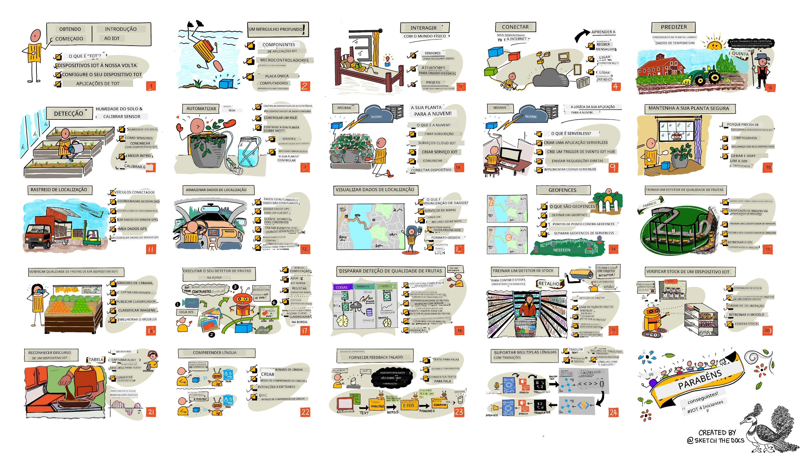

[](https://github.com/microsoft/IoT-For-Beginners/blob/master/LICENSE)
[](https://GitHub.com/microsoft/IoT-For-Beginners/graphs/contributors/)
[](https://GitHub.com/microsoft/IoT-For-Beginners/issues/)
[](https://GitHub.com/microsoft/IoT-For-Beginners/pulls/)
[](http://makeapullrequest.com)

[](https://GitHub.com/microsoft/IoT-For-Beginners/watchers/)
[](https://GitHub.com/microsoft/IoT-For-Beginners/network/)
[](https://GitHub.com/microsoft/IoT-For-Beginners/stargazers/)

### Junte-se à Comunidade Azure AI Foundry 

Se ficar bloqueado ou tiver alguma dúvida sobre como criar aplicações de IA, junte-se a outros aprendizes e a programadores experientes nas discussões sobre o MCP. É uma comunidade de apoio onde as perguntas são bem-vindas e o conhecimento é partilhado livremente.

[](https://discord.gg/nTYy5BXMWG)

Se tiver feedback sobre o produto ou encontrar erros durante a construção, visite:

[](https://aka.ms/foundry/forum)

Siga estes passos para começar a utilizar estes recursos:
1. **Fazer fork do repositório**: Click [](https://GitHub.com/microsoft/IoT-For-Beginners/fork)
2. **Clonar o repositório**:   `git clone https://github.com/microsoft/IoT-For-Beginners.git`
3. [**Junte-se ao Discord da Microsoft Foundry e conheça especialistas e outros desenvolvedores**](https://discord.com/invite/ByRwuEEgH4)


### 🌐 Suporte multilingue

#### Suportado via GitHub Action (Automatizado e Sempre Atualizado)

<!-- CO-OP TRANSLATOR LANGUAGES TABLE START -->
[Árabe](../ar/README.md) | [Bengalês](../bn/README.md) | [Búlgaro](../bg/README.md) | [Birmanês (Myanmar)](../my/README.md) | [Chinês (Simplificado)](../zh-CN/README.md) | [Chinês (Tradicional, Hong Kong)](../zh-HK/README.md) | [Chinês (Tradicional, Macau)](../zh-MO/README.md) | [Chinês (Tradicional, Taiwan)](../zh-TW/README.md) | [Croata](../hr/README.md) | [Checo](../cs/README.md) | [Dinamarquês](../da/README.md) | [Holandês](../nl/README.md) | [Estónio](../et/README.md) | [Finlandês](../fi/README.md) | [Francês](../fr/README.md) | [Alemão](../de/README.md) | [Grego](../el/README.md) | [Hebraico](../he/README.md) | [Hindi](../hi/README.md) | [Húngaro](../hu/README.md) | [Indonésio](../id/README.md) | [Italiano](../it/README.md) | [Japonês](../ja/README.md) | [Kannada](../kn/README.md) | [Khmer](../km/README.md) | [Coreano](../ko/README.md) | [Lituano](../lt/README.md) | [Malaio](../ms/README.md) | [Malayalam](../ml/README.md) | [Marathi](../mr/README.md) | [Nepalês](../ne/README.md) | [Pidgin Nigeriano](../pcm/README.md) | [Norueguês](../no/README.md) | [Persa (Farsi)](../fa/README.md) | [Polaco](../pl/README.md) | [Português (Brasil)](../pt-BR/README.md) | [Português (Portugal)](./README.md) | [Punjabi (Gurmukhi)](../pa/README.md) | [Romeno](../ro/README.md) | [Russo](../ru/README.md) | [Sérvio (Cirílico)](../sr/README.md) | [Eslovaco](../sk/README.md) | [Esloveno](../sl/README.md) | [Espanhol](../es/README.md) | [Suaíli](../sw/README.md) | [Sueco](../sv/README.md) | [Tagalo (Filipino)](../tl/README.md) | [Tamil](../ta/README.md) | [Telugu](../te/README.md) | [Tailandês](../th/README.md) | [Turco](../tr/README.md) | [Ucraniano](../uk/README.md) | [Urdu](../ur/README.md) | [Vietnamita](../vi/README.md)

> **Prefere clonar localmente?**
>
> Este repositório inclui mais de 50 traduções, o que aumenta significativamente o tamanho de transferência. Para clonar sem traduções, use sparse checkout:
>
> **Bash / macOS / Linux:**
> ```bash
> git clone --filter=blob:none --sparse https://github.com/microsoft/IoT-For-Beginners.git
> cd IoT-For-Beginners
> git sparse-checkout set --no-cone '/*' '!translations' '!translated_images'
> ```
>
> **CMD (Windows):**
> ```cmd
> git clone --filter=blob:none --sparse https://github.com/microsoft/IoT-For-Beginners.git
> cd IoT-For-Beginners
> git sparse-checkout set --no-cone "/*" "!translations" "!translated_images"
> ```
>
> Isto dá-lhe tudo o que precisa para completar o curso com um download muito mais rápido.
<!-- CO-OP TRANSLATOR LANGUAGES TABLE END -->

# IoT para Principiantes - Um Currículo

Os Azure Cloud Advocates da Microsoft têm o prazer de oferecer um currículo de 12 semanas e 24 aulas, totalmente dedicado aos fundamentos do IoT. Cada aula inclui questionários pré e pós-aula, instruções escritas para completar a aula, uma solução, um trabalho e mais. A nossa pedagogia baseada em projetos permite-lhe aprender enquanto constrói, uma forma comprovada de fazer com que novas competências "fixem".

Os projetos cobrem a jornada dos alimentos da quinta à mesa. Isto inclui agricultura, logística, fabrico, retalho e consumo - todas áreas industriais populares para dispositivos IoT.



> Sketchnote por [Nitya Narasimhan](https://github.com/nitya). Clique na imagem para uma versão maior.

**Um grande obrigado aos nossos autores [Jen Fox](https://github.com/jenfoxbot), [Jen Looper](https://github.com/jlooper), [Jim Bennett](https://github.com/jimbobbennett), e ao nosso artista de sketchnote [Nitya Narasimhan](https://github.com/nitya).**

**Obrigado também à nossa equipa de [Embaixadores Estudantis Microsoft Learn](https://studentambassadors.microsoft.com?WT.mc_id=academic-17441-jabenn) que têm estado a rever e a traduzir este currículo - [Aditya Garg](https://github.com/AdityaGarg00), [Anurag Sharma](https://github.com/Anurag-0-1-A), [Arpita Das](https://github.com/Arpiiitaaa), [Aryan Jain](https://www.linkedin.com/in/aryan-jain-47a4a1145/), [Bhavesh Suneja](https://github.com/EliteWarrior315), [Faith Hunja](https://faithhunja.github.io/), [Lateefah Bello](https://www.linkedin.com/in/lateefah-bello/), [Manvi Jha](https://github.com/Severus-Matthew), [Mireille Tan](https://www.linkedin.com/in/mireille-tan-a4834819a/), [Mohammad Iftekher (Iftu) Ebne Jalal](https://github.com/Iftu119), [Mohammad Zulfikar](https://github.com/mohzulfikar), [Priyanshu Srivastav](https://www.linkedin.com/in/priyanshu-srivastav-b067241ba), [Thanmai Gowducheruvu](https://github.com/innovation-platform), and [Zina Kamel](https://www.linkedin.com/in/zina-kamel/).**

Conheça a equipa!

[](https://youtu.be/-wippUJRi5k)

**Gif por** [Mohit Jaisal](https://linkedin.com/in/mohitjaisal)

> 🎥 Clique na imagem acima para ver um vídeo sobre o projeto!

> **Professores**, incluímos [algumas sugestões](for-teachers.md) sobre como utilizar este currículo. Se quiser criar as suas próprias aulas, também incluímos um [modelo de aula](lesson-template/README.md).

> **[Estudantes](https://aka.ms/student-page)**, para utilizar este currículo por conta própria, faça fork do repositório completo e complete os exercícios por conta própria, começando com um questionário pré-aula, depois lendo a aula e completando o resto das atividades. Tente criar os projetos compreendendo as lições em vez de copiar o código da solução; no entanto esse código está disponível nas pastas /solutions em cada aula orientada a projeto. Outra ideia é formar um grupo de estudo com amigos e percorrer o conteúdo juntos. Para estudo adicional, recomendamos o [Microsoft Learn](https://docs.microsoft.com/users/jimbobbennett/collections/ke2ehd351jopwr?WT.mc_id=academic-17441-jabenn).

Para uma visão geral em vídeo deste curso, veja este vídeo:

[](https://youtube.com/watch?v=bccEMm8gRuc "Vídeo promocional")

> 🎥 Clique na imagem acima para ver um vídeo sobre o projeto!

## Pedagogia

Escolhemos dois princípios pedagógicos ao construir este currículo: garantir que é baseado em projetos e que inclui questionários frequentes. No final desta série, os alunos terão construído um sistema de monitorização e rega de plantas, um rastreador de veículos, uma configuração de fábrica inteligente para seguir e verificar alimentos, e um temporizador de cozinha controlado por voz, e terão aprendido os fundamentos da Internet das Coisas, incluindo como escrever código para dispositivos, ligar-se à cloud, analisar telemetria e executar IA na borda.

Ao garantir que o conteúdo está alinhado com projetos, o processo torna-se mais envolvente para os alunos e a retenção de conceitos será aumentada.

Além disso, um questionário de baixo risco antes de uma aula define a intenção do aluno para aprender um tópico, enquanto um segundo questionário após a aula assegura uma retenção adicional. Este currículo foi concebido para ser flexível e divertido e pode ser feito na sua totalidade ou em parte. Os projetos começam pequenos e tornam-se progressivamente mais complexos até ao final do ciclo de 12 semanas.

Cada projeto baseia-se em hardware do mundo real disponível para alunos e entusiastas. Cada projeto analisa o domínio específico do projeto, fornecendo conhecimentos de fundo relevantes. Para ser um desenvolvedor bem-sucedido, ajuda compreender o domínio em que está a resolver problemas; fornecer este conhecimento de fundo permite que os alunos pensem nas suas soluções IoT e aprendizagens no contexto do tipo de problema do mundo real que lhes pode ser pedido para resolver como desenvolvedor IoT. Os alunos aprendem o "porquê" das soluções que estão a construir e ganham uma apreciação do utilizador final.

## Hardware
Temos duas opções de hardware IoT para utilizar nos projetos dependendo da preferência pessoal, conhecimento ou preferências de linguagem de programação, objetivos de aprendizagem e disponibilidade. Também fornecemos uma versão de 'hardware virtual' para quem não tem acesso a hardware ou quer aprender mais antes de efetuar uma compra. Pode ler mais e encontrar uma 'lista de compras' na [hardware page](./hardware.md), incluindo links para comprar kits completos com os nossos parceiros na Seeed Studio.

> 💁 Consulte o nosso [Código de Conduta](CODE_OF_CONDUCT.md), [Contributing](CONTRIBUTING.md), e [Translation](TRANSLATIONS.md) guidelines. Agradecemos o seu feedback construtivo!
>
> 🔧 Está com problemas? Consulte o nosso [Guia de Resolução de Problemas](TROUBLESHOOTING.md) para soluções para problemas comuns.

## Each lesson includes:

- nota gráfica (sketchnote)
- vídeo suplementar opcional
- quiz de aquecimento pré-aula
- aula escrita
- para aulas baseadas em projetos, guias passo a passo sobre como construir o projeto
- verificações de conhecimento
- um desafio
- leitura suplementar
- tarefa
- [quiz pós-aula](https://ff-quizzes.netlify.app/en/)

> **Uma nota sobre os questionários**: Todos os questionários estão contidos na pasta quiz-app, num total de 48 questionários com três perguntas cada. Estão ligados a partir das aulas mas a app de questionários pode ser executada localmente ou implantada no Azure; siga as instruções na pasta `quiz-app`. Estão a ser localizados gradualmente.

## Lessons

|       |              Nome do Projeto              |                       Conceitos Ensinados                       | Objetivos de Aprendizagem                                                                                                                                                 |                                                        Aula Associada                                                         |
| :---: | :------------------------------------: | :---------------------------------------------------------: | ------------------------------------------------------------------------------------------------------------------------------------------------------------------- | :--------------------------------------------------------------------------------------------------------------------------: |
|  01   | [Getting started](./1-getting-started/README.md) |                     Introdução ao IoT                     | Aprenda os princípios básicos do IoT e os blocos de construção fundamentais de soluções IoT, como sensores e serviços na nuvem, enquanto configura o seu primeiro dispositivo IoT |                      [Introduction to IoT](./1-getting-started/lessons/1-introduction-to-iot/README.md)                      |
|  02   | [Getting started](./1-getting-started/README.md) |                   Uma análise mais aprofundada do IoT                    | Aprenda mais sobre os componentes de um sistema IoT, bem como microcontroladores e computadores de placa única                                                            |                        [A deeper dive into IoT](./1-getting-started/lessons/2-deeper-dive/README.md)                         |
|  03   | [Getting started](./1-getting-started/README.md) | Interagir com o mundo físico com sensores e atuadores | Aprenda sobre sensores para recolher dados do mundo físico, e atuadores para enviar feedback, enquanto constrói uma luz noturna                                           | [Interact with the physical world with sensors and actuators](./1-getting-started/lessons/3-sensors-and-actuators/README.md) |
|  04   | [Getting started](./1-getting-started/README.md) |             Ligar o seu dispositivo à Internet             | Aprenda como ligar um dispositivo IoT à Internet para enviar e receber mensagens, ligando a sua luz noturna a um broker MQTT                               |               [Connect your device to the Internet](./1-getting-started/lessons/4-connect-internet/README.md)                |
|  05   |            [Farm](./2-farm/README.md)            |                    Prever o crescimento das plantas                     | Aprenda a prever o crescimento das plantas usando dados de temperatura capturados por um dispositivo IoT                                                                                  |                          [Predict plant growth](./2-farm/lessons/1-predict-plant-growth/README.md)                           |
|  06   |            [Farm](./2-farm/README.md)            |                    Detetar a humidade do solo                     | Aprenda a detetar a humidade do solo e a calibrar um sensor de humidade do solo                                                                                              |                          [Detect soil moisture](./2-farm/lessons/2-detect-soil-moisture/README.md)                           |
|  07   |            [Farm](./2-farm/README.md)            |                  Regar plantas automaticamente                   | Aprenda a automatizar e programar a rega usando um relé e MQTT                                                                                                      |                      [Automated plant watering](./2-farm/lessons/3-automated-plant-watering/README.md)                       |
|  08   |            [Farm](./2-farm/README.md)            |               Migrar a sua planta para a nuvem               | Aprenda sobre a nuvem e serviços IoT alojados na nuvem e como ligar a sua planta a um destes em vez de a um broker MQTT público                                   |               [Migrate your plant to the cloud](./2-farm/lessons/4-migrate-your-plant-to-the-cloud/README.md)                |
|  09   |            [Farm](./2-farm/README.md)            |         Migrar a lógica da sua aplicação para a nuvem         | Aprenda como pode escrever lógica de aplicação na nuvem que responda a mensagens IoT                                                                          |         [Migrate your application logic to the cloud](./2-farm/lessons/5-migrate-application-to-the-cloud/README.md)         |
|  10   |            [Farm](./2-farm/README.md)            |                   Manter a sua planta segura                    | Aprenda sobre segurança em IoT e como manter a sua planta segura com chaves e certificados                                                                          |                        [Keep your plant secure](./2-farm/lessons/6-keep-your-plant-secure/README.md)                         |
|  11   |       [Transport](./3-transport/README.md)       |                      Rastreio de localização                      | Aprenda sobre rastreio de localização por GPS para dispositivos IoT                                                                                                                   |                           [Location tracking](./3-transport/lessons/1-location-tracking/README.md)                           |
|  12   |       [Transport](./3-transport/README.md)       |                     Armazenar dados de localização                     | Aprenda como armazenar dados IoT para serem visualizados ou analisados posteriormente                                                                                                      |                         [Store location data](./3-transport/lessons/2-store-location-data/README.md)                         |
|  13   |       [Transport](./3-transport/README.md)       |                   Visualizar dados de localização                   | Aprenda sobre visualização de dados de localização num mapa, e como os mapas representam o mundo 3D real em 2 dimensões                                                            |                     [Visualize location data](./3-transport/lessons/3-visualize-location-data/README.md)                     |
|  14   |       [Transport](./3-transport/README.md)       |                          Geocercas                          | Aprenda sobre geocercas e como podem ser utilizadas para alertar quando veículos na cadeia de abastecimento estão próximos do seu destino                                           |                                   [Geofences](./3-transport/lessons/4-geofences/README.md)                                   |
|  15   |   [Manufacturing](./4-manufacturing/README.md)   |               Treinar um detector de qualidade de fruta                | Aprenda a treinar um classificador de imagens na nuvem para detetar a qualidade da fruta                                                                                       |                 [Train a fruit quality detector](./4-manufacturing/lessons/1-train-fruit-detector/README.md)                 |
|  16   |   [Manufacturing](./4-manufacturing/README.md)   |           Verificar a qualidade da fruta a partir de um dispositivo IoT            | Aprenda a utilizar o seu detector de qualidade de fruta a partir de um dispositivo IoT                                                                                                    |           [Check fruit quality from an IoT device](./4-manufacturing/lessons/2-check-fruit-from-device/README.md)            |
|  17   |   [Manufacturing](./4-manufacturing/README.md)   |             Executar o seu detector de fruta na borda             | Aprenda sobre executar o seu detector de fruta num dispositivo IoT na borda                                                                                                |             [Run your fruit detector on the edge](./4-manufacturing/lessons/3-run-fruit-detector-edge/README.md)             |
|  18   |   [Manufacturing](./4-manufacturing/README.md)   |        Ativar a deteção de qualidade da fruta a partir de um sensor        | Aprenda sobre ativar a deteção de qualidade da fruta a partir de um sensor                                                                                                        |        [Trigger fruit quality detection from a sensor](./4-manufacturing/lessons/4-trigger-fruit-detector/README.md)         |
|  19   |          [Retail](./5-retail/README.md)          |                   Treinar um detector de stock                    | Aprenda a utilizar deteção de objetos para treinar um detector de stock para contar o stock numa loja                                                                                |                        [Train a stock detector](./5-retail/lessons/1-train-stock-detector/README.md)                         |
|  20   |          [Retail](./5-retail/README.md)          |               Verificar stock a partir de um dispositivo IoT                | Aprenda como verificar o stock a partir de um dispositivo IoT usando um modelo de deteção de objetos                                                                                         |                     [Check stock from an IoT device](./5-retail/lessons/2-check-stock-device/README.md)                      |
|  21   |        [Consumer](./6-consumer/README.md)        |             Reconhecer fala com um dispositivo IoT             | Aprenda a reconhecer a fala num dispositivo IoT para construir um temporizador inteligente                                                                                             |                  [Recognize speech with an IoT device](./6-consumer/lessons/1-speech-recognition/README.md)                  |
|  22   |        [Consumer](./6-consumer/README.md)        |                     Compreender a linguagem                     | Aprenda a compreender frases faladas para um dispositivo IoT                                                                                                           |                        [Understand language](./6-consumer/lessons/2-language-understanding/README.md)                        |
|  23   |        [Consumer](./6-consumer/README.md)        |           Definir um temporizador e fornecer feedback falado           | Aprenda a definir um temporizador num dispositivo IoT e a dar feedback falado quando o temporizador é definido e quando termina                                                    |                 [Set a timer and provide spoken feedback](./6-consumer/lessons/3-spoken-feedback/README.md)                  |
|  24   |        [Consumer](./6-consumer/README.md)        |                 Suportar múltiplas línguas                  | Aprenda a suportar múltiplas línguas, tanto as faladas para o dispositivo como as respostas do seu temporizador inteligente                                                               |                   [Support multiple languages](./6-consumer/lessons/4-multiple-language-support/README.md)                   |

## Offline access

Pode executar esta documentação offline usando o [Docsify](https://docsify.js.org/#/). Faça um fork deste repositório, [instale o Docsify](https://docsify.js.org/#/quickstart) na sua máquina local, e depois, na pasta raiz deste repositório, escreva `docsify serve`. O site será servido na porta 3000 no seu localhost: `localhost:3000`.

## Quiz

Obrigado à comunidade por hospedar o quiz interativo que testa os seus conhecimentos em cada um dos capítulos. Teste os seus conhecimentos [aqui](https://ff-quizzes.netlify.app/en/) 

### PDF

Pode gerar um PDF deste conteúdo para acesso offline, se necessário. Para tal, certifique-se de que tem [npm instalado](https://docs.npmjs.com/downloading-and-installing-node-js-and-npm) e execute os seguintes comandos na pasta raiz deste repositório:

```sh
npm i
npm run convert
```

### Slides

Há conjuntos de slides para algumas das aulas na pasta [slides](../../slides) folder.


## Other Curricula

A nossa equipa produz outros currículos! Veja:

<!-- CO-OP TRANSLATOR OTHER COURSES START -->
### LangChain
[](https://aka.ms/langchain4j-for-beginners)
[](https://aka.ms/langchainjs-for-beginners?WT.mc_id=m365-94501-dwahlin)
[](https://github.com/microsoft/langchain-for-beginners?WT.mc_id=m365-94501-dwahlin)
---

### Azure / Edge / MCP / Agentes
[](https://github.com/microsoft/AZD-for-beginners?WT.mc_id=academic-105485-koreyst)
[](https://github.com/microsoft/edgeai-for-beginners?WT.mc_id=academic-105485-koreyst)
[](https://github.com/microsoft/mcp-for-beginners?WT.mc_id=academic-105485-koreyst)
[](https://github.com/microsoft/ai-agents-for-beginners?WT.mc_id=academic-105485-koreyst)

---
 
### Série de IA Generativa
[](https://github.com/microsoft/generative-ai-for-beginners?WT.mc_id=academic-105485-koreyst)
[-9333EA?style=for-the-badge&labelColor=E5E7EB&color=9333EA)](https://github.com/microsoft/Generative-AI-for-beginners-dotnet?WT.mc_id=academic-105485-koreyst)
[-C084FC?style=for-the-badge&labelColor=E5E7EB&color=C084FC)](https://github.com/microsoft/generative-ai-for-beginners-java?WT.mc_id=academic-105485-koreyst)
[-E879F9?style=for-the-badge&labelColor=E5E7EB&color=E879F9)](https://github.com/microsoft/generative-ai-with-javascript?WT.mc_id=academic-105485-koreyst)

---
 
### Aprendizagem Fundamental
[](https://aka.ms/ml-beginners?WT.mc_id=academic-105485-koreyst)
[](https://aka.ms/datascience-beginners?WT.mc_id=academic-105485-koreyst)
[](https://aka.ms/ai-beginners?WT.mc_id=academic-105485-koreyst)
[](https://github.com/microsoft/Security-101?WT.mc_id=academic-96948-sayoung)
[](https://aka.ms/webdev-beginners?WT.mc_id=academic-105485-koreyst)
[](https://aka.ms/iot-beginners?WT.mc_id=academic-105485-koreyst)
[](https://github.com/microsoft/xr-development-for-beginners?WT.mc_id=academic-105485-koreyst)

---
 
### Série Copilot
[](https://aka.ms/GitHubCopilotAI?WT.mc_id=academic-105485-koreyst)
[](https://github.com/microsoft/mastering-github-copilot-for-dotnet-csharp-developers?WT.mc_id=academic-105485-koreyst)
[](https://github.com/microsoft/CopilotAdventures?WT.mc_id=academic-105485-koreyst)
<!-- CO-OP TRANSLATOR OTHER COURSES END -->

## Atribuições de imagens

Pode encontrar todas as atribuições das imagens utilizadas neste currículo, onde necessário, em [Atribuições](./attributions.md).

---

<!-- CO-OP TRANSLATOR DISCLAIMER START -->
**Disclaimer**:
Este documento foi traduzido utilizando o serviço de tradução por IA [Co-op Translator](https://github.com/Azure/co-op-translator). Embora nos esforcemos pela precisão, tenha em atenção que traduções automáticas podem conter erros ou imprecisões. O documento original, na sua língua nativa, deve ser considerado a fonte autoritativa. Para informação crítica, recomenda-se tradução profissional por um tradutor humano. Não nos responsabilizamos por quaisquer mal-entendidos ou interpretações incorretas decorrentes da utilização desta tradução.
<!-- CO-OP TRANSLATOR DISCLAIMER END -->