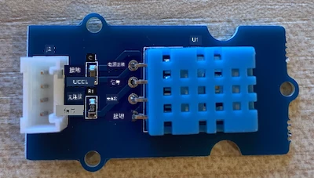

# 测量温度 - Wio Terminal

在本节课程中，您将为 Wio Terminal 添加一个温度传感器，并从中读取温度值。

## 硬件

Wio Terminal 需要一个温度传感器。

您将使用的传感器是 [DHT11 湿度和温度传感器](https://www.seeedstudio.com/Grove-Temperature-Humidity-Sensor-DHT11.html)，它将两个传感器集成在一个封装中。这是一款非常流行的传感器，许多商用传感器都结合了温度、湿度，有时还包括大气压力。温度传感器组件是一个负温度系数（NTC）热敏电阻，这是一种电阻随温度升高而减小的热敏电阻。

这是一个数字传感器，因此它内置了 ADC（模数转换器），可以生成包含温度和湿度数据的数字信号，供微控制器读取。

### 连接温度传感器

Grove 温度传感器可以连接到 Wio Terminal 的数字端口。

#### 任务 - 连接温度传感器

连接温度传感器。



1. 将 Grove 电缆的一端插入湿度和温度传感器上的插座。电缆只能以一种方向插入。

1. 在 Wio Terminal 未连接到计算机或其他电源的情况下，将 Grove 电缆的另一端连接到 Wio Terminal 屏幕右侧的 Grove 插座。这是距离电源按钮最远的插座。


## 编程温度传感器

现在可以为 Wio Terminal 编程以使用连接的温度传感器。

### 任务 - 编程温度传感器

为设备编程。

1. 使用 PlatformIO 创建一个全新的 Wio Terminal 项目。将此项目命名为 `temperature-sensor`。在 `setup` 函数中添加代码以配置串口。

    > ⚠️ 如果需要，可以参考 [项目 1，第 1 课中创建 PlatformIO 项目的说明](../../../1-getting-started/lessons/1-introduction-to-iot/wio-terminal.md#create-a-platformio-project)。

1. 在项目的 `platformio.ini` 文件中添加 Seeed Grove 湿度和温度传感器库的库依赖项：

    ```ini
    lib_deps =
        seeed-studio/Grove Temperature And Humidity Sensor @ 1.0.1
    ```

    > ⚠️ 如果需要，可以参考 [项目 1，第 4 课中为 PlatformIO 项目添加库的说明](../../../1-getting-started/lessons/4-connect-internet/wio-terminal-mqtt.md#install-the-wifi-and-mqtt-arduino-libraries)。

1. 在文件顶部现有的 `#include <Arduino.h>` 下面添加以下 `#include` 指令：

    ```cpp
    #include <DHT.h>
    #include <SPI.h>
    ```

    这会导入与传感器交互所需的文件。`DHT.h` 头文件包含传感器本身的代码，而添加 `SPI.h` 头文件确保在应用程序编译时链接与传感器通信所需的代码。

1. 在 `setup` 函数之前，声明 DHT 传感器：

    ```cpp
    DHT dht(D0, DHT11);
    ```

    这声明了一个 `DHT` 类的实例，用于管理 **D**igital **H**umidity 和 **T**emperature 传感器。该传感器连接到 Wio Terminal 的 `D0` 端口，即右侧的 Grove 插座。第二个参数告诉代码使用的是 *DHT11* 传感器——您使用的库支持该传感器的其他变体。

1. 在 `setup` 函数中，添加代码以设置串行连接：

    ```cpp
    void setup()
    {
        Serial.begin(9600);
    
        while (!Serial)
            ; // Wait for Serial to be ready
    
        delay(1000);
    }
    ```

1. 在 `setup` 函数的最后一个 `delay` 之后，添加调用以启动 DHT 传感器：

    ```cpp
    dht.begin();
    ```

1. 在 `loop` 函数中，添加代码以调用传感器并将温度打印到串口：

    ```cpp
    void loop()
    {
        float temp_hum_val[2] = {0};
        dht.readTempAndHumidity(temp_hum_val);
        Serial.print("Temperature: ");
        Serial.print(temp_hum_val[1]);
        Serial.println ("°C");
    
        delay(10000);
    }
    ```

    此代码声明了一个包含两个浮点数的空数组，并将其传递给 `DHT` 实例上的 `readTempAndHumidity` 调用。此调用会将数组填充为两个值——湿度存储在数组的第 0 项（请记住，在 C++ 中数组是从 0 开始的，因此第 0 项是数组的“第一”项），温度存储在第 1 项。

    温度从数组的第 1 项读取，并打印到串口。

    > 🇺🇸 温度以摄氏度读取。对于美国用户，要将摄氏度转换为华氏度，请将读取的摄氏度值除以 5，然后乘以 9，再加上 32。例如，20°C 的温度读取值转换为 ((20/5)*9) + 32 = 68°F。

1. 构建并上传代码到 Wio Terminal。

    > ⚠️ 如果需要，可以参考 [项目 1，第 1 课中创建 PlatformIO 项目的说明](../../../1-getting-started/lessons/1-introduction-to-iot/wio-terminal.md#write-the-hello-world-app)。

1. 上传完成后，您可以使用串口监视器监控温度：

    ```output
    > Executing task: platformio device monitor <
    
    --- Available filters and text transformations: colorize, debug, default, direct, hexlify, log2file, nocontrol, printable, send_on_enter, time
    --- More details at http://bit.ly/pio-monitor-filters
    --- Miniterm on /dev/cu.usbmodem1201  9600,8,N,1 ---
    --- Quit: Ctrl+C | Menu: Ctrl+T | Help: Ctrl+T followed by Ctrl+H ---
    Temperature: 25.00°C
    Temperature: 25.00°C
    Temperature: 25.00°C
    Temperature: 24.00°C
    ```

> 💁 您可以在 [code-temperature/wio-terminal](../../../../../2-farm/lessons/1-predict-plant-growth/code-temperature/wio-terminal) 文件夹中找到此代码。

😀 您的温度传感器程序运行成功！

**免责声明**：  
本文档使用AI翻译服务 [Co-op Translator](https://github.com/Azure/co-op-translator) 进行翻译。尽管我们努力确保翻译的准确性，但请注意，自动翻译可能包含错误或不准确之处。应以原文档的原始语言版本为权威来源。对于关键信息，建议使用专业人工翻译。我们对因使用此翻译而引起的任何误解或误读不承担责任。