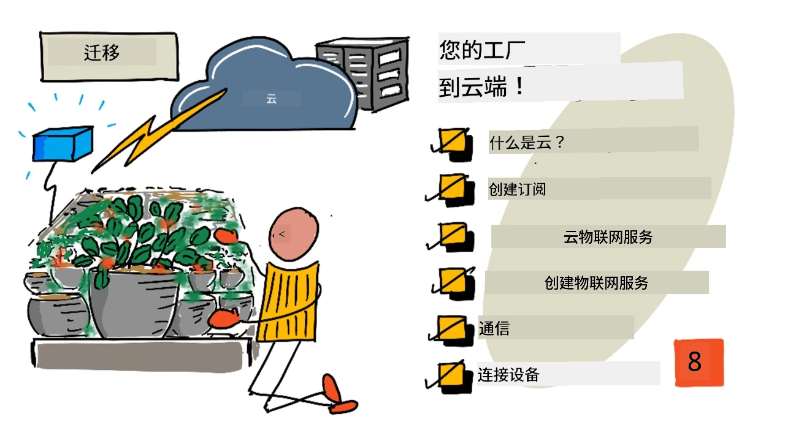
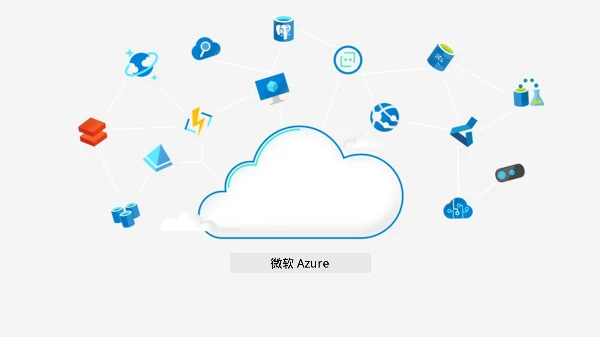
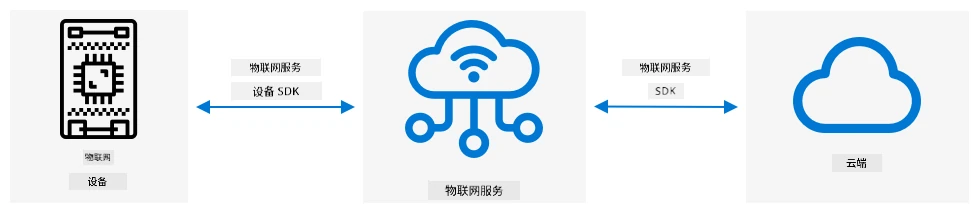
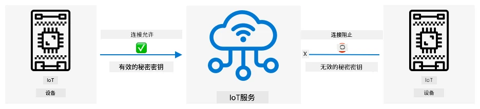
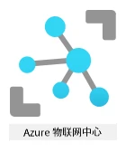

# 将植物迁移到云端



> 手绘笔记由 [Nitya Narasimhan](https://github.com/nitya) 提供。点击图片查看大图。

本课程是 [Microsoft Reactor](https://developer.microsoft.com/reactor/?WT.mc_id=academic-17441-jabenn) 的 [IoT 初学者项目 2 - 数字农业系列](https://youtube.com/playlist?list=PLmsFUfdnGr3yCutmcVg6eAUEfsGiFXgcx) 的一部分。

[](https://youtu.be/bNxjopXkhvk)

## 课前测验

[课前测验](https://black-meadow-040d15503.1.azurestaticapps.net/quiz/15)

## 简介

在上一课中，你学习了如何将植物连接到 MQTT broker，并通过本地运行的服务器代码控制继电器。这构成了从家中单个植物到商业农场使用的联网自动灌溉系统的核心。

IoT 设备通过公共 MQTT broker 进行通信，以演示原理，但这种方式并不是最可靠或安全的。在本课中，你将学习云端以及公共云服务提供的 IoT 功能。你还将学习如何将植物从公共 MQTT broker 迁移到这些云服务之一。

本课内容包括：

* [什么是云？](../../../../../2-farm/lessons/4-migrate-your-plant-to-the-cloud)
* [创建云订阅](../../../../../2-farm/lessons/4-migrate-your-plant-to-the-cloud)
* [云 IoT 服务](../../../../../2-farm/lessons/4-migrate-your-plant-to-the-cloud)
* [在云端创建 IoT 服务](../../../../../2-farm/lessons/4-migrate-your-plant-to-the-cloud)
* [与 IoT Hub 通信](../../../../../2-farm/lessons/4-migrate-your-plant-to-the-cloud)
* [将设备连接到 IoT 服务](../../../../../2-farm/lessons/4-migrate-your-plant-to-the-cloud)

## 什么是云？

在云出现之前，当公司想为员工（如数据库或文件存储）或公众（如网站）提供服务时，他们需要建立并运行数据中心。这可能是一个有少量计算机的房间，也可能是一个有许多计算机的建筑。公司需要管理所有事情，包括：

* 购买计算机
* 硬件维护
* 电力和冷却
* 网络连接
* 安全性，包括建筑安全和计算机软件安全
* 软件安装和更新

这可能非常昂贵，需要广泛的专业员工，并且在需要时改变速度非常慢。例如，如果一家在线商店需要为繁忙的假期季节做计划，他们需要提前几个月购买更多硬件、配置、安装并安装运行销售流程的软件。假期季节结束后，销售量下降，他们会留下闲置的计算机，直到下一个繁忙季节。

✅ 你认为这种方式能让公司快速行动吗？如果一家在线服装零售商因为某位名人穿着他们的服装而突然流行起来，他们能否快速增加计算能力以支持突然涌入的订单？

### 别人的计算机

云通常被戏称为“别人的计算机”。最初的想法很简单——与其购买计算机，不如租用别人的计算机。云计算提供商会管理巨大的数据中心。他们负责购买和安装硬件、管理电力和冷却、网络连接、建筑安全、硬件和软件更新等所有事情。作为客户，你可以根据需求租用计算机，需求增加时租用更多，需求减少时减少租用。这些云数据中心分布在全球各地。


这些数据中心的面积可以达到数平方公里。上图是几年前拍摄的微软云数据中心，展示了初始规模以及计划扩展。扩展区域的面积超过 5 平方公里。

> 💁 这些数据中心需要大量电力，有些甚至拥有自己的发电站。由于规模和云提供商的投资，它们通常非常环保。它们比大量小型数据中心更高效，主要使用可再生能源，云提供商努力减少浪费、降低水资源使用，并重新种植森林以弥补因建设数据中心而砍伐的树木。你可以在 [Azure 可持续发展网站](https://azure.microsoft.com/global-infrastructure/sustainability/?WT.mc_id=academic-17441-jabenn) 上了解更多关于云提供商如何致力于可持续发展的信息。

✅ 做一些研究：了解主要的云服务，例如 [微软的 Azure](https://azure.microsoft.com/?WT.mc_id=academic-17441-jabenn) 或 [谷歌的 GCP](https://cloud.google.com)。它们有多少个数据中心，这些数据中心分布在哪里？

使用云可以降低公司的成本，让公司专注于自己的核心业务，将云计算的专业知识交给提供商。公司不再需要租用或购买数据中心空间、支付不同的供应商以获得连接和电力，也不需要雇佣专家。相反，他们可以向云提供商支付一张月度账单，所有事情都由云提供商处理。

云提供商可以利用规模经济降低成本，例如批量购买计算机以获得更低价格、投资工具以减少维护工作量，甚至设计和制造自己的硬件以改进云服务。

### 微软 Azure

Azure 是微软的开发者云，也是你将在这些课程中使用的云服务。以下视频简要介绍了 Azure：

[](https://www.microsoft.com/videoplayer/embed/RE4Ibng?WT.mc_id=academic-17441-jabenn)

## 创建云订阅

要使用云服务，你需要向云提供商注册订阅。在本课中，你将注册一个微软 Azure 订阅。如果你已经有 Azure 订阅，可以跳过此任务。以下描述的订阅详情在撰写时是正确的，但可能会有所变化。

> 💁 如果你通过学校访问这些课程，你可能已经有一个可用的 Azure 订阅。请向你的老师确认。

你可以注册两种不同类型的免费 Azure 订阅：

* **Azure for Students** - 这是为 18 岁以上学生设计的订阅。注册时不需要信用卡，你可以使用学校邮箱地址验证自己是学生。注册后，你将获得 100 美元的云资源使用额度，以及包括免费版 IoT 服务在内的免费服务。订阅有效期为 12 个月，每年可以续订，只要你仍是学生。

* **Azure 免费订阅** - 这是为非学生设计的订阅。注册时需要信用卡，但不会扣费，仅用于验证你是真人而不是机器人。你可以在前 30 天内获得 200 美元的信用额度，用于任何服务，同时享受 Azure 服务的免费层。一旦信用额度用完，除非你转换为按需付费订阅，否则不会扣费。

> 💁 微软确实为 18 岁以下学生提供了 Azure for Students Starter 订阅，但在撰写时它不支持任何 IoT 服务。

### 任务 - 注册免费云订阅

如果你是 18 岁以上的学生，可以注册 Azure for Students 订阅。你需要使用学校邮箱地址验证身份。你可以通过以下两种方式完成：

* 在 [education.github.com/pack](https://education.github.com/pack) 注册 GitHub 学生开发者包。这将为你提供一系列工具和优惠，包括 GitHub 和微软 Azure。注册开发者包后，你可以激活 Azure for Students 优惠。

* 直接在 [azure.microsoft.com/free/students](https://azure.microsoft.com/free/students/?WT.mc_id=academic-17441-jabenn) 注册 Azure for Students 账户。

> ⚠️ 如果你的学校邮箱地址未被识别，请在 [此仓库中提交问题](https://github.com/Microsoft/IoT-For-Beginners/issues)，我们将尝试将其添加到 Azure for Students 允许列表中。

如果你不是学生，或者没有有效的学校邮箱地址，可以注册 Azure 免费订阅。

* 在 [azure.microsoft.com/free](https://azure.microsoft.com/free/?WT.mc_id=academic-17441-jabenn) 注册 Azure 免费订阅。

## 云 IoT 服务

你使用的公共测试 MQTT broker 是一个很好的学习工具，但作为商业工具有以下缺点：

* 可靠性 - 它是一个免费服务，没有任何保证，随时可能关闭
* 安全性 - 它是公共的，任何人都可以监听你的遥测数据或发送命令控制你的硬件
* 性能 - 它设计用于少量测试消息，无法处理大量消息
* 发现 - 无法知道哪些设备已连接

云中的 IoT 服务解决了这些问题。它们由大型云提供商维护，这些提供商在可靠性方面投入巨大，并随时解决可能出现的问题。它们内置了安全性，防止黑客读取你的数据或发送恶意命令。它们还具有高性能，能够每天处理数百万条消息，并利用云根据需求进行扩展。

> 💁 虽然这些服务需要支付月费，但大多数云提供商提供免费版 IoT 服务，限制每天的消息数量或可连接的设备数量。对于开发者学习服务来说，这个免费版通常已经足够。在本课中，你将使用免费版。

IoT 设备通过设备 SDK（一个提供服务功能代码的库）或直接通过通信协议（如 MQTT 或 HTTP）连接到云服务。设备 SDK 通常是最简单的选择，因为它会处理所有事情，例如知道要发布或订阅哪些主题，以及如何处理安全性。



你的设备随后通过该服务与应用程序的其他部分通信——类似于你通过 MQTT 发送遥测数据和接收命令。通常使用服务 SDK 或类似库。消息从设备发送到服务，应用程序的其他组件可以读取这些消息，然后将消息发送回设备。



这些服务通过了解所有可以连接并发送数据的设备来实现安全性，方法是预先注册设备，或者为设备提供密钥或证书，使它们能够在首次连接时自行注册到服务。未知设备无法连接，如果尝试连接，服务会拒绝连接并忽略它们发送的消息。

✅ 做一些研究：开放的 IoT 服务允许任何设备或代码连接会有什么缺点？你能找到黑客利用这种服务的具体例子吗？

应用程序的其他组件可以连接到 IoT 服务，了解所有已连接或注册的设备，并直接与它们单独或批量通信。
💁 物联网服务还实现了额外的功能，云服务提供商也提供了可以连接到服务的其他服务和应用程序。例如，如果您想将所有设备发送的遥测消息存储到数据库中，通常只需在云服务提供商的配置工具中点击几下，就可以将服务连接到数据库并将数据流入其中。
## 在云端创建一个 IoT 服务

现在您已经拥有了一个 Azure 订阅，您可以注册一个 IoT 服务。微软提供的 IoT 服务叫做 Azure IoT Hub。



下面的视频简要介绍了 Azure IoT Hub：

[](https://www.youtube.com/watch?v=smuZaZZXKsU)

> 🎥 点击上方图片观看视频

✅ 花点时间研究并阅读 [Microsoft IoT Hub 文档](https://docs.microsoft.com/azure/iot-hub/about-iot-hub?WT.mc_id=academic-17441-jabenn)中的 IoT Hub 概述。

Azure 提供的云服务可以通过基于网页的门户或命令行界面（CLI）进行配置。在本任务中，您将使用 CLI。

### 任务 - 安装 Azure CLI

要使用 Azure CLI，首先需要在您的 PC 或 Mac 上安装它。

1. 按照 [Azure CLI 文档](https://docs.microsoft.com/cli/azure/install-azure-cli?WT.mc_id=academic-17441-jabenn)中的说明安装 CLI。

1. Azure CLI 支持许多扩展，这些扩展增加了管理各种 Azure 服务的功能。通过命令行或终端运行以下命令安装 IoT 扩展：

    ```sh
    az extension add --name azure-iot
    ```

1. 在命令行或终端中运行以下命令，从 Azure CLI 登录到您的 Azure 订阅。

    ```sh
    az login
    ```

    默认浏览器将打开一个网页。使用您注册 Azure 订阅时的账户登录。登录后，您可以关闭浏览器标签页。

1. 如果您有多个 Azure 订阅，例如学校提供的订阅和您自己的 Azure for Students 订阅，您需要选择要使用的订阅。运行以下命令列出您有权限访问的所有订阅：

    ```sh
    az account list --output table
    ```

    输出中将显示每个订阅的名称及其 `SubscriptionId`。

    ```output
    ➜  ~ az account list --output table
    Name                    CloudName    SubscriptionId                        State    IsDefault
    ----------------------  -----------  ------------------------------------  -------  -----------
    School-subscription     AzureCloud   cb30cde9-814a-42f0-a111-754cb788e4e1  Enabled  True
    Azure for Students      AzureCloud   fa51c31b-162c-4599-add6-781def2e1fbf  Enabled  False
    ```

    使用以下命令选择您要使用的订阅：

    ```sh
    az account set --subscription <SubscriptionId>
    ```

    将 `<SubscriptionId>` 替换为您想使用的订阅的 ID。运行此命令后，重新运行列出账户的命令。您会看到 `IsDefault` 列标记为 `True`，表示您刚刚设置的订阅。

### 任务 - 创建资源组

Azure 服务（如 IoT Hub 实例、虚拟机、数据库或 AI 服务）被称为**资源**。每个资源都必须属于一个**资源组**，即一个或多个资源的逻辑分组。

> 💁 使用资源组可以一次性管理多个服务。例如，在完成本项目的所有课程后，您可以删除资源组，资源组中的所有资源也会被自动删除。

1. Azure 在全球有多个数据中心，这些数据中心被划分为不同的区域。创建 Azure 资源或资源组时，您需要指定创建位置。运行以下命令获取位置列表：

    ```sh
    az account list-locations --output table
    ```

    您将看到一个位置列表。这个列表会很长。

    > 💁 截至撰写本文时，您可以部署到 65 个位置。

    ```output
        ➜  ~ az account list-locations --output table
    DisplayName               Name                 RegionalDisplayName
    ------------------------  -------------------  -------------------------------------
    East US                   eastus               (US) East US
    East US 2                 eastus2              (US) East US 2
    South Central US          southcentralus       (US) South Central US
    ...
    ```

    记下离您最近的区域的 `Name` 列中的值。您可以在 [Azure 地理位置页面](https://azure.microsoft.com/global-infrastructure/geographies/?WT.mc_id=academic-17441-jabenn)上查看这些区域的地图。

1. 运行以下命令创建一个名为 `soil-moisture-sensor` 的资源组。资源组名称在您的订阅中必须是唯一的。

    ```sh
    az group create --name soil-moisture-sensor \
                    --location <location>
    ```

    将 `<location>` 替换为您在上一步中选择的位置。

### 任务 - 创建 IoT Hub

现在，您可以在资源组中创建一个 IoT Hub 资源。

1. 使用以下命令创建 IoT Hub 资源：

    ```sh
    az iot hub create --resource-group soil-moisture-sensor \
                      --sku F1 \
                      --partition-count 2 \
                      --name <hub_name>
    ```

    将 `<hub_name>` 替换为您的 Hub 名称。此名称必须在全球范围内唯一——即任何人创建的 IoT Hub 都不能有相同的名称。此名称将用于指向 Hub 的 URL，因此需要唯一。可以使用类似 `soil-moisture-sensor-` 的名称，并在末尾添加一些唯一标识符，例如随机单词或您的名字。

    `--sku F1` 选项表示使用免费层。免费层支持每天 8,000 条消息，并提供大多数付费层的功能。

    > 🎓 Azure 服务的不同定价级别称为层。每个层的成本不同，提供的功能或数据量也不同。

    > 💁 如果您想了解更多关于定价的信息，可以查看 [Azure IoT Hub 定价指南](https://azure.microsoft.com/pricing/details/iot-hub/?WT.mc_id=academic-17441-jabenn)。

    `--partition-count 2` 选项定义 IoT Hub 支持的数据流数量。更多分区可以减少多个设备从 IoT Hub 读写数据时的阻塞情况。分区的详细内容超出了本课程的范围，但创建免费层 IoT Hub 时需要设置此值。

    > 💁 每个订阅只能有一个免费层 IoT Hub。

IoT Hub 将被创建。完成此过程可能需要一分钟左右。

## 与 IoT Hub 通信

在上一课中，您使用 MQTT 在不同主题上发送和接收消息，不同主题有不同的用途。而在 IoT Hub 中，设备与 Hub 或 Hub 与设备之间的通信有多种定义好的方式。

> 💁 在底层，IoT Hub 和设备之间的通信可以使用 MQTT、HTTPS 或 AMQP。

* 设备到云（D2C）消息 - 这些是从设备发送到 IoT Hub 的消息，例如遥测数据。应用程序代码可以从 IoT Hub 中读取这些消息。

    > 🎓 在底层，IoT Hub 使用一个名为 [Event Hubs](https://docs.microsoft.com/azure/event-hubs/?WT.mc_id=academic-17441-jabenn) 的 Azure 服务。当您编写代码读取发送到 Hub 的消息时，这些消息通常被称为事件。

* 云到设备（C2D）消息 - 这些是从应用程序代码通过 IoT Hub 发送到 IoT 设备的消息。

* 直接方法请求 - 这些是从应用程序代码通过 IoT Hub 发送到 IoT 设备的消息，用于请求设备执行某些操作，例如控制执行器。这些消息需要响应，以便应用程序代码知道是否成功处理。

* 设备孪生 - 这些是 JSON 文档，在设备和 IoT Hub 之间保持同步，用于存储设备报告的设置或其他属性，或者 IoT Hub 应设置在设备上的属性（称为期望值）。

IoT Hub 可以存储消息和直接方法请求一段可配置的时间（默认一天），因此如果设备或应用程序代码失去连接，重新连接后仍然可以检索离线期间发送的消息。设备孪生会永久保存在 IoT Hub 中，因此设备可以随时重新连接并获取最新的设备孪生。

✅ 做一些研究：阅读 IoT Hub 文档中的 [设备到云通信指南](https://docs.microsoft.com/azure/iot-hub/iot-hub-devguide-d2c-guidance?WT.mc_id=academic-17441-jabenn) 和 [云到设备通信指南](https://docs.microsoft.com/azure/iot-hub/iot-hub-devguide-c2d-guidance?WT.mc_id=academic-17441-jabenn)。

## 将设备连接到 IoT 服务

一旦 Hub 创建完成，您的 IoT 设备就可以连接到它。只有注册的设备才能连接到服务，因此您需要先注册设备。注册后，您将获得一个连接字符串，设备可以使用它进行连接。这个连接字符串是设备特定的，包含有关 IoT Hub、设备和允许设备连接的密钥的信息。

> 🎓 连接字符串是一个通用术语，指包含连接详细信息的一段文本。这些字符串用于连接 IoT Hub、数据库和许多其他服务。它们通常包括服务的标识符（如 URL）和安全信息（如密钥）。这些字符串会传递给 SDK 以连接到服务。

> ⚠️ 连接字符串应保持安全！安全性将在后续课程中详细介绍。

### 任务 - 注册您的 IoT 设备

可以使用 Azure CLI 将 IoT 设备注册到 IoT Hub。

1. 运行以下命令注册设备：

    ```sh
    az iot hub device-identity create --device-id soil-moisture-sensor \
                                      --hub-name <hub_name>
    ```

    将 `<hub_name>` 替换为您为 IoT Hub 使用的名称。

    这将创建一个 ID 为 `soil-moisture-sensor` 的设备。

1. 当您的 IoT 设备使用 SDK 连接到 IoT Hub 时，需要使用一个连接字符串，该字符串包含 Hub 的 URL 和密钥。运行以下命令获取连接字符串：

    ```sh
    az iot hub device-identity connection-string show --device-id soil-moisture-sensor \
                                                      --output table \
                                                      --hub-name <hub_name>
    ```

    将 `<hub_name>` 替换为您为 IoT Hub 使用的名称。

1. 保存输出中显示的连接字符串，稍后您将需要它。

### 任务 - 将 IoT 设备连接到云

按照相关指南将您的 IoT 设备连接到云：

* [Arduino - Wio Terminal](wio-terminal-connect-hub.md)
* [单板计算机 - Raspberry Pi/虚拟 IoT 设备](single-board-computer-connect-hub.md)

### 任务 - 监控事件

目前，您无需更新服务器代码。您可以使用 Azure CLI 监控来自 IoT 设备的事件。

1. 确保您的 IoT 设备正在运行并发送土壤湿度遥测值。

1. 在命令提示符或终端中运行以下命令以监控发送到 IoT Hub 的消息：

    ```sh
    az iot hub monitor-events --hub-name <hub_name>
    ```

    将 `<hub_name>` 替换为您为 IoT Hub 使用的名称。

    您将在控制台输出中看到 IoT 设备发送的消息。

    ```output
    Starting event monitor, use ctrl-c to stop...
    {
        "event": {
            "origin": "soil-moisture-sensor",
            "module": "",
            "interface": "",
            "component": "",
            "payload": "{\"soil_moisture\": 376}"
        }
    },
    {
        "event": {
            "origin": "soil-moisture-sensor",
            "module": "",
            "interface": "",
            "component": "",
            "payload": "{\"soil_moisture\": 381}"
        }
    }
    ```

    `payload` 的内容将与您的 IoT 设备发送的消息匹配。

    > 截至撰写本文时，`az iot` 扩展在 Apple Silicon 上尚未完全工作。如果您使用的是 Apple Silicon 设备，则需要通过其他方式监控消息，例如使用 [Visual Studio Code 的 Azure IoT 工具](https://docs.microsoft.com/en-us/azure/iot-hub/iot-hub-vscode-iot-toolkit-cloud-device-messaging)。

1. 这些消息会自动附加一些属性，例如发送的时间戳。这些属性称为*注解*。要查看所有消息注解，请使用以下命令：

    ```sh
    az iot hub monitor-events --properties anno --hub-name <hub_name>
    ```

    将 `<hub_name>` 替换为您为 IoT Hub 使用的名称。

    您将在控制台输出中看到 IoT 设备发送的消息。

    ```output
    Starting event monitor, use ctrl-c to stop...
    {
        "event": {
            "origin": "soil-moisture-sensor",
            "module": "",
            "interface": "",
            "component": "",
            "properties": {},
            "annotations": {
                "iothub-connection-device-id": "soil-moisture-sensor",
                "iothub-connection-auth-method": "{\"scope\":\"device\",\"type\":\"sas\",\"issuer\":\"iothub\",\"acceptingIpFilterRule\":null}",
                "iothub-connection-auth-generation-id": "637553997165220462",
                "iothub-enqueuedtime": 1619976150288,
                "iothub-message-source": "Telemetry",
                "x-opt-sequence-number": 1379,
                "x-opt-offset": "550576",
                "x-opt-enqueued-time": 1619976150277
            },
            "payload": "{\"soil_moisture\": 381}"
        }
    }
    ```

    注解中的时间值是 [UNIX 时间](https://wikipedia.org/wiki/Unix_time)，表示自 1970 年 1 月 1 日午夜以来的秒数。

    完成后退出事件监控。

### 任务 - 控制您的 IoT 设备

您还可以使用 Azure CLI 调用 IoT 设备上的直接方法。

1. 在命令提示符或终端中运行以下命令以调用 IoT 设备上的 `relay_on` 方法：

    ```sh
    az iot hub invoke-device-method --device-id soil-moisture-sensor \
                                    --method-name relay_on \
                                    --method-payload '{}' \
                                    --hub-name <hub_name>
    ```

    将 `
<hub_name>
使用您为 IoT Hub 设置的名称。

这将发送一个直接方法请求，调用指定的 `method-name` 方法。直接方法可以携带一个包含方法数据的有效负载，这可以通过 `method-payload` 参数以 JSON 格式指定。

您将看到继电器打开，并从您的 IoT 设备中看到相应的输出：

```output
    Direct method received -  relay_on
    ```

1. 重复上述步骤，但将 `--method-name` 设置为 `relay_off`。您将看到继电器关闭，并从 IoT 设备中看到相应的输出。

---

## 🚀 挑战

IoT Hub 的免费层每天允许发送 8,000 条消息。您编写的代码每 10 秒发送一条遥测消息。每 10 秒发送一条消息，一天会发送多少条消息？

思考一下，土壤湿度的测量数据应该多频繁发送？如何修改您的代码以保持在免费层的限制内，同时确保需要时进行检查但不过于频繁？如果您想添加第二个设备，该怎么办？

## 课后测验

[课后测验](https://black-meadow-040d15503.1.azurestaticapps.net/quiz/16)

## 复习与自学

IoT Hub SDK 对 Arduino 和 Python 都是开源的。在 GitHub 上的代码仓库中，有许多示例展示了如何使用不同的 IoT Hub 功能。

* 如果您使用的是 Wio Terminal，请查看 [GitHub 上的 Arduino 示例](https://github.com/Azure/azure-iot-pal-arduino/tree/master/pal/samples)
* 如果您使用的是 Raspberry Pi 或虚拟设备，请查看 [GitHub 上的 Python 示例](https://github.com/Azure/azure-iot-sdk-python/tree/master/azure-iot-hub/samples)

## 作业

[了解云服务](assignment.md)

**免责声明**：  
本文档使用AI翻译服务 [Co-op Translator](https://github.com/Azure/co-op-translator) 进行翻译。尽管我们努力确保翻译的准确性，但请注意，自动翻译可能包含错误或不准确之处。应以原文档的原始语言版本为权威来源。对于关键信息，建议使用专业人工翻译。我们对因使用本翻译而引起的任何误解或误读不承担责任。