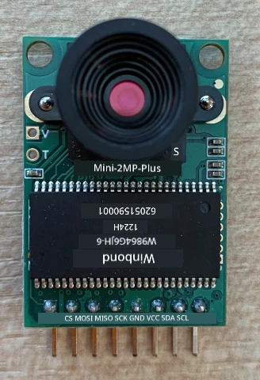
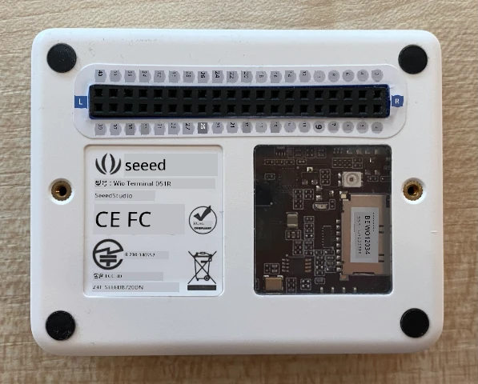
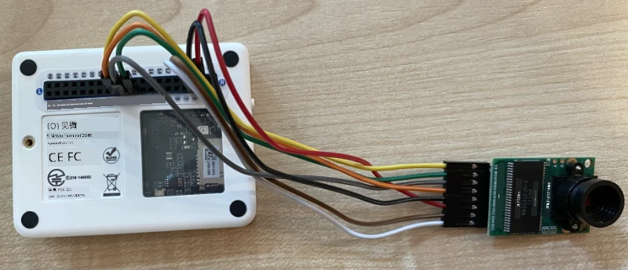

# 捕获图像 - Wio Terminal

在本课程的这一部分，您将为 Wio Terminal 添加一个摄像头，并从中捕获图像。

## 硬件

Wio Terminal 需要一个摄像头。

您将使用的摄像头是 [ArduCam Mini 2MP Plus](https://www.arducam.com/product/arducam-2mp-spi-camera-b0067-arduino/)。这是一个基于 OV2640 图像传感器的 2 百万像素摄像头。它通过 SPI 接口进行通信以捕获图像，并使用 I2C 配置传感器。

## 连接摄像头

ArduCam 没有 Grove 插座，而是通过 Wio Terminal 的 GPIO 引脚连接到 SPI 和 I2C 总线。

### 任务 - 连接摄像头

连接摄像头。



1. ArduCam 底部的引脚需要连接到 Wio Terminal 的 GPIO 引脚。为了更容易找到正确的引脚，请将 Wio Terminal 附带的 GPIO 引脚贴纸贴在引脚周围：

    

1. 使用跳线，进行以下连接：

    | ArduCAM 引脚 | Wio Terminal 引脚 | 描述                                   |
    | ------------ | ----------------- | -------------------------------------- |
    | CS           | 24 (SPI_CS)       | SPI 芯片选择                           |
    | MOSI         | 19 (SPI_MOSI)     | SPI 控制器输出，外设输入               |
    | MISO         | 21 (SPI_MISO)     | SPI 控制器输入，外设输出               |
    | SCK          | 23 (SPI_SCLK)     | SPI 串行时钟                           |
    | GND          | 6 (GND)           | 地线 - 0V                              |
    | VCC          | 4 (5V)            | 5V 电源                                |
    | SDA          | 3 (I2C1_SDA)      | I2C 串行数据                           |
    | SCL          | 5 (I2C1_SCL)      | I2C 串行时钟                           |

    

    GND 和 VCC 连接为 ArduCam 提供 5V 电源。它运行在 5V，而 Grove 传感器运行在 3V。此电源直接来自为设备供电的 USB-C 连接。

    > 💁 对于 SPI 连接，ArduCam 上的引脚标签和 Wio Terminal 引脚名称在代码中仍使用旧命名约定。本课程中的说明将使用新命名约定，除非代码中使用了引脚名称。

1. 现在可以将 Wio Terminal 连接到您的计算机。

## 编程设备以连接摄像头

现在可以对 Wio Terminal 进行编程，以使用连接的 ArduCAM 摄像头。

### 任务 - 编程设备以连接摄像头

1. 使用 PlatformIO 创建一个全新的 Wio Terminal 项目。将此项目命名为 `fruit-quality-detector`。在 `setup` 函数中添加代码以配置串口。

1. 添加代码以连接到 WiFi，并将您的 WiFi 凭据放在名为 `config.h` 的文件中。不要忘记将所需的库添加到 `platformio.ini` 文件中。

1. ArduCam 库不是可以从 `platformio.ini` 文件中安装的 Arduino 库。相反，它需要从其 GitHub 页面安装源代码。您可以通过以下方式获取：

    * 从 [https://github.com/ArduCAM/Arduino.git](https://github.com/ArduCAM/Arduino.git) 克隆仓库
    * 前往 GitHub 上的仓库 [github.com/ArduCAM/Arduino](https://github.com/ArduCAM/Arduino)，并从 **Code** 按钮下载代码的 zip 文件

1. 您只需要代码中的 `ArduCAM` 文件夹。将整个文件夹复制到项目中的 `lib` 文件夹中。

    > ⚠️ 必须复制整个文件夹，因此代码位于 `lib/ArduCam` 中。不要仅将 `ArduCam` 文件夹的内容复制到 `lib` 文件夹中，而是复制整个文件夹。

1. ArduCam 库代码适用于多种类型的摄像头。您想要使用的摄像头类型通过编译器标志进行配置——这使得构建的库尽可能小，通过移除您未使用的摄像头的代码来实现。要将库配置为 OV2640 摄像头，请在 `platformio.ini` 文件末尾添加以下内容：

    ```ini
    build_flags =
        -DARDUCAM_SHIELD_V2
        -DOV2640_CAM
    ```

    这设置了两个编译器标志：

      * `ARDUCAM_SHIELD_V2` 告诉库摄像头位于 Arduino 板上，称为 shield。
      * `OV2640_CAM` 告诉库仅包含 OV2640 摄像头的代码。

1. 在 `src` 文件夹中添加一个名为 `camera.h` 的头文件。此文件将包含与摄像头通信的代码。将以下代码添加到此文件中：

    ```cpp
    #pragma once
    
    #include <ArduCAM.h>
    #include <Wire.h>
    
    class Camera
    {
    public:
        Camera(int format, int image_size) : _arducam(OV2640, PIN_SPI_SS)
        {
            _format = format;
            _image_size = image_size;
        }
    
        bool init()
        {
            // Reset the CPLD
            _arducam.write_reg(0x07, 0x80);
            delay(100);
    
            _arducam.write_reg(0x07, 0x00);
            delay(100);
    
            // Check if the ArduCAM SPI bus is OK
            _arducam.write_reg(ARDUCHIP_TEST1, 0x55);
            if (_arducam.read_reg(ARDUCHIP_TEST1) != 0x55)
            {
                return false;
            }
                
            // Change MCU mode
            _arducam.set_mode(MCU2LCD_MODE);
    
            uint8_t vid, pid;
    
            // Check if the camera module type is OV2640
            _arducam.wrSensorReg8_8(0xff, 0x01);
            _arducam.rdSensorReg8_8(OV2640_CHIPID_HIGH, &vid);
            _arducam.rdSensorReg8_8(OV2640_CHIPID_LOW, &pid);
            if ((vid != 0x26) && ((pid != 0x41) || (pid != 0x42)))
            {
                return false;
            }
            
            _arducam.set_format(_format);
            _arducam.InitCAM();
            _arducam.OV2640_set_JPEG_size(_image_size);
            _arducam.OV2640_set_Light_Mode(Auto);
            _arducam.OV2640_set_Special_effects(Normal);
            delay(1000);
    
            return true;
        }
    
        void startCapture()
        {
            _arducam.flush_fifo();
            _arducam.clear_fifo_flag();
            _arducam.start_capture();
        }
    
        bool captureReady()
        {
            return _arducam.get_bit(ARDUCHIP_TRIG, CAP_DONE_MASK);
        }
    
        bool readImageToBuffer(byte **buffer, uint32_t &buffer_length)
        {
            if (!captureReady()) return false;
    
            // Get the image file length
            uint32_t length = _arducam.read_fifo_length();
            buffer_length = length;
    
            if (length >= MAX_FIFO_SIZE)
            {
                return false;
            }
            if (length == 0)
            {
                return false;
            }
    
            // create the buffer
            byte *buf = new byte[length];
    
            uint8_t temp = 0, temp_last = 0;
            int i = 0;
            uint32_t buffer_pos = 0;
            bool is_header = false;
    
            _arducam.CS_LOW();
            _arducam.set_fifo_burst();
            
            while (length--)
            {
                temp_last = temp;
                temp = SPI.transfer(0x00);
                //Read JPEG data from FIFO
                if ((temp == 0xD9) && (temp_last == 0xFF)) //If find the end ,break while,
                {
                    buf[buffer_pos] = temp;
    
                    buffer_pos++;
                    i++;
                    
                    _arducam.CS_HIGH();
                }
                if (is_header == true)
                {
                    //Write image data to buffer if not full
                    if (i < 256)
                    {
                        buf[buffer_pos] = temp;
                        buffer_pos++;
                        i++;
                    }
                    else
                    {
                        _arducam.CS_HIGH();
    
                        i = 0;
                        buf[buffer_pos] = temp;
    
                        buffer_pos++;
                        i++;
    
                        _arducam.CS_LOW();
                        _arducam.set_fifo_burst();
                    }
                }
                else if ((temp == 0xD8) & (temp_last == 0xFF))
                {
                    is_header = true;
    
                    buf[buffer_pos] = temp_last;
                    buffer_pos++;
                    i++;
    
                    buf[buffer_pos] = temp;
                    buffer_pos++;
                    i++;
                }
            }
            
            _arducam.clear_fifo_flag();
    
            _arducam.set_format(_format);
            _arducam.InitCAM();
            _arducam.OV2640_set_JPEG_size(_image_size);
    
            // return the buffer
            *buffer = buf;
        }
    
    private:
        ArduCAM _arducam;
        int _format;
        int _image_size;
    };
    ```

    这是使用 ArduCam 库配置摄像头并在需要时通过 SPI 总线提取图像的底层代码。此代码非常特定于 ArduCam，因此您无需担心它的工作原理。

1. 在 `main.cpp` 中，在其他 `include` 语句下方添加以下代码以包含此新文件并创建摄像头类的实例：

    ```cpp
    #include "camera.h"

    Camera camera = Camera(JPEG, OV2640_640x480);
    ```

    这会创建一个 `Camera`，以 640x480 的分辨率保存图像为 JPEG。虽然支持更高的分辨率（最高 3280x2464），但图像分类器处理的图像尺寸要小得多（227x227），因此无需捕获和发送更大的图像。

1. 在此下方添加以下代码以定义一个设置摄像头的函数：

    ```cpp
    void setupCamera()
    {
        pinMode(PIN_SPI_SS, OUTPUT);
        digitalWrite(PIN_SPI_SS, HIGH);
    
        Wire.begin();
        SPI.begin();
    
        if (!camera.init())
        {
            Serial.println("Error setting up the camera!");
        }
    }
    ```

    此 `setupCamera` 函数首先将 SPI 芯片选择引脚 (`PIN_SPI_SS`) 配置为高电平，使 Wio Terminal 成为 SPI 控制器。然后启动 I2C 和 SPI 总线。最后，它初始化摄像头类，配置摄像头传感器设置并确保所有连接正确。

1. 在 `setup` 函数末尾调用此函数：

    ```cpp
    setupCamera();
    ```

1. 构建并上传此代码，并检查串口监视器的输出。如果看到 `Error setting up the camera!`，请检查布线以确保所有电缆正确连接 ArduCam 的引脚和 Wio Terminal 的 GPIO 引脚，并且所有跳线电缆都正确插入。

## 捕获图像

现在可以对 Wio Terminal 进行编程，以在按下按钮时捕获图像。

### 任务 - 捕获图像

1. 微控制器会连续运行您的代码，因此很难触发类似拍照的操作，而不响应传感器。Wio Terminal 有按钮，因此可以设置摄像头通过其中一个按钮触发。将以下代码添加到 `setup` 函数末尾，以配置 C 按钮（顶部的三个按钮之一，靠近电源开关的那个）。

    

    ```cpp
    pinMode(WIO_KEY_C, INPUT_PULLUP);
    ```

    `INPUT_PULLUP` 模式实际上会反转输入。例如，通常按钮在未按下时会发送低信号，按下时发送高信号。当设置为 `INPUT_PULLUP` 时，它们在未按下时发送高信号，按下时发送低信号。

1. 在 `loop` 函数之前添加一个空函数以响应按钮按下：

    ```cpp
    void buttonPressed()
    {
        
    }
    ```

1. 在按钮按下时在 `loop` 方法中调用此函数：

    ```cpp
    void loop()
    {
        if (digitalRead(WIO_KEY_C) == LOW)
        {
            buttonPressed();
            delay(2000);
        }
    
        delay(200);
    }
    ```

    此代码检查按钮是否被按下。如果按下，则调用 `buttonPressed` 函数，并且循环延迟 2 秒。这是为了给按钮释放留出时间，以免长按被注册为两次按下。

    > 💁 Wio Terminal 上的按钮设置为 `INPUT_PULLUP`，因此在未按下时发送高信号，按下时发送低信号。

1. 将以下代码添加到 `buttonPressed` 函数中：

    ```cpp
    camera.startCapture();
 
    while (!camera.captureReady())
        delay(100);

    Serial.println("Image captured");

    byte *buffer;
    uint32_t length;

    if (camera.readImageToBuffer(&buffer, length))
    {
        Serial.print("Image read to buffer with length ");
        Serial.println(length);

        delete(buffer);
    }
    ```

    此代码通过调用 `startCapture` 开始摄像头捕获。摄像头硬件不会在您请求时返回数据，而是发送指令开始捕获，摄像头将在后台工作以捕获图像、将其转换为 JPEG，并将其存储在摄像头本地缓冲区中。然后通过 `captureReady` 调用检查图像捕获是否完成。

    捕获完成后，图像数据通过 `readImageToBuffer` 调用从摄像头缓冲区复制到本地缓冲区（字节数组）。缓冲区的长度随后发送到串口监视器。

1. 构建并上传此代码，并检查串口监视器上的输出。每次按下 C 按钮时，都会捕获一张图像，并在串口监视器上看到图像大小。

    ```output
    Connecting to WiFi..
    Connected!
    Image captured
    Image read to buffer with length 9224
    Image captured
    Image read to buffer with length 11272
    ```

    不同的图像会有不同的大小。它们被压缩为 JPEG 文件，给定分辨率的 JPEG 文件大小取决于图像内容。

> 💁 您可以在 [code-camera/wio-terminal](../../../../../4-manufacturing/lessons/2-check-fruit-from-device/code-camera/wio-terminal) 文件夹中找到此代码。

😀 您已成功使用 Wio Terminal 捕获图像。

## 可选 - 使用 SD 卡验证摄像头图像

查看摄像头捕获的图像的最简单方法是将它们写入 Wio Terminal 中的 SD 卡，然后在计算机上查看。如果您有备用的 microSD 卡和计算机上的 microSD 卡插槽或适配器，请执行此步骤。

Wio Terminal 仅支持最大 16GB 的 microSD 卡。如果您有更大的 SD 卡，则无法使用。

### 任务 - 使用 SD 卡验证摄像头图像

1. 使用计算机上的相关应用程序（macOS 上的磁盘工具、Windows 上的文件资源管理器或 Linux 中的命令行工具）将 microSD 卡格式化为 FAT32 或 exFAT。

1. 将 microSD 卡插入电源开关下方的插槽。确保完全插入直到卡扣住并保持到位，您可能需要使用指甲或细工具推动。

1. 在 `main.cpp` 文件顶部添加以下 include 语句：

    ```cpp
    #include "SD/Seeed_SD.h"
    #include <Seeed_FS.h>
    ```

1. 在 `setup` 函数之前添加以下函数：

    ```cpp
    void setupSDCard()
    {
        while (!SD.begin(SDCARD_SS_PIN, SDCARD_SPI))
        {
            Serial.println("SD Card Error");
        }
    }
    ```

    此函数使用 SPI 总线配置 SD 卡。

1. 从 `setup` 函数调用此函数：

    ```cpp
    setupSDCard();
    ```

1. 在 `buttonPressed` 函数上方添加以下代码：

    ```cpp
    int fileNum = 1;

    void saveToSDCard(byte *buffer, uint32_t length)
    {
        char buff[16];
        sprintf(buff, "%d.jpg", fileNum);
        fileNum++;
    
        File outFile = SD.open(buff, FILE_WRITE );
        outFile.write(buffer, length);
        outFile.close();

        Serial.print("Image written to file ");
        Serial.println(buff);
    }
    ```

    这定义了一个用于文件计数的全局变量。此变量用于图像文件名，以便可以捕获多个图像并递增文件名——例如 `1.jpg`、`2.jpg` 等。

    然后定义 `saveToSDCard` 函数，该函数接收字节数据缓冲区和缓冲区长度。使用文件计数创建文件名，并为下一个文件递增文件计数。然后将缓冲区中的二进制数据写入文件。

1. 在 `buttonPressed` 函数中调用 `saveToSDCard` 函数。调用应在缓冲区被删除之前：

    ```cpp
    Serial.print("Image read to buffer with length ");
    Serial.println(length);

    saveToSDCard(buffer, length);
    
    delete(buffer);
    ```

1. 构建并上传此代码，并检查串口监视器上的输出。每次按下 C 按钮时，都会捕获图像并保存到 SD 卡。

    ```output
    Connecting to WiFi..
    Connected!
    Image captured
    Image read to buffer with length 16392
    Image written to file 1.jpg
    Image captured
    Image read to buffer with length 14344
    Image written to file 2.jpg
    ```

1. 关闭 microSD 卡并通过轻轻按下并释放将其弹出，它会弹出。您可能需要使用细工具执行此操作。将 microSD 卡插入计算机以查看图像。

    
💁 相机的白平衡可能需要几张图片来进行自我调整。您会根据捕获的图片颜色注意到这一点，前几张可能颜色不对。您可以通过更改代码，在 `setup` 函数中捕获几张被忽略的图片来解决这个问题。


**免责声明**：  
本文档使用AI翻译服务 [Co-op Translator](https://github.com/Azure/co-op-translator) 进行翻译。尽管我们努力确保翻译的准确性，但请注意，自动翻译可能包含错误或不准确之处。应以原文档的原始语言版本为权威来源。对于关键信息，建议使用专业人工翻译。我们对于因使用本翻译而引起的任何误解或误读不承担责任。