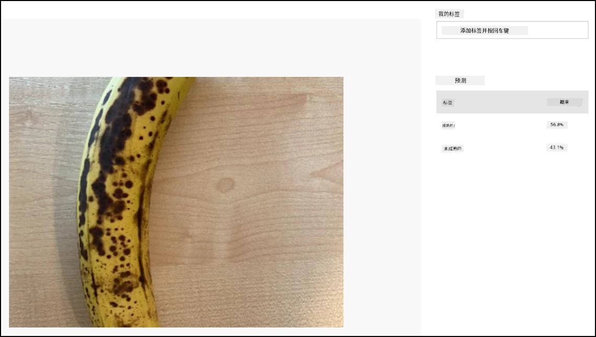

# 分类图像 - Wio Terminal

在本节课程中，您将把摄像头捕获的图像发送到 Custom Vision 服务进行分类。

## 分类图像

Custom Vision 服务提供了一个 REST API，您可以通过 Wio Terminal 调用该 API 来分类图像。这个 REST API 是通过 HTTPS 连接访问的——一种安全的 HTTP 连接。

在与 HTTPS 端点交互时，客户端代码需要从被访问的服务器请求公钥证书，并使用该证书加密发送的流量。您的网页浏览器会自动完成这些操作，但微控制器不会。您需要手动请求此证书，并使用它来创建与 REST API 的安全连接。这些证书不会更改，因此一旦获取证书，您可以将其硬编码到应用程序中。

这些证书包含公钥，不需要保密。您可以在源代码中使用它们，并在 GitHub 等公共平台上共享。

### 任务 - 设置 SSL 客户端

1. 如果尚未打开，请打开 `fruit-quality-detector` 应用项目。

1. 打开 `config.h` 头文件，并添加以下内容：

    ```cpp
    const char *CERTIFICATE =
        "-----BEGIN CERTIFICATE-----\r\n"
        "MIIF8zCCBNugAwIBAgIQAueRcfuAIek/4tmDg0xQwDANBgkqhkiG9w0BAQwFADBh\r\n"
        "MQswCQYDVQQGEwJVUzEVMBMGA1UEChMMRGlnaUNlcnQgSW5jMRkwFwYDVQQLExB3\r\n"
        "d3cuZGlnaWNlcnQuY29tMSAwHgYDVQQDExdEaWdpQ2VydCBHbG9iYWwgUm9vdCBH\r\n"
        "MjAeFw0yMDA3MjkxMjMwMDBaFw0yNDA2MjcyMzU5NTlaMFkxCzAJBgNVBAYTAlVT\r\n"
        "MR4wHAYDVQQKExVNaWNyb3NvZnQgQ29ycG9yYXRpb24xKjAoBgNVBAMTIU1pY3Jv\r\n"
        "c29mdCBBenVyZSBUTFMgSXNzdWluZyBDQSAwNjCCAiIwDQYJKoZIhvcNAQEBBQAD\r\n"
        "ggIPADCCAgoCggIBALVGARl56bx3KBUSGuPc4H5uoNFkFH4e7pvTCxRi4j/+z+Xb\r\n"
        "wjEz+5CipDOqjx9/jWjskL5dk7PaQkzItidsAAnDCW1leZBOIi68Lff1bjTeZgMY\r\n"
        "iwdRd3Y39b/lcGpiuP2d23W95YHkMMT8IlWosYIX0f4kYb62rphyfnAjYb/4Od99\r\n"
        "ThnhlAxGtfvSbXcBVIKCYfZgqRvV+5lReUnd1aNjRYVzPOoifgSx2fRyy1+pO1Uz\r\n"
        "aMMNnIOE71bVYW0A1hr19w7kOb0KkJXoALTDDj1ukUEDqQuBfBxReL5mXiu1O7WG\r\n"
        "0vltg0VZ/SZzctBsdBlx1BkmWYBW261KZgBivrql5ELTKKd8qgtHcLQA5fl6JB0Q\r\n"
        "gs5XDaWehN86Gps5JW8ArjGtjcWAIP+X8CQaWfaCnuRm6Bk/03PQWhgdi84qwA0s\r\n"
        "sRfFJwHUPTNSnE8EiGVk2frt0u8PG1pwSQsFuNJfcYIHEv1vOzP7uEOuDydsmCjh\r\n"
        "lxuoK2n5/2aVR3BMTu+p4+gl8alXoBycyLmj3J/PUgqD8SL5fTCUegGsdia/Sa60\r\n"
        "N2oV7vQ17wjMN+LXa2rjj/b4ZlZgXVojDmAjDwIRdDUujQu0RVsJqFLMzSIHpp2C\r\n"
        "Zp7mIoLrySay2YYBu7SiNwL95X6He2kS8eefBBHjzwW/9FxGqry57i71c2cDAgMB\r\n"
        "AAGjggGtMIIBqTAdBgNVHQ4EFgQU1cFnOsKjnfR3UltZEjgp5lVou6UwHwYDVR0j\r\n"
        "BBgwFoAUTiJUIBiV5uNu5g/6+rkS7QYXjzkwDgYDVR0PAQH/BAQDAgGGMB0GA1Ud\r\n"
        "JQQWMBQGCCsGAQUFBwMBBggrBgEFBQcDAjASBgNVHRMBAf8ECDAGAQH/AgEAMHYG\r\n"
        "CCsGAQUFBwEBBGowaDAkBggrBgEFBQcwAYYYaHR0cDovL29jc3AuZGlnaWNlcnQu\r\n"
        "Y29tMEAGCCsGAQUFBzAChjRodHRwOi8vY2FjZXJ0cy5kaWdpY2VydC5jb20vRGln\r\n"
        "aUNlcnRHbG9iYWxSb290RzIuY3J0MHsGA1UdHwR0MHIwN6A1oDOGMWh0dHA6Ly9j\r\n"
        "cmwzLmRpZ2ljZXJ0LmNvbS9EaWdpQ2VydEdsb2JhbFJvb3RHMi5jcmwwN6A1oDOG\r\n"
        "MWh0dHA6Ly9jcmw0LmRpZ2ljZXJ0LmNvbS9EaWdpQ2VydEdsb2JhbFJvb3RHMi5j\r\n"
        "cmwwHQYDVR0gBBYwFDAIBgZngQwBAgEwCAYGZ4EMAQICMBAGCSsGAQQBgjcVAQQD\r\n"
        "AgEAMA0GCSqGSIb3DQEBDAUAA4IBAQB2oWc93fB8esci/8esixj++N22meiGDjgF\r\n"
        "+rA2LUK5IOQOgcUSTGKSqF9lYfAxPjrqPjDCUPHCURv+26ad5P/BYtXtbmtxJWu+\r\n"
        "cS5BhMDPPeG3oPZwXRHBJFAkY4O4AF7RIAAUW6EzDflUoDHKv83zOiPfYGcpHc9s\r\n"
        "kxAInCedk7QSgXvMARjjOqdakor21DTmNIUotxo8kHv5hwRlGhBJwps6fEVi1Bt0\r\n"
        "trpM/3wYxlr473WSPUFZPgP1j519kLpWOJ8z09wxay+Br29irPcBYv0GMXlHqThy\r\n"
        "8y4m/HyTQeI2IMvMrQnwqPpY+rLIXyviI2vLoI+4xKE4Rn38ZZ8m\r\n"
        "-----END CERTIFICATE-----\r\n";
    ```

    这是 *Microsoft Azure DigiCert Global Root G2 证书*——它是许多 Azure 服务全球使用的证书之一。

    > 💁 要查看这是需要使用的证书，请在 macOS 或 Linux 上运行以下命令。如果您使用的是 Windows，可以通过 [Windows Subsystem for Linux (WSL)](https://docs.microsoft.com/windows/wsl/?WT.mc_id=academic-17441-jabenn) 运行此命令：
    >
    > ```sh
    > openssl s_client -showcerts -verify 5 -connect api.cognitive.microsoft.com:443
    > ```
    >
    > 输出将列出 DigiCert Global Root G2 证书。

1. 打开 `main.cpp` 并添加以下 include 指令：

    ```cpp
    #include <WiFiClientSecure.h>
    ```

1. 在 include 指令下方，声明一个 `WifiClientSecure` 实例：

    ```cpp
    WiFiClientSecure client;
    ```

    此类包含与 HTTPS 端点通信的代码。

1. 在 `connectWiFi` 方法中，将 WiFiClientSecure 设置为使用 DigiCert Global Root G2 证书：

    ```cpp
    client.setCACert(CERTIFICATE);
    ```

### 任务 - 分类图像

1. 在 `platformio.ini` 文件的 `lib_deps` 列表中添加以下内容作为额外行：

    ```ini
    bblanchon/ArduinoJson @ 6.17.3
    ```

    这将导入 [ArduinoJson](https://arduinojson.org)，一个 Arduino JSON 库，用于解码 REST API 的 JSON 响应。

1. 在 `config.h` 中，为 Custom Vision 服务的预测 URL 和 Key 添加常量：

    ```cpp
    const char *PREDICTION_URL = "<PREDICTION_URL>";
    const char *PREDICTION_KEY = "<PREDICTION_KEY>";
    ```

    将 `<PREDICTION_URL>` 替换为 Custom Vision 的预测 URL。将 `<PREDICTION_KEY>` 替换为预测密钥。

1. 在 `main.cpp` 中，为 ArduinoJson 库添加 include 指令：

    ```cpp
    #include <ArduinoJSON.h>
    ```

1. 在 `main.cpp` 中，添加以下函数，放置在 `buttonPressed` 函数上方：

    ```cpp
    void classifyImage(byte *buffer, uint32_t length)
    {
        HTTPClient httpClient;
        httpClient.begin(client, PREDICTION_URL);
        httpClient.addHeader("Content-Type", "application/octet-stream");
        httpClient.addHeader("Prediction-Key", PREDICTION_KEY);
    
        int httpResponseCode = httpClient.POST(buffer, length);
    
        if (httpResponseCode == 200)
        {
            String result = httpClient.getString();
    
            DynamicJsonDocument doc(1024);
            deserializeJson(doc, result.c_str());
    
            JsonObject obj = doc.as<JsonObject>();
            JsonArray predictions = obj["predictions"].as<JsonArray>();
    
            for(JsonVariant prediction : predictions) 
            {
                String tag = prediction["tagName"].as<String>();
                float probability = prediction["probability"].as<float>();
    
                char buff[32];
                sprintf(buff, "%s:\t%.2f%%", tag.c_str(), probability * 100.0);
                Serial.println(buff);
            }
        }
    
        httpClient.end();
    }
    ```

    此代码首先声明一个 `HTTPClient`——一个包含与 REST API 交互方法的类。然后使用之前设置的 Azure 公钥，通过 `WiFiClientSecure` 实例连接客户端到预测 URL。

    一旦连接成功，它会发送请求头——关于即将对 REST API 发出的请求的信息。`Content-Type` 请求头表示 API 调用将发送原始二进制数据，`Prediction-Key` 请求头传递 Custom Vision 的预测密钥。

    接下来，向 HTTP 客户端发出 POST 请求，上传一个字节数组。该数组将包含从摄像头捕获的 JPEG 图像，当此函数被调用时上传。

    > 💁 POST 请求用于发送数据并获取响应。还有其他请求类型，例如 GET 请求，用于检索数据。您的网页浏览器使用 GET 请求加载网页。

    POST 请求返回一个响应状态码。这些是定义明确的值，其中 200 表示 **OK**——POST 请求成功。

    > 💁 您可以在 [维基百科的 HTTP 状态码列表页面](https://wikipedia.org/wiki/List_of_HTTP_status_codes) 中查看所有响应状态码。

    如果返回 200，则从 HTTP 客户端读取结果。这是 REST API 的预测结果，以 JSON 文档的形式返回的文本响应。JSON 格式如下：

    ```jSON
    {
        "id":"45d614d3-7d6f-47e9-8fa2-04f237366a16",
        "project":"135607e5-efac-4855-8afb-c93af3380531",
        "iteration":"04f1c1fa-11ec-4e59-bb23-4c7aca353665",
        "created":"2021-06-10T17:58:58.959Z",
        "predictions":[
            {
                "probability":0.5582016,
                "tagId":"05a432ea-9718-4098-b14f-5f0688149d64",
                "tagName":"ripe"
            },
            {
                "probability":0.44179836,
                "tagId":"bb091037-16e5-418e-a9ea-31c6a2920f17",
                "tagName":"unripe"
            }
        ]
    }
    ```

    这里重要的部分是 `predictions` 数组。它包含预测结果，每个标签都有一个条目，包含标签名称和概率。返回的概率是 0-1 的浮点数，其中 0 表示与标签匹配的可能性为 0%，1 表示与标签匹配的可能性为 100%。

    > 💁 图像分类器会返回所有使用过的标签的百分比。每个标签都会有一个图像与该标签匹配的概率。

    该 JSON 被解码后，每个标签的概率会发送到串行监视器。

1. 在 `buttonPressed` 函数中，将保存到 SD 卡的代码替换为对 `classifyImage` 的调用，或者在图像写入后添加调用，但 **在**删除缓冲区之前：

    ```cpp
    classifyImage(buffer, length);
    ```

    > 💁 如果您替换了保存到 SD 卡的代码，可以清理代码，删除 `setupSDCard` 和 `saveToSDCard` 函数。

1. 上传并运行代码。将摄像头对准一些水果并按下 C 按钮。您将在串行监视器中看到输出：

    ```output
    Connecting to WiFi..
    Connected!
    Image captured
    Image read to buffer with length 8200
    ripe:   56.84%
    unripe: 43.16%
    ```

    您将能够看到拍摄的图像，以及这些值在 Custom Vision 的 **Predictions** 标签中。

    

> 💁 您可以在 [code-classify/wio-terminal](../../../../../4-manufacturing/lessons/2-check-fruit-from-device/code-classify/wio-terminal) 文件夹中找到此代码。

😀 您的水果质量分类程序成功了！

**免责声明**：  
本文档使用AI翻译服务 [Co-op Translator](https://github.com/Azure/co-op-translator) 进行翻译。尽管我们努力确保翻译的准确性，但请注意，自动翻译可能包含错误或不准确之处。应以原文档的原始语言版本为权威来源。对于关键信息，建议使用专业人工翻译。我们对于因使用本翻译而引起的任何误解或误读不承担责任。