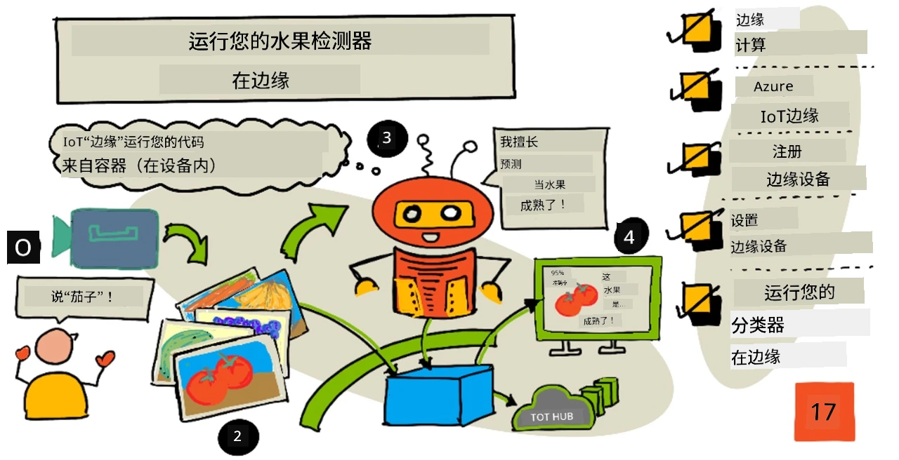
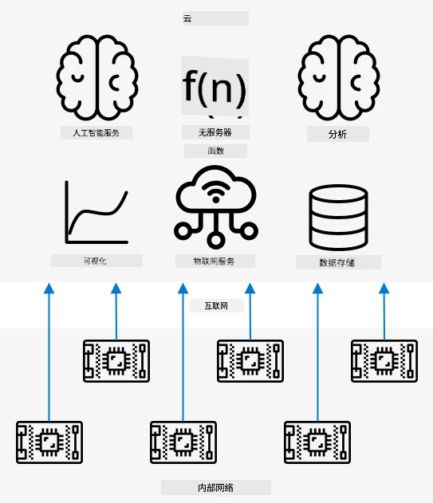
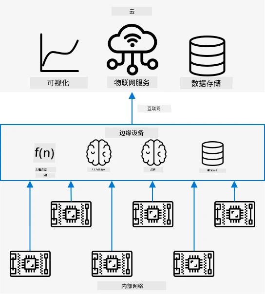
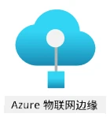
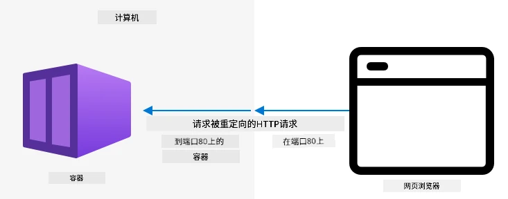
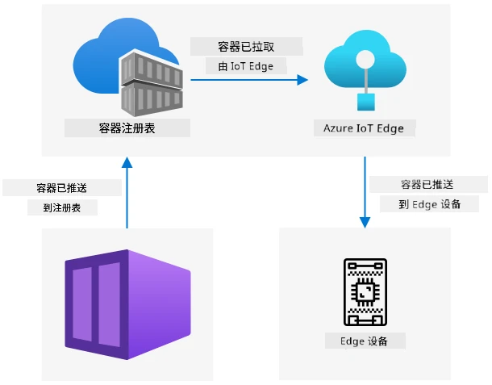
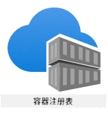

# 在边缘设备上运行水果检测器



> 手绘笔记由 [Nitya Narasimhan](https://github.com/nitya) 提供。点击图片查看大图。

这段视频概述了如何在物联网设备上运行图像分类器，这是本课的主题。

[](https://www.youtube.com/watch?v=_K5fqGLO8us)

## 课前测验

[课前测验](https://black-meadow-040d15503.1.azurestaticapps.net/quiz/33)

## 简介

在上一课中，你使用图像分类器对成熟和未成熟的水果进行分类，将物联网设备摄像头捕获的图像通过互联网发送到云服务。这种方式需要时间、花费金钱，并且根据所使用的图像数据类型，可能会带来隐私问题。

在本课中，你将学习如何在边缘设备上运行机器学习（ML）模型——即在运行于你自己网络上的物联网设备上，而不是在云端。你将了解边缘计算相较于云计算的优缺点，如何将 AI 模型部署到边缘设备，以及如何从物联网设备访问它。

本课内容包括：

* [边缘计算](../../../../../4-manufacturing/lessons/3-run-fruit-detector-edge)
* [Azure IoT Edge](../../../../../4-manufacturing/lessons/3-run-fruit-detector-edge)
* [注册一个 IoT Edge 设备](../../../../../4-manufacturing/lessons/3-run-fruit-detector-edge)
* [设置 IoT Edge 设备](../../../../../4-manufacturing/lessons/3-run-fruit-detector-edge)
* [导出你的模型](../../../../../4-manufacturing/lessons/3-run-fruit-detector-edge)
* [准备容器以进行部署](../../../../../4-manufacturing/lessons/3-run-fruit-detector-edge)
* [部署容器](../../../../../4-manufacturing/lessons/3-run-fruit-detector-edge)
* [使用你的 IoT Edge 设备](../../../../../4-manufacturing/lessons/3-run-fruit-detector-edge)

## 边缘计算

边缘计算是指尽可能靠近数据生成位置的地方处理物联网数据。与在云端处理不同，边缘计算将处理移至云的边缘——即你的内部网络。



到目前为止的课程中，你的设备一直在收集数据并将其发送到云端进行分析，在云端运行无服务器函数或 AI 模型。



边缘计算将部分云服务从云端移到与物联网设备同一网络上的计算机上，仅在需要时与云端通信。例如，你可以在边缘设备上运行 AI 模型来分析水果的成熟度，仅将分析结果（如成熟水果与未成熟水果的数量）发送回云端。

✅ 思考一下你迄今为止构建的物联网应用程序。哪些部分可以移到边缘？

### 优点

边缘计算的优点包括：

1. **速度** - 边缘计算非常适合时间敏感型数据，因为操作在与设备相同的网络上完成，而不是通过互联网进行调用。这使得速度更快，因为内部网络的运行速度通常比互联网连接快得多，数据传输的距离也更短。

    > 💁 尽管互联网连接使用光纤电缆，数据可以以光速传输，但数据在全球范围内传输到云服务提供商仍需要时间。例如，如果你从欧洲向美国的云服务发送数据，数据通过光纤电缆跨越大西洋至少需要 28 毫秒，这还不包括数据到达跨大西洋电缆的时间、电信号与光信号的转换时间以及从光纤电缆到云服务提供商的时间。

    边缘计算还需要更少的网络流量，从而降低了因互联网连接带宽有限而导致数据传输变慢的风险。

1. **远程可访问性** - 边缘计算在连接有限或没有连接，或者连接成本过高时仍然有效。例如，在基础设施有限的人道主义灾区或发展中国家工作时。

1. **成本更低** - 在边缘设备上进行数据收集、存储、分析和触发操作可以减少云服务的使用，从而降低物联网应用程序的总体成本。近年来，专为边缘计算设计的设备（如 [NVIDIA 的 Jetson Nano](https://developer.nvidia.com/embedded/jetson-nano-developer-kit)）的兴起，这些设备可以使用 GPU 硬件在成本低于 100 美元的设备上运行 AI 工作负载。

1. **隐私和安全性** - 使用边缘计算，数据保留在你的网络中，而不会上传到云端。这对于敏感和个人身份信息来说通常是更好的选择，尤其是因为数据在分析后不需要存储，从而大大降低了数据泄露的风险。例如，医疗数据和安全摄像头录像。

1. **处理不安全设备** - 如果你有已知存在安全漏洞的设备，不希望它们直接连接到你的网络或互联网，那么你可以将它们连接到一个单独的网络，并通过一个网关 IoT Edge 设备进行管理。这个边缘设备可以同时连接到更广泛的网络或互联网，并管理数据的双向流动。

1. **支持不兼容设备** - 如果你有无法连接到 IoT Hub 的设备，例如只能通过 HTTP 连接的设备或只能通过蓝牙连接的设备，你可以使用 IoT Edge 设备作为网关设备，将消息转发到 IoT Hub。

✅ 做一些研究：边缘计算还有哪些其他优点？

### 缺点

边缘计算也有一些缺点，在某些情况下云计算可能是更好的选择：

1. **规模和灵活性** - 云计算可以通过增加或减少服务器和其他资源实时调整网络和数据需求。而增加边缘计算机需要手动添加更多设备。

1. **可靠性和弹性** - 云计算通常提供多个服务器，甚至位于多个位置，以实现冗余和灾难恢复。而在边缘实现同样的冗余需要大量投资和配置工作。

1. **维护** - 云服务提供商负责系统维护和更新。

✅ 做一些研究：边缘计算还有哪些其他缺点？

这些缺点实际上是使用云计算的优点的反面——你需要自己构建和管理这些设备，而不是依赖云服务提供商的专业知识和规模。

某些风险可以通过边缘计算的特性得到缓解。例如，如果你在工厂中运行一个边缘设备来收集机器数据，你不需要考虑某些灾难恢复场景。如果工厂断电，那么生成数据的机器也会断电，因此不需要备用的边缘设备。

对于物联网系统，你通常需要云计算和边缘计算的结合，根据系统、客户和维护者的需求利用每种服务的优势。

## Azure IoT Edge



Azure IoT Edge 是一项服务，可以帮助你将工作负载从云端移到边缘。你可以将设备设置为边缘设备，并从云端向该边缘设备部署代码。这使得你可以混合使用云和边缘的功能。

> 🎓 *工作负载* 是指执行某种工作的任何服务，例如 AI 模型、应用程序或无服务器函数。

例如，你可以在云端训练一个图像分类器，然后从云端将其部署到边缘设备。你的物联网设备随后将图像发送到边缘设备进行分类，而不是通过互联网发送图像。如果需要部署模型的新版本，你可以在云端训练它，并使用 IoT Edge 将新版本更新到边缘设备。

> 🎓 部署到 IoT Edge 的软件称为 *模块*。默认情况下，IoT Edge 运行与 IoT Hub 通信的模块，例如 `edgeAgent` 和 `edgeHub` 模块。当你部署图像分类器时，它会作为一个额外的模块部署。

IoT Edge 内置于 IoT Hub 中，因此你可以使用与管理物联网设备相同的服务来管理边缘设备，并具有相同的安全级别。

IoT Edge 从 *容器* 中运行代码——容器是独立的应用程序，运行时与计算机上的其他应用程序隔离。当你运行一个容器时，它就像在你的计算机中运行的一个独立计算机，拥有自己的软件、服务和应用程序。大多数情况下，容器无法访问计算机上的任何内容，除非你选择共享某些内容（例如文件夹）给容器。容器通过开放端口暴露服务，你可以连接到这些端口或将其暴露到网络。



例如，你可以在端口 80（默认 HTTP 端口）上运行一个带有网站的容器，然后也在你的计算机上通过端口 80 暴露它。

✅ 做一些研究：阅读有关容器和 Docker 或 Moby 等服务的资料。

你可以使用 Custom Vision 下载图像分类器，并将其作为容器部署，无论是直接运行在设备上还是通过 IoT Edge 部署。一旦它们在容器中运行，你可以使用与云版本相同的 REST API 访问它们，但端点指向运行容器的边缘设备。

## 注册一个 IoT Edge 设备

要使用 IoT Edge 设备，必须在 IoT Hub 中注册它。

### 任务 - 注册一个 IoT Edge 设备

1. 在 `fruit-quality-detector` 资源组中创建一个 IoT Hub。为其命名一个基于 `fruit-quality-detector` 的唯一名称。

1. 在你的 IoT Hub 中注册一个名为 `fruit-quality-detector-edge` 的 IoT Edge 设备。注册命令与注册非边缘设备的命令类似，但需要传递 `--edge-enabled` 标志。

    ```sh
    az iot hub device-identity create --edge-enabled \
                                      --device-id fruit-quality-detector-edge \
                                      --hub-name <hub_name>
    ```

    将 `<hub_name>` 替换为你的 IoT Hub 的名称。

1. 使用以下命令获取设备的连接字符串：

    ```sh
    az iot hub device-identity connection-string show --device-id fruit-quality-detector-edge \
                                                      --output table \
                                                      --hub-name <hub_name>
    ```

    将 `<hub_name>` 替换为你的 IoT Hub 的名称。

    复制输出中显示的连接字符串。

## 设置 IoT Edge 设备

在你的 IoT Hub 中创建了边缘设备注册后，你可以设置边缘设备。

### 任务 - 安装并启动 IoT Edge 运行时

**IoT Edge 运行时仅运行 Linux 容器。** 它可以运行在 Linux 上，或者通过 Linux 虚拟机运行在 Windows 上。

* 如果你使用 Raspberry Pi 作为物联网设备，那么它运行的是支持的 Linux 版本，可以托管 IoT Edge 运行时。按照 [Microsoft 文档中的安装 Azure IoT Edge for Linux 指南](https://docs.microsoft.com/azure/iot-edge/how-to-install-iot-edge?WT.mc_id=academic-17441-jabenn) 安装 IoT Edge 并设置连接字符串。

    > 💁 请记住，Raspberry Pi OS 是 Debian Linux 的一个变体。

* 如果你没有使用 Raspberry Pi，但有一台 Linux 计算机，你可以运行 IoT Edge 运行时。按照 [Microsoft 文档中的安装 Azure IoT Edge for Linux 指南](https://docs.microsoft.com/azure/iot-edge/how-to-install-iot-edge?WT.mc_id=academic-17441-jabenn) 安装 IoT Edge 并设置连接字符串。

* 如果你使用的是 Windows，可以通过 Linux 虚拟机安装 IoT Edge 运行时，按照 [Microsoft 文档中在 Windows 设备上部署第一个 IoT Edge 模块快速入门的安装和启动 IoT Edge 运行时部分](https://docs.microsoft.com/azure/iot-edge/quickstart?WT.mc_id=academic-17441-jabenn#install-and-start-the-iot-edge-runtime) 进行操作。到达 *部署模块* 部分时可以停止。

* 如果你使用的是 macOS，可以在云中创建一个虚拟机（VM）作为你的 IoT Edge 设备。这些是你可以在云中创建并通过互联网访问的计算机。你可以创建一个安装了 IoT Edge 的 Linux 虚拟机。按照 [创建运行 IoT Edge 的虚拟机指南](vm-iotedge.md) 获取相关说明。

## 导出你的模型

要在边缘运行分类器，需要从 Custom Vision 导出它。Custom Vision 可以生成两种类型的模型——标准模型和紧凑型模型。紧凑型模型使用各种技术来减小模型的大小，使其足够小以便下载并部署到物联网设备上。

当你创建图像分类器时，使用的是 *Food* 域，这是一个针对食物图像训练优化的模型版本。在 Custom Vision 中，你可以更改项目的域，使用你的训练数据重新训练一个新域的模型。Custom Vision 支持的所有域都可以作为标准和紧凑型模型使用。

### 任务 - 使用 Food（紧凑型）域训练你的模型
1. 打开 [CustomVision.ai](https://customvision.ai) 的 Custom Vision 门户并登录（如果尚未打开）。然后打开你的 `fruit-quality-detector` 项目。

1. 点击 **设置** 按钮（⚙ 图标）。

1. 在 *Domains* 列表中，选择 *Food (compact)*。

1. 在 *Export Capabilities* 下，确保选择了 *Basic platforms (Tensorflow, CoreML, ONNX, ...)*。

1. 在设置页面底部，点击 **保存更改**。

1. 使用 **训练** 按钮重新训练模型，选择 *快速训练*。

### 任务 - 导出你的模型

模型训练完成后，需要将其导出为一个容器。

1. 点击 **性能** 标签，找到使用紧凑域训练的最新迭代。

1. 点击顶部的 **导出** 按钮。

1. 选择 **DockerFile**，然后选择与你的边缘设备匹配的版本：

    * 如果你在 Linux 电脑、Windows 电脑或虚拟机上运行 IoT Edge，选择 *Linux* 版本。
    * 如果你在 Raspberry Pi 上运行 IoT Edge，选择 *ARM (Raspberry Pi 3)* 版本。

> 🎓 Docker 是管理容器最流行的工具之一，而 DockerFile 是一组关于如何设置容器的指令。

1. 点击 **导出** 让 Custom Vision 创建相关文件，然后点击 **下载** 将它们下载为一个 zip 文件。

1. 将文件保存到你的电脑，然后解压文件夹。

## 为部署准备容器



下载模型后，需要将其构建为容器，然后推送到容器注册表——一个在线存储容器的位置。IoT Edge 可以从注册表下载容器并将其推送到你的设备。



本课程中使用的容器注册表是 Azure 容器注册表。这不是一个免费服务，因此为了节省费用，请确保在完成后[清理你的项目](../../../clean-up.md)。

> 💁 你可以在 [Azure 容器注册表定价页面](https://azure.microsoft.com/pricing/details/container-registry/?WT.mc_id=academic-17441-jabenn) 查看使用 Azure 容器注册表的费用。

### 任务 - 安装 Docker

为了构建和部署分类器，你可能需要安装 [Docker](https://www.docker.com/)。

只有当你计划在与安装 IoT Edge 的设备不同的设备上构建容器时才需要安装 Docker——安装 IoT Edge 的过程中会自动安装 Docker。

1. 如果你在与 IoT Edge 设备不同的设备上构建 Docker 容器，请按照 [Docker 安装页面](https://www.docker.com/products/docker-desktop) 上的安装说明安装 Docker Desktop 或 Docker 引擎。确保安装后运行。

### 任务 - 创建容器注册表资源

1. 在终端或命令提示符中运行以下命令以创建 Azure 容器注册表资源：

    ```sh
    az acr create --resource-group fruit-quality-detector \
                  --sku Basic \
                  --name <Container registry name>
    ```

    将 `<Container registry name>` 替换为容器注册表的唯一名称，仅使用字母和数字。可以基于 `fruitqualitydetector` 创建名称。此名称将成为访问容器注册表的 URL 的一部分，因此需要全局唯一。

1. 使用以下命令登录到 Azure 容器注册表：

    ```sh
    az acr login --name <Container registry name>
    ```

    将 `<Container registry name>` 替换为你为容器注册表使用的名称。

1. 使用以下命令将容器注册表设置为管理员模式，以便生成密码：

    ```sh
    az acr update --admin-enabled true \
                 --name <Container registry name>
    ```

    将 `<Container registry name>` 替换为你为容器注册表使用的名称。

1. 使用以下命令生成容器注册表的密码：

    ```sh
     az acr credential renew --password-name password \
                             --output table \
                             --name <Container registry name>
    ```

    将 `<Container registry name>` 替换为你为容器注册表使用的名称。

    复制 `PASSWORD` 的值，因为稍后会用到。

### 任务 - 构建你的容器

从 Custom Vision 下载的是一个 DockerFile，包含关于如何构建容器的指令，以及将在容器内运行的应用程序代码，用于托管你的 Custom Vision 模型和一个 REST API 来调用它。你可以使用 Docker 从 DockerFile 构建一个带标签的容器，然后将其推送到容器注册表。

> 🎓 容器会被赋予一个标签，定义其名称和版本。当需要更新容器时，可以使用相同的标签但更新版本。

1. 打开终端或命令提示符，导航到从 Custom Vision 下载的解压模型。

1. 运行以下命令以构建并标记镜像：

    ```sh
    docker build --platform <platform> -t <Container registry name>.azurecr.io/classifier:v1 .
    ```

    将 `<platform>` 替换为容器运行的平台。如果你在 Raspberry Pi 上运行 IoT Edge，将其设置为 `linux/armhf`，否则设置为 `linux/amd64`。

    > 💁 如果你在运行 IoT Edge 的设备上运行此命令，例如在 Raspberry Pi 上运行，可以省略 `--platform <platform>` 部分，因为它会默认使用当前平台。

    将 `<Container registry name>` 替换为你为容器注册表使用的名称。

    > 💁 如果你在 Linux 或 Raspberry Pi OS 上运行此命令，可能需要使用 `sudo`。

    Docker 将构建镜像，配置所需的软件。镜像将被标记为 `classifier:v1`。

    ```output
    ➜  d4ccc45da0bb478bad287128e1274c3c.DockerFile.Linux docker build --platform linux/amd64 -t  fruitqualitydetectorjimb.azurecr.io/classifier:v1 .
    [+] Building 102.4s (11/11) FINISHED
     => [internal] load build definition from Dockerfile
     => => transferring dockerfile: 131B
     => [internal] load .dockerignore
     => => transferring context: 2B
     => [internal] load metadata for docker.io/library/python:3.7-slim
     => [internal] load build context
     => => transferring context: 905B
     => [1/6] FROM docker.io/library/python:3.7-slim@sha256:b21b91c9618e951a8cbca5b696424fa5e820800a88b7e7afd66bba0441a764d6
     => => resolve docker.io/library/python:3.7-slim@sha256:b21b91c9618e951a8cbca5b696424fa5e820800a88b7e7afd66bba0441a764d6
     => => sha256:b4d181a07f8025e00e0cb28f1cc14613da2ce26450b80c54aea537fa93cf3bda 27.15MB / 27.15MB
     => => sha256:de8ecf497b753094723ccf9cea8a46076e7cb845f333df99a6f4f397c93c6ea9 2.77MB / 2.77MB
     => => sha256:707b80804672b7c5d8f21e37c8396f319151e1298d976186b4f3b76ead9f10c8 10.06MB / 10.06MB
     => => sha256:b21b91c9618e951a8cbca5b696424fa5e820800a88b7e7afd66bba0441a764d6 1.86kB / 1.86kB
     => => sha256:44073386687709c437586676b572ff45128ff1f1570153c2f727140d4a9accad 1.37kB / 1.37kB
     => => sha256:3d94f0f2ca798607808b771a7766f47ae62a26f820e871dd488baeccc69838d1 8.31kB / 8.31kB
     => => sha256:283715715396fd56d0e90355125fd4ec57b4f0773f306fcd5fa353b998beeb41 233B / 233B
     => => sha256:8353afd48f6b84c3603ea49d204bdcf2a1daada15f5d6cad9cc916e186610a9f 2.64MB / 2.64MB
     => => extracting sha256:b4d181a07f8025e00e0cb28f1cc14613da2ce26450b80c54aea537fa93cf3bda
     => => extracting sha256:de8ecf497b753094723ccf9cea8a46076e7cb845f333df99a6f4f397c93c6ea9
     => => extracting sha256:707b80804672b7c5d8f21e37c8396f319151e1298d976186b4f3b76ead9f10c8
     => => extracting sha256:283715715396fd56d0e90355125fd4ec57b4f0773f306fcd5fa353b998beeb41
     => => extracting sha256:8353afd48f6b84c3603ea49d204bdcf2a1daada15f5d6cad9cc916e186610a9f
     => [2/6] RUN pip install -U pip
     => [3/6] RUN pip install --no-cache-dir numpy~=1.17.5 tensorflow~=2.0.2 flask~=1.1.2 pillow~=7.2.0
     => [4/6] RUN pip install --no-cache-dir mscviplib==2.200731.16
     => [5/6] COPY app /app
     => [6/6] WORKDIR /app
     => exporting to image
     => => exporting layers
     => => writing image sha256:1846b6f134431f78507ba7c079358ed66d944c0e185ab53428276bd822400386
     => => naming to fruitqualitydetectorjimb.azurecr.io/classifier:v1
    ```

### 任务 - 将容器推送到容器注册表

1. 使用以下命令将容器推送到容器注册表：

    ```sh
    docker push <Container registry name>.azurecr.io/classifier:v1
    ```

    将 `<Container registry name>` 替换为你为容器注册表使用的名称。

    > 💁 如果你在 Linux 上运行，可能需要使用 `sudo`。

    容器将被推送到容器注册表。

    ```output
    ➜  d4ccc45da0bb478bad287128e1274c3c.DockerFile.Linux docker push fruitqualitydetectorjimb.azurecr.io/classifier:v1
    The push refers to repository [fruitqualitydetectorjimb.azurecr.io/classifier]
    5f70bf18a086: Pushed 
    8a1ba9294a22: Pushed 
    56cf27184a76: Pushed 
    b32154f3f5dd: Pushed 
    36103e9a3104: Pushed 
    e2abb3cacca0: Pushed 
    4213fd357bbe: Pushed 
    7ea163ba4dce: Pushed 
    537313a13d90: Pushed 
    764055ebc9a7: Pushed 
    v1: digest: sha256:ea7894652e610de83a5a9e429618e763b8904284253f4fa0c9f65f0df3a5ded8 size: 2423
    ```

1. 为验证推送，可以使用以下命令列出注册表中的容器：

    ```sh
    az acr repository list --output table \
                           --name <Container registry name> 
    ```

    将 `<Container registry name>` 替换为你为容器注册表使用的名称。

    ```output
    ➜  d4ccc45da0bb478bad287128e1274c3c.DockerFile.Linux az acr repository list --name fruitqualitydetectorjimb --output table
    Result
    ----------
    classifier
    ```

    你会在输出中看到你的分类器。

## 部署你的容器

现在可以将容器部署到 IoT Edge 设备。要部署，需要定义一个部署清单——一个列出将部署到边缘设备的模块的 JSON 文档。

### 任务 - 创建部署清单

1. 在电脑上创建一个名为 `deployment.json` 的新文件。

1. 在文件中添加以下内容：

    ```json
    {
        "content": {
            "modulesContent": {
                "$edgeAgent": {
                    "properties.desired": {
                        "schemaVersion": "1.1",
                        "runtime": {
                            "type": "docker",
                            "settings": {
                                "minDockerVersion": "v1.25",
                                "loggingOptions": "",
                                "registryCredentials": {
                                    "ClassifierRegistry": {
                                        "username": "<Container registry name>",
                                        "password": "<Container registry password>",
                                        "address": "<Container registry name>.azurecr.io"
                                      }
                                }
                            }
                        },
                        "systemModules": {
                            "edgeAgent": {
                                "type": "docker",
                                "settings": {
                                    "image": "mcr.microsoft.com/azureiotedge-agent:1.1",
                                    "createOptions": "{}"
                                }
                            },
                            "edgeHub": {
                                "type": "docker",
                                "status": "running",
                                "restartPolicy": "always",
                                "settings": {
                                    "image": "mcr.microsoft.com/azureiotedge-hub:1.1",
                                    "createOptions": "{\"HostConfig\":{\"PortBindings\":{\"5671/tcp\":[{\"HostPort\":\"5671\"}],\"8883/tcp\":[{\"HostPort\":\"8883\"}],\"443/tcp\":[{\"HostPort\":\"443\"}]}}}"
                                }
                            }
                        },
                        "modules": {
                            "ImageClassifier": {
                                "version": "1.0",
                                "type": "docker",
                                "status": "running",
                                "restartPolicy": "always",
                                "settings": {
                                    "image": "<Container registry name>.azurecr.io/classifier:v1",
                                    "createOptions": "{\"ExposedPorts\": {\"80/tcp\": {}},\"HostConfig\": {\"PortBindings\": {\"80/tcp\": [{\"HostPort\": \"80\"}]}}}"
                                }
                            }
                        }
                    }
                },
                "$edgeHub": {
                    "properties.desired": {
                        "schemaVersion": "1.1",
                        "routes": {
                            "upstream": "FROM /messages/* INTO $upstream"
                        },
                        "storeAndForwardConfiguration": {
                            "timeToLiveSecs": 7200
                        }
                    }
                }
            }
        }
    }
    ```

    > 💁 你可以在 [code-deployment/deployment](../../../../../4-manufacturing/lessons/3-run-fruit-detector-edge/code-deployment/deployment) 文件夹中找到此文件。

    将文件中的三个 `<Container registry name>` 替换为你为容器注册表使用的名称。一个在 `ImageClassifier` 模块部分，另外两个在 `registryCredentials` 部分。

    将 `registryCredentials` 部分中的 `<Container registry password>` 替换为你的容器注册表密码。

1. 从包含部署清单的文件夹运行以下命令：

    ```sh
    az iot edge set-modules --device-id fruit-quality-detector-edge \
                            --content deployment.json \
                            --hub-name <hub_name>
    ```

    将 `<hub_name>` 替换为你的 IoT Hub 名称。

    图像分类器模块将被部署到你的边缘设备。

### 任务 - 验证分类器是否运行

1. 连接到 IoT Edge 设备：

    * 如果你使用 Raspberry Pi 运行 IoT Edge，可以通过终端使用 ssh 或通过 VS Code 的远程 SSH 会话连接。
    * 如果你在 Windows 上的 Linux 容器中运行 IoT Edge，请按照 [验证成功配置指南](https://docs.microsoft.com/azure/iot-edge/how-to-install-iot-edge-on-windows?WT.mc_id=academic-17441-jabenn&view=iotedge-2018-06&tabs=powershell#verify-successful-configuration) 的步骤连接到 IoT Edge 设备。
    * 如果你在虚拟机上运行 IoT Edge，可以使用创建虚拟机时设置的 `adminUsername` 和 `password` 通过 IP 地址或 DNS 名称 SSH 到机器：

        ```sh
        ssh <adminUsername>@<IP address>
        ```

        或：

        ```sh
        ssh <adminUsername>@<DNS Name>
        ```

        按提示输入密码。

1. 连接后，运行以下命令获取 IoT Edge 模块列表：

    ```sh
    iotedge list
    ```

    > 💁 你可能需要使用 `sudo` 运行此命令。

    你会看到运行中的模块：

    ```output
    jim@fruit-quality-detector-jimb:~$ iotedge list
    NAME             STATUS           DESCRIPTION      CONFIG
    ImageClassifier  running          Up 42 minutes    fruitqualitydetectorjimb.azurecr.io/classifier:v1
    edgeAgent        running          Up 42 minutes    mcr.microsoft.com/azureiotedge-agent:1.1
    edgeHub          running          Up 42 minutes    mcr.microsoft.com/azureiotedge-hub:1.1
    ```

1. 使用以下命令检查图像分类器模块的日志：

    ```sh
    iotedge logs ImageClassifier
    ```

    > 💁 你可能需要使用 `sudo` 运行此命令。

    ```output
    jim@fruit-quality-detector-jimb:~$ iotedge logs ImageClassifier
    2021-07-05 20:30:15.387144: I tensorflow/core/platform/cpu_feature_guard.cc:142] Your CPU supports instructions that this TensorFlow binary was not compiled to use: AVX2 FMA
    2021-07-05 20:30:15.392185: I tensorflow/core/platform/profile_utils/cpu_utils.cc:94] CPU Frequency: 2394450000 Hz
    2021-07-05 20:30:15.392712: I tensorflow/compiler/xla/service/service.cc:168] XLA service 0x55ed9ac83470 executing computations on platform Host. Devices:
    2021-07-05 20:30:15.392806: I tensorflow/compiler/xla/service/service.cc:175]   StreamExecutor device (0): Host, Default Version
    Loading model...Success!
    Loading labels...2 found. Success!
     * Serving Flask app "app" (lazy loading)
     * Environment: production
       WARNING: This is a development server. Do not use it in a production deployment.
       Use a production WSGI server instead.
     * Debug mode: off
     * Running on http://0.0.0.0:80/ (Press CTRL+C to quit)
    ```

### 任务 - 测试图像分类器

1. 你可以使用 CURL 测试图像分类器，使用运行 IoT Edge 代理的电脑的 IP 地址或主机名。找到 IP 地址：

    * 如果你在运行 IoT Edge 的同一台机器上，可以使用 `localhost` 作为主机名。
    * 如果你使用虚拟机，可以使用虚拟机的 IP 地址或 DNS 名称。
    * 否则可以获取运行 IoT Edge 的机器的 IP 地址：
      * 在 Windows 10 上，按照 [查找 IP 地址指南](https://support.microsoft.com/windows/find-your-ip-address-f21a9bbc-c582-55cd-35e0-73431160a1b9?WT.mc_id=academic-17441-jabenn)。
      * 在 macOS 上，按照 [如何在 Mac 上查找 IP 地址指南](https://www.hellotech.com/guide/for/how-to-find-ip-address-on-mac)。
      * 在 Linux 上，按照 [如何在 Linux 中查找 IP 地址指南](https://opensource.com/article/18/5/how-find-ip-address-linux) 中的查找私有 IP 地址部分。

1. 你可以使用本地文件运行以下 CURL 命令测试容器：

    ```sh
    curl --location \
         --request POST 'http://<IP address or name>/image' \
         --header 'Content-Type: image/png' \
         --data-binary '@<file_Name>' 
    ```

    将 `<IP address or name>` 替换为运行 IoT Edge 的电脑的 IP 地址或主机名。将 `<file_Name>` 替换为要测试的文件名。

    你会在输出中看到预测结果：

    ```output
    {
        "created": "2021-07-05T21:44:39.573181",
        "id": "",
        "iteration": "",
        "predictions": [
            {
                "boundingBox": null,
                "probability": 0.9995615482330322,
                "tagId": "",
                "tagName": "ripe"
            },
            {
                "boundingBox": null,
                "probability": 0.0004384400090202689,
                "tagId": "",
                "tagName": "unripe"
            }
        ],
        "project": ""
    }
    ```

    > 💁 这里不需要提供预测密钥，因为这不是使用 Azure 资源。相反，安全性会基于内部网络的内部安全需求进行配置，而不是依赖公共端点和 API 密钥。

## 使用你的 IoT Edge 设备

现在你的图像分类器已经部署到 IoT Edge 设备，可以从 IoT 设备使用它。

### 任务 - 使用你的 IoT Edge 设备

按照相关指南使用 IoT Edge 分类器对图像进行分类：

* [Arduino - Wio Terminal](wio-terminal.md)
* [单板计算机 - Raspberry Pi/虚拟 IoT 设备](single-board-computer.md)

### 模型重新训练

在 IoT Edge 上运行图像分类器的一个缺点是它们没有连接到你的 Custom Vision 项目。如果你查看 Custom Vision 中的 **预测** 标签，你不会看到使用基于 Edge 的分类器分类的图像。

这是预期行为——图像不会被发送到云端进行分类，因此它们不会在云端可用。在 IoT Edge 上使用的一个优点是隐私，确保图像不会离开你的网络，另一个优点是可以离线工作，因此不依赖于设备没有互联网连接时上传图像。缺点是改进你的模型——你需要实现另一种存储图像的方法，这些图像可以手动重新分类以改进和重新训练图像分类器。

✅ 思考如何上传图像以重新训练分类器。

---

## 🚀 挑战

在边缘设备上运行 AI 模型可能比在云端更快——网络跳跃更短。也可能更慢，因为运行模型的硬件可能没有云端强大。

进行一些计时比较，看看调用边缘设备是否比调用云端更快或更慢？思考解释差异或没有差异的原因。研究如何使用专用硬件在边缘更快地运行 AI 模型。

## 课后测验

[课后测验](https://black-meadow-040d15503.1.azurestaticapps.net/quiz/34)

## 复习与自学

* 阅读更多关于容器的信息：[Wikipedia 上的操作系统级虚拟化页面](https://wikipedia.org/wiki/OS-level_virtualization)
* 阅读更多关于边缘计算的内容，重点了解5G如何帮助扩展边缘计算，请参阅[NetworkWorld上的“什么是边缘计算及其重要性”文章](https://www.networkworld.com/article/3224893/what-is-edge-computing-and-how-its-changing-the-network.html)
* 通过观看[Microsoft Channel9上的Learn Live节目“学习如何在边缘上的预构建AI服务中使用Azure IoT Edge进行语言检测”](https://channel9.msdn.com/Shows/Learn-Live/Sharpen-Your-AI-Edge-Skills-Episode-4-Learn-How-to-Use-Azure-IoT-Edge-on-a-Pre-Built-AI-Service-on-t?WT.mc_id=academic-17441-jabenn)，了解更多关于在IoT Edge上运行AI服务的信息

## 作业

[在边缘运行其他服务](assignment.md)

**免责声明**：  
本文档使用AI翻译服务[Co-op Translator](https://github.com/Azure/co-op-translator)进行翻译。尽管我们努力确保翻译的准确性，但请注意，自动翻译可能包含错误或不准确之处。应以原始语言的文档作为权威来源。对于关键信息，建议使用专业人工翻译。我们对于因使用此翻译而引起的任何误解或误读不承担责任。