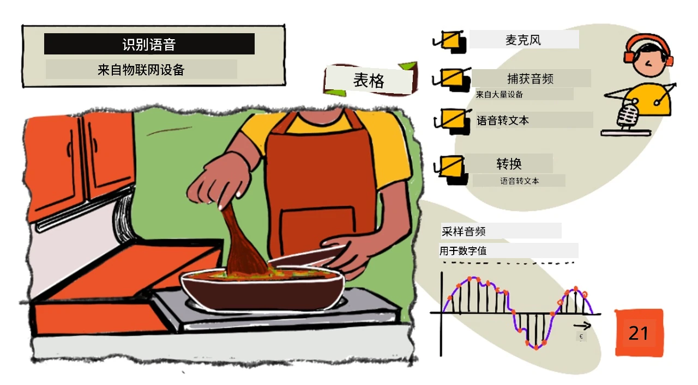
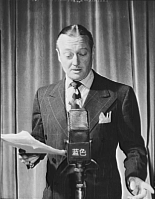
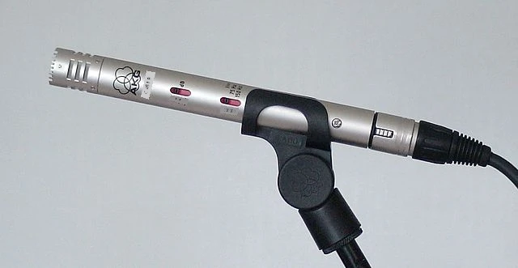
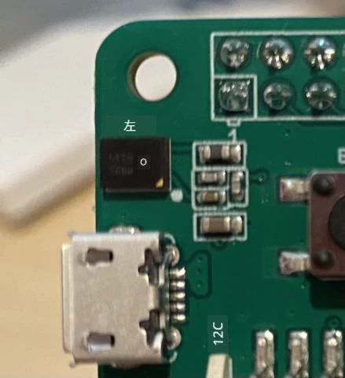
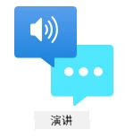

# 使用物联网设备进行语音识别



> 手绘笔记由 [Nitya Narasimhan](https://github.com/nitya) 提供。点击图片查看更大版本。

以下视频概述了 Azure 语音服务，这是本课将要讲解的主题：

[](https://www.youtube.com/watch?v=iW0Fw0l3mrA)

> 🎥 点击上方图片观看视频

## 课前测验

[课前测验](https://black-meadow-040d15503.1.azurestaticapps.net/quiz/41)

## 简介

“Alexa，设置一个12分钟的计时器。”

“Alexa，计时器状态。”

“Alexa，设置一个8分钟的计时器，命名为蒸西兰花。”

智能设备正变得越来越普及。不仅是像 HomePods、Echos 和 Google Homes 这样的智能音箱，还嵌入在我们的手机、手表，甚至灯具和恒温器中。

> 💁 我家里至少有19个带语音助手的设备，这还只是我知道的那些！

语音控制通过让行动受限的人能够与设备互动来提高可访问性。无论是天生没有手这样的永久性残疾，还是像手臂骨折这样的暂时性残疾，或者双手提满购物袋或抱着小孩，能够通过语音而不是双手控制我们的家居设备，打开了一个全新的便利世界。在处理婴儿换尿布和调皮的幼儿时，喊一声“嘿 Siri，关上我的车库门”可能是一个小但有效的生活改善。

语音助手最受欢迎的用途之一是设置计时器，尤其是厨房计时器。能够通过语音设置多个计时器在厨房中非常有帮助——无需停下揉面团、搅拌汤或清理手上的饺子馅来使用实体计时器。

在本课中，您将学习如何将语音识别功能集成到物联网设备中。您将了解麦克风作为传感器的工作原理，如何从连接到物联网设备的麦克风捕获音频，以及如何使用 AI 将听到的内容转换为文本。在整个项目中，您将构建一个智能厨房计时器，能够使用多种语言通过语音设置计时器。

在本课中，我们将学习以下内容：

* [麦克风](../../../../../6-consumer/lessons/1-speech-recognition)
* [从物联网设备捕获音频](../../../../../6-consumer/lessons/1-speech-recognition)
* [语音转文本](../../../../../6-consumer/lessons/1-speech-recognition)
* [将语音转换为文本](../../../../../6-consumer/lessons/1-speech-recognition)

## 麦克风

麦克风是一种模拟传感器，可以将声波转换为电信号。空气中的振动会导致麦克风内部的组件发生微小的移动，从而引起电信号的微小变化。这些变化随后会被放大以生成电输出。

### 麦克风类型

麦克风有多种类型：

* 动圈麦克风 - 动圈麦克风的振膜上附有磁铁，磁铁在线圈中移动时会产生电流。这与大多数扬声器的工作原理相反，扬声器使用电流使磁铁在线圈中移动，从而推动振膜产生声音。这意味着扬声器可以用作动圈麦克风，而动圈麦克风也可以用作扬声器。在像对讲机这样的设备中，用户要么在听，要么在说，但不会同时进行，一个设备可以同时充当扬声器和麦克风。

    动圈麦克风无需电源即可工作，电信号完全由麦克风生成。

    

* 带状麦克风 - 带状麦克风与动圈麦克风类似，但它们使用金属带代替振膜。金属带在磁场中移动时会产生电流。与动圈麦克风一样，带状麦克风无需电源即可工作。

    

* 电容麦克风 - 电容麦克风有一个薄金属振膜和一个固定的金属背板。电流会施加到这两个部件上，当振膜振动时，板之间的静电荷发生变化，从而生成信号。电容麦克风需要电源才能工作，这种电源被称为 *幻象电源*。

    

* MEMS 麦克风 - 微机电系统麦克风，简称 MEMS，是芯片上的麦克风。它们在硅芯片上蚀刻了一个压力敏感的振膜，工作原理类似于电容麦克风。这些麦克风可以非常小，并集成到电路中。

    

    在上图中，标有 **LEFT** 的芯片是一个 MEMS 麦克风，其振膜宽度不到一毫米。

✅ 做些研究：您周围有哪些麦克风——无论是在您的电脑、手机、耳机还是其他设备中。它们是什么类型的麦克风？

### 数字音频

音频是一种携带非常细腻信息的模拟信号。为了将这种信号转换为数字信号，需要每秒对音频进行数千次采样。

> 🎓 采样是将音频信号转换为数字值，表示该时刻的信号。


数字音频使用脉冲编码调制（PCM）进行采样。PCM 通过读取信号的电压，并根据定义的大小选择最接近该电压的离散值。

> 💁 您可以将 PCM 看作是传感器版本的脉宽调制（PWM）。PWM 是将数字信号转换为模拟信号，而 PCM 是将模拟信号转换为数字信号。（PWM 在[入门项目的第3课](../../../1-getting-started/lessons/3-sensors-and-actuators/README.md#pulse-width-modulation)中讲解过。）

例如，大多数流媒体音乐服务提供 16 位或 24 位音频。这意味着它们将电压转换为一个适合 16 位整数或 24 位整数的值。16 位音频的值范围是 -32,768 到 32,767，24 位音频的范围是 −8,388,608 到 8,388,607。位数越多，采样越接近我们耳朵实际听到的声音。

> 💁 您可能听说过 8 位音频，通常被称为 LoFi。这是使用仅 8 位采样的音频，因此范围是 -128 到 127。由于硬件限制，最早的计算机音频被限制为 8 位，因此这通常出现在复古游戏中。

这些采样每秒进行数千次，使用以 KHz（每秒数千次读取）为单位的采样率来衡量。流媒体音乐服务通常使用 48KHz 的采样率，但一些“无损”音频使用高达 96KHz 或甚至 192KHz 的采样率。采样率越高，音频越接近原始声音，但超过一定程度后，人类是否能分辨出差异仍有争议。

✅ 做些研究：如果您使用流媒体音乐服务，它的采样率和位数是多少？如果您使用 CD，CD 音频的采样率和位数是多少？

音频数据有多种格式。您可能听说过 mp3 文件——一种压缩音频数据以减小文件大小但不损失质量的格式。未压缩音频通常存储为 WAV 文件——这种文件包含 44 字节的头部信息，后面是原始音频数据。头部信息包括采样率（例如 16000 表示 16KHz）、采样大小（16 表示 16 位）以及通道数。在头部之后，WAV 文件包含原始音频数据。

> 🎓 通道指的是音频由多少个不同的音频流组成。例如，对于左右声道的立体声音频，会有 2 个通道。对于家庭影院系统的 7.1 环绕声，则会有 8 个通道。

### 音频数据大小

音频数据相对较大。例如，捕获未压缩的 16 位音频，采样率为 16KHz（足够用于语音转文本模型），每秒需要 32KB 的数据：

* 16 位意味着每个采样需要 2 字节（1 字节是 8 位）。
* 16KHz 表示每秒 16,000 次采样。
* 16,000 x 2 字节 = 32,000 字节每秒。

这听起来数据量不大，但如果您使用的是内存有限的微控制器，这可能会占用大量空间。例如，Wio Terminal 只有 192KB 的内存，这还需要存储程序代码和变量。即使您的程序代码非常小，也无法捕获超过 5 秒的音频。

微控制器可以访问额外的存储，例如 SD 卡或闪存。在构建捕获音频的物联网设备时，您需要确保不仅有额外的存储空间，还需要编写代码将麦克风捕获的音频直接写入存储，并在发送到云端时从存储流式传输到网络请求。这样可以避免试图一次性将整个音频数据块存储在内存中而导致内存不足。

## 从物联网设备捕获音频

您的物联网设备可以连接麦克风以捕获音频，准备转换为文本。它还可以连接扬声器以输出音频。在后续课程中，这将用于提供音频反馈，但现在设置扬声器以测试麦克风是很有用的。

### 任务 - 配置麦克风和扬声器

按照相关指南配置物联网设备的麦克风和扬声器：

* [Arduino - Wio Terminal](wio-terminal-microphone.md)
* [单板计算机 - Raspberry Pi](pi-microphone.md)
* [单板计算机 - 虚拟设备](virtual-device-microphone.md)

### 任务 - 捕获音频

按照相关指南在物联网设备上捕获音频：

* [Arduino - Wio Terminal](wio-terminal-audio.md)
* [单板计算机 - Raspberry Pi](pi-audio.md)
* [单板计算机 - 虚拟设备](virtual-device-audio.md)

## 语音转文本

语音转文本或语音识别涉及使用 AI 将音频信号中的单词转换为文本。

### 语音识别模型

为了将语音转换为文本，音频信号的样本会被分组并输入到基于循环神经网络（RNN）的机器学习模型中。这是一种可以利用之前数据来对当前数据做出决策的机器学习模型。例如，RNN 可以检测到一个音频样本块发出的声音是“Hel”，当它接收到另一个块发出的声音是“lo”时，可以将其与之前的声音结合起来，发现“Hello”是一个有效的单词并选择它作为结果。

机器学习模型总是接受固定大小的数据。您在之前课程中构建的图像分类器会将图像调整为固定大小并进行处理。语音模型也是如此，它们必须处理固定大小的音频块。语音模型需要能够结合多个预测的输出以获得答案，从而区分“Hi”和“Highway”，或“flock”和“floccinaucinihilipilification”。

语音模型还足够先进，可以理解上下文，并在处理更多声音时纠正检测到的单词。例如，如果您说“我去商店买了两个香蕉和一个苹果”，您会使用三个发音相同但拼写不同的单词——to、two 和 too。语音模型能够理解上下文并使用正确的单词拼写。
💁 一些语音服务允许进行自定义，以便在嘈杂的环境（如工厂）中更好地工作，或者处理特定行业的词汇（如化学名称）。这些自定义通过提供示例音频和转录内容进行训练，并使用迁移学习的方式实现，这与您在之前课程中仅使用少量图像训练图像分类器的方法相同。
### 隐私

在消费级物联网设备中使用语音转文字功能时，隐私至关重要。这些设备会持续监听音频，作为消费者，你肯定不希望自己说的每句话都被发送到云端并转换为文字。这不仅会消耗大量的网络带宽，还会带来巨大的隐私问题，尤其是当一些智能设备制造商随机选择音频片段让[人工验证生成的文本以改进模型](https://www.theverge.com/2019/4/10/18305378/amazon-alexa-ai-voice-assistant-annotation-listen-private-recordings)时。

你希望智能设备仅在你使用它时才将音频发送到云端进行处理，而不是在它听到家中的音频时发送，这些音频可能包括私人会议或亲密互动。大多数智能设备的工作方式是通过一个*唤醒词*，例如“Alexa”、“Hey Siri”或“OK Google”，这些关键短语会让设备“唤醒”，并监听你说的话，直到检测到你停止说话的间隙，表明你已经完成了对设备的指令。

> 🎓 唤醒词检测也被称为*关键词检测*或*关键词识别*。

这些唤醒词是在设备上检测的，而不是在云端。这些智能设备内置了小型的AI模型，这些模型运行在设备上，用于监听唤醒词。一旦检测到唤醒词，设备就会开始将音频流发送到云端进行识别。这些模型非常专注，仅用于监听唤醒词。

> 💁 一些科技公司正在为设备增加更多隐私保护功能，并在设备上完成部分语音转文字的处理。苹果公司宣布，在其2021年的iOS和macOS更新中，将支持在设备上进行语音转文字处理，并能够处理许多请求而无需使用云端。这得益于其设备中强大的处理器，可以运行机器学习模型。

✅ 你认为将音频存储到云端会带来哪些隐私和伦理问题？这些音频是否应该被存储？如果存储，应该如何存储？你认为将录音用于执法是否是隐私损失的一个合理权衡？

唤醒词检测通常使用一种称为TinyML的技术，即将机器学习模型转换为能够在微控制器上运行的形式。这些模型体积小，运行时功耗极低。

为了避免训练和使用唤醒词模型的复杂性，在本课中你将构建的智能计时器会使用一个按钮来开启语音识别功能。

> 💁 如果你想尝试创建一个唤醒词检测模型，并在Wio Terminal或Raspberry Pi上运行，可以查看这个[Edge Impulse的语音响应教程](https://docs.edgeimpulse.com/docs/responding-to-your-voice)。如果你想在电脑上尝试，可以参考[Microsoft文档中的自定义关键词快速入门](https://docs.microsoft.com/azure/cognitive-services/speech-service/keyword-recognition-overview?WT.mc_id=academic-17441-jabenn)。

## 将语音转换为文字



就像之前项目中的图像分类一样，有一些预构建的AI服务可以将音频文件中的语音转换为文字。其中一个服务是语音服务，它是认知服务的一部分，你可以在应用程序中使用这些预构建的AI服务。

### 任务 - 配置语音AI资源

1. 为此项目创建一个名为`smart-timer`的资源组。

1. 使用以下命令创建一个免费的语音资源：

    ```sh
    az cognitiveservices account create --name smart-timer \
                                        --resource-group smart-timer \
                                        --kind SpeechServices \
                                        --sku F0 \
                                        --yes \
                                        --location <location>
    ```

    将`<location>`替换为创建资源组时使用的位置。

1. 你需要一个API密钥来从代码中访问语音资源。运行以下命令获取密钥：

    ```sh
    az cognitiveservices account keys list --name smart-timer \
                                           --resource-group smart-timer \
                                           --output table
    ```

    复制其中一个密钥。

### 任务 - 将语音转换为文字

按照相关指南，在你的物联网设备上将语音转换为文字：

* [Arduino - Wio Terminal](wio-terminal-speech-to-text.md)
* [单板计算机 - Raspberry Pi](pi-speech-to-text.md)
* [单板计算机 - 虚拟设备](virtual-device-speech-to-text.md)

---

## 🚀 挑战

语音识别技术已经存在很长时间，并且在不断改进。研究当前的技术能力，并比较这些能力是如何随着时间演变的，包括机器转录的准确性与人工相比如何。

你认为语音识别的未来会是什么样子？

## 课后测验

[课后测验](https://black-meadow-040d15503.1.azurestaticapps.net/quiz/42)

## 复习与自学

* 阅读关于不同类型麦克风及其工作原理的文章：[Musician's HQ上的动态麦克风和电容麦克风的区别](https://musicianshq.com/whats-the-difference-between-dynamic-and-condenser-microphones/)。
* 阅读更多关于认知服务语音服务的内容：[Microsoft Docs上的语音服务文档](https://docs.microsoft.com/azure/cognitive-services/speech-service/?WT.mc_id=academic-17441-jabenn)。
* 阅读关于关键词检测的内容：[Microsoft Docs上的关键词识别文档](https://docs.microsoft.com/azure/cognitive-services/speech-service/keyword-recognition-overview?WT.mc_id=academic-17441-jabenn)。

## 作业

[](assignment.md)

**免责声明**：  
本文档使用AI翻译服务 [Co-op Translator](https://github.com/Azure/co-op-translator) 进行翻译。尽管我们努力确保翻译的准确性，但请注意，自动翻译可能包含错误或不准确之处。应以原始语言的文档作为权威来源。对于关键信息，建议使用专业人工翻译。因使用本翻译而引起的任何误解或误读，我们概不负责。