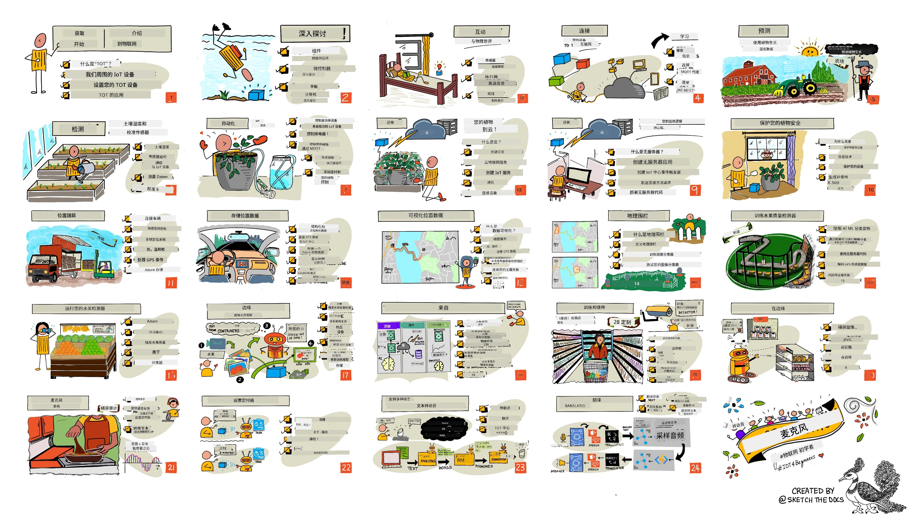

[](https://github.com/microsoft/IoT-For-Beginners/blob/master/LICENSE)
[](https://GitHub.com/microsoft/IoT-For-Beginners/graphs/contributors/)
[](https://GitHub.com/microsoft/IoT-For-Beginners/issues/)
[](https://GitHub.com/microsoft/IoT-For-Beginners/pulls/)
[](http://makeapullrequest.com)

[](https://GitHub.com/microsoft/IoT-For-Beginners/watchers/)
[](https://GitHub.com/microsoft/IoT-For-Beginners/network/)
[](https://GitHub.com/microsoft/IoT-For-Beginners/stargazers/)

### 加入 Azure AI Foundry 社区

如果您遇到困难或对构建 AI 应用有任何疑问，欢迎加入学习者和经验丰富开发者的讨论，共同探讨 MCP。这是一个支持性的社区，问题被欢迎且知识自由分享。

[](https://discord.gg/nTYy5BXMWG)

如果您在构建过程中有产品反馈或遇到错误，请访问：

[](https://aka.ms/foundry/forum)

按照以下步骤开始使用这些资源：
1. **Fork 仓库**: 点击 [](https://GitHub.com/microsoft/IoT-For-Beginners/fork)
2. **克隆仓库**: `git clone https://github.com/microsoft/IoT-For-Beginners.git`
3. [**加入 Microsoft Foundry Discord，与专家和开发者见面**](https://discord.com/invite/ByRwuEEgH4)


### 🌐 多语言支持

#### 通过 GitHub Action 支持（自动且始终保持最新）

<!-- CO-OP TRANSLATOR LANGUAGES TABLE START -->
[阿拉伯语](../ar/README.md) | [孟加拉语](../bn/README.md) | [保加利亚语](../bg/README.md) | [缅甸语 (Myanmar)](../my/README.md) | [中文（简体）](./README.md) | [中文（繁体，香港）](../zh-HK/README.md) | [中文（繁体，澳门）](../zh-MO/README.md) | [中文（繁体，台湾）](../zh-TW/README.md) | [克罗地亚语](../hr/README.md) | [捷克语](../cs/README.md) | [丹麦语](../da/README.md) | [荷兰语](../nl/README.md) | [爱沙尼亚语](../et/README.md) | [芬兰语](../fi/README.md) | [法语](../fr/README.md) | [德语](../de/README.md) | [希腊语](../el/README.md) | [希伯来语](../he/README.md) | [印地语](../hi/README.md) | [匈牙利语](../hu/README.md) | [印度尼西亚语](../id/README.md) | [意大利语](../it/README.md) | [日语](../ja/README.md) | [卡纳达语](../kn/README.md) | [韩语](../ko/README.md) | [立陶宛语](../lt/README.md) | [马来语](../ms/README.md) | [马拉雅拉姆语](../ml/README.md) | [马拉地语](../mr/README.md) | [尼泊尔语](../ne/README.md) | [尼日利亚皮钦语](../pcm/README.md) | [挪威语](../no/README.md) | [波斯语 (法尔西语)](../fa/README.md) | [波兰语](../pl/README.md) | [葡萄牙语 (巴西)](../pt-BR/README.md) | [葡萄牙语 (葡萄牙)](../pt-PT/README.md) | [旁遮普语 (Gurmukhi)](../pa/README.md) | [罗马尼亚语](../ro/README.md) | [俄语](../ru/README.md) | [塞尔维亚语 (西里尔字母)](../sr/README.md) | [斯洛伐克语](../sk/README.md) | [斯洛文尼亚语](../sl/README.md) | [西班牙语](../es/README.md) | [斯瓦希里语](../sw/README.md) | [瑞典语](../sv/README.md) | [他加禄语 (菲律宾语)](../tl/README.md) | [泰米尔语](../ta/README.md) | [泰卢固语](../te/README.md) | [泰语](../th/README.md) | [土耳其语](../tr/README.md) | [乌克兰语](../uk/README.md) | [乌尔都语](../ur/README.md) | [越南语](../vi/README.md)

> **想本地克隆？**

> 此仓库包含 50 多种语言翻译，显著增加下载大小。若想不带翻译克隆，可使用稀疏检出：
> ```bash
> git clone --filter=blob:none --sparse https://github.com/microsoft/IoT-For-Beginners.git
> cd IoT-For-Beginners
> git sparse-checkout set --no-cone '/*' '!translations' '!translated_images'
> ```
> 这让你可以更快下载，并获取完成课程所需的一切。
<!-- CO-OP TRANSLATOR LANGUAGES TABLE END -->

# IoT 初学者课程

微软 Azure 云推广团队荣幸推出为期 12 周、共 24 课的物联网基础课程。每节课包括课前和课后测验、书面指导、解决方案、作业等。我们的项目驱动教学法让你在构建中学习，这是一种被验证的新技能“牢固掌握”的方式。

这些项目涵盖了从农场到餐桌的食品全流程。包括农业、物流、制造、零售和消费者领域——这些都是物联网设备的热门行业领域。



> 插画由 [Nitya Narasimhan](https://github.com/nitya) 绘制。点击图片查看更大版本。

**热烈感谢作者 [Jen Fox](https://github.com/jenfoxbot)、[Jen Looper](https://github.com/jlooper)、[Jim Bennett](https://github.com/jimbobbennett) 和插画师 [Nitya Narasimhan](https://github.com/nitya)。**

**也感谢我们的 [Microsoft Learn 学生大使团队](https://studentambassadors.microsoft.com?WT.mc_id=academic-17441-jabenn) 审核和翻译此课程——[Aditya Garg](https://github.com/AdityaGarg00)、[Anurag Sharma](https://github.com/Anurag-0-1-A)、[Arpita Das](https://github.com/Arpiiitaaa)、[Aryan Jain](https://www.linkedin.com/in/aryan-jain-47a4a1145/)、[Bhavesh Suneja](https://github.com/EliteWarrior315)、[Faith Hunja](https://faithhunja.github.io/)、[Lateefah Bello](https://www.linkedin.com/in/lateefah-bello/)、[Manvi Jha](https://github.com/Severus-Matthew)、[Mireille Tan](https://www.linkedin.com/in/mireille-tan-a4834819a/)、[Mohammad Iftekher (Iftu) Ebne Jalal](https://github.com/Iftu119)、[Mohammad Zulfikar](https://github.com/mohzulfikar)、[Priyanshu Srivastav](https://www.linkedin.com/in/priyanshu-srivastav-b067241ba)、[Thanmai Gowducheruvu](https://github.com/innovation-platform) 和 [Zina Kamel](https://www.linkedin.com/in/zina-kamel/)。**

团队介绍！

[](https://youtu.be/-wippUJRi5k)

**Gif 动图由** [Mohit Jaisal](https://linkedin.com/in/mohitjaisal)

> 🎥 点击上方图片观看项目介绍视频！

> **教师们**，我们[提供了一些建议](for-teachers.md)以协助使用此课程。如果您想制作自己的课程，也提供了[课程模板](lesson-template/README.md)。

> **[学生们](https://aka.ms/student-page)**，若要自主使用此课程，请 fork 整个仓库并独立完成练习，依序从课前测验开始，阅读讲义并完成其他活动。尝试理解课程内容再制作项目，而非直接复制解决方案代码；但解决方案代码可在每个项目导向课程的 /solutions 文件夹中找到。你也可以组建学习小组，与朋友一起学习。进一步学习推荐使用 [Microsoft Learn](https://docs.microsoft.com/users/jimbobbennett/collections/ke2ehd351jopwr?WT.mc_id=academic-17441-jabenn)。

课程视频概览：

[](https://youtube.com/watch?v=bccEMm8gRuc "宣传视频")

> 🎥 点击上方图片观看项目介绍视频！

## 教学理念

我们为此课程选择了两个教学理念：确保课程以项目为中心，且包含频繁测验。在本系列结束时，学生将构建一个植物监控及浇水系统、车辆跟踪器、智能工厂食品追踪检测系统和语音控制烹饪计时器，并学习物联网基础知识，包括如何编写设备代码、连接云端、分析遥测数据和边缘 AI 运行。

通过确保内容与项目对齐，使学习过程更有趣味性，并提高概念记忆率。

此外，课前的低压测验帮助学生设定学习目标，课后的测验进一步加深记忆。课程设计灵活有趣，可完整学习或拆分学习。项目从小型开始，逐步复杂，贯穿 12 周周期。

每个项目基于学生和爱好者可获取的真实硬件。项目针对具体领域提供相关背景知识。作为成功的开发者，理解所解决问题的领域十分重要，提供这些背景知识帮助学生将物联网解决方案和学习内容置于可能面临的现实问题情境中。学生不仅理解解决方案的“为什么”，还能理解最终用户需求。

## 硬件

根据个人偏好、编程语言知识、学习目标和可用性，我们提供两种物联网硬件选择。此外，还提供“虚拟硬件”版本，适合没有硬件或想先学习部分内容的人。详情及购买完整套件，请查看[硬件页面](./hardware.md)，其中包含我们合作伙伴 Seeed Studio 的购买链接。
> 💁 了解我们的[行为准则](CODE_OF_CONDUCT.md)、[贡献指南](CONTRIBUTING.md)和[翻译指南](TRANSLATIONS.md)。我们欢迎您提出建设性的反馈！
>
> 🔧 遇到问题？请查看我们的[故障排除指南](TROUBLESHOOTING.md)，获取常见问题的解决方案。

## 每节课包含：

- 手绘笔记
- 可选的补充视频
- 课前热身测验
- 书面课程内容
- 针对项目课程，包含构建项目的逐步指导
- 知识检测
- 挑战题
- 补充阅读材料
- 作业
- [课后测验](https://ff-quizzes.netlify.app/en/)

> **关于测验的说明**：所有测验均包含在 quiz-app 文件夹中，总计48个测验，每个测验包含三道题。测验链接位于课程内，但测验应用可以在本地运行或部署到Azure；请按照 `quiz-app` 文件夹中的说明进行。测验正在逐步本地化。

## 课程列表

|       |              项目名称                |                       教授概念                       | 学习目标                                                                                                                                                 |                                                        关联课程                                                         |
| :---: | :---------------------------------: | :-------------------------------------------------: | -------------------------------------------------------------------------------------------------------------------------------------------------------- | :--------------------------------------------------------------------------------------------------------------------------: |
|  01   | [入门](./1-getting-started/README.md) |                     物联网简介                      | 在设置第一个物联网设备时，学习物联网的基本原理以及物联网解决方案的基本构建块，如传感器和云服务                                                                 |                      [物联网简介](./1-getting-started/lessons/1-introduction-to-iot/README.md)                      |
|  02   | [入门](./1-getting-started/README.md) |                   物联网深入了解                    | 了解物联网系统的组件，以及微控制器和单板计算机                                                                                                            |                        [物联网深入了解](./1-getting-started/lessons/2-deeper-dive/README.md)                         |
|  03   | [入门](./1-getting-started/README.md) | 使用传感器和执行器与物理世界交互                    | 了解用于采集物理世界数据的传感器和用于发送反馈的执行器，同时构建一盏夜灯                                                                                   | [使用传感器和执行器与物理世界交互](./1-getting-started/lessons/3-sensors-and-actuators/README.md) |
|  04   | [入门](./1-getting-started/README.md) |             将设备连接到互联网                       | 了解如何连接物联网设备到互联网，通过将夜灯连接到MQTT代理发送和接收消息                                                                                      |               [将设备连接到互联网](./1-getting-started/lessons/4-connect-internet/README.md)                |
|  05   |            [农场](./2-farm/README.md)             |                    预测植物生长                     | 学习如何利用物联网设备捕获的温度数据预测植物生长                                                                                                           |                          [预测植物生长](./2-farm/lessons/1-predict-plant-growth/README.md)                         |
|  06   |            [农场](./2-farm/README.md)             |                    检测土壤湿度                     | 学习如何检测土壤湿度并校准土壤湿度传感器                                                                                                                 |                          [检测土壤湿度](./2-farm/lessons/2-detect-soil-moisture/README.md)                         |
|  07   |            [农场](./2-farm/README.md)             |                  自动化植物浇水                     | 学习如何使用继电器和MQTT实现自动定时浇水                                                                                                                 |                      [自动化植物浇水](./2-farm/lessons/3-automated-plant-watering/README.md)                       |
|  08   |            [农场](./2-farm/README.md)             |               将植物数据迁移到云端                   | 了解云和基于云的物联网服务，以及如何将植物连接到云端服务，而不是公共MQTT代理                                                                               |               [将植物数据迁移到云端](./2-farm/lessons/4-migrate-your-plant-to-the-cloud/README.md)                |
|  09   |            [农场](./2-farm/README.md)             |          将应用逻辑迁移到云端                       | 了解如何在云端编写响应物联网消息的应用逻辑                                                                                                               |         [将应用逻辑迁移到云端](./2-farm/lessons/5-migrate-application-to-the-cloud/README.md)         |
|  10   |            [农场](./2-farm/README.md)             |                   保护植物安全                       | 了解物联网安全性，如何使用密钥和证书保护植物安全                                                                                                        |                        [保护植物安全](./2-farm/lessons/6-keep-your-plant-secure/README.md)                         |
|  11   |       [运输](./3-transport/README.md)       |                      位置追踪                        | 了解物联网设备的GPS位置追踪                                                                                                                                |                           [位置追踪](./3-transport/lessons/1-location-tracking/README.md)                           |
|  12   |       [运输](./3-transport/README.md)       |                     存储位置数据                      | 学习如何存储物联网数据以供后续可视化或分析                                                                                                                |                         [存储位置数据](./3-transport/lessons/2-store-location-data/README.md)                         |
|  13   |       [运输](./3-transport/README.md)       |                   可视化位置信息                      | 学习在地图上可视化位置信息，以及地图如何将真实三维世界表示为二维                                                                                            |                     [可视化位置信息](./3-transport/lessons/3-visualize-location-data/README.md)                     |
|  14   |       [运输](./3-transport/README.md)       |                          地理围栏                      | 了解地理围栏，及其如何用于在供应链车辆接近目的地时发出提醒                                                                                                |                                   [地理围栏](./3-transport/lessons/4-geofences/README.md)                                   |
|  15   |   [制造](./4-manufacturing/README.md)    |               训练水果质量检测器                     | 了解如何在云端训练图像分类器检测水果质量                                                                                                                 |                 [训练水果质量检测器](./4-manufacturing/lessons/1-train-fruit-detector/README.md)                 |
|  16   |   [制造](./4-manufacturing/README.md)    |           从物联网设备检查水果质量                   | 了解如何使用物联网设备中的水果质量检测器                                                                                                                 |           [从物联网设备检查水果质量](./4-manufacturing/lessons/2-check-fruit-from-device/README.md)            |
|  17   |   [制造](./4-manufacturing/README.md)    |             在边缘设备上运行水果检测器               | 了解如何在边缘物联网设备上运行水果检测器                                                                                                                 |             [在边缘设备上运行水果检测器](./4-manufacturing/lessons/3-run-fruit-detector-edge/README.md)             |
|  18   |   [制造](./4-manufacturing/README.md)    |        由传感器触发水果质量检测                      | 了解如何由传感器触发水果质量检测                                                                                                                          |        [由传感器触发水果质量检测](./4-manufacturing/lessons/4-trigger-fruit-detector/README.md)         |
|  19   |          [零售](./5-retail/README.md)           |                   训练库存检测器                      | 学习如何使用目标检测训练库存检测器，以统计商店中的库存                                                                                                   |                        [训练库存检测器](./5-retail/lessons/1-train-stock-detector/README.md)                         |
|  20   |          [零售](./5-retail/README.md)           |               从物联网设备检查库存                    | 学习如何使用目标检测模型从物联网设备检查库存                                                                                                             |                     [从物联网设备检查库存](./5-retail/lessons/2-check-stock-device/README.md)                      |
|  21   |        [消费](./6-consumer/README.md)         |             使用物联网设备识别语音                    | 学习如何识别物联网设备的语音，构建智能定时器                                                                                                              |                  [使用物联网设备识别语音](./6-consumer/lessons/1-speech-recognition/README.md)                  |
|  22   |        [消费](./6-consumer/README.md)         |                     理解语言                         | 学习如何理解对物联网设备说的句子                                                                                                                          |                        [理解语言](./6-consumer/lessons/2-language-understanding/README.md)                        |
|  23   |        [消费](./6-consumer/README.md)         |           设定定时器并提供语音反馈                   | 学习如何在物联网设备上设定定时器，并在定时开始和结束时提供语音反馈                                                                                        |                 [设定定时器并提供语音反馈](./6-consumer/lessons/3-spoken-feedback/README.md)                  |
|  24   |        [消费](./6-consumer/README.md)         |                 支持多语言                           | 学习如何支持多语言，包括被设备说出的语言和智能定时器的响应                                                                                                |                   [支持多语言](./6-consumer/lessons/4-multiple-language-support/README.md)                   |

## 离线访问

您可以通过使用[Docsify](https://docsify.js.org/#/)在本地离线运行此文档。请先 Fork 本仓库，[在本地安装 Docsify](https://docsify.js.org/#/quickstart)，然后在本仓库根文件夹中运行 `docsify serve`。网站将在本地主机的3000端口启动：`localhost:3000`。

## 测验

感谢社区提供的交互式测验，测试您对每章节内容的掌握。您可以[在此测试您的知识](https://ff-quizzes.netlify.app/en/)

### PDF

如有需要，您可以生成此内容的PDF以便离线访问。为此，请确保您已[安装 npm](https://docs.npmjs.com/downloading-and-installing-node-js-and-npm)，并在此仓库根目录下运行以下命令：

```sh
npm i
npm run convert
```

### 幻灯片

部分课程在 [slides](../../slides) 文件夹中提供了幻灯片。

## 其他课程

我们的团队还制作了其他课程！请查阅：

<!-- CO-OP TRANSLATOR OTHER COURSES START -->
### LangChain
[](https://aka.ms/langchain4j-for-beginners)
[](https://aka.ms/langchainjs-for-beginners?WT.mc_id=m365-94501-dwahlin)

---

### Azure / Edge / MCP / Agents
[](https://github.com/microsoft/AZD-for-beginners?WT.mc_id=academic-105485-koreyst)
[](https://github.com/microsoft/edgeai-for-beginners?WT.mc_id=academic-105485-koreyst)
[](https://github.com/microsoft/mcp-for-beginners?WT.mc_id=academic-105485-koreyst)
[](https://github.com/microsoft/ai-agents-for-beginners?WT.mc_id=academic-105485-koreyst)

---
 
### 生成式 AI 系列
[](https://github.com/microsoft/generative-ai-for-beginners?WT.mc_id=academic-105485-koreyst)
[-9333EA?style=for-the-badge&labelColor=E5E7EB&color=9333EA)](https://github.com/microsoft/Generative-AI-for-beginners-dotnet?WT.mc_id=academic-105485-koreyst)
[-C084FC?style=for-the-badge&labelColor=E5E7EB&color=C084FC)](https://github.com/microsoft/generative-ai-for-beginners-java?WT.mc_id=academic-105485-koreyst)
[-E879F9?style=for-the-badge&labelColor=E5E7EB&color=E879F9)](https://github.com/microsoft/generative-ai-with-javascript?WT.mc_id=academic-105485-koreyst)

---
 
### 核心学习
[](https://aka.ms/ml-beginners?WT.mc_id=academic-105485-koreyst)
[](https://aka.ms/datascience-beginners?WT.mc_id=academic-105485-koreyst)
[](https://aka.ms/ai-beginners?WT.mc_id=academic-105485-koreyst)
[](https://github.com/microsoft/Security-101?WT.mc_id=academic-96948-sayoung)
[](https://aka.ms/webdev-beginners?WT.mc_id=academic-105485-koreyst)
[](https://aka.ms/iot-beginners?WT.mc_id=academic-105485-koreyst)
[](https://github.com/microsoft/xr-development-for-beginners?WT.mc_id=academic-105485-koreyst)

---
 
### Copilot 系列
[](https://aka.ms/GitHubCopilotAI?WT.mc_id=academic-105485-koreyst)
[](https://github.com/microsoft/mastering-github-copilot-for-dotnet-csharp-developers?WT.mc_id=academic-105485-koreyst)
[](https://github.com/microsoft/CopilotAdventures?WT.mc_id=academic-105485-koreyst)
<!-- CO-OP TRANSLATOR OTHER COURSES END -->

## 图片署名

您可以在[署名](./attributions.md)中找到本课程中所用图片的所有必要署名信息。

---

<!-- CO-OP TRANSLATOR DISCLAIMER START -->
**免责声明**：
本文件使用人工智能翻译服务 [Co-op Translator](https://github.com/Azure/co-op-translator) 进行翻译。尽管我们努力确保准确性，但请注意，自动翻译可能存在错误或不准确之处。以原文文件为权威版本。如涉及重要信息，建议使用专业人工翻译。对于因使用本翻译而产生的任何误解或误释，我们概不负责。
<!-- CO-OP TRANSLATOR DISCLAIMER END -->