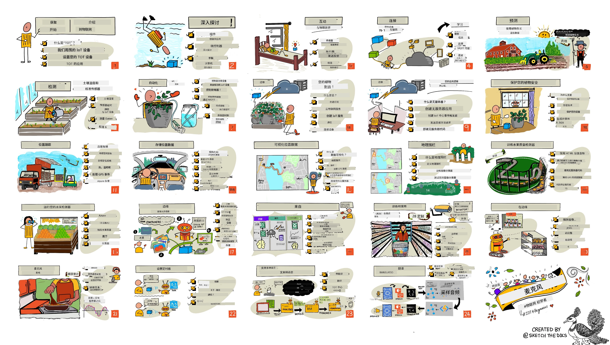

[](https://github.com/microsoft/IoT-For-Beginners/blob/master/LICENSE)
[](https://GitHub.com/microsoft/IoT-For-Beginners/graphs/contributors/)
[](https://GitHub.com/microsoft/IoT-For-Beginners/issues/)
[](https://GitHub.com/microsoft/IoT-For-Beginners/pulls/)
[](http://makeapullrequest.com)

[](https://GitHub.com/microsoft/IoT-For-Beginners/watchers/)
[](https://GitHub.com/microsoft/IoT-For-Beginners/network/)
[](https://GitHub.com/microsoft/IoT-For-Beginners/stargazers/)

### 加入 Azure AI Foundry 社区

如果您在构建 AI 应用时遇到困难或有任何问题，欢迎加入学习者和有经验开发者的讨论社区，共同探讨 MCP。这里是一个支持性的社区，欢迎提出问题并自由分享知识。

[](https://discord.gg/nTYy5BXMWG)

如果您在构建过程中有产品反馈或遇到错误，请访问：

[](https://aka.ms/foundry/forum)

请按照以下步骤开始使用这些资源：
1. **Fork 仓库**: 点击 [](https://GitHub.com/microsoft/IoT-For-Beginners/fork)
2. **Clone 仓库**: `git clone https://github.com/microsoft/IoT-For-Beginners.git`
3. [**加入 Microsoft Foundry Discord，结识专家和同行开发者**](https://discord.com/invite/ByRwuEEgH4)


### 🌐 多语言支持

#### 通过 GitHub Action 支持（自动且始终保持最新）

<!-- CO-OP TRANSLATOR LANGUAGES TABLE START -->
[Arabic](../ar/README.md) | [Bengali](../bn/README.md) | [Bulgarian](../bg/README.md) | [Burmese (Myanmar)](../my/README.md) | [Chinese (Simplified)](./README.md) | [Chinese (Traditional, Hong Kong)](../zh-HK/README.md) | [Chinese (Traditional, Macau)](../zh-MO/README.md) | [Chinese (Traditional, Taiwan)](../zh-TW/README.md) | [Croatian](../hr/README.md) | [Czech](../cs/README.md) | [Danish](../da/README.md) | [Dutch](../nl/README.md) | [Estonian](../et/README.md) | [Finnish](../fi/README.md) | [French](../fr/README.md) | [German](../de/README.md) | [Greek](../el/README.md) | [Hebrew](../he/README.md) | [Hindi](../hi/README.md) | [Hungarian](../hu/README.md) | [Indonesian](../id/README.md) | [Italian](../it/README.md) | [Japanese](../ja/README.md) | [Kannada](../kn/README.md) | [Khmer](../km/README.md) | [Korean](../ko/README.md) | [Lithuanian](../lt/README.md) | [Malay](../ms/README.md) | [Malayalam](../ml/README.md) | [Marathi](../mr/README.md) | [Nepali](../ne/README.md) | [Nigerian Pidgin](../pcm/README.md) | [Norwegian](../no/README.md) | [Persian (Farsi)](../fa/README.md) | [Polish](../pl/README.md) | [Portuguese (Brazil)](../pt-BR/README.md) | [Portuguese (Portugal)](../pt-PT/README.md) | [Punjabi (Gurmukhi)](../pa/README.md) | [Romanian](../ro/README.md) | [Russian](../ru/README.md) | [Serbian (Cyrillic)](../sr/README.md) | [Slovak](../sk/README.md) | [Slovenian](../sl/README.md) | [Spanish](../es/README.md) | [Swahili](../sw/README.md) | [Swedish](../sv/README.md) | [Tagalog (Filipino)](../tl/README.md) | [Tamil](../ta/README.md) | [Telugu](../te/README.md) | [Thai](../th/README.md) | [Turkish](../tr/README.md) | [Ukrainian](../uk/README.md) | [Urdu](../ur/README.md) | [Vietnamese](../vi/README.md)

> **更喜欢本地克隆？**
>
> 该仓库包含 50 多种语言的翻译，显著增加下载大小。若想不下载翻译内容，可使用稀疏检出：
>
> **Bash / macOS / Linux:**
> ```bash
> git clone --filter=blob:none --sparse https://github.com/microsoft/IoT-For-Beginners.git
> cd IoT-For-Beginners
> git sparse-checkout set --no-cone '/*' '!translations' '!translated_images'
> ```
>
> **CMD（Windows）:**
> ```cmd
> git clone --filter=blob:none --sparse https://github.com/microsoft/IoT-For-Beginners.git
> cd IoT-For-Beginners
> git sparse-checkout set --no-cone "/*" "!translations" "!translated_images"
> ```
>
> 这样可以更快下载您完成课程所需的全部内容。
<!-- CO-OP TRANSLATOR LANGUAGES TABLE END -->

# 物联网初学者课程

微软 Azure 云倡导者很高兴提供一个为期 12 周，共 24 课时的物联网基础课程。每节课包含课前和课后测验、完成课程的书面指导、解决方案、作业等。我们的项目式教学法让您在构建中学习，这是一种被证实有助于新技能“扎实掌握”的学习方式。

这些项目涵盖了食物从农场到餐桌的全过程，包括农业、物流、制造、零售及消费者——这些都是物联网设备的热门行业领域。



> 手绘图作者为 [Nitya Narasimhan](https://github.com/nitya)。点击图片查看大图。

**衷心感谢我们的作者 [Jen Fox](https://github.com/jenfoxbot)、[Jen Looper](https://github.com/jlooper)、[Jim Bennett](https://github.com/jimbobbennett) 以及我们的手绘图艺术家 [Nitya Narasimhan](https://github.com/nitya)。**

**同时感谢参与审核和翻译本课程的 [Microsoft Learn 学生大使团队](https://studentambassadors.microsoft.com?WT.mc_id=academic-17441-jabenn) —— [Aditya Garg](https://github.com/AdityaGarg00)、[Anurag Sharma](https://github.com/Anurag-0-1-A)、[Arpita Das](https://github.com/Arpiiitaaa)、[Aryan Jain](https://www.linkedin.com/in/aryan-jain-47a4a1145/)、[Bhavesh Suneja](https://github.com/EliteWarrior315)、[Faith Hunja](https://faithhunja.github.io/)、[Lateefah Bello](https://www.linkedin.com/in/lateefah-bello/)、[Manvi Jha](https://github.com/Severus-Matthew)、[Mireille Tan](https://www.linkedin.com/in/mireille-tan-a4834819a/)、[Mohammad Iftekher (Iftu) Ebne Jalal](https://github.com/Iftu119)、[Mohammad Zulfikar](https://github.com/mohzulfikar)、[Priyanshu Srivastav](https://www.linkedin.com/in/priyanshu-srivastav-b067241ba)、[Thanmai Gowducheruvu](https://github.com/innovation-platform)、以及 [Zina Kamel](https://www.linkedin.com/in/zina-kamel/)。**

认识团队！

[](https://youtu.be/-wippUJRi5k)

<strong>动图由</strong> [Mohit Jaisal](https://linkedin.com/in/mohitjaisal) <strong>制作</strong>

> 🎥 点击图片观看项目视频！

> <strong>教师们</strong>，我们[提供了一些建议](for-teachers.md)关于如何使用本课程。如果您想创建自己的课程，也可参考我们提供的[课程模板](lesson-template/README.md)。

> **[学生](https://aka.ms/student-page)**，若想独立使用本课程，请 fork 整个仓库并完成练习，先做课前测验，再阅读课程，完成剩余活动。建议在理解课程内容基础上完成项目，而非直接复制解决方案代码。解决方案代码位于各项目导向课程的 /solutions 文件夹内。或组建学习小组，共同学习内容。想深入学习的话，推荐使用 [Microsoft Learn](https://docs.microsoft.com/users/jimbobbennett/collections/ke2ehd351jopwr?WT.mc_id=academic-17441-jabenn)。

课程视频总览，请观看：

[](https://youtube.com/watch?v=bccEMm8gRuc "宣传视频")

> 🎥 点击图片观看项目视频！

## 教学法

我们设计该课程时秉持两个教学原则：确保课程基于项目，且包含频繁的测验。通过本系列课程，学生将学习制作植物监测和浇水系统、车辆追踪器、智能工厂食品追踪与检测系统以及语音控制烹饪计时器，并掌握物联网基础知识，包括设备编程、连接云端、分析遥测数据及边缘运行 AI。

项目驱动的内容能让学习过程更有吸引力，增强概念的记忆力。

此外，课前的低压力测验帮助学生设定学习目标，课后的测验则促进复习巩固。课程设计灵活有趣，可完整学习或部分学习。项目规模由浅入深，12 周课程结束时达到较高复杂度。

每个项目基于学生和爱好者可获得的真实硬件设备，具体聚焦项目领域，提供相关背景知识。成为成功开发者需理解所解决问题领域，提供这种背景知识使学生能围绕现实物联网问题思考解决方案，理解所构建解决方案的“原因”，并体会最终用户需求。

## 硬件
我们有两种物联网硬件可供项目选择，具体取决于个人偏好、编程语言知识或偏好、学习目标和硬件的可用性。我们还为没有硬件设备，或者想在购买前多了解的人提供了“虚拟硬件”版本。您可以在[硬件页面](./hardware.md)了解更多内容，并找到“购物清单”，包括我们合作伙伴Seeed Studio提供的完整套件购买链接。

> 💁 查阅我们的[行为守则](CODE_OF_CONDUCT.md)、[贡献指南](CONTRIBUTING.md)和[翻译指南](TRANSLATIONS.md)。欢迎您的建设性反馈！
>
> 🔧 遇到问题？请查看我们的[疑难解答指南](TROUBLESHOOTING.md)以获取常见问题解决方法。

## 每节课程包含：

- 草图笔记
- 可选补充视频
- 课前热身测验
- 书面课程内容
- 针对项目型课程，提供分步骤的项目构建指南
- 知识检测
- 挑战
- 补充阅读材料
- 作业
- [课后测验](https://ff-quizzes.netlify.app/en/)

> <strong>关于测验的说明</strong>：所有测验包含在quiz-app文件夹中，共48个，每个测验包含三道题。它们从课程中链接，但测验应用可以本地运行或部署到Azure；请遵循`quiz-app`文件夹中的说明。测验正在逐步实现本地化。

## 课程列表

|       |                  项目名称                  |                          授课概念                          | 学习目标                                                                                                                                                           |                                                       关联课程                                                        |
| :---: | :----------------------------------------: | :--------------------------------------------------------: | ----------------------------------------------------------------------------------------------------------------------------------------------------------------- | :---------------------------------------------------------------------------------------------------------------------: |
|  01   | [入门](./1-getting-started/README.md)     |                       物联网介绍                          | 学习物联网的基本原理及物联网解决方案的基础组件，如传感器与云服务，同时设置您的第一个物联网设备                                                                   |                      [物联网介绍](./1-getting-started/lessons/1-introduction-to-iot/README.md)                             |
|  02   | [入门](./1-getting-started/README.md)     |                     深入了解物联网                         | 学习物联网系统组件，微控制器和单板计算机的相关知识                                                                                                               |                        [深入了解物联网](./1-getting-started/lessons/2-deeper-dive/README.md)                               |
|  03   | [入门](./1-getting-started/README.md)     |       用传感器和执行器与物理世界互动                       | 学习使用传感器采集物理世界的数据，使用执行器反馈信息，同时构建夜灯                                                                                            | [用传感器和执行器与物理世界互动](./1-getting-started/lessons/3-sensors-and-actuators/README.md)                         |
|  04   | [入门](./1-getting-started/README.md)     |                    将设备连接到互联网                       | 学习如何连接物联网设备至互联网发送和接收消息，将您的夜灯连接至MQTT代理                                                                                          |                      [将设备连接到互联网](./1-getting-started/lessons/4-connect-internet/README.md)                       |
|  05   |            [农场](./2-farm/README.md)      |                     预测植物生长                           | 学习如何使用物联网设备采集的温度数据来预测植物生长                                                                                                             |                          [预测植物生长](./2-farm/lessons/1-predict-plant-growth/README.md)                                |
|  06   |            [农场](./2-farm/README.md)      |                     检测土壤湿度                           | 学习如何检测土壤湿度并校准土壤湿度传感器                                                                                                                       |                          [检测土壤湿度](./2-farm/lessons/2-detect-soil-moisture/README.md)                                |
|  07   |            [农场](./2-farm/README.md)      |                   自动化植物浇水                           | 学习如何使用继电器和MQTT实现自动化定时浇水                                                                                                                     |                      [自动化植物浇水](./2-farm/lessons/3-automated-plant-watering/README.md)                               |
|  08   |            [农场](./2-farm/README.md)      |                   将植株迁移到云端                         | 学习云和云托管物联网服务，了解如何将您的植株连接到云服务代替公共MQTT代理                                                                                      |               [植株迁移到云端](./2-farm/lessons/4-migrate-your-plant-to-the-cloud/README.md)                              |
|  09   |            [农场](./2-farm/README.md)      |              将应用逻辑迁移到云端                          | 学习如何在云端编写响应物联网消息的应用逻辑                                                                                                                     |            [将应用逻辑迁移到云端](./2-farm/lessons/5-migrate-application-to-the-cloud/README.md)                          |
|  10   |            [农场](./2-farm/README.md)      |                     保护您的植物安全                       | 学习物联网安全，了解如何通过密钥和证书保护您的植物安全                                                                                                         |                        [保护您的植物安全](./2-farm/lessons/6-keep-your-plant-secure/README.md)                             |
|  11   |          [运输](./3-transport/README.md)   |                     位置追踪                               | 学习物联网设备GPS位置追踪                                                                                                                                        |                           [位置追踪](./3-transport/lessons/1-location-tracking/README.md)                                  |
|  12   |          [运输](./3-transport/README.md)   |                     存储位置信息                           | 学习如何存储物联网数据，以便以后可视化或分析                                                                                                                   |                         [存储位置信息](./3-transport/lessons/2-store-location-data/README.md)                             |
|  13   |          [运输](./3-transport/README.md)   |                    可视化位置信息                          | 学习如何在地图上可视化位置信息，以及地图如何以二维方式表示真实的三维世界                                                                                        |                     [可视化位置信息](./3-transport/lessons/3-visualize-location-data/README.md)                            |
|  14   |          [运输](./3-transport/README.md)   |                        地理围栏                            | 学习地理围栏及其如何用于在供应链车辆接近目的地时发出警报                                                                                                        |                                   [地理围栏](./3-transport/lessons/4-geofences/README.md)                                |
|  15   |    [制造](./4-manufacturing/README.md)     |               训练水果质量检测器                           | 学习如何在云端训练图像分类器以检测水果质量                                                                                                                     |                 [训练水果质量检测器](./4-manufacturing/lessons/1-train-fruit-detector/README.md)                          |
|  16   |    [制造](./4-manufacturing/README.md)     |               从物联网设备检测水果质量                     | 学习如何使用您的水果质量检测器从物联网设备检查水果                                                                                                             |           [从物联网设备检测水果质量](./4-manufacturing/lessons/2-check-fruit-from-device/README.md)                       |
|  17   |    [制造](./4-manufacturing/README.md)     |                 在边缘设备运行水果检测器                   | 学习如何在物联网边缘设备上运行您的水果检测器                                                                                                                   |              [在边缘设备运行水果检测器](./4-manufacturing/lessons/3-run-fruit-detector-edge/README.md)                   |
|  18   |    [制造](./4-manufacturing/README.md)     |                 通过传感器触发水果质量检测                 | 学习如何通过传感器触发水果质量检测                                                                                                                             |             [通过传感器触发水果质量检测](./4-manufacturing/lessons/4-trigger-fruit-detector/README.md)                    |
|  19   |           [零售](./5-retail/README.md)      |                  训练库存检测器                            | 学习如何使用物体检测训练库存检测器以统计店铺库存                                                                                                               |                        [训练库存检测器](./5-retail/lessons/1-train-stock-detector/README.md)                               |
|  20   |           [零售](./5-retail/README.md)      |              从物联网设备检查库存                          | 学习如何使用物联网设备结合物体检测模型检查库存                                                                                                                 |                        [从物联网设备检查库存](./5-retail/lessons/2-check-stock-device/README.md)                           |
|  21   |         [消费者](./6-consumer/README.md)    |               用物联网设备识别语音                         | 学习如何从物联网设备识别语音，构建智能计时器                                                                                                                   |                 [用物联网设备识别语音](./6-consumer/lessons/1-speech-recognition/README.md)                                |
|  22   |         [消费者](./6-consumer/README.md)    |                   理解语言                                 | 学习如何理解对物联网设备说出的句子                                                                                                                             |                        [理解语言](./6-consumer/lessons/2-language-understanding/README.md)                                 |
|  23   |         [消费者](./6-consumer/README.md)    |           设定计时器并提供语音反馈                         | 学习如何在物联网设备上设定计时器，并在计时开始和结束时提供语音反馈                                                                                            |                [设定计时器并提供语音反馈](./6-consumer/lessons/3-spoken-feedback/README.md)                                |
|  24   |         [消费者](./6-consumer/README.md)    |                 支持多种语言                              | 学习如何支持多语言，包括接受语音输入和智能计时器的语音回复                                                                                                     |                      [支持多种语言](./6-consumer/lessons/4-multiple-language-support/README.md)                            |

## 离线访问

您可以通过使用[Docsify](https://docsify.js.org/#/)来离线运行本文档。fork此仓库，在本地机器上[安装Docsify](https://docsify.js.org/#/quickstart)，然后在本仓库的根目录运行`docsify serve`。网站将在本地的3000端口提供服务：`localhost:3000`。

## 测验

感谢社区托管的互动测验，测试您对各章节内容的掌握。您可以[在这里测试](https://ff-quizzes.netlify.app/en/)

### PDF

如果需要，您可以生成此内容的PDF以供离线访问。为此，请确保已安装[npm](https://docs.npmjs.com/downloading-and-installing-node-js-and-npm)，然后在本仓库根目录运行以下命令：

```sh
npm i
npm run convert
```

### 幻灯片

部分课程提供幻灯片，位于[slides](../../slides)文件夹中。

## 其他课程体系

我们的团队还制作了其他课程！敬请关注：

<!-- CO-OP TRANSLATOR OTHER COURSES START -->
### LangChain
[](https://aka.ms/langchain4j-for-beginners)
[](https://aka.ms/langchainjs-for-beginners?WT.mc_id=m365-94501-dwahlin)
[](https://github.com/microsoft/langchain-for-beginners?WT.mc_id=m365-94501-dwahlin)
---

### Azure / Edge / MCP / Agents
[](https://github.com/microsoft/AZD-for-beginners?WT.mc_id=academic-105485-koreyst)
[](https://github.com/microsoft/edgeai-for-beginners?WT.mc_id=academic-105485-koreyst)
[](https://github.com/microsoft/mcp-for-beginners?WT.mc_id=academic-105485-koreyst)
[](https://github.com/microsoft/ai-agents-for-beginners?WT.mc_id=academic-105485-koreyst)

---

### 生成式 AI 系列
[](https://github.com/microsoft/generative-ai-for-beginners?WT.mc_id=academic-105485-koreyst)
[-9333EA?style=for-the-badge&labelColor=E5E7EB&color=9333EA)](https://github.com/microsoft/Generative-AI-for-beginners-dotnet?WT.mc_id=academic-105485-koreyst)
[-C084FC?style=for-the-badge&labelColor=E5E7EB&color=C084FC)](https://github.com/microsoft/generative-ai-for-beginners-java?WT.mc_id=academic-105485-koreyst)
[-E879F9?style=for-the-badge&labelColor=E5E7EB&color=E879F9)](https://github.com/microsoft/generative-ai-with-javascript?WT.mc_id=academic-105485-koreyst)

---

### 核心学习
[](https://aka.ms/ml-beginners?WT.mc_id=academic-105485-koreyst)
[](https://aka.ms/datascience-beginners?WT.mc_id=academic-105485-koreyst)
[](https://aka.ms/ai-beginners?WT.mc_id=academic-105485-koreyst)
[](https://github.com/microsoft/Security-101?WT.mc_id=academic-96948-sayoung)
[](https://aka.ms/webdev-beginners?WT.mc_id=academic-105485-koreyst)
[](https://aka.ms/iot-beginners?WT.mc_id=academic-105485-koreyst)
[](https://github.com/microsoft/xr-development-for-beginners?WT.mc_id=academic-105485-koreyst)

---

### Copilot 系列
[](https://aka.ms/GitHubCopilotAI?WT.mc_id=academic-105485-koreyst)
[](https://github.com/microsoft/mastering-github-copilot-for-dotnet-csharp-developers?WT.mc_id=academic-105485-koreyst)
[](https://github.com/microsoft/CopilotAdventures?WT.mc_id=academic-105485-koreyst)
<!-- CO-OP TRANSLATOR OTHER COURSES END -->

## 图片来源说明

您可以在[Attributions](./attributions.md)中找到本课程教材中所用图片的所有来源说明。

---

<!-- CO-OP TRANSLATOR DISCLAIMER START -->
**免责声明**：
本文件使用AI翻译服务[Co-op Translator](https://github.com/Azure/co-op-translator)进行翻译。尽管我们力求准确，但请注意自动翻译可能包含错误或不准确之处。应以原始语言的文件作为权威来源。对于重要信息，建议采用专业人工翻译。对于因使用本翻译而产生的任何误解或错误解释，我们概不负责。
<!-- CO-OP TRANSLATOR DISCLAIMER END -->